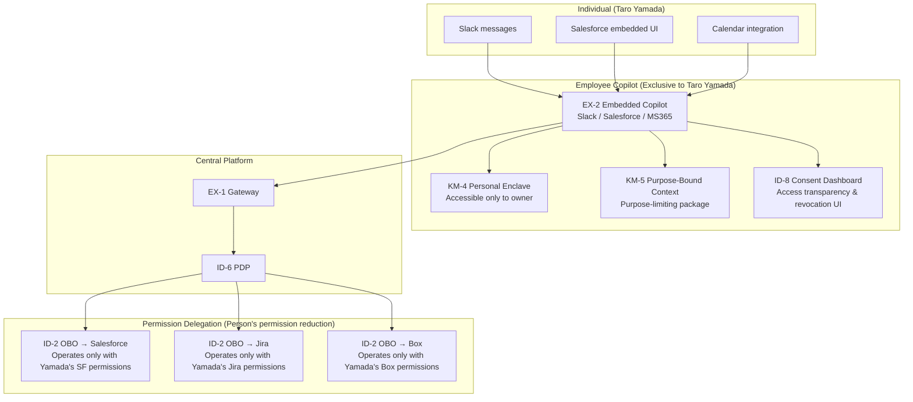

# Individual Axis

## Overview

The company-wide foundation, departmental agents, and project agents are "AI for the organization," but ultimately individuals are the ones who do the work. This axis shows the design for personal memory, permission delegation, and context that individual copilots (Employee Copilots) hold. Individual copilots remember each person's work style, frequently used documents, and ongoing tasks, optimizing business efficiency at the individual level. However, personal memory can only access within the individual's permission scope, and is shared with the organization only within the scope that the person has explicitly consented to.

## Patterns Deployed on This Axis

### Knowledge & Memory (KM)

[KM-4 Scoped Memory Hierarchy (Personal Enclave)](../../decisions/km-knowledge/km-d3-memory-scope.md) provides a personal memory partition (Personal Enclave) exclusively for the individual. Individual work history, notes, bookmarks, and custom instructions are stored here, inaccessible to anyone other than the person. Personal knowledge such as "we decided this in last week's meeting" and "I always communicate this point to this customer" accumulates here.

[KM-5 Purpose-Bound Context Package](../../decisions/km-knowledge/km-d4-purpose-limitation.md) ensures that when the individual copilot passes context to other agents and services, it is delivered as a limited package with an explicit purpose. It technically enforces the purpose constraint of "this information is used only for creating this quote," preventing context reuse.

### Identity & Trust (ID)

[ID-2 OBO Delegation (per-user delegation)](../../decisions/id-identity/id-d2-delegation-method.md) is a mechanism for using tokens reduced to the person's own permissions when the individual copilot calls external SaaS. Whether calling Salesforce or Jira, the copilot operates only within the range that the person can access. The principle is permission-faithful delegation from the person's own authority, not full delegation via service accounts.

[ID-8 Consent & Access Transparency](../../decisions/id-identity/id-d6-consent-transparency.md) is a mechanism for individuals to manage access to their own data. Individuals can view which SaaS and which data their copilot is accessing for what purpose, and can revoke consent. This is an important pattern for ensuring autonomy over the use of personal information.

### Experience (EX)

[EX-2 Business Embedded](../../decisions/ex-experience/ex-d1-front-door-channel.md) is a reference pattern when choosing to embed the individual copilot within existing workflows such as Slack, Salesforce, and MS365. Not requiring a switch to a separate portal — having the copilot respond within the tools used every day — greatly lowers individual adoption barriers.

## Individual Copilot Architecture

## Privacy and Autonomy

Individual copilots are part of the organization's agent infrastructure while also touching the individual's private work domain. This tension must be appropriately handled at the design stage.

**Right to erase personal memory**: Memories accumulated in the Personal Enclave must be deletable by the person at any time. An automatic deletion policy is applied at departure or role change, so that the previous person's memory is not handed over to the successor. A mechanism for individuals to set KM-4's forgetting policy (TTL, explicit deletion) at the individual level is required.

**Consent management**: Access to data sources the copilot uses (Slack history, email, calendar) requires prior consent. The person manages "which SaaS, for what purpose, until when" access through [ID-8](../../decisions/id-identity/id-d6-consent-transparency.md)'s consent dashboard. Changes and revocations to the scope of consent are reflected in real time.

**Explicit sharing scope with the organization**: Explicitly state when and how individual memory may flow to departmental or project memory. Memory within the Personal Enclave is non-public by default, but only information the person explicitly selects "share with project" moves to the project workspace. The organization implicitly viewing or analyzing personal memory is structurally prohibited by design.

!!! warning "Be Careful of Excessive Permissions for Individual Copilots"
    Giving the individual copilot broad access to all that person's SaaS "because it's convenient" means that when the copilot is compromised, the impact covers all the individual's SaaS. OBO delegation should be issued at minimum scope per task and per session, and long-lived service account tokens must not be held by the copilot.
