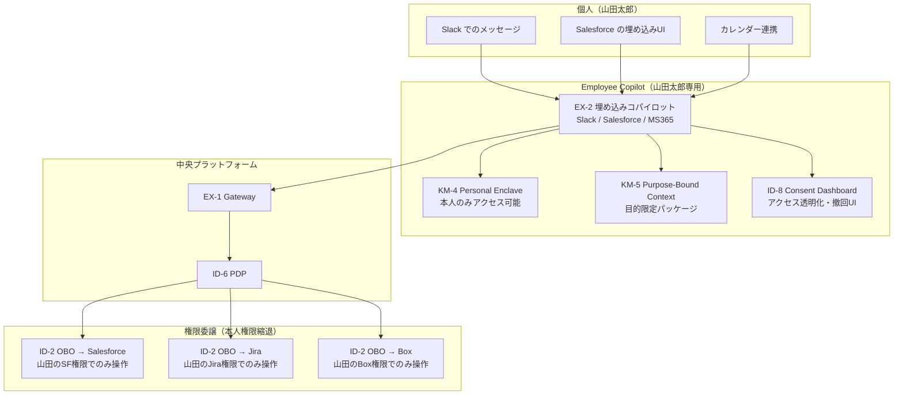

# メンバー個別軸

## 概要

全社基盤・部署エージェント・プロジェクトエージェントは「組織のための AI」ですが、最終的に手を動かすのは個人です。この軸では個人ごとのコパイロット（Employee Copilot）が持つパーソナルメモリ・権限委譲・コンテキストの設計を示します。個人コパイロットはその人固有の作業スタイル・よく使うドキュメント・継続中のタスクを記憶し、業務効率を個人レベルで最適化します。ただし、個人のメモリは個人の権限範囲にのみアクセスでき、本人が明示的に同意した範囲でのみ組織と共有されるようになっています。

## この軸に配置するパターン

### 知識・メモリ（KM）

[KM-4 Scoped Memory Hierarchy（Personal Enclave）](../../decisions/km-knowledge/km-d3-memory-scope.md) は個人専用のメモリ区画（Personal Enclave）を提供します。個人の作業履歴・メモ・ブックマーク・カスタム指示が格納され、本人以外はアクセスできません。「先週の会議でこう決めた」「この顧客には毎回この注意事項を伝える」といった個人の知識が蓄積されていきます。

[KM-5 Purpose-Bound Context Package](../../decisions/km-knowledge/km-d4-purpose-limitation.md) は個人コパイロットが他のエージェント・サービスにコンテキストを渡す際に、目的を明示した限定パッケージとして渡す仕組みです。「この情報は今回の見積もり作成のためだけに使う」という目的の縛りを技術的に強制し、コンテキストの流用を防ぎます。

### アイデンティティ・信頼（ID）

[ID-2 OBO 委譲（per-user delegation）](../../decisions/id-identity/id-d2-delegation-method.md) は個人コパイロットが外部 SaaS を呼び出す際に、本人権限に縮退したトークンを使う仕組みです。Salesforce を呼び出す場合も Jira を呼び出す場合も、コパイロットはその人がアクセスできる範囲だけで操作します。サービスアカウントへの全権委任ではなく、本人権限への忠実な委譲が原則となります。

[ID-8 Consent & Access Transparency](../../decisions/id-identity/id-d6-consent-transparency.md) は個人が自分のデータへのアクセスを管理する仕組みです。コパイロットがどの SaaS・どのデータに何の目的でアクセスしているかを本人が閲覧し、同意を撤回できます。個人情報の利用に対する自律性を保証する重要なパターンとなっています。

### 体験（EX）

[EX-2 業務埋め込み](../../decisions/ex-experience/ex-d1-front-door-channel.md) は個人コパイロットを Slack・Salesforce・MS365 などの既存ワークフローの中に埋め込む形態を選ぶ際に参照するパターンです。独立したポータルへの切り替えを要求せず、普段使いのツールの中でコパイロットが応答する体験は、個人の導入障壁を大きく下げてくれます。

## 個人コパイロットの構成図

## プライバシーと自律性

個人コパイロットは組織のエージェント基盤の一部であると同時に、個人のプライベートな作業領域に触れます。この緊張関係を設計の段階で適切に処理しなければなりません。

**個人メモリの消去権**：Personal Enclave に蓄積された記憶は、本人がいつでも削除できる設計にしなければなりません。退職時・ロール変更時には自動削除ポリシーを適用し、前任者のメモリが後任者に引き継がれない構造にします。KM-4 の忘却ポリシー（TTL・明示的削除）を個人単位で設定できるようにしておく必要があります。

**同意管理**：コパイロットが利用するデータソース（Slack 履歴・メール・カレンダー）へのアクセスには、事前の同意が必要です。[ID-8](../../decisions/id-identity/id-d6-consent-transparency.md) の同意ダッシュボードで、「どの SaaS に・何の目的で・いつまで」アクセスするかを本人が管理します。同意範囲の変更・撤回はリアルタイムに反映されます。

**組織との共有範囲の明示**：個人のメモリがいつ・どのように部署やプロジェクトのメモリに流れ得るかを明示します。Personal Enclave 内のメモリは原則非公開ですが、本人が「プロジェクトに共有」を選択した情報だけがプロジェクトワークスペースに移動します。組織が個人メモリを黙示的に閲覧・分析することは、設計上認めていません。

!!! warning "個人コパイロットの権限過剰に注意"
    個人コパイロットに「便利だから」という理由でその人の全SaaSへの広範なアクセスを与えると、コパイロットが侵害された際の影響範囲が個人全SaaSに及びます。OBO委譲はタスクごと・セッションごとに最小限のスコープで発行し、長期有効なサービスアカウントトークンをコパイロットに持たせてはなりません。
