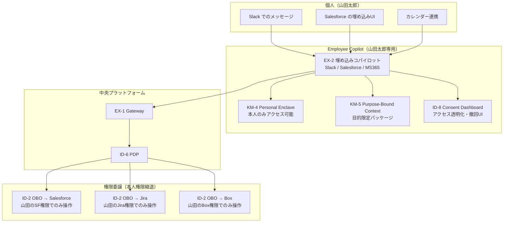

# メンバー個別軸

## 概要

全社基盤・部署エージェント・プロジェクトエージェントは「組織のためのAI」だが、最終的に手を動かすのは個人である。この軸では、個人ごとのコパイロット（Employee Copilot）が持つパーソナルメモリ・権限委譲・コンテキストの設計を示す。個人コパイロットは、その人固有の作業スタイル・よく使うドキュメント・継続中のタスクを記憶し、業務効率を個人レベルで最適化する。ただし、個人のメモリは個人の権限範囲にのみアクセスでき、本人が明示的に同意した範囲で組織と共有される。

## この軸に配置するパターン

### 知識・メモリ（KM）

[KM-4 Scoped Memory Hierarchy（Personal Enclave）](../../patterns/km-knowledge/km4-scoped-memory-hierarchy.md)は個人専用のメモリ区画（Personal Enclave）を提供する。個人の作業履歴・メモ・ブックマーク・カスタム指示が格納され、本人以外はアクセスできない。「先週の会議でこう決めた」「この顧客には毎回この注意事項を伝える」といった個人知識が蓄積される。

[KM-5 Purpose-Bound Context Package](../../patterns/km-knowledge/km5-purpose-bound-context.md)は個人コパイロットが他のエージェント・サービスにコンテキストを渡す際に、目的を明示した限定パッケージとして渡す。「この情報は今回の見積もり作成のためだけに使う」という目的縛りを技術的に強制し、コンテキストの流用を防ぐ。

### アイデンティティ・信頼（ID）

[ID-2 OBO委譲（per-user delegation）](../../patterns/id-identity/id2-identity-federation-obo.md)は個人コパイロットが外部SaaSを呼び出す際に、本人権限に縮退したトークンを使う仕組みである。Salesforceを呼び出す場合も、Jiraを呼び出す場合も、コパイロットはその人がアクセスできる範囲だけで操作する。サービスアカウントの全権委任ではなく、本人権限忠実な委譲が原則である。

[ID-8 Consent & Access Transparency](../../patterns/id-identity/id8-consent-access-transparency.md)は個人が自分のデータへのアクセスを管理する仕組みである。コパイロットがどのSaaS・どのデータに何の目的でアクセスしているかを本人が閲覧し、同意を撤回できる。個人情報の利用に対する自律性を保証する重要なパターンである。

### 体験（EX）

[EX-2 業務埋め込み](../../patterns/ex-experience/ex2-embedded-vs-portal.md)は個人コパイロットをSlack・Salesforce・MS365などの既存ワークフローの中に埋め込む形態を選ぶ際に参照するパターンである。独立したポータルへの切り替えを要求せず、普段使いのツールの中でコパイロットが応答する体験は、個人の導入障壁を大幅に下げる。

## 個人コパイロットの構成図

## プライバシーと自律性

個人コパイロットは組織のエージェント基盤の一部であると同時に、個人のプライベートな作業領域に触れる。この緊張関係を適切に設計する必要がある。

**個人メモリの消去権**：Personal Enclaveに蓄積された記憶は、本人がいつでも削除できなければならない。退職時・ロール変更時には自動削除ポリシーを適用し、前任者のメモリが後任者に引き継がれないよう設計する。KM-4の忘却ポリシー（TTL・明示的削除）を個人単位で設定できる仕組みが必要である。

**同意管理**：コパイロットが利用するデータソース（Slack履歴・メール・カレンダー）へのアクセスは、事前の同意が必要である。[ID-8](../../patterns/id-identity/id8-consent-access-transparency.md)の同意ダッシュボードで、「どのSaaSに・何の目的で・いつまで」アクセスするかを本人が管理する。同意範囲の変更・撤回はリアルタイムに反映される。

**組織との共有範囲の明示**：個人のメモリがいつ・どのように部署やプロジェクトのメモリに流れ得るかを明示する。Personal Enclave内のメモリは原則非公開だが、本人が「プロジェクトに共有」を選択した情報だけがプロジェクトワークスペースに移動する。組織が個人メモリを黙示的に閲覧・分析することは設計上禁止する。

!!! warning "個人コパイロットの権限過剰に注意"
    個人コパイロットに「便利だから」という理由でその人の全SaaSへの広範なアクセスを与えると、コパイロットが侵害された際の影響範囲が個人全SaaSに及ぶ。OBO委譲はタスクごと・セッションごとに最小限のスコープで発行し、長期有効なサービスアカウントトークンをコパイロットに持たせてはならない。
