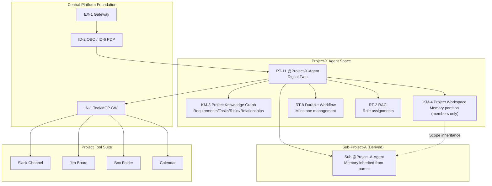

# Project Axis

## Overview

Projects and teams have beginnings and endings. Members transfer, sub-projects emerge, and after completion the context needs to be archived. This axis designs agent placement tied to the project lifecycle, centering on [RT-11 Project Digital Twin](../../decisions/rt-runtime/rt-d6-project-digital-twin.md). While departmental axis agents reflect "permanent organizational units," project axis agents reflect "time-limited purpose groups." Project-specific memory, permissions, and tool access are valid only for the project's duration and are appropriately archived or deleted after completion.

## Patterns Deployed on This Axis

### Runtime & Orchestration (RT)

[RT-11 Project Workspace / Digital Twin Agent](../../decisions/rt-runtime/rt-d6-project-digital-twin.md) acts as a project-specific agent, centrally managing the project's goals, members, progress, and decision memory. It resides in a channel in the form of `@Project-X-Agent` and integrates with project tools like Slack, Jira, and Box. It functions as the project's "memory keeper" and also handles context sharing when new members join.

[RT-2 RACI-based Multi-Agent Orchestration](../../decisions/rt-runtime/rt-d1-single-vs-multi-agent.md) assigns role assignments within a project (who executes, approves, provides information, receives notifications) to agents using a RACI matrix. This makes explicit the structure where the project leader holds decision-making responsibility, assignee agents execute tasks, and notifications reach stakeholders.

[RT-8 Durable Enterprise Agent Workflow](../../decisions/rt-runtime/rt-d4-long-running-reliability.md) implements workflows that continue across project milestones as persistent workflows resistant to failures and restarts. When a project spans weeks or months, state persistence of workflows is essential.

### Knowledge & Memory (KM)

[KM-4 Scoped Memory Hierarchy (Project Workspace)](../../decisions/km-knowledge/km-d3-memory-scope.md) provides a memory partition at project scope. Information accessible only to project members (meeting decisions, interim deliverables, concern lists) is managed separately from company-wide shared memory. After project completion, the partition can be archived or deleted in its entirety.

[KM-3 Canonical Object Knowledge Graph](../../decisions/km-knowledge/km-d2-knowledge-normalization.md) manages the relationships of project-specific entities (requirements, tasks, risks, stakeholders, deliverables) as a graph. It places in a state where the agent can reference structural knowledge such as "Requirement A is achieved by task groups B and C, Risk D exists, and Stakeholder E is the approver."

## Project Agent Architecture

## Lifecycle Management

Project agents follow the same lifecycle as the project. The state of the agent's permissions, memory, and connections changes at each phase.

**Creation Phase**: Register the agent in the Registry simultaneously with project approval. Initialize member lists, scope, goals, and tool access, and allocate a dedicated memory partition (KM-4) for the project. Limit the delegation scope of OBO tokens to project scope.

**Operations Phase**: Dynamically update access permissions each time a member joins or leaves. Use [RT-4 Human Approval Chain](../../decisions/rt-runtime/rt-d2-autonomy-design.md) to automatically resolve approvers on the organizational reporting line and record project-internal decisions. When sub-projects emerge, generate child agents that inherit scope from the parent project but have independent memory partitions.

**Completion & Archive Phase**: After project completion, transition the agent from active state to read-only archive state. Memory partition data is retained, but write access to tools expires. Following [KM-4](../../decisions/km-knowledge/km-d3-memory-scope.md)'s forgetting policy, after a certain period it is automatically deleted or migrated to long-term storage.

!!! note "Boundary Between Project and Department"
    When a project is composed of members from multiple departments, the project agent's access permissions are reduced to the permissions of each member's affiliated department. For projects where members from outside the HR department are mixed, KM-4 scope settings need to be configured carefully to prevent HR-only information from flowing into project memory.
