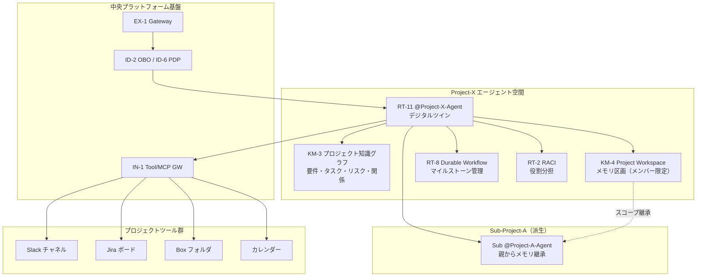

# プロジェクト軸

## 概要

プロジェクトやチームには始まりと終わりがある。メンバーは異動し、サブプロジェクトが生まれ、完了後は文脈をアーカイブする必要がある。この軸では、[RT-11 Project Digital Twin](../../patterns/rt-runtime/rt11-project-digital-twin.md)を中心に、プロジェクトライフサイクルに連動したエージェント配置を設計する。部署軸のエージェントが「永続的な組織単位」を反映するのに対し、プロジェクト軸のエージェントは「時限的な目的集団」を反映する。プロジェクト固有のメモリ・権限・ツールアクセスはプロジェクトの存続期間中だけ有効であり、完了後は適切にアーカイブまたは削除される。

## この軸に配置するパターン

### 実行・オーケストレーション（RT）

[RT-11 Project Workspace / Digital Twin Agent](../../patterns/rt-runtime/rt11-project-digital-twin.md)はプロジェクト固有のエージェントとして、プロジェクトの目標・メンバー・進捗・意思決定の記憶を一元管理する。`@Project-X-Agent`のような形でチャネルに常駐し、Slack・Jira・Box等のプロジェクトツールと連携する。プロジェクトの「記憶係」として機能し、新メンバーが加わった際の文脈共有も担う。

[RT-2 RACI-based Multi-Agent Orchestration](../../patterns/rt-runtime/rt2-raci-multi-agent.md)はプロジェクト内の役割分担（誰が実行・承認・情報提供・通知を受けるか）をRACIマトリクスでエージェントに割り当てる。プロジェクトリーダーが意思決定責任を持ち、担当者エージェントがタスクを実行し、ステークホルダーに通知が届く構造を明示化する。

[RT-8 Durable Enterprise Agent Workflow](../../patterns/rt-runtime/rt8-durable-workflow.md)はプロジェクトのマイルストーンをまたいで継続するワークフローを、障害・再起動に耐える永続ワークフローとして実装する。プロジェクト期間が数週間・数ヶ月に及ぶ場合、ワークフローの状態永続化は不可欠だ。

### 知識・メモリ（KM）

[KM-4 Scoped Memory Hierarchy（Project Workspace）](../../patterns/km-knowledge/km4-scoped-memory-hierarchy.md)はプロジェクトスコープのメモリ区画を提供する。プロジェクトメンバーだけがアクセスできる情報（会議の決定事項・中間成果物・懸念リスト）を、全社共有メモリから分離して管理する。プロジェクト完了後は区画ごとアーカイブまたは削除できる。

[KM-3 Canonical Object Knowledge Graph](../../patterns/km-knowledge/km3-canonical-object-knowledge-graph.md)はプロジェクト固有のエンティティ（要件・タスク・リスク・利害関係者・成果物）の関係をグラフで管理する。「要件Aはタスク群BとCで達成され、リスクDが存在し、ステークホルダーEが承認者」という構造的な知識をエージェントが参照できる状態にする。

## プロジェクトエージェントの構成図

## ライフサイクル管理

プロジェクトエージェントはプロジェクトと同じライフサイクルをたどる。各フェーズでエージェントの権限・メモリ・接続の状態が変化する。

**作成フェーズ**：プロジェクト承認と同時にエージェントを Registry に登録する。メンバーリスト・スコープ・目標・ツールアクセスを初期設定し、プロジェクト専用のメモリ区画（KM-4）を割り当てる。OBOトークンの委譲範囲はプロジェクトスコープに絞る。

**運用フェーズ**：メンバー追加・離脱のたびにアクセス権限を動的に更新する。[RT-4 Human Approval Chain](../../patterns/rt-runtime/rt4-human-approval-chain.md)で組織のレポートライン上の承認者を自動解決し、プロジェクト内の意思決定を記録する。サブプロジェクト発生時は親プロジェクトからスコープを継承しつつ、独立したメモリ区画を持つ子エージェントを生成する。

**完了・アーカイブフェーズ**：プロジェクト完了後、エージェントをアクティブ状態から読み取り専用のアーカイブ状態に遷移させる。メモリ区画のデータは保持されるが、ツールへの書き込みアクセスは失効する。[KM-4](../../patterns/km-knowledge/km4-scoped-memory-hierarchy.md)の忘却ポリシーに従い、一定期間後に自動削除または長期ストレージへ移行する。

!!! note "プロジェクトと部署の境界"
    プロジェクトが複数部署のメンバーで構成される場合、プロジェクトエージェントのアクセス権は各メンバーの所属部署の権限に縮退する。HR部門外のメンバーが混在するプロジェクトで、HR専用情報がプロジェクトメモリに流入しないよう、KM-4のスコープ設定を慎重に行う。
