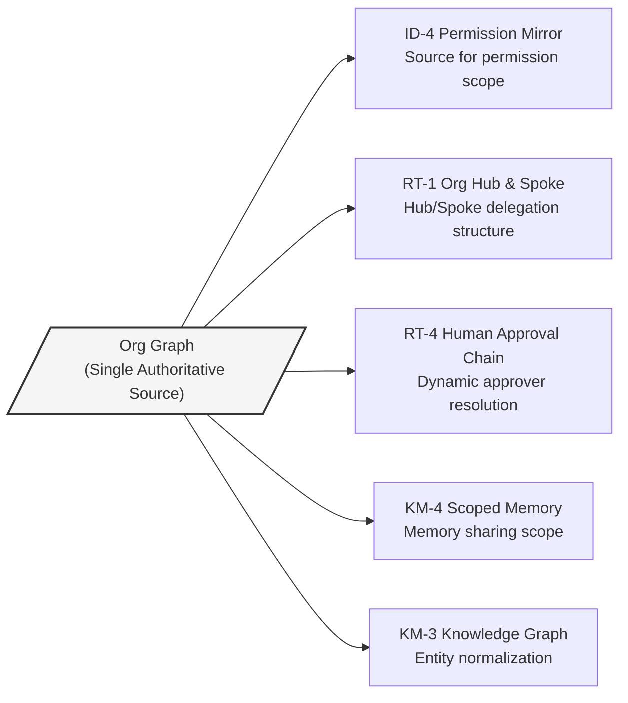
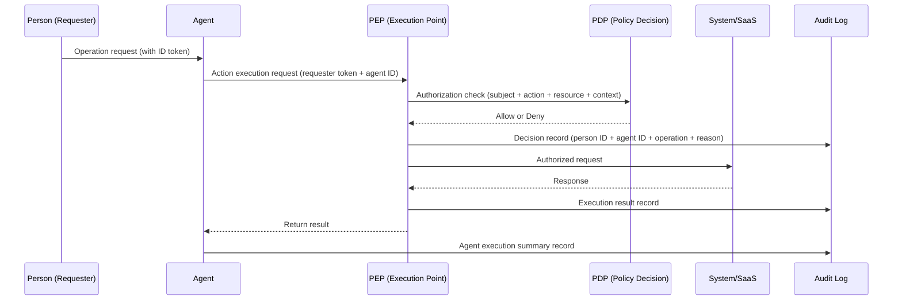

# Cross-Cutting Axes

## Overview

The 7-plane layered structure resembles floors in a building, but there are elements that penetrate every floor like elevators and plumbing. These are the two cross-cutting axes: the "Org Graph" and "Zero Trust/Audit." Neither belongs to a specific plane — both influence the judgment criteria, scope, and records of every pattern.

The choice of "which plane's patterns to use" is floor-by-floor design, but the questions of "who, in what scope, may execute what" and "under whose name is that execution recorded" appear uniformly on every floor. By establishing these two cross-cutting axes first, the patterns on each plane function coherently.

## Org Graph

### What is the Org Graph?

The org graph is a data foundation that normalizes people, roles, departments, teams, projects, and responsibilities from multiple systems — Workday, Okta, GitHub, project management tools — and maintains them as a single authoritative org master. It is often represented as a graph structure (nodes = people, org units, roles; edges = reporting relationships, memberships, delegation relationships).

There are four reasons why the org graph is necessary in an agent system. First, permission scope definition: the range a person can operate is determined by their department, role, and project membership. Second, delegation relationship resolution: judging "whether A may act on behalf of B" requires the organizational relationship between A and B. Third, approver identification: dynamically resolving "who is the approver for this operation" at runtime requires data on the upward reporting line. Fourth, sharing scope determination: whether the boundary is "shared within team," "within department," or "company-wide" corresponds to organizational structure.

### Patterns That Depend on the Org Graph

**[ID-4 Permission Mirror](../decisions/id-identity/id-d3-permission-reduction.md)** is a pattern that ensures the agent operates with the least common denominator (most restrictive permission) rather than the least common multiple across multiple SaaS systems. Taking the intersection of "the range a person can see in Salesforce" and "the range they can see in Confluence" requires retrieving that person's organizational position from the org graph.

**[RT-1 Org Hierarchical Hub & Spoke](../decisions/rt-runtime/rt-d1-single-vs-multi-agent.md)** is a pattern for deploying agents in a central Hub + departmental Spoke structure that reflects the organizational hierarchy. Which department has which specialized agents and what scope can be delegated is derived directly from the department tree in the org graph.

**[RT-4 Human Approval Chain](../decisions/rt-runtime/rt-d2-autonomy-design.md)** is a pattern for realizing tiered human approval according to risk. Dynamically resolving "who is the approver" at execution time requires pulling the requester's upward reporting line from the org graph. Even when organizational changes occur (transfers, promotions, departures), once the org graph is updated, approver resolution follows automatically.

**[KM-4 Scoped Memory Hierarchy](../decisions/km-knowledge/km-d3-memory-scope.md)** is a pattern for managing agent memory in four tiers: personal, team, department, and company-wide. The sharing range of team memory ("who are the members of this team?") is pulled from the org graph. Preventing memory contamination across projects requires the sharing scope boundaries to be clearly defined.

**[KM-3 Canonical Object Knowledge Graph](../decisions/km-knowledge/km-d2-knowledge-normalization.md)** is a pattern for managing key internal entities (customers, products, deals, people) as a normalized graph. The org master's person data is used as the normalization reference for entity matching such as "Yamada Taro (Salesforce) = yamada-t (Slack) = taro.yamada@example.com (email)."

### Risks When the Org Graph Is Not in Place

Running these patterns without an org graph leads to situations like:

- Old permission scopes persist after cross-department transfers, allowing continued access to data from the previous department
- Approvers do not follow org changes, causing workflows to stall on departed or transferred employees
- Team memory sharing boundaries become unclear, leaking information to other teams that should not see it

!!! warning "Freshness of the Org Graph"
    The org graph must not be a static snapshot but a real-time authoritative source that immediately reflects transfers, departures, promotions, and project joins. Batch updates introduce lags of hours to days in approver resolution and permission scopes.

## Zero Trust/Audit

### What is Zero Trust/Audit?

The Zero Trust/Audit cross-cutting axis means threading the principle of "authenticate, authorize, and audit every action" throughout the entire system. Every call executed by an agent is accompanied by a record with three-party accountability: **person (requester), agent (execution subject), system (tool/SaaS)**.

The idea that "constraining behavior through prompts ensures safety" is denied by this cross-cutting axis. Prompts are for adjusting quality and behavior; they do not constitute security boundaries. Safety guarantees must be placed on the execution platform side — this is the core of this cross-cutting axis.

### Three-Party Accountability Structure

The "three parties" in three-party accountability are: ① whose request it was (person), ② who executed it (agent), ③ what system was used (tool/SaaS). Only when all three are present in the audit log can an incident investigation trace back "why that operation was performed."

### Patterns That Implement Zero Trust/Audit

**[ID-6 Zero-Trust PDP/PEP](../decisions/id-identity/id-d5-authorization-method.md)** is a pattern for placing an execution point (PEP) that performs an authorization check against a policy decision point (PDP) before every action is executed. This abandons the network boundary concept of "safe because it's within a trusted network," and performs authentication, authorization, and context evaluation per request. Without this pattern, an agent that has been authenticated once can execute subsequent actions without restriction.

**[OB-2 Unified Audit Lineage](../decisions/ob-observability/ob-d2-audit-attribution.md)** is a pattern for recording three-party accountability audit trails in a unified format at every execution step. Operations conducted through an agent are connected as a single lineage of "at whose instruction, which agent, to which system, did what." This trail is used for regulatory compliance, internal audits, and incident investigations.

**[ID-7 Policy-as-Code Guardrail](../decisions/id-identity/id-d5-authorization-method.md)** is a pattern for managing the decision logic of "what is permitted and what is prohibited" as code. With policy as code, change history is managed in Git, tests can be written, and deployment is controlled through CI/CD. It eliminates the state where policies are scattered across people's heads and configuration files.

!!! danger "Defense at the Execution Platform"
    A design that "guards security with prompts" does not work in enterprise settings. There is no resistance to prompt rewriting or jailbreaks, and no audit trail remains. All safety guarantees must be placed on the execution platform side (PEP/PDP/Policy-as-Code/audit logs).

### Risks When Zero Trust/Audit Is Not in Place

- Investigation becomes impossible when an agent is misoperated or abused (unknown who did what)
- Compliance violations occur in regulatory domains (finance, healthcare, personal information protection)
- Policies become person-dependent, and rules are lost when the responsible person departs or transfers
- During incident response, the scope of impact cannot be determined
