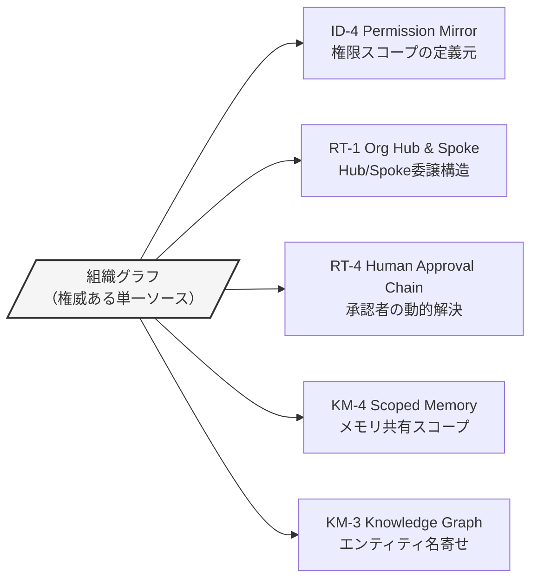
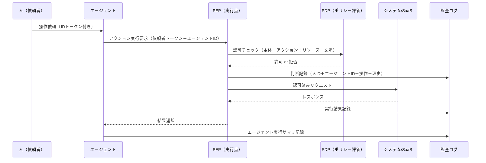

# 横断軸

## 概要

7面の層構造は建物のフロアに似ているが、エレベーターや配管のように全フロアを貫く要素がある。それが「組織グラフ」と「ゼロトラスト/監査」の2つの横断軸だ。どちらも特定の面に属さず、すべてのパターンの判断基準・スコープ・記録に影響を与える。

「どの面のパターンを使うか」という選択はフロアごとの設計だが、「誰が、どの範囲で、何を実行してよいか」「その実行を誰の名義で記録するか」という問いはすべてのフロアに共通して現れる。この2つの横断軸を先に整えることで、各面のパターンが整合的に機能するようになる。

## 組織グラフ

### 組織グラフとは何か

組織グラフとは、Workday・Okta・GitHub・プロジェクト管理ツールなど複数のシステムから人物・役職・部署・チーム・プロジェクト・役割を名寄せし、単一の権威ある組織マスターとして維持するデータ基盤だ。グラフ構造（ノード＝人・組織単位・役割、エッジ＝報告関係・所属・委譲関係）で表現するのが一般的だ。

エージェントシステムにおいて組織グラフが必要な理由は4つある。

1. **権限スコープの定義**：「この人物が操作できる範囲」は部署・役職・プロジェクトメンバーシップによって決まる。
2. **委譲関係の解決**：「A が B に代わって動作してよいか」の判断には、A と B の組織上の関係が必要になる。
3. **承認者の特定**：「この操作の承認者は誰か」を動的に解決するには、上位報告ラインのデータが要る。
4. **共有スコープの決定**：「チーム内共有か部門共有か全社共有か」の境界は組織構造に対応する。

### 組織グラフに依存するパターン

**[ID-4 Permission Mirror](../patterns/id-identity/id4-permission-mirror-least-of.md)** は、エージェントが複数SaaSの権限の最小公倍数ではなく最小公約数（最も制限された権限）で動くことを保証するパターンだ。「この人物がSalesforceで見られる範囲」と「Confluenceで見られる範囲」の積（共通部分）を取るには、その人物の組織上の位置付けを組織グラフから取得する必要がある。

**[RT-1 Org Hierarchical Hub & Spoke](../patterns/rt-runtime/rt1-org-hierarchical-hub-spoke.md)** は、組織階層を反映した中央Hub＋部門Spokeの構造でエージェントを配置するパターンだ。どの部門がどの専門エージェントを持ち、どの範囲に委譲できるかは、組織グラフの部門ツリーから直接導かれる。

**[RT-4 Human Approval Chain](../patterns/rt-runtime/rt4-human-approval-chain.md)** は、リスクに応じた段階的な人間承認を実現するパターンだ。「誰が承認者か」を実行時に動的に解決するには、依頼者の上位報告ラインを組織グラフから引く必要がある。異動・昇格・退職があっても、組織グラフが更新されれば承認者の解決は自動的に追随する。

**[KM-4 Scoped Memory Hierarchy](../patterns/km-knowledge/km4-scoped-memory-hierarchy.md)** は、エージェントのメモリを個人・チーム・部門・全社の4階層で管理するパターンだ。チームメモリの共有範囲（「このチームのメンバーは誰か」）は組織グラフから引く。プロジェクトをまたいだメモリ汚染を防ぐには、共有スコープの境界を明確に定義しておく必要がある。

**[KM-3 Canonical Object Knowledge Graph](../patterns/km-knowledge/km3-canonical-object-knowledge-graph.md)** は、社内の主要エンティティ（顧客・製品・案件・人物）を正規化されたグラフとして管理するパターンだ。「山田太郎（Salesforce）＝yamada-t（Slack）＝taro.yamada@example.com（メール）」という名寄せの基準に、組織マスターの人物データを使う。

### 組織グラフが整っていない場合のリスク

組織グラフなしにこれらのパターンを動かすと、以下のような事態が起きる。

- 部署横断の異動後も古い権限スコープが残り、元の部署のデータに引き続きアクセスできる
- 承認者が組織変更に追随せず、退職者や異動者にワークフローが滞留する
- チームメモリの共有境界が不明確になり、本来見せてはいけない情報が別チームに漏れる

!!! warning "組織グラフの鮮度"
    組織グラフは静的なスナップショットではなく、異動・退職・昇格・プロジェクト参加を即時に反映するリアルタイムの権威ソースでなければならない。バッチ更新では承認者解決や権限スコープに数時間から数日のラグが生じる。

## ゼロトラスト/監査

### ゼロトラスト/監査とは何か

ゼロトラスト/監査横断軸とは、「すべてのアクションを認証・認可・監査する」という原則をシステム全体に貫くことだ。エージェントが実行するすべての呼び出しには、**人（依頼者）・エージェント（実行主体）・システム（ツール/SaaS）** の三者帰責による記録が伴う。

「プロンプトで動きを制約すれば安全」という考え方は、この横断軸が否定するものだ。プロンプトは品質と振る舞いの調整に使うものであり、セキュリティ境界にはならない。安全保証は実行基盤側に置く——これがこの横断軸の核心だ。

### 三者帰責の構造

三者帰責の「三者」とは、①誰の依頼か（人）、②誰が実行したか（エージェント）、③何のシステムを使ったか（ツール/SaaS）の3つだ。この3つが監査ログに揃って初めて、事故調査で「なぜその操作が行われたか」を遡れる。

### ゼロトラスト/監査を実装するパターン

**[ID-6 Zero-Trust PDP/PEP](../patterns/id-identity/id6-zero-trust-pdp-pep.md)** は、すべてのアクション実行前にポリシー決定点（PDP）への認可チェックを挟む実行点（PEP）を置くパターンだ。「信頼するネットワーク内だから安全」というネットワーク境界の考え方を捨て、リクエストごとに認証・認可・文脈評価を行う。このパターンがなければ、一度認証されたエージェントが以降のアクションを無制限に実行できてしまう。

**[OB-2 Unified Audit Lineage](../patterns/ob-observability/ob2-unified-audit-lineage.md)** は、三者帰責による監査証跡をすべての実行ステップで統一フォーマットに記録するパターンだ。エージェントを経由した操作が「誰の指示で、どのエージェントが、どのシステムに、何をしたか」を一本のリネージとして繋げる。規制対応・内部監査・事故調査のすべてにこの証跡が使われる。

**[ID-7 Policy-as-Code Guardrail](../patterns/id-identity/id7-policy-as-code-guardrail.md)** は、「何が許可され、何が禁止されるか」の判断ロジックをコードとして管理するパターンだ。ポリシーがコードになることで、変更履歴を Git で管理でき、テストを書け、デプロイは CI/CD で制御される。担当者の頭の中や設定ファイルにポリシーが散在していた状態を解消できる。

!!! danger "実行基盤での防御"
    「プロンプトでセキュリティを守る」という設計はエンタープライズでは機能しない。プロンプトの書き換えやジェイルブレイクへの耐性はなく、監査証跡も残らない。すべての安全保証を実行基盤側（PEP/PDP/Policy-as-Code/監査ログ）に置くこと。

### ゼロトラスト/監査が整っていない場合のリスク

- エージェントが誤操作・悪用された際の調査が不可能になる（誰が何をしたか不明）
- 規制対応（金融・医療・個人情報保護）でコンプライアンス違反が発生する
- ポリシーが属人化し、担当者退職・異動でルールが失われる
- インシデント対応でどこまで影響があったかの範囲特定ができない
