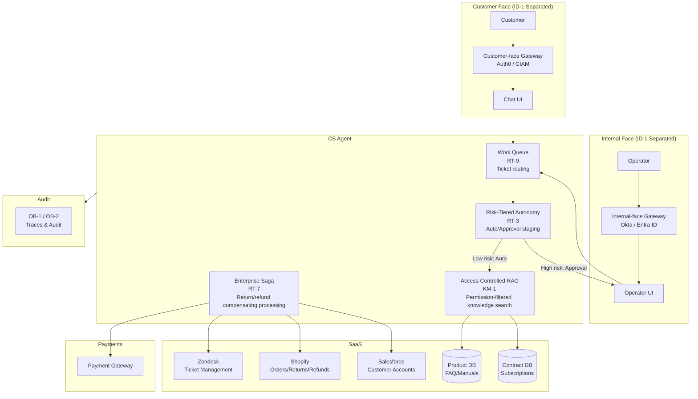
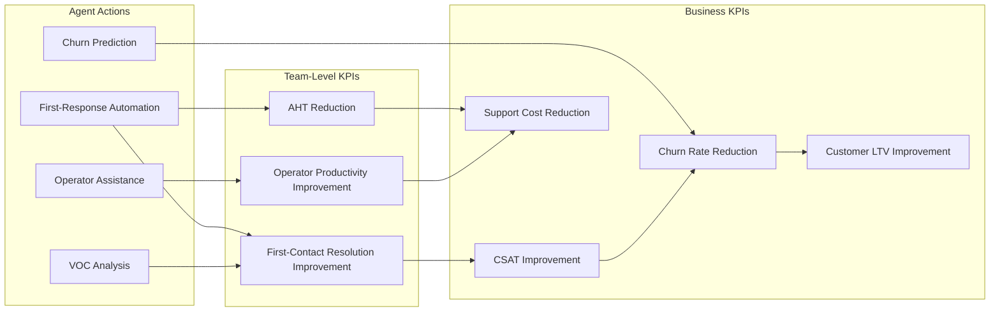
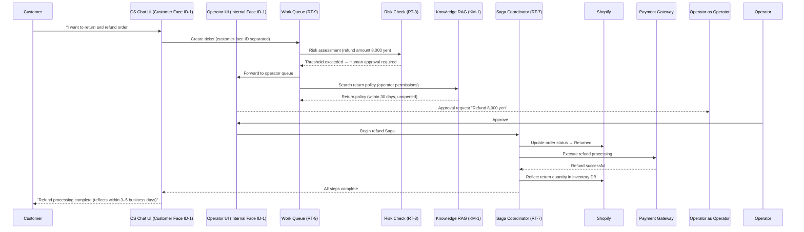

# Customer Support Agent Pattern Application

## Overview

The purpose of CS Agent is to move the customer support outcome KPIs of **CSAT (customer satisfaction) improvement, AHT (average handling time) reduction, first-contact resolution improvement, early churn prediction, and upsell opportunity extraction**. Through value use cases such as first-response automation, operator assistance, churn risk analysis, and customer sentiment analysis, it raises support quality and customer retention rates.

As the foundation for safely realizing this value, complete separation of the customer-facing and internal-facing systems (ID-1) is a fundamental prerequisite. The staged differentiation between automated responses and operations requiring approval (RT-3 Risk-Tiered Autonomy) achieves both safety and efficiency for a structure where customer interactions cross internal contract DB, product DB, and refund systems.

## Target SaaS

- Zendesk (ticket management, customer interaction)
- Shopify (orders, returns, refunds management)
- Salesforce (customer accounts, contract management)
- Product DB (FAQs, manuals, known issues)
- Contract DB (subscriptions, terms of service)

## Applied Patterns and Reasons

### [ID-1 Workforce / Customer Identity Split](../../decisions/id-identity/id-d1-workforce-customer-split.md)

The customer support agent interfaces with both the customer-facing chat UI and the internal operator UI. ID-1 completely separates these two faces at the level of identity providers, permission scopes, and log storage. It structurally prevents customer authentication tokens from being misused for internal system operations, and eliminates the possibility of internal operator permissions being accidentally exposed on the customer-facing interface. Incidents like "was able to directly access internal contract DB from the customer chat" arise from the absence of this separation.

### [RT-3 Risk-Tiered Autonomy](../../decisions/rt-runtime/rt-d2-autonomy-design.md)

Answering FAQs, checking order status, and general troubleshooting may be executed automatically. However, refund processing, contract changes, and account suspension are operations the agent must not judge independently. RT-3 sets autonomy levels in stages according to risk level (amount, irreversibility of operation, customer impact scope), and automatically routes operations exceeding thresholds (e.g., refund amounts over 5,000 yen) to a human approval queue. Operators review operation content in the approval UI and approve, reject, or modify.

### [KM-1 Access-Controlled RAG](../../decisions/km-knowledge/km-d1-context-supply.md)

The knowledge base of product manuals, FAQs, and known issues is a mix of information that may be disclosed to customers and information exclusive to internal operators (internal failure information, unpublished fix statuses, etc.). KM-1 applies the caller's role (customer or operator) as a search filter during vector search, ensuring information that should not be shown to customers is not included in search results. Simply "full-text searching and returning results" would destroy permission boundaries.

### [RT-7 Enterprise Saga](../../decisions/rt-runtime/rt-d4-long-running-reliability.md)

Returns and refund processing span multiple systems. Updating order status to "returned" in Shopify, executing refund processing at the payment gateway, closing the Zendesk ticket, and reflecting the returned quantity in inventory DB — these form a series of transactions. If Shopify's update succeeds but the payment refund fails mid-process, compensating processing is needed to maintain consistency. RT-7 manages this distributed transaction with the Saga pattern, automatically controlling the success or failure of each step and compensating processing.

### [RT-9 Work Queue Agent](../../decisions/rt-runtime/rt-d5-trigger-mechanism.md)

Customer support processes large volumes of tickets with human operators and AI working together. RT-9 breaks down the Zendesk ticket queue into units the agent can process, evaluating priority, operator skill, and automatic processing eligibility to route tickets. Simple FAQ responses are automatically closed by the agent, while complex issues and emotional complaints are forwarded to humans. With both human and agent work flowing from the same queue, operators can focus on high-difficulty tickets without the burden of manual triage.

## System Architecture

The defining feature of CS Agent is that the customer-facing and internal-facing systems are physically separated by ID-1. Customer requests pass through the customer-facing gateway and are processed on a completely separate path from internal-facing operator tools.

## Value Use Cases

The value of CS Agent lies not just in "preventing refund accidents," but also in "improving customer satisfaction, reducing churn, and lowering support costs." Customer support is at the front line of customer contact — it simultaneously achieves not only cost reduction (AHT, operator workload), but also **direct top-line contributions (revenue, retention)** — maintaining LTV through churn suppression, strengthening customer loyalty through improved first-contact resolution, and extracting upsell opportunities. The following value use cases are deployed on the safety foundation of [ID-1 (customer-facing separation)](../../decisions/id-identity/id-d1-workforce-customer-split.md).

| Use Case | Overview | Effective Outcome KPIs |
|---|---|---|
| First-response automation | Auto-generate initial responses to customer inquiries based on FAQs, known issues, and product manuals | First-contact resolution, AHT reduction |
| Churn prediction and intervention | Detect churn risk from inquiry frequency, tone, and contract renewal timing, and proactively suggest intervention | Churn rate reduction, LTV improvement |
| Operator assistance (response suggestions) | Instantly present past similar cases and solutions for complex inquiries to operators | Operator productivity, CSAT |
| Escalation decision automation | Automatically judge whether escalation is needed and to whom based on inquiry content, customer attributes, and past history | Escalation accuracy, customer wait time reduction |
| VOC analysis and improvement proposals | Automatically generate insights for product improvements and FAQ updates through trend analysis of ticket data | Inquiry volume reduction (root cause resolution) |
| Return/refund processing draft generation | Generate drafts for return/refund decisions based on policy, reducing operator verification workload | Processing lead time, operator workload |

## Outcome KPI Mapping

## Value Staircase (Staged Expansion)

| Stage | Autonomy | Representative Functions | Expected Outcomes |
|---|---|---|---|
| **Step 1: Efficiency (Read-only)** | Read-only Copilot | FAQ search, past case reference, response suggestions to operators | Reduce operator information-search time. Quick win deployable same day |
| **Step 2: Insights (Analysis)** | Analysis + Auto-classification | Ticket auto-classification, churn prediction, VOC analysis, escalation judgment | First-contact resolution and CSAT improvement. Natural integration with RT-9 queue |
| **Step 3: Execution (Writes)** | Staged automation | FAQ auto-responses (low risk), refund processing drafts, ticket closure | Direct support cost reduction. RT-3 risk tiers gradually raise autonomy |

## Typical Flow

The processing flow when a customer requests "I want to return and get a refund for last week's order."

