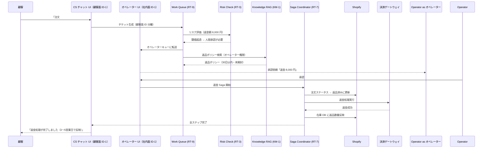

# Customer Support Agent の適用パターン

## 概要

カスタマーサポート部門のエージェントは、他の部門と決定的に異なる特徴を持つ。顧客（外部ユーザー）と直接やり取りしながら、同時に社内の契約 DB・製品 DB・返金システムにもアクセスする。この「顧客面と社内面が交差する」構造が、独自のリスクを生む。顧客向けの ID・権限・ログと、社内従業員向けのそれを混在させると、権限境界が曖昧になり不正アクセスの温床となる。また、FAQ 回答は完全自動でよいが、返金処理や契約変更は人間承認を必要とする——この「自動と承認の段階的使い分け」もカスタマーサポート特有の設計要件だ。

## 対象 SaaS

- Zendesk（チケット管理・顧客対話）
- Shopify（注文・返品・返金管理）
- Salesforce（顧客アカウント・契約管理）
- 製品 DB（FAQ・マニュアル・既知問題）
- 契約 DB（サブスクリプション・利用規約）

## 適用パターンと理由

### [ID-1 Workforce / Customer Identity Split（二面分離）](../../patterns/id-identity/id1-workforce-customer-split.md)

カスタマーサポートエージェントは、顧客向けチャット UI と社内オペレーター UI の両方に接する。ID-1 はこの二面を ID プロバイダー・権限スコープ・ログストレージのレベルで完全に分離する。顧客の認証トークンが社内システムの操作に流用されることを構造的に防ぎ、社内オペレーターの権限が顧客向けインターフェースに誤って露出することもなくなる。「顧客用チャットから社内の契約 DB に直接アクセスできてしまった」というインシデントはこの分離の欠如から生まれる。

### [RT-3 Risk-Tiered Autonomy（リスク段階的自律）](../../patterns/rt-runtime/rt3-risk-tiered-autonomy.md)

FAQ への回答・注文状況の確認・一般的なトラブルシューティングは自動実行してよい。しかし返金処理・契約変更・アカウント停止は、エージェントが単独で判断してはならない操作だ。RT-3 はリスクレベル（金額・操作の不可逆性・顧客影響範囲）に応じて自律度を段階的に設定し、閾値を超えた操作（例：返金額5000円以上）を自動的に人間承認キューへ振り分ける。オペレーターは承認 UI で操作内容を確認し、承認・否決・修正を行う。

### [KM-1 Access-Controlled RAG（権限付きナレッジ検索）](../../patterns/km-knowledge/km1-access-controlled-rag.md)

製品マニュアル・FAQ・既知問題のナレッジベースは、顧客向けに公開してよい情報と社内オペレーター専用の情報（内部障害情報・未公開の修正ステータスなど）が混在している。KM-1 はベクトル検索時に呼び出し元のロール（顧客 or オペレーター）を検索フィルタとして適用し、顧客に見せてはいけない情報が検索結果に含まれないことを保証する。単純な「全文検索して返す」では権限境界を破壊する。

### [RT-7 Enterprise Saga（分散トランザクション管理）](../../patterns/rt-runtime/rt7-enterprise-saga.md)

返品・返金の処理は複数システムを横断する。Shopify で注文ステータスを「返品済み」に更新し、決済ゲートウェイで返金処理を実行し、Zendesk チケットをクローズし、在庫 DB に戻し数量を反映する——これらは一連のトランザクションだ。途中で Shopify の更新が成功して決済返金が失敗した場合、一貫性を保つための補償処理が必要になる。RT-7 はこの分散トランザクションを Saga パターンで管理し、各ステップの成否と補償処理を自動で制御する。

### [RT-9 Work Queue Agent（業務キューエージェント）](../../patterns/rt-runtime/rt9-work-queue-agent.md)

カスタマーサポートは大量のチケットを人間オペレーターと AI が協働して処理する。RT-9 は Zendesk のチケットキューをエージェントが処理できる単位に分解し、優先度・担当者スキル・自動処理可否を評価して振り分ける。単純な FAQ 対応はエージェントが自動クローズし、複雑な問題や感情的なクレームは人間に転送する。人間とエージェントの作業が同じキューから流れることで、オペレーターは手動トリアージの負担なく高難度チケットに集中できる。

## 典型的なフロー

以下は顧客から「先週の注文を返品・返金してほしい」というリクエストが来たときの処理フローだ。

