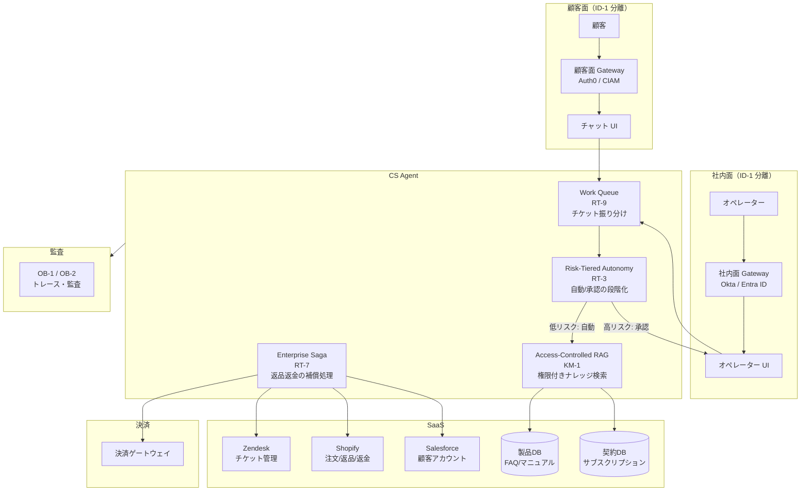
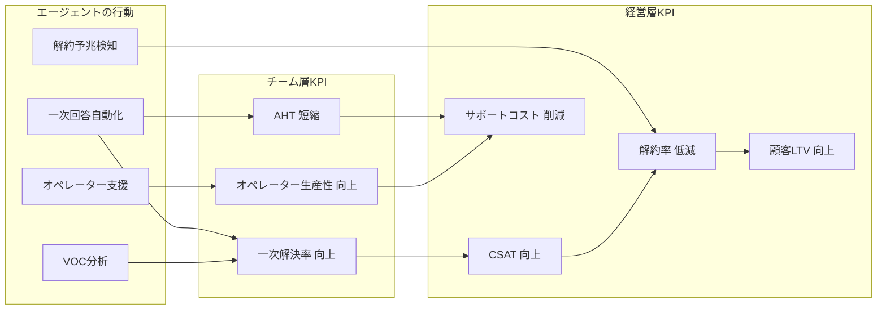
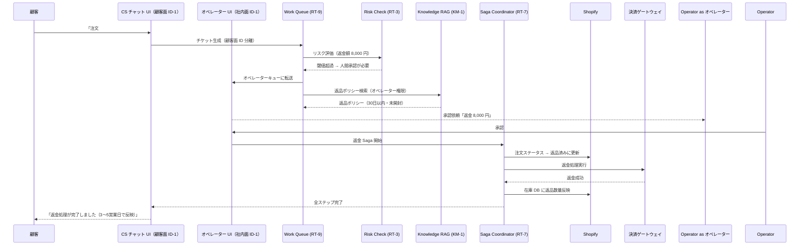

# Customer Support Agent の適用パターン

## 概要

CS Agent の目的は**CSAT（顧客満足度）の向上・AHT（平均対応時間）の短縮・一次解決率の改善・解約予兆の早期検知・アップセル機会の抽出**というカスタマーサポートの成果 KPI を動かすことにある。一次回答の自動化・オペレーター支援・解約リスク分析・顧客感情分析といった価値ユースケースを通じて、サポート品質と顧客維持率を高める。

この価値を安全に実現する大前提は、顧客面と社内面の完全分離（ID-1）だ。顧客との直接やり取りと社内の契約 DB・製品 DB・返金システムへのアクセスが交差する構造に対し、自動回答と要承認操作を段階的に使い分ける（RT-3 リスク階層自律）ことで安全と効率を両立する。

## 対象 SaaS

- Zendesk（チケット管理・顧客対話）
- Shopify（注文・返品・返金管理）
- Salesforce（顧客アカウント・契約管理）
- 製品 DB（FAQ・マニュアル・既知問題）
- 契約 DB（サブスクリプション・利用規約）

## 適用パターンと理由

### [ID-1 Workforce / Customer Identity Split（二面分離）](../../patterns/id-identity/id1-workforce-customer-split.md)

カスタマーサポートエージェントは、顧客向けチャット UI と社内オペレーター UI の両方に接する。ID-1 はこの二面を ID プロバイダー・権限スコープ・ログストレージのレベルで完全に分離する。顧客の認証トークンが社内システムの操作に流用されることを構造的に防ぎ、社内オペレーターの権限が顧客向けインターフェースに誤って露出することもない。「顧客用チャットから社内の契約 DB に直接アクセスできてしまった」というインシデントは、この分離の欠如から生まれるものだ。

### [RT-3 Risk-Tiered Autonomy（リスク段階的自律）](../../patterns/rt-runtime/rt3-risk-tiered-autonomy.md)

FAQ への回答・注文状況の確認・一般的なトラブルシューティングは自動実行してよい。しかし返金処理・契約変更・アカウント停止は、エージェントが単独で判断してはならない操作だ。RT-3 はリスクレベル（金額・操作の不可逆性・顧客影響範囲）に応じて自律度を段階的に設定し、閾値を超えた操作（例：返金額 5,000 円以上）を自動的に人間承認キューへ振り分ける。オペレーターは承認 UI で操作内容を確認し、承認・否決・修正を行う。

### [KM-1 Access-Controlled RAG（権限付きナレッジ検索）](../../patterns/km-knowledge/km1-access-controlled-rag.md)

製品マニュアル・FAQ・既知問題のナレッジベースには、顧客向けに公開してよい情報と社内オペレーター専用の情報（内部障害情報・未公開の修正ステータスなど）が混在している。KM-1 はベクトル検索時に呼び出し元のロール（顧客 or オペレーター）を検索フィルタとして適用し、顧客に見せてはいけない情報が検索結果に含まれないことを保証する。単純な「全文検索して返す」では、権限境界を破壊してしまう。

### [RT-7 Enterprise Saga（分散トランザクション管理）](../../patterns/rt-runtime/rt7-enterprise-saga.md)

返品・返金の処理は複数システムを横断する一連のトランザクションだ。Shopify で注文ステータスを「返品済み」に更新し、決済ゲートウェイで返金処理を実行し、Zendesk チケットをクローズし、在庫 DB に戻し数量を反映する——これらを連続して行う。途中で Shopify の更新が成功して決済返金が失敗した場合、一貫性を保つための補償処理が必要になる。RT-7 はこの分散トランザクションを Saga パターンで管理し、各ステップの成否と補償処理を自動で制御する。

### [RT-9 Work Queue Agent（業務キューエージェント）](../../patterns/rt-runtime/rt9-work-queue-agent.md)

カスタマーサポートは大量のチケットを人間オペレーターと AI が協働して処理する。RT-9 は Zendesk のチケットキューをエージェントが処理できる単位に分解し、優先度・担当者スキル・自動処理可否を評価して振り分ける。単純な FAQ 対応はエージェントが自動クローズし、複雑な問題や感情的なクレームは人間に転送する。人間とエージェントが同じキューから作業を受け取る構造により、オペレーターは手動トリアージの負担なく高難度チケットへ集中できる。

## システム構成

CS Agent の最大の特徴は、顧客面と社内面が ID-1 で物理的に分離されている点だ。顧客からのリクエストは顧客面ゲートウェイを通り、社内面のオペレーターツールとは完全に別経路で処理される。

## 価値ユースケース

CS Agent の価値は「返金事故を防ぐ」ことに加え、顧客満足度を高め、解約を減らし、サポートコストを下げることにある。カスタマーサポートは顧客接点の最前線であり、コスト削減（AHT・オペレーター工数）だけでなく、**トップライン（売上・継続率）への直接的な貢献**——解約抑止による LTV 維持、一次解決率向上による顧客ロイヤルティ強化、アップセル機会の検出——も同時に実現できる部門だ。[ID-1（顧客面分離）](../../patterns/id-identity/id1-workforce-customer-split.md)の安全前提の上で、以下の価値ユースケースを展開する。

| ユースケース | 概要 | 効く成果KPI |
|---|---|---|
| 一次回答の自動化 | FAQ・既知問題・製品マニュアルを基に、顧客問い合わせの初回回答を自動生成 | 一次解決率・AHT（平均処理時間）短縮 |
| 解約予兆検知と介入 | 問い合わせ頻度・トーン・契約更新時期から解約リスクを検知し、プロアクティブに介入提案 | 解約率低減・LTV向上 |
| オペレーター支援（回答示唆） | 複雑な問い合わせに対し、過去類似ケースと解決策を即座にオペレーターに提示 | オペレーター生産性・CSAT |
| エスカレーション判断の自動化 | 問い合わせ内容・顧客属性・過去履歴からエスカレーション要否と先を自動判断 | エスカレーション適切率・顧客待ち時間短縮 |
| VOC分析・改善提案 | チケットデータの傾向分析により、製品改善や FAQ 更新のインサイトを自動生成 | 問い合わせ件数削減（根本原因解消） |
| 返品・返金処理のドラフト生成 | ポリシーに基づく返品・返金判断のドラフトを生成し、オペレーターの確認工数を削減 | 処理リードタイム・オペレーター工数 |

## 成果KPIマッピング

## 価値の階段（段階的拡大）

| 段階 | 自律度 | 代表的な機能 | 期待成果 |
|---|---|---|---|
| **Step 1：効率化（読み取り）** | Read-only Copilot | FAQ検索・過去ケース参照・オペレーターへの回答示唆 | オペレーターの情報探索時間を削減。即日導入可能なクイックウィン |
| **Step 2：示唆提供（分析）** | 分析＋自動分類 | チケット自動分類・解約予兆・VOC分析・エスカレーション判断 | 一次解決率・CSATの改善。RT-9キューとの連携で自然に統合 |
| **Step 3：業務実行（書き込み）** | 段階的自動実行 | FAQ自動回答（低リスク）・返金処理ドラフト・チケットクローズ | サポートコストの直接的削減。RT-3のリスクティアで段階的に自律度を上げる |

## 典型的なフロー

顧客から「先週の注文を返品・返金してほしい」というリクエストが来たときの処理フローを以下に示す。

