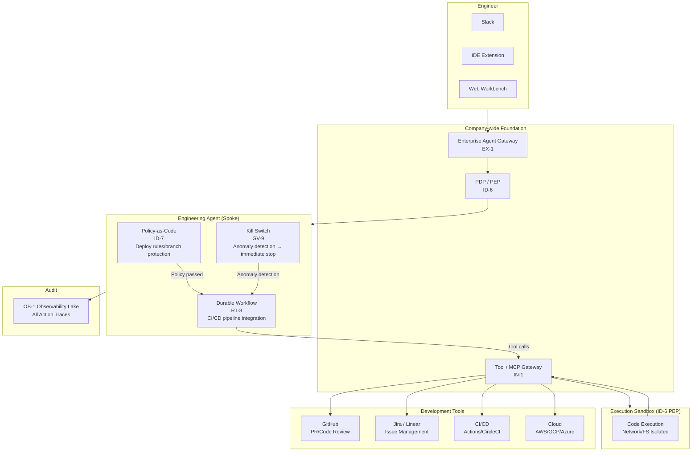
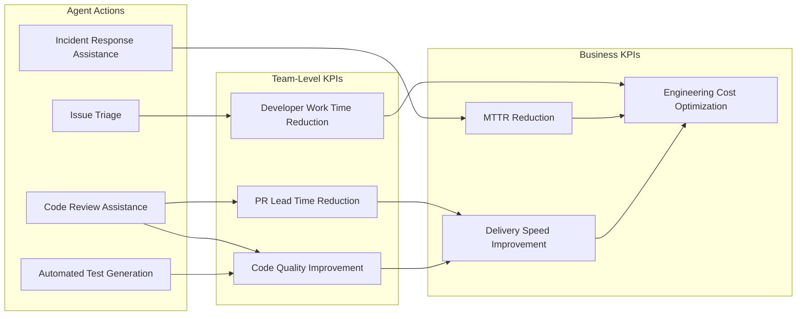
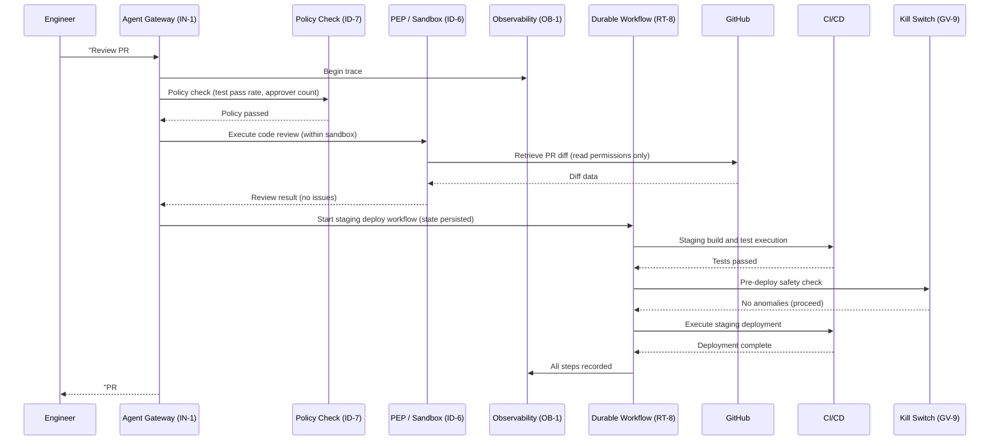

# Engineering Agent Pattern Application

## Overview

The purpose of Engineering Agent is to move the engineering outcome KPIs of **lead time (DORA metrics) shortening, code review time reduction, incident MTTR improvement, and documentation self-service rate improvement**. Through value use cases such as code review assistance, automated incident triage, documentation search, and CI/CD pipeline optimization, it raises development team productivity and system reliability.

As the foundation for safely realizing this value, for operations with the most direct system impact of all departments — code execution, CI/CD pipeline, and production infrastructure operations — mandatory execution environment isolation (IN-1 sandbox), automated checks through policy code (ID-7), complete action tracing (OB-1), and instant stop mechanisms (GV-9 Kill Switch) are combined. Safety is assured through execution platform structure, not trust in prompts.

## Target SaaS

- GitHub (code review, PRs, release management)
- Jira / Linear (issue management, sprint planning)
- Slack (incident notifications, approval flow integration)
- CI/CD (GitHub Actions / CircleCI / Jenkins, etc.)
- Cloud (AWS / GCP / Azure resource management)

## Applied Patterns and Reasons

### [IN-1 Tool / MCP Gateway](../../patterns/in-integration/in1-tool-mcp-gateway.md)

Engineering agents use many tools — code execution, GitHub API, cloud CLI, and more. IN-1 routes all these tool calls through a single gateway, centrally recording and restricting "which agent, which tool, with what arguments." If the agent is given direct AWS CLI access without a gateway, permission boundaries become invisible and post-hoc tracing of what happened becomes difficult. Adding, removing, and changing tool permissions can also be centrally managed at the gateway.

### [ID-6 Zero-Trust PDP/PEP](../../patterns/id-identity/id6-zero-trust-pdp-pep.md)

The "execute code" operation requires allow/deny judgment that varies based on the content. Fine-grained authorization is needed: allow running unit tests, but deny direct connections to production DB. ID-6 separates the policy decision point (PDP) and policy enforcement point (PEP), evaluating all execution requests in real time. When the agent attempts to access resources outside the sandbox, the PEP forcibly blocks it and records it in the PDP log. By separating network, filesystem, and process permissions at the execution platform level, this provides far stronger guarantees than prompt-level restrictions.

### [RT-8 Durable Workflow](../../patterns/rt-runtime/rt8-durable-workflow.md)

CI/CD pipelines are multi-stage processes: "build → test → review → staging deploy → production deploy." Having to restart the entire process from the beginning when network failures or timeouts occur is inefficient and dangerous (risk of double-deploy). RT-8 persists each workflow step, enabling resumption from the point of failure while skipping already-completed steps. Even if the agent crashes after completing staging, it can resume from the production deploy step and prevent duplicate execution.

### [OB-1 Observability Lake](../../patterns/ob-observability/ob1-observability-lake.md)

What "purpose, which tools, in what sequence" the engineering agent used must be completely recorded from the perspectives of security audit, incident investigation, and cost tracking. OB-1 aggregates all agent actions (tool calls, LLM input/output, decision rationale) into the observability lake and stores them as OpenTelemetry-compatible traces. The ability to identify within 5 minutes "what this agent sent to the production DB" after an incident is particularly important for engineering use cases.

### [GV-9 Incident Response / Kill Switch](../../patterns/gv-governance/gv9-incident-response-kill-switch.md)

When production environment impact occurs, a mechanism to immediately stop the agent is essential. GV-9 monitors agent execution in real time and stops the agent automatically or manually when anomaly indicators are detected (spike in error rate, unexpected resource deletion, abnormal API call patterns). After stopping, the current execution state is saved, enabling resumption or rollback after cause investigation. When "the agent has started deploying to production and I want to stop it," one kill switch handles it without modifying code.

### [ID-7 Policy-as-Code Guardrail](../../patterns/id-identity/id7-policy-as-code-guardrail.md)

Rules such as "only approved PRs permitted to deploy to production," "builds with test pass rate below 80% cannot deploy," and "direct pushes to production branch prohibited" should be implemented as policy code in OPA (Open Policy Agent), not instructed through prompts. ID-7 routes agent operation requests through the policy engine and blocks them before execution if they violate policy. Since policies are managed as code, version control, review, and audit trails are automatically created.

## System Architecture

In Engineering Agent, all tool calls go through the Tool Gateway (IN-1), and code execution is isolated in a sandbox by the PEP. The Kill Switch monitors continuously and can stop immediately on anomaly detection.

## Value Use Cases

The value of Engineering Agent lies not just in "preventing production accidents," but also in "shortening the development cycle and letting engineers focus on high-value work."

| Use Case | Overview | Effective Outcome KPIs |
|---|---|---|
| Code review assistance | Analyze PR diffs and automatically detect bugs, security vulnerabilities, and design issues | Review lead time reduction, bug leakage rate reduction |
| Issue triage automation | Analyze issue content, urgency, and impact scope, automatically assigning priority and responsible party | Triage workload reduction, MTTR shortening |
| Incident response assistance (MTTR reduction) | Automatically collect logs, metrics, and change history when alerts occur, and present root cause candidates | MTTR reduction, incident impact time reduction |
| Test generation and execution | Auto-generate test cases for code changes, execute them, and create coverage reports | Test workload reduction, quality improvement |
| Automated documentation generation | Auto-update API specs, changelogs, and operations procedures accompanying code changes | Documentation maintenance cost reduction |
| Technical debt visualization | Periodically analyze codebase complexity, dependencies, and old libraries, presenting improvement priorities | Long-term maintenance cost reduction, development speed maintenance |

## Outcome KPI Mapping

## Value Staircase (Staged Expansion)

| Stage | Autonomy | Representative Functions | Expected Outcomes |
|---|---|---|---|
| **Step 1: Efficiency (Read-only)** | Read-only Copilot | Code review assistance, log analysis, documentation search | Reduce engineer information-gathering and analysis time. Safe same-day deployment within sandbox |
| **Step 2: Insights (Analysis)** | Analysis + Proposals | Root cause candidates for incidents, technical debt priority, test case suggestions | MTTR reduction and code quality improvement. Operates within ID-6 PEP read permissions |
| **Step 3: Execution (Writes)** | Policy-controlled execution | Test auto-execution, staging deployment, issue label assignment | CI/CD cycle automation. ID-7 policy restricts production operations while automating low-risk operations |

## Typical Flow

The processing flow when an engineer requests "review this PR and deploy to staging."

