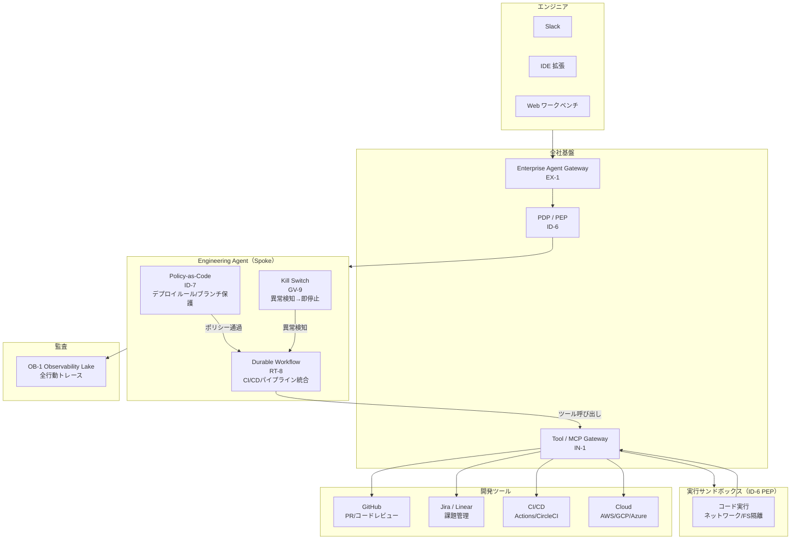
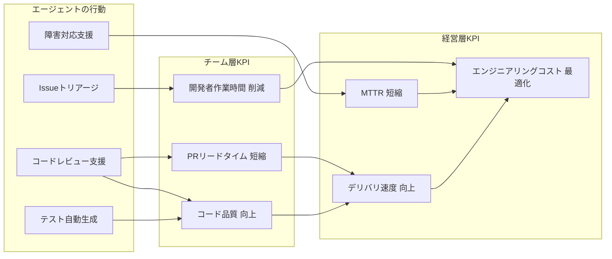
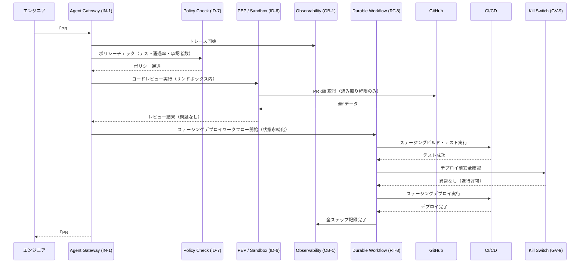

# Engineering Agent の適用パターン

## 概要

Engineering Agent の目的は**リードタイム（DORA 指標）の短縮・コードレビュー時間の削減・インシデント MTTR の改善・ドキュメント自己解決率の向上**というエンジニアリングの成果 KPI を動かすことにあります。コードレビュー支援・インシデント自動トリアージ・ドキュメント検索・CI/CD パイプライン最適化といった価値ユースケースを通じて、開発チームの生産性とシステム信頼性を高められます。

この価値を安全に実現する土台として、コード実行・CI/CD パイプライン・本番インフラ操作——全部門の中で最もシステムへの直接影響力が大きい操作——に対し、実行環境の強制隔離（IN-1 サンドボックス）・ポリシーコードによる自動チェック（ID-7）・行動の完全トレース（OB-1）・即時停止機構（GV-9 Kill Switch）を組み合わせます。安全性はプロンプトへの信頼ではなく、実行基盤の構造で確保するものです。

## 対象 SaaS

- GitHub（コードレビュー・PR・リリース管理）
- Jira / Linear（課題管理・スプリント計画）
- Slack（インシデント通知・承認フロー）
- CI/CD（GitHub Actions / CircleCI / Jenkins 等）
- Cloud（AWS / GCP / Azure のリソース管理）

## 適用パターンと理由

### [IN-1 Tool / MCP Gateway（ツール・MCP ゲートウェイ）](../../patterns/in-integration/in1-tool-mcp-gateway.md)

エンジニアリングエージェントはコード実行・GitHub API・クラウド CLI など多数のツールを使います。IN-1 はこれらすべてのツール呼び出しを単一のゲートウェイ経由で通過させ、「どのエージェントが・どのツールを・どんな引数で呼んだか」を一元的に記録・制限します。ゲートウェイなしでエージェントに直接 AWS CLI を持たせると権限の境界が見えなくなり、事後追跡も困難になります。ツールの追加・削除・権限変更もゲートウェイで一元管理できる点が大きな利点です。

### [ID-6 Zero-Trust PDP/PEP（ゼロトラスト認可）](../../patterns/id-identity/id6-zero-trust-pdp-pep.md)

「コードを実行する」という操作は、内容によって許可/拒否の判断が変わります。ユニットテストの実行は許可するが、本番 DB への直接接続は拒否する——そういった細粒度の認可が必要です。ID-6 はポリシー決定点（PDP）とポリシー適用点（PEP）を分離し、すべての実行リクエストをリアルタイムに評価します。エージェントがサンドボックス外のリソースにアクセスしようとすると PEP が強制遮断し、PDP のログに記録します。ネットワーク・ファイルシステム・プロセス権限を実行基盤レベルで分離することで、プロンプトレベルの制約よりはるかに強い保証が得られるようになります。

### [RT-8 Durable Workflow（耐久性ワークフロー）](../../patterns/rt-runtime/rt8-durable-workflow.md)

CI/CD パイプラインは「ビルド → テスト → レビュー → ステージングデプロイ → 本番デプロイ」という多段階のプロセスです。途中でネットワーク障害やタイムアウトが発生しても、処理全体を最初からやり直すのは非効率で危険（二重デプロイのリスク）です。RT-8 はワークフローの各ステップを永続化し、障害後に完了済みステップをスキップして再開できます。エージェントがステージングまで完了した後にクラッシュしても、本番デプロイのステップから再開でき、重複実行を防ぐことができます。

### [OB-1 Observability Lake（可観測性レイク）](../../patterns/ob-observability/ob1-observability-lake.md)

エンジニアリングエージェントが「何のために・どのツールを・どんな順序で」使ったかは、セキュリティ監査・インシデント調査・コスト追跡の観点から完全に記録しなければなりません。OB-1 はエージェントのすべての行動（ツール呼び出し・LLM 入出力・判断根拠）を可観測性レイクに集約し、OpenTelemetry 互換のトレースとして保存します。「このエージェントが本番 DB に何を送ったか」をインシデント発生後5分以内に特定できる体制は、エンジニアリング用途では特に重要です。

### [GV-9 Incident Response / Kill Switch（インシデント対応・緊急停止）](../../patterns/gv-governance/gv9-incident-response-kill-switch.md)

本番環境に影響が出たとき、エージェントを即座に停止できる機構は不可欠です。GV-9 はエージェントの実行をリアルタイムで監視し、異常指標（エラー率の急上昇・予期せぬリソース削除・異常な API 呼び出しパターン）を検知したときに自動または手動でエージェントを停止します。停止後は実行状態を保存し、原因調査後に再開または巻き戻しができます。「エージェントが本番にデプロイし始めたので止めたい」という瞬間に、コードを修正せずキルスイッチ一発で対応できる仕組みとなります。

### [ID-7 Policy-as-Code Guardrail（ポリシーコードガードレール）](../../patterns/id-identity/id7-policy-as-code-guardrail.md)

「本番へのデプロイは承認済みの PR のみ許可」「テスト通過率 80% 未満のビルドはデプロイ不可」「production ブランチへの直接プッシュは禁止」——これらのルールはプロンプトで指示するのではなく、OPA（Open Policy Agent）等のポリシーコードとして実装します。ID-7 はエージェントの操作要求をポリシーエンジンに通し、違反する場合は実行前に遮断できます。ポリシーはコードとして管理されるため、バージョン管理・レビュー・監査証跡が自動的に生まれます。

## システム構成

Engineering Agent はすべてのツール呼び出しが Tool Gateway（IN-1）を経由し、コード実行は PEP によるサンドボックスで隔離されます。Kill Switch が常時監視し、異常検知時に即停止できる構成です。



## 価値ユースケース

Engineering Agent の価値は「本番事故を防ぐ」ことに加え、開発サイクルを短縮し、エンジニアを高付加価値作業に集中させることにあります。

| ユースケース | 概要 | 効く成果KPI |
|---|---|---|
| コードレビュー支援 | PR の diff を分析し、バグ・セキュリティ脆弱性・設計上の問題を自動検出 | レビューリードタイム短縮・バグ流出率低減 |
| Issue トリアージ自動化 | Issue の内容・緊急度・影響範囲を分析し、優先度と担当者を自動割り当て | トリアージ工数削減・MTTR短縮 |
| 障害対応支援（MTTR短縮） | アラート発生時にログ・メトリクス・変更履歴を自動収集し、根本原因の候補を提示 | MTTR短縮・障害影響時間削減 |
| テスト生成・実行 | コード変更に対応したテストケースの自動生成と実行、カバレッジレポート作成 | テスト工数削減・品質向上 |
| ドキュメント自動生成 | コード変更に伴うAPI仕様書・変更ログ・運用手順の自動更新 | ドキュメント維持コスト削減 |
| 技術的負債の可視化 | コードベースの複雑度・依存関係・古いライブラリを定期分析し、改善優先順位を提示 | 長期保守コスト削減・開発速度維持 |

## 成果KPIマッピング



## 価値の階段（段階的拡大）

| 段階 | 自律度 | 代表的な機能 | 期待成果 |
|---|---|---|---|
| **Step 1：効率化（読み取り）** | Read-only Copilot | コードレビュー補助・ログ分析・ドキュメント検索 | エンジニアの情報収集・分析時間を削減します。サンドボックス内で安全に即日展開できます |
| **Step 2：示唆提供（分析）** | 分析＋提案 | 障害根因候補提示・技術負債優先順位・テストケース提案 | MTTR短縮とコード品質向上。ID-6 PEPの読み取り権限内で動作します |
| **Step 3：業務実行（書き込み）** | ポリシー制御付き実行 | テスト自動実行・ステージングデプロイ・Issueラベル付与 | CI/CDサイクルの自動化。ID-7ポリシーで本番操作を制限しつつ低リスク操作を自動化します |

## 典型的なフロー

エンジニアが「この PR をレビューしてステージングにデプロイして」と依頼したときの処理フローを以下に示します。



## Decision Summary

```yaml
decision_summary:
  department: engineering
  value_drivers: [project_productivity, automation, employee_efficiency]
  value_usecases:
    - "コードレビュー支援"
    - "障害トリアージ・根本原因分析"
    - "ドキュメント自動生成"
    - "プロジェクト進捗可視化"
    - "テスト生成・品質分析"
  kpis:
    - "リードタイム"
    - "変更失敗率"
    - "レビュー時間"
    - "デプロイ頻度"
    - "障害復旧時間"
  value_ladder:
    - "Step 1: 可視化 — ログ検索・進捗ダッシュボード"
    - "Step 2: 分析・示唆 — コードレビュー・障害トリアージ"
    - "Step 3: 実行支援 — PRマージ・デプロイ・ドキュメント更新"
  applied_patterns: [RT-11, RT-2, KM-1, KM-4, IN-1, OB-1]
```
