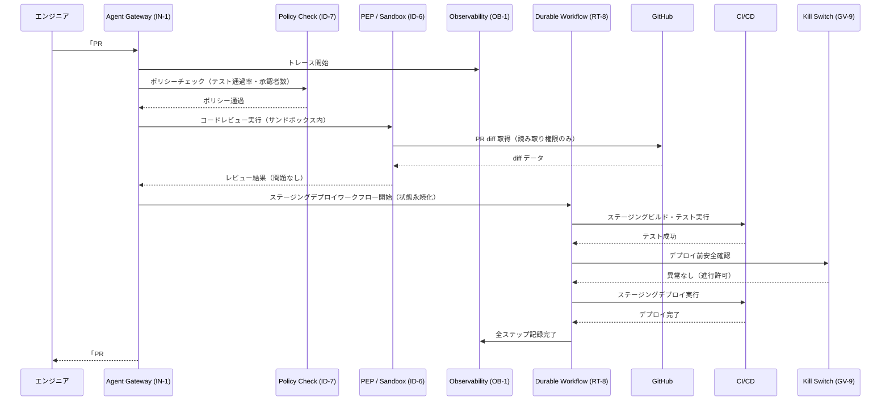

# Engineering Agent の適用パターン

## 概要

エンジニアリング部門のエージェントは、すべての部門の中で最もシステムへの直接的な影響力を持つ。コードを実行し、CI/CD パイプラインを動かし、本番インフラのリソースを操作できる。これは言い換えれば、エージェントが誤動作したときの被害が最も大きい部門でもある。本番デプロイの誤操作・本番 DB へのアクセス・機密認証情報の漏洩——これらをすべて事前に防ぐには、「実行環境の強制隔離」「ポリシーコードによる自動チェック」「行動の完全トレース」「即時停止機構」を組み合わせる必要がある。エンジニアリングエージェントの安全性は、信頼するプロンプトではなく、実行基盤の構造で確保する。

## 対象 SaaS

- GitHub（コードレビュー・PR・リリース管理）
- Jira / Linear（課題管理・スプリント計画）
- Slack（インシデント通知・承認フロー）
- CI/CD（GitHub Actions / CircleCI / Jenkins 等）
- Cloud（AWS / GCP / Azure のリソース管理）

## 適用パターンと理由

### [IN-1 Tool / MCP Gateway（ツール・MCP ゲートウェイ）](../../patterns/in-integration/in1-tool-mcp-gateway.md)

エンジニアリングエージェントはコード実行・GitHub API・クラウド CLI など多数のツールを使う。IN-1 はこれらすべてのツール呼び出しを単一のゲートウェイ経由で通過させ、「どのエージェントが・どのツールを・どんな引数で呼んだか」を一元的に記録・制限する。ゲートウェイなしでエージェントに直接 AWS CLI を持たせると、権限の境界が見えなくなり、何が起きたかの事後追跡も困難になる。ツールの追加・削除・権限変更もゲートウェイで一元管理できる。

### [ID-6 Zero-Trust PDP/PEP（ゼロトラスト認可）](../../patterns/id-identity/id6-zero-trust-pdp-pep.md)

「コードを実行する」という操作は、内容によって許可/拒否の判断が変わる。ユニットテストの実行は許可するが、本番 DB への直接接続は拒否する、といった細粒度の認可が必要だ。ID-6 はポリシー決定点（PDP）とポリシー適用点（PEP）を分離し、すべての実行リクエストをリアルタイムに評価する。エージェントがサンドボックス外のリソースにアクセスしようとすると PEP が強制遮断し、PDP のログに記録する。ネットワーク・ファイルシステム・プロセス権限を実行基盤レベルで分離することで、プロンプトレベルの制約よりはるかに強い保証を提供する。

### [RT-8 Durable Workflow（耐久性ワークフロー）](../../patterns/rt-runtime/rt8-durable-workflow.md)

CI/CD パイプラインは「ビルド → テスト → レビュー → ステージングデプロイ → 本番デプロイ」という多段階のプロセスだ。途中でネットワーク障害やタイムアウトが発生しても、処理全体を最初からやり直すのは非効率で危険（二重デプロイのリスク）だ。RT-8 はワークフローの各ステップを永続化し、障害後に完了済みステップをスキップして再開できる。エージェントがステージングまで完了した後にクラッシュしても、本番デプロイのステップから再開でき、重複実行を防ぐ。

### [OB-1 Observability Lake（可観測性レイク）](../../patterns/ob-observability/ob1-observability-lake.md)

エンジニアリングエージェントが「何のために・どのツールを・どんな順序で」使ったかは、セキュリティ監査・インシデント調査・コスト追跡の観点から完全に記録する必要がある。OB-1 はエージェントのすべての行動（ツール呼び出し・LLM 入出力・判断根拠）を可観測性レイクに集約し、OpenTelemetry 互換のトレースとして保存する。インシデント発生後に「このエージェントが本番 DB に何を送ったか」を5分以内に特定できる体制が、エンジニアリング用途では特に重要だ。

### [GV-9 Incident Response / Kill Switch（インシデント対応・緊急停止）](../../patterns/gv-governance/gv9-incident-response-kill-switch.md)

本番環境に影響が出たとき、エージェントを即座に停止できる機構が不可欠だ。GV-9 はエージェントの実行をリアルタイムで監視し、異常指標（エラー率の急上昇・予期せぬリソース削除・異常な API 呼び出しパターン）を検知したときに自動または手動でエージェントを停止する。停止後は現在の実行状態を保存し、原因調査後に再開または巻き戻しができる。「エージェントが本番にデプロイし始めたので止めたい」という瞬間に、コードを修正せずキルスイッチ一発で対応できる。

### [ID-7 Policy-as-Code Guardrail（ポリシーコードガードレール）](../../patterns/id-identity/id7-policy-as-code-guardrail.md)

「本番へのデプロイは承認済みの PR のみ許可」「テスト通過率 80% 未満のビルドはデプロイ不可」「production ブランチへの直接プッシュは禁止」といったルールは、プロンプトで指示するのではなく OPA（Open Policy Agent）等のポリシーコードとして実装する。ID-7 はエージェントの操作要求をポリシーエンジンに通し、違反する場合は実行前に遮断する。ポリシーはコードとして管理されるため、バージョン管理・レビュー・監査証跡が自動的に生まれる。

## 典型的なフロー

以下はエンジニアが「この PR をレビューしてステージングにデプロイして」と依頼したときの処理フローだ。

