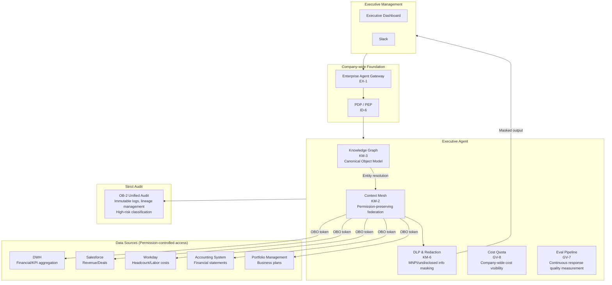
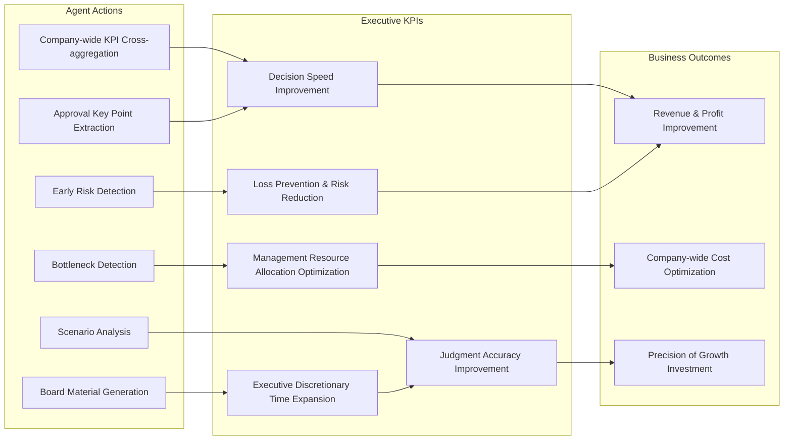
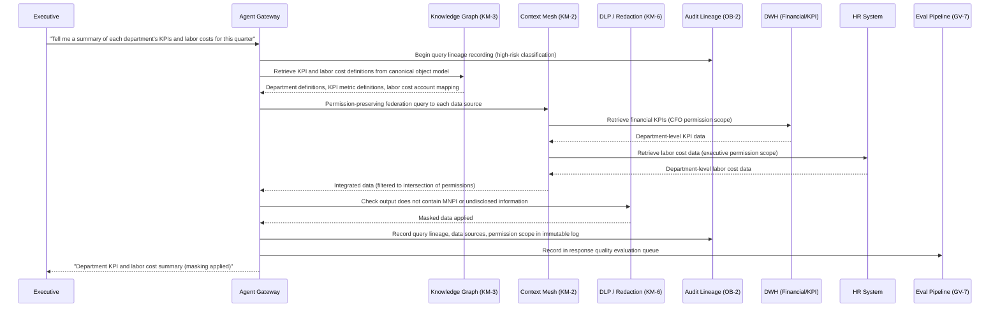

# Executive Agent Pattern Application

## Overview

Executive-level agents function as **value-creating agents that accelerate management decision-making** by cross-referencing company-wide KPIs, financial information, HR information, and business portfolios. They potentially have the broadest data access permissions of all departments, and this breadth of access creates the most stringent audit requirements. At the same time, cross-departmental data access is the source of executive value — "accelerating company-wide optimal decision-making." Since each department's data has different permission models, schemas, and update frequencies, cross-departmental aggregation and analysis requires "permission-preserving federation" and "normalized object models."

## Target SaaS

- DWH (company-wide data warehouse such as BigQuery/Snowflake)
- Finance systems (accounting, financial statements, budget management)
- Sales CRM (Salesforce-level deal and revenue data)
- HR systems (Workday-level headcount and organization data)
- Portfolio management tools (business plans, KPI tracking)

## Applied Patterns and Reasons

### [KM-3 Canonical Object & Knowledge Graph](../../patterns/km-knowledge/km3-canonical-object-knowledge-graph.md)

To answer an executive question like "tell me the relationship between this quarter's operating profit and labor costs," Sales revenue data, Finance expense data, and HR labor cost data must be joined. However, in practice there are many inconsistencies: the definition of "department" differs by system, the "revenue" aggregation timing differs. KM-3 manages a normalized company-wide object model (products, customers, employees, projects, etc.) as a knowledge graph and centrally resolves "which system's, which definition's, at what granularity" to retrieve data. Cross-departmental aggregation for executive dashboards stabilizes with this pattern.

### [KM-2 Context Mesh](../../patterns/km-knowledge/km2-context-mesh.md)

Each department's data must be provided to the executive agent while preserving its respective permission models. Sales data within what sales staff can view, HR data only for officers with HR authority, financial data within the CFO-approved scope — federating cross-departmentally while maintaining these permission constraints is KM-2's role. Simply "executives can see everything" makes permission boundaries ambiguous and can create legal issues. KM-2 respects each data source's permission policies at the federation layer, always filtering data delivered to the executive agent to the intersection of permissions.

### [KM-6 DLP & Redaction Boundary](../../patterns/km-knowledge/km6-dlp-redaction-boundary.md)

Executive-level agents are likely to handle highly sensitive information (undisclosed M&A information, individual employee evaluations, financial forecasts). KM-6 applies DLP rules to agent outputs, logs, and transfers to external integrations, preventing information that could be problematic under insider trading regulations (MNPI: Material Non-Public Information) from being sent to inappropriate channels. Even when posting meeting minutes summaries to Slack, KM-6 automatically masks undisclosed financial figures and personnel information.

### [GV-8 Cost Quota & Chargeback](../../patterns/gv-governance/gv8-cost-quota-chargeback.md)

For executives to visualize and allocate company-wide AI costs, a mechanism is needed to accurately measure and report usage costs by department, project, and agent. GV-8 records LLM API costs, infrastructure costs, and tool call costs with tags and generates cost chargeback reports by department. When the executive agent is asked "show me this month's AI costs by department," it can immediately answer from GV-8's data sources. Company-wide cost ceiling (quota) settings and excess alerts are also handled by GV-8.

### [GV-7 Evaluation Governance Pipeline](../../patterns/gv-governance/gv7-evaluation-governance-pipeline.md)

For agents used in management decisions, "the quality of responses is continuously measured" is mandatory. If the answer to "What are the KPI changes compared to last month?" differs from the facts and cannot be detected after the fact, it does not function as governance. GV-7 runs automated evaluation pipelines periodically, measuring the executive agent's response accuracy, factual consistency, and hallucination rate. Evaluation results are visualized on dashboards, and when quality metrics fall below thresholds, automatic alerts and model update consideration triggers fire.

### [OB-2 Unified Audit Lineage](../../patterns/ob-observability/ob2-unified-audit-lineage.md)

Executive operations fall into high-risk classification and require the most stringent audit records. The act of "the executive agent referenced financial data and generated a report" must have a fully traceable lineage (which query, with what data, under whose authority) from the perspectives of securities law and corporate law. OB-2 records the lineage of all agent operations as immutable logs, enabling auditors to go back to any point in time and verify "what was the source data for this report." Tamper prevention for logs, long-term storage, and integration with external audit tools are also handled by OB-2.

## System Architecture

Executive Agent crosses all departmental data, but access to each data source maintains permissions through federation via Context Mesh (KM-2). DLP monitors both outputs and logs, preventing inappropriate leakage of MNPI (Material Non-Public Information).

## Value Use Cases

The essence of Executive Agent's value lies in "accelerating management decision-making and realizing company-wide optimization." Safe cross-departmental data access is a means — the goal is improving the quality and speed of management judgments.

| Use Case | Overview | Effective Outcome KPIs |
|---|---|---|
| Company-wide KPI cross-reference | Real-time cross-aggregation of KPIs from each department, instantly visualizing anomalies and trend changes | Management decision speed, anomaly detection lead time |
| Scenario analysis (What-if) | Instantly simulate scenarios such as "impact on each department if labor costs are reduced 10%" | Decision quality, planning accuracy |
| Cross-departmental bottleneck detection | Analyze inter-departmental dependencies and KPI correlations to identify company-wide performance bottlenecks | Management resource optimal allocation, company-wide productivity |
| Early risk detection | Early detection of management risks (cash flow, mass attrition, large-scale churn) from anomalous patterns in financial, HR, and customer data | Risk response speed, loss prevention |
| AI investment portfolio management | Evaluate company-wide AI agent investment by use case on value × cost × risk and support allocation optimization | AI investment ROI, objective prioritization of deployment |
| GV-10 executive dashboard direct connection | Real-time reference to Three-Layer Value Measurement business KPIs to support AI investment decisions | Speed of AI investment continuation/expansion/withdrawal decisions |
| Board meeting material preparation | Cross-aggregate dispersed departmental reports, financial data, and KPI results to auto-generate first drafts of board materials | Material preparation time reduction, executive time savings |
| Investor relations / IR preparation | Generate anticipated Q&As and response drafts based on past IR materials, financial statements, and industry trends | IR preparation workload reduction, response quality |
| Approval and arbitration acceleration | Extract key points from approval documents, compare with similar past cases, and automatically organize risk factors, shortening management judgment wait time | Approval lead time, decision wait time |

## Outcome KPI Mapping

## Value Staircase (Staged Expansion)

| Stage | Autonomy | Representative Functions | Expected Outcomes |
|---|---|---|---|
| **Step 1: Visualization (Read-only)** | Read-only dashboard | Company-wide KPI cross-display, departmental performance comparison, cost visibility | Reduce management meeting preparation time. Immediate access to GV-10/GV-8 data |
| **Step 2: Analysis & Insights (Reasoning)** | Analysis + Alerts | What-if simulation, bottleneck detection, early risk detection | Decision quality improvement. Leverages KM-3 knowledge graph and KM-2 mesh cross-analysis capability |
| **Step 3: Decision Support (Proposals)** | Proposals + Option presentation | Investment allocation proposals, organizational restructuring scenario comparison, medium-term plan draft generation | Corporate planning workload reduction and decision speed improvement. Final decisions are always made by humans |

!!! note "Essential Value of Executive Agents"
    The value of executive agents is not "showing data" but "eliminating decision-making delays." Information that previously took the corporate planning department several days to aggregate and analyze is instantly provided cross-departmentally by the agent, shortening the cycle time of decision-making itself.

## Typical Flow

The processing flow when an executive requests "tell me a summary of each department's KPIs and labor costs for this quarter."

