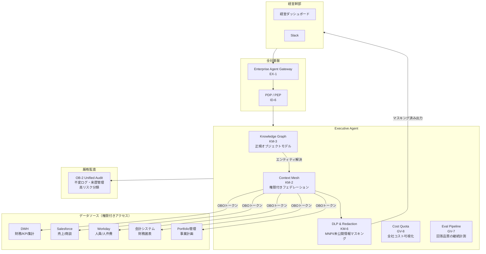
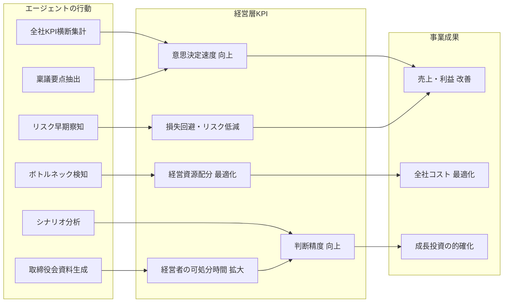
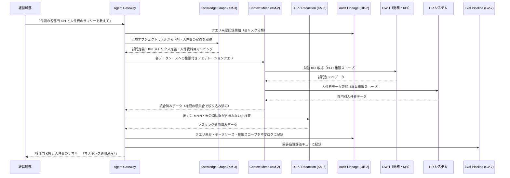

# Executive Agent の適用パターン

## 概要

経営層のエージェントは、全社の KPI・財務情報・人事情報・事業ポートフォリオを横断的に参照し、**経営の意思決定を加速する価値創出エージェント**として機能する。すべての部門の中で最も広いデータアクセス権限を持つ可能性があり、この権限の広さは最も厳格な監査要件を生む。同時に、横断データへのアクセスは「全社最適の意思決定を高速化する」という経営価値の源泉でもある。各部門のデータはそれぞれ異なる権限モデル・スキーマ・更新頻度を持つため、横断的な集計・分析には「権限付きのフェデレーション」と「正規化されたオブジェクトモデル」が不可欠だ。

## 対象 SaaS

- DWH（BigQuery / Snowflake 等の全社データウェアハウス）
- Finance システム（会計・財務諸表・予算管理）
- Sales CRM（Salesforce 等の商談・売上データ）
- HR システム（Workday 等の人員・組織データ）
- Portfolio 管理ツール（事業計画・KPI トラッキング）

## 適用パターンと理由

### [KM-3 Canonical Object & Knowledge Graph（正規オブジェクトと知識グラフ）](../../patterns/km-knowledge/km3-canonical-object-knowledge-graph.md)

「今期の営業利益と人件費の関係を教えて」という経営質問に答えるには、Sales の売上データと Finance の費用データと HR の人件費データを結合する必要がある。しかし各システムで「部門」の定義が異なる、「売上」の集計タイミングがずれている、といった不整合が現実には多い。KM-3 は全社横断の正規化されたオブジェクトモデル（製品・顧客・従業員・プロジェクト等）を知識グラフとして管理し、エージェントが「どのシステムの・どの定義の・どの粒度で」データを取得するかを一元的に解決する。経営ダッシュボード用の横断集計がこのパターンで安定する。

### [KM-2 Context Mesh（コンテキストメッシュ）](../../patterns/km-knowledge/km2-context-mesh.md)

各部門のデータは、それぞれの権限モデルを保持したまま経営エージェントに提供される必要がある。Sales データは営業担当が参照できる範囲、HR データは人事権限を持つ役員のみ、財務データは CFO 承認済みの範囲——これらの権限制約を維持しながら横断的にフェデレーションするのが KM-2 の役割だ。「経営層は全部見える」と単純化すると権限の境界が曖昧になり、法令上の問題が生じる可能性がある。KM-2 は各データソースの権限ポリシーをフェデレーション層で尊重し、経営エージェントに渡るデータを常に権限の積集合で絞り込む。

### [KM-6 DLP & Redaction Boundary（データ損失防止とマスキング）](../../patterns/km-knowledge/km6-dlp-redaction-boundary.md)

経営層が使うエージェントは、秘匿性の高い情報（未公開の M&A 情報・個別従業員の評価・財務予測）を扱う可能性が高い。KM-6 はエージェントの出力・ログ・外部連携先への転送に対して DLP ルールを適用し、インサイダー取引規制上の問題になりうる情報（MNPI: 重要な未公開情報）が不適切なチャネルに送信されることを防ぐ。会議録の要約を Slack に投稿する場合でも、KM-6 が未公開の決算数値や人事情報を自動マスキングする。

### [GV-8 Cost Quota & Chargeback（コストクォータと配賦）](../../patterns/gv-governance/gv8-cost-quota-chargeback.md)

経営層が全社 AI コストの可視化と配賦を行うには、部門別・プロジェクト別・エージェント別の利用コストを正確に計測・報告する仕組みが必要だ。GV-8 は LLM API コスト・インフラコスト・ツール呼び出しコストをタグ付きで記録し、部門ごとのコストチャージバックレポートを生成する。経営エージェントが「今月の AI コストを部門別に見せて」と聞かれたとき、GV-8 のデータソースから即座に回答できる。また全社のコスト上限（クォータ）設定と超過アラートも GV-8 が担う。

### [GV-7 Evaluation Governance Pipeline（評価ガバナンスパイプライン）](../../patterns/gv-governance/gv7-evaluation-governance-pipeline.md)

経営判断に使うエージェントは「回答の品質が継続的に計測されている」ことが必須だ。「先月比の KPI 変化は？」という質問への回答が事実と異なっていたとき、それを事後に検知できなければガバナンスとして機能しない。GV-7 は自動評価パイプラインを定期実行し、経営エージェントの回答精度・事実整合性・ハルシネーション率を計測する。評価結果はダッシュボードで可視化され、品質指標が閾値を下回ったときに自動アラートとモデル更新の検討トリガーが発火する。

### [OB-2 Unified Audit Lineage（統合監査・来歴管理）](../../patterns/ob-observability/ob2-unified-audit-lineage.md)

経営層の操作は高リスク分類に当たるため、最も厳格な監査記録が必要だ。「経営エージェントが財務データを参照して報告書を生成した」という行為は、証券取引法・会社法の観点から完全な来歴（どのクエリを・どのデータで・誰の権限で実行したか）が追跡可能でなければならない。OB-2 は全エージェント操作の来歴を不変ログとして記録し、監査人が任意の時点に遡って「このレポートの根拠データはなにか」を確認できるようにする。ログ改ざん防止・長期保存・外部監査ツールとの連携も OB-2 が担う。

## システム構成

Executive Agent は全部門のデータを横断するが、各データソースへのアクセスは Context Mesh（KM-2）によるフェデレーションで権限を維持する。DLP が出力とログの両方を監視し、MNPI（重要な未公開情報）の不適切な流出を防ぐ。

## 価値ユースケース

Executive Agent の価値の本質は「経営の意思決定を加速し、全社最適を実現する」ことにある。データの安全な横断参照は手段であり、目的は経営判断の質と速度の向上である。

| ユースケース | 概要 | 効く成果KPI |
|---|---|---|
| 全社KPI横断把握 | 各部門のKPIをリアルタイムに横断集計し、異常値・トレンド変化を即座に可視化 | 経営判断速度・異常検知リードタイム |
| シナリオ分析（What-if） | 「人件費を10%削減した場合の各部門への影響」等のシナリオを即座にシミュレーション | 意思決定の質・計画精度 |
| 部門横断ボトルネック検知 | 部門間の依存関係とKPI相関を分析し、全社パフォーマンスのボトルネックを特定 | 経営資源の最適配分・全社生産性 |
| リスクの早期察知 | 財務・人事・顧客データの異常パターンから経営リスク（資金繰り・大量離職・大口解約）を早期検知 | リスク対応速度・損失回避 |
| AI投資ポートフォリオ管理 | 全社のAIエージェント投資をユースケース別に価値×コスト×リスクで評価し、配分最適化を支援 | AI投資ROI・展開優先順位の客観化 |
| GV-10経営ダッシュボード直結 | Three-Layer Value Measurement の経営層KPIをリアルタイムに参照し、エージェント投資の意思決定を支援 | AI投資の継続・拡大・撤退判断速度 |
| 取締役会資料の準備支援 | 散在する部門レポート・財務データ・KPI実績を横断集約し、取締役会向け資料の初稿を自動生成 | 資料準備時間の短縮・経営者の可処分時間 |
| 投資家対応・IR準備 | 過去のIR資料・財務諸表・業界動向を踏まえた想定Q&Aの生成と回答ドラフトの作成 | IR準備工数の削減・対応品質 |
| 稟議・裁定の高速化 | 稟議書の要点抽出・類似案件との比較・リスク要因の自動整理により、経営者の判断待ち時間を短縮 | 稟議裁定リードタイム・意思決定待ち時間 |

## 成果KPIマッピング

## 価値の階段（段階的拡大）

| 段階 | 自律度 | 代表的な機能 | 期待成果 |
|---|---|---|---|
| **Step 1：可視化（読み取り）** | Read-only ダッシュボード | 全社KPI横断表示・部門別パフォーマンス比較・コスト可視化 | 経営会議の準備時間を削減。GV-10/GV-8のデータを即座に参照可能 |
| **Step 2：分析・示唆（推論）** | 分析＋アラート | What-ifシミュレーション・ボトルネック検知・リスク早期察知 | 意思決定の質向上。KM-3知識グラフとKM-2メッシュの横断分析能力を活用 |
| **Step 3：意思決定支援（提案）** | 提案＋選択肢提示 | 投資配分提案・組織再編シナリオ比較・中期計画素案生成 | 経営企画工数の削減と判断速度の向上。最終決定は常に人間が行う |

!!! note "経営エージェントの本質的価値"
    経営エージェントの価値は「データを見せる」ことではなく「意思決定の遅延を排除する」ことにある。従来は経営企画部門が数日かけて集計・分析していた情報を、エージェントが即座に横断提供することで、意思決定のサイクルタイムそのものを短縮する。

## 典型的なフロー

経営幹部が「今期の各部門 KPI と人件費のサマリーを教えて」と依頼したときの処理フローを以下に示す。

