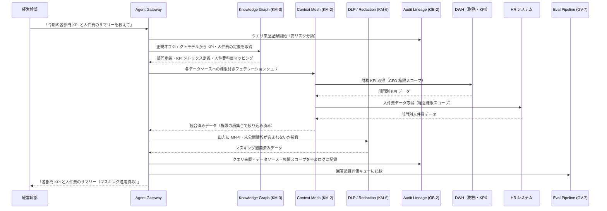

# Executive Agent の適用パターン

## 概要

経営層のエージェントは、全社の KPI・財務情報・人事情報・事業ポートフォリオを横断的に参照できる。これはすべての部門の中で最も広いデータアクセス権限を持つ可能性があることを意味する。この権限の広さは同時に、最も厳格な監査要件を生む。経営判断の根拠となるデータが誰によって・どのような操作で生成されたかを完全に追跡できなければ、ガバナンスとして成立しない。また、各部門のデータはそれぞれ異なる権限モデル・スキーマ・更新頻度を持つため、横断的な集計・分析を行うには「権限付きのフェデレーション」と「正規化されたオブジェクトモデル」が不可欠だ。

## 対象 SaaS

- DWH（BigQuery / Snowflake 等の全社データウェアハウス）
- Finance システム（会計・財務諸表・予算管理）
- Sales CRM（Salesforce 等の商談・売上データ）
- HR システム（Workday 等の人員・組織データ）
- Portfolio 管理ツール（事業計画・KPI トラッキング）

## 適用パターンと理由

### [KM-3 Canonical Object & Knowledge Graph（正規オブジェクトと知識グラフ）](../../patterns/km-knowledge/km3-canonical-object-knowledge-graph.md)

「今期の営業利益と人件費の関係を教えて」という経営質問に答えるには、Sales の売上データと Finance の費用データと HR の人件費データを結合する必要がある。しかし各システムで「部門」の定義が異なる、「売上」の集計タイミングがずれている、といった不整合が現実には多い。KM-3 は全社横断の正規化されたオブジェクトモデル（製品・顧客・従業員・プロジェクト等）を知識グラフとして管理し、エージェントが「どのシステムの・どの定義の・どの粒度で」データを取得するかを一元的に解決する。経営ダッシュボード用の横断集計がこのパターンで安定する。

### [KM-2 Context Mesh（コンテキストメッシュ）](../../patterns/km-knowledge/km2-context-mesh.md)

各部門のデータは、それぞれの権限モデルを保持したまま経営エージェントに提供される必要がある。Sales データは営業担当が参照できる範囲、HR データは人事権限を持つ役員のみ、財務データは CFO 承認済みの範囲——これらの権限制約を維持しながら横断的にフェデレーションするのが KM-2 の役割だ。「Executive は全部見える」と単純化すると、むしろ権限の境界が曖昧になり法令上の問題が生じる可能性がある。KM-2 は各データソースの権限ポリシーをフェデレーション層で尊重し、経営エージェントに渡るデータは常に権限の積集合で絞り込まれる。

### [KM-6 DLP & Redaction Boundary（データ損失防止とマスキング）](../../patterns/km-knowledge/km6-dlp-redaction-boundary.md)

経営層が使うエージェントは、秘匿性の高い情報（未公開の M&A 情報・個別従業員の評価・財務予測）を扱う可能性が高い。KM-6 はエージェントの出力・ログ・外部連携先への転送に対して DLP ルールを適用し、インサイダー取引規制上の問題になりうる情報（MNPI: 重要な未公開情報）が不適切なチャネルに送信されることを防ぐ。会議録の要約を Slack に投稿する場合でも、KM-6 が未公開の決算数値や人事情報を自動マスキングする。

### [GV-8 Cost Quota & Chargeback（コストクォータと配賦）](../../patterns/gv-governance/gv8-cost-quota-chargeback.md)

経営層が全社 AI コストの可視化と配賦を行うには、部門別・プロジェクト別・エージェント別の利用コストを正確に計測・報告する仕組みが必要だ。GV-8 は LLM API コスト・インフラコスト・ツール呼び出しコストをタグ付きで記録し、部門ごとのコストチャージバックレポートを生成する。経営エージェントが「今月の AI コストを部門別に見せて」と聞かれたとき、GV-8 のデータソースから即座に回答できる。また全社のコスト上限（クォータ）設定と超過アラートも GV-8 が担う。

### [GV-7 Evaluation Governance Pipeline（評価ガバナンスパイプライン）](../../patterns/gv-governance/gv7-evaluation-governance-pipeline.md)

経営判断に使うエージェントは「回答の品質が継続的に計測されている」ことが必須だ。「先月比の KPI 変化は？」という質問への回答が事実と異なっていたとき、それを事後に検知できなければガバナンスとして機能しない。GV-7 は自動評価パイプラインを定期実行し、経営エージェントの回答精度・事実整合性・ハルシネーション率を計測する。評価結果はダッシュボードで可視化され、品質指標が閾値を下回ったときに自動アラートとモデル更新の検討トリガーが発火する。

### [OB-2 Unified Audit Lineage（統合監査・来歴管理）](../../patterns/ob-observability/ob2-unified-audit-lineage.md)

経営層の操作は高リスク分類に当たるため、最も厳格な監査記録が必要だ。「経営エージェントが財務データを参照して報告書を生成した」という行為は、証券取引法・会社法の観点から完全な来歴（どのクエリを・どのデータで・誰の権限で実行したか）が追跡可能でなければならない。OB-2 は全エージェント操作の来歴を不変ログとして記録し、監査人が任意の時点に遡って「このレポートの根拠データはなにか」を確認できるようにする。ログ改ざん防止・長期保存・外部監査ツールとの連携も OB-2 が担う。

## 典型的なフロー

以下は経営幹部が「今期の各部門 KPI と人件費のサマリーを教えて」と依頼したときの処理フローだ。

