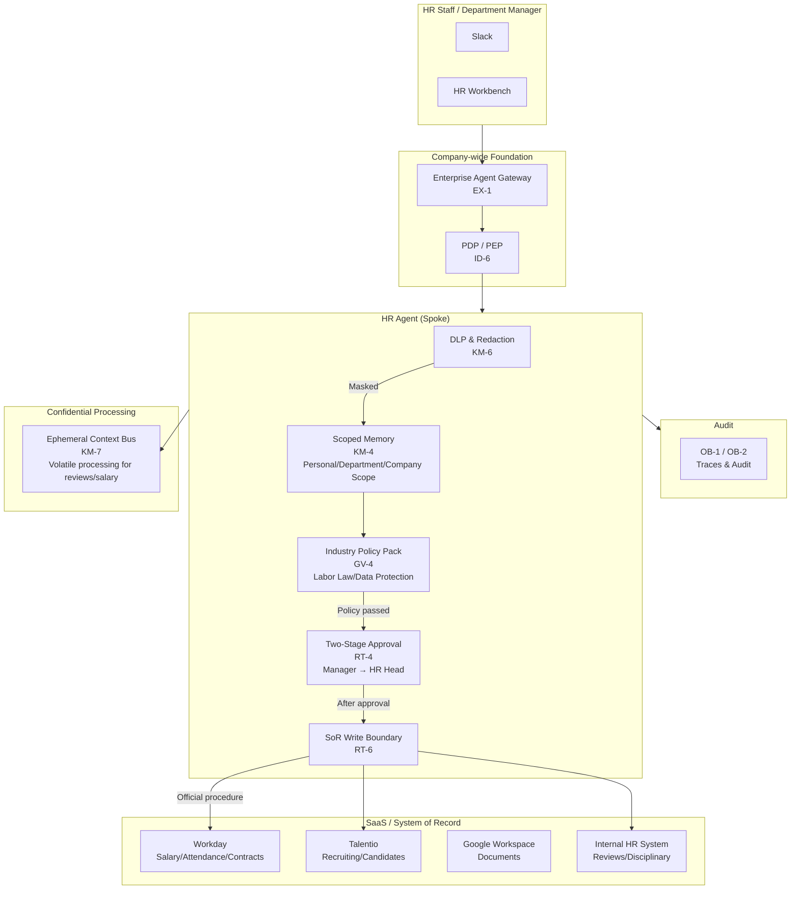
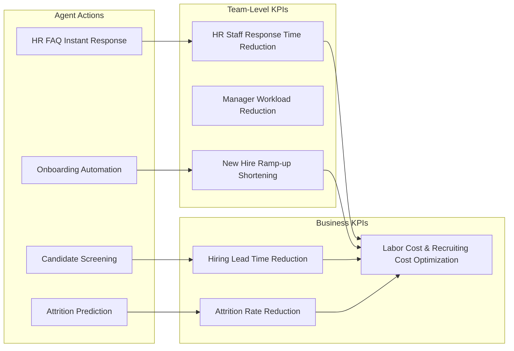
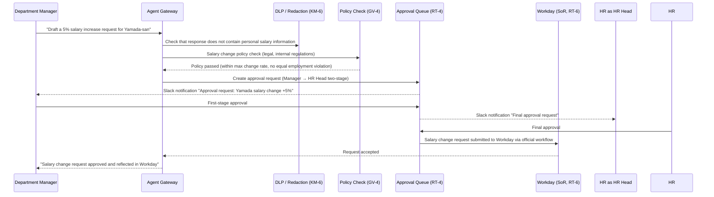

# HR Agent Pattern Application

## Overview

The purpose of HR Agent is to move the HR outcome KPIs of **hiring lead time reduction, offer acceptance rate improvement, early attrition prediction, faster onboarding, and improved self-service inquiry resolution rates**. Through value use cases such as candidate screening, attrition risk analysis, onboarding automation, and instant internal FAQ responses, it raises HR team productivity and talent retention capability.

As the foundation for safely realizing this value, KM-4 (Scoped Memory), KM-6 (DLP), RT-4 (Two-Party Approval), GV-4 (Regulatory Policy), and RT-6 (SoR Write Boundary) ensure data scope separation, DLP masking, strict approval flows, and automated regulatory compliance checks when handling highly sensitive data (subject to personal information protection law and labor law) such as salary, performance reviews, disciplinary actions, and transfers.

## Target SaaS

- Workday (salary, attendance, employment contract management)
- Talentio (recruitment management, candidate information)
- Google Workspace (documents, spreadsheets, email)
- Slack (internal notifications, approval flow integration)
- Internal HR system (performance reviews, transfers, disciplinary records)

## Applied Patterns and Reasons

### [KM-4 Scoped Memory Hierarchy](../../decisions/km-knowledge/km-d3-memory-scope.md)

HR information has a clear hierarchy: "personal scope (viewable by the individual only)," "department scope (department manager only)," and "company-wide scope (entire HR department)." KM-4 embeds this scope in runtime memory management, so even when the agent receives a request to "retrieve and analyze company-wide salary data," it references only data within the scope appropriate to the requester's role. The accident of a department manager accidentally accessing another department's individual performance reviews is prevented at the memory layer.

### [KM-6 DLP & Redaction Boundary](../../decisions/km-knowledge/km-d5-confidentiality-strength.md)

Salary amounts, performance scores, and disciplinary records often should not be included in agent outputs. When responding to a request like "summarize Department A's headcount composition," KM-6 performs automatic masking to prevent individual salary information from leaking into the response. DLP rules are applied before output, replacing items requiring masking (personal identifiers, salary bands, performance categories) with `[REDACTED]`. The same boundary is applied in logs, Slack notifications, and transfers to external integrations.

### [RT-4 Human Approval Chain](../../decisions/rt-runtime/rt-d2-autonomy-design.md)

Drafting personnel transfers, salary changes, and disciplinary actions must not be automatically executed by the agent. RT-4 requires two-party approval (e.g., direct manager + HR department head) for these operations. The agent handles up to "creating a draft of March salary increase candidates," and the final reflection in Workday is limited to after explicit approval by approvers. Visualization of the pending approval state and automatic escalation on deadline expiry are also handled by RT-4.

### [GV-4 Industry Policy Pack](../../decisions/gv-governance/gv-d6-industry-regulation.md)

Labor law, personal information protection law, and equal employment opportunity law requirements must be automatically applied to agent operations. GV-4 codifies these laws and internal regulations as a policy pack, blocking and warning the agent before it executes an operation that would violate policy (e.g., attempting to initiate disciplinary proceedings against an employee on maternity leave). Policies are referenced from a repository managed by the external legal team and can be updated when laws change without rewriting agent code.

### [RT-6 SoR Write Boundary](../../decisions/rt-runtime/rt-d3-side-effect-safety.md)

Workday is the System of Record (SoR) for HR, and rather than the agent directly hitting the API to write, it must go through the official change request flow (via workflow engine). RT-6 treats writes from the agent to the SoR as "draft requests," prohibiting direct updates. This ensures Workday's internal consistency checks, approval logs, and change history are all recorded through official flows, enabling tracking of agent-mediated changes during audit responses.

## System Architecture

Shows the components of HR Agent and where each pattern is deployed. Reflecting the extremely high sensitivity of HR data, DLP, policy checks, and two-stage approval are built in multiple layers.

## Value Use Cases

The value of HR Agent lies not only in "protecting confidential data," but also in "improving the speed and quality of recruiting, development, and retention."

| Use Case | Overview | Effective Outcome KPIs |
|---|---|---|
| Candidate screening support | Match job requirements against candidate resumes and present high-fit candidates in priority order | Hiring lead time reduction, hiring quality |
| Attrition prediction | Early detection of high attrition risk employees from attendance patterns, 1-on-1 notes, and engagement surveys | Attrition rate reduction, retention costs |
| Onboarding automation | Automated checklist execution and progress tracking for entry procedures (account issuance, equipment requests, training schedules) | Onboarding completion time reduction, new hire ramp-up speed |
| HR FAQ and policy inquiry | Instant answers to inquiries about employment rules, benefits, and leave policies, reducing HR staff response workload | HR staff productivity, employee satisfaction |
| Performance review and promotion draft creation | Generate first-draft review documents from past review history and goal achievement status, reducing manager creation workload | Review process lead time, manager workload |
| Headcount planning simulation | Support scenario comparison for headcount planning considering organizational structure, budget constraints, and attrition rate predictions | Management decision speed, labor cost optimization |

## Outcome KPI Mapping

## Value Staircase (Staged Expansion)

| Stage | Autonomy | Representative Functions | Expected Outcomes |
|---|---|---|---|
| **Step 1: Efficiency (Read-only)** | Read-only Copilot | HR FAQ responses, policy search, past case reference | Reduce HR staff inquiry response time. Low-risk, deployable same day |
| **Step 2: Insights (Analysis)** | Analysis + Alerts | Attrition prediction, candidate scoring, review drafts | Hiring quality and retention improvement. Maintain confidentiality protection with DLP/KM-6 |
| **Step 3: Execution (Writes)** | Approved automation | Onboarding procedure execution, salary change requests, transfer request drafts | Significant reduction in HR administrative workload. RT-4 two-stage approval ensures safety |

## Typical Flow

The processing flow when a request comes in to "draft a salary increase request of 5% for Yamada-san."

