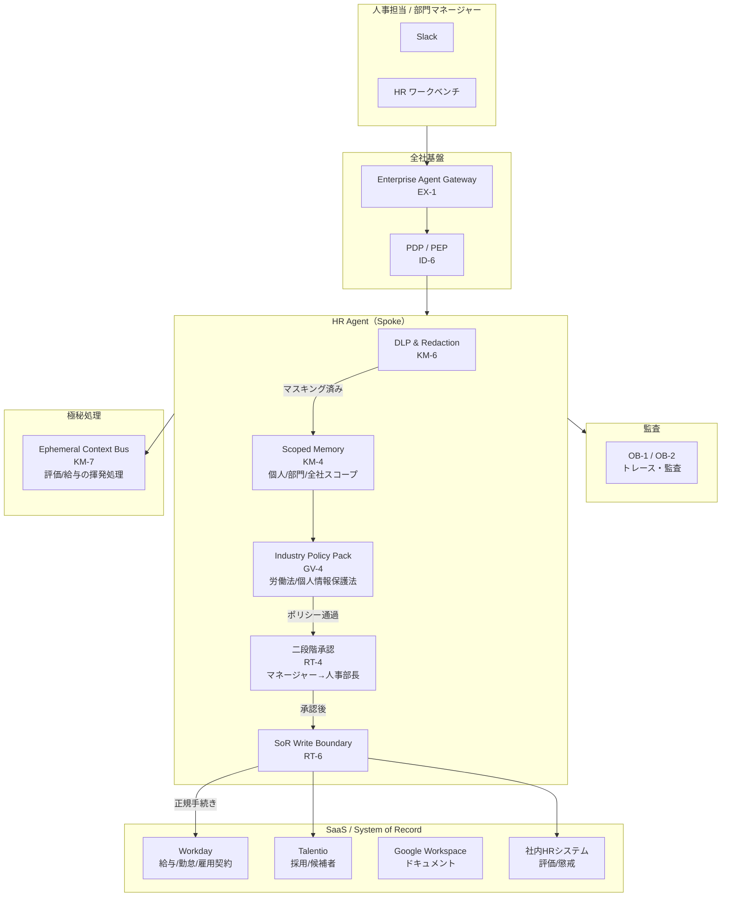
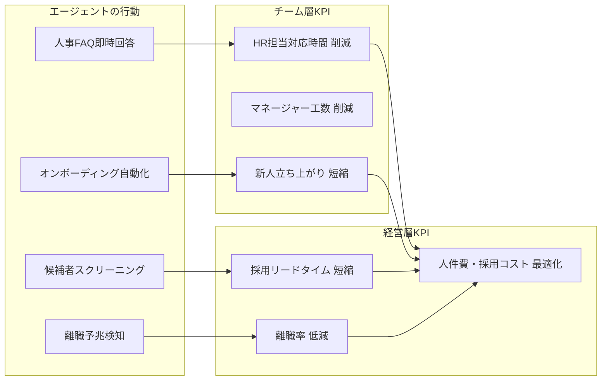
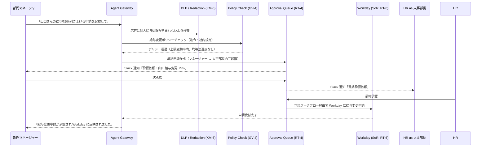

# HR Agent の適用パターン

## 概要

HR Agent の目的は**採用リードタイムの短縮・内定承諾率の向上・離職予兆の早期検知・オンボーディング速度の改善・問い合わせ自己解決率の向上**という人事の成果KPIを動かすことにある。候補者スクリーニング・離職リスク分析・オンボーディング自動化・社内FAQ即時回答といった価値ユースケースを通じて、人事チームの生産性と人材確保力を引き上げる。

この価値を安全に実現するための土台として、給与・評価・懲戒・異動という極めて機密度の高いデータ（個人情報保護法・労働基準法の規制対象）を扱う際の、データのスコープ分離・DLP によるマスキング・厳格な承認フロー・法令準拠の自動チェックを KM-4（スコープ記憶）・KM-6（DLP）・RT-4（二者承認）・GV-4（法令ポリシー）・RT-6（SoR書き込み境界）で担保する。

## 対象 SaaS

- Workday（給与・勤怠・雇用契約管理）
- Talentio（採用管理・候補者情報）
- Google Workspace（ドキュメント・スプレッドシート・メール）
- Slack（社内通知・承認フロー連携）
- 社内 HR システム（評価・異動・懲戒記録）

## 適用パターンと理由

### [KM-4 Scoped Memory Hierarchy（スコープ付きメモリ階層）](../../patterns/km-knowledge/km4-scoped-memory-hierarchy.md)

人事情報は「個人スコープ（本人のみ閲覧可）」「部門スコープ（部門マネージャーのみ）」「全社スコープ（人事部全体）」という明確な階層を持つ。KM-4 はこのスコープを実行時のメモリ管理に組み込み、エージェントが「全社の給与データを取得して分析して」という依頼を受けても、依頼者のロールに応じたスコープのデータのみを参照させる。部門マネージャーが誤って他部門の個人評価にアクセスする、という事故をメモリ層で防ぐ。

### [KM-6 DLP & Redaction Boundary（データ損失防止とマスキング）](../../patterns/km-knowledge/km6-dlp-redaction-boundary.md)

給与額・評価スコア・懲戒処分の記録はエージェントの出力に含めるべきでない場合が多い。「A部門の人員構成をまとめて」という依頼に応じる際、個々の給与情報が応答に漏れ込まないよう KM-6 が自動マスキングを行う。出力前に DLP ルールを適用し、マスキングが必要な項目（個人識別子・給与帯・評価区分）を `[REDACTED]` に置換する。ログ・スラック通知・外部連携先への転送でも同じ境界が適用される。

### [RT-4 Human Approval Chain（人間承認チェーン）](../../patterns/rt-runtime/rt4-human-approval-chain.md)

人事異動・給与変更・懲戒処分の起案はエージェントが自動実行してはならない。RT-4 はこれらの操作に対して二者承認（例：直属マネージャー＋人事部長）を必須とする。エージェントは「3月の昇給対象者リストのドラフトを作成」まで担当し、最終的な Workday への反映は承認者の明示的な確認後に限定する。承認待ち状態の可視化と、期限切れ時の自動エスカレーションも RT-4 が担う。

### [GV-4 Industry Policy Pack（業界ポリシーパック）](../../patterns/gv-governance/gv4-industry-policy-pack.md)

労働基準法・個人情報保護法・均等法といった法令要件は、エージェントの操作に自動で適用される必要がある。GV-4 はこれらの法令・社内規定をポリシーパックとしてコード化し、エージェントがポリシー違反となる操作を実行しようとしたとき（例：産休中の従業員に懲戒手続きを開始しようとする）、事前に遮断・警告する。ポリシーは外部の法務チームが管理するリポジトリから参照し、法改正時にエージェントコードを書き換えずに更新できる。

### [RT-6 SoR Write Boundary（記録システム書き込み境界）](../../patterns/rt-runtime/rt6-sor-write-boundary.md)

Workday は HR における System of Record（記録システム）であり、エージェントが直接 API を叩いて書き込むのではなく、正規の変更申請フロー（ワークフローエンジン経由）を通す必要がある。RT-6 はエージェントから SoR への書き込みを「申請の起案」として扱い、直接更新を禁止する。これにより、Workday 側の内部整合性チェック・承認ログ・変更履歴がすべて正規フローで記録され、監査対応時にエージェント経由の変更を追跡できる。

## システム構成

HR Agent の構成要素と、各パターンの配置を示す。人事データの極めて高い機密性を反映し、DLP・ポリシーチェック・二段階承認が多層的に組み込まれている。

## 価値ユースケース

HR Agent の価値は「機密データを守る」ことに加え、「採用・育成・定着のスピードと質を高める」ことにある。

| ユースケース | 概要 | 効く成果KPI |
|---|---|---|
| 採用候補者スクリーニング支援 | 求人要件と候補者レジュメを照合し、適合度の高い候補を優先順位付きで提示 | 採用リードタイム短縮・採用品質 |
| 離職予兆検知 | 勤怠パターン・1on1メモ・エンゲージメントサーベイから離職リスクの高い人材を早期に検知 | 離職率低減・リテンションコスト |
| オンボーディング自動化 | 入社手続き（アカウント発行・備品手配・研修スケジュール）のチェックリスト自動実行と進捗追跡 | オンボーディング完了時間短縮・新人立ち上がり速度 |
| 人事FAQ・規程照会 | 就業規則・福利厚生・休暇制度などの問い合わせに即時回答し、HR担当の対応工数を削減 | HR担当の生産性・従業員満足度 |
| 評価・昇格ドラフト作成 | 過去の評価履歴・目標達成状況から評価文書の初稿を生成し、マネージャーの作成工数を削減 | 評価プロセスのリードタイム・マネージャー工数 |
| 人員計画シミュレーション | 組織構成・予算制約・離職率予測を踏まえた人員計画のシナリオ比較を支援 | 経営判断速度・人件費最適化 |

## 成果KPIマッピング

## 価値の階段（段階的拡大）

| 段階 | 自律度 | 代表的な機能 | 期待成果 |
|---|---|---|---|
| **Step 1：効率化（読み取り）** | Read-only Copilot | 人事FAQ回答・規程検索・過去事例参照 | HR担当の問い合わせ対応時間を削減。低リスクで即日展開可能 |
| **Step 2：示唆提供（分析）** | 分析＋アラート | 離職予兆検知・採用候補者スコアリング・評価ドラフト | 採用品質・リテンション改善。DLP/KM-6で機密保護を維持 |
| **Step 3：業務実行（書き込み）** | 承認付き自動実行 | オンボーディング手続き実行・給与変更起案・異動申請起案 | 人事事務工数の大幅削減。RT-4二段階承認で安全性担保 |

## 典型的なフロー

「山田さんの給与を5%引き上げる申請を起案して」という依頼が入ったときの処理フローを以下に示す。

