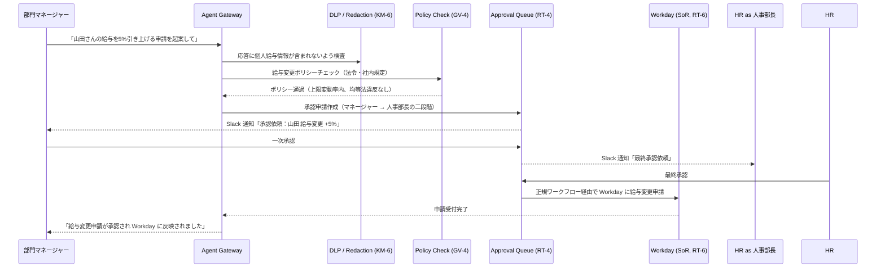

# HR Agent の適用パターン

## 概要

人事部門のエージェントは、給与・評価・懲戒・異動という極めて機密度の高いデータを扱う。これらの情報は個人情報保護法・労働基準法の規制対象であり、不正アクセスや誤った書き込みは法的リスクに直結する。さらに「誰がいくら給与をもらっているか」「誰が今期の評価でCを付けられたか」といった情報は、社内での信頼関係に深刻な影響を与える。そのため HR エージェントには、データのスコープ分離・DLP によるマスキング・厳格な承認フロー・法令準拠の自動チェックを組み合わせることが必要だ。

## 対象 SaaS

- Workday（給与・勤怠・雇用契約管理）
- Talentio（採用管理・候補者情報）
- Google Workspace（ドキュメント・スプレッドシート・メール）
- Slack（社内通知・承認フロー連携）
- 社内 HR システム（評価・異動・懲戒記録）

## 適用パターンと理由

### [KM-4 Scoped Memory Hierarchy（スコープ付きメモリ階層）](../../patterns/km-knowledge/km4-scoped-memory-hierarchy.md)

人事情報は「個人スコープ（本人のみ閲覧可）」「部門スコープ（部門マネージャーのみ）」「全社スコープ（人事部全体）」という明確な階層を持つ。KM-4 はこのスコープを実行時のメモリ管理に組み込み、エージェントが「全社の給与データを取得して分析して」という依頼を受けても、依頼者のロールに応じたスコープのデータのみを参照させる。部門マネージャーが誤って他部門の個人評価にアクセスする、という事故をメモリ層で防ぐ。

### [KM-6 DLP & Redaction Boundary（データ損失防止とマスキング）](../../patterns/km-knowledge/km6-dlp-redaction-boundary.md)

給与額・評価スコア・懲戒処分の記録はエージェントの出力に含めるべきでない場合が多い。「A部門の人員構成をまとめて」という依頼に応じる際、個々の給与情報が応答に漏れ込まないよう KM-6 が自動マスキングを行う。出力前に DLP ルールを適用し、マスキングが必要な項目（個人識別子・給与帯・評価区分）を `[REDACTED]` に置換する。ログ・スラック通知・外部連携先への転送でも同じ境界が適用される。

### [RT-4 Human Approval Chain（人間承認チェーン）](../../patterns/rt-runtime/rt4-human-approval-chain.md)

人事異動・給与変更・懲戒処分の起案はエージェントが自動実行してはならない。RT-4 はこれらの操作に対して二者承認（例：直属マネージャー＋人事部長）を必須化する。エージェントは「3月の昇給対象者リストのドラフトを作成」まで担当し、最終的な Workday への反映は承認者の明示的な確認後に限定する。承認待ち状態を可視化し、期限切れ時は自動エスカレーションする仕組みも RT-4 が提供する。

### [GV-4 Industry Policy Pack（業界ポリシーパック）](../../patterns/gv-governance/gv4-industry-policy-pack.md)

労働基準法・個人情報保護法・均等法といった法令要件は、エージェントの操作に自動で適用される必要がある。GV-4 はこれらの法令・社内規定をポリシーパックとしてコード化し、エージェントがポリシー違反となる操作を実行しようとしたとき（例：産休中の従業員に懲戒手続きを開始しようとする）、事前に遮断・警告する。ポリシーは外部の法務チームが管理するリポジトリから参照し、法改正時にエージェントコードを書き換えずに更新できる。

### [RT-6 SoR Write Boundary（記録システム書き込み境界）](../../patterns/rt-runtime/rt6-sor-write-boundary.md)

Workday は HR における System of Record（記録システム）であり、エージェントが直接 API を叩いて書き込むのではなく、正規の変更申請フロー（ワークフローエンジン経由）を通す必要がある。RT-6 はエージェントから SoR への書き込みを「申請の起案」として扱い、直接更新を禁止する。これにより、Workday 側の内部整合性チェック・承認ログ・変更履歴がすべて正規フローで記録され、監査対応時にエージェント経由の変更を追跡できる。

## 典型的なフロー

以下は「山田さんの給与を5%引き上げる申請を起案して」という依頼が入ったときの処理フローだ。

