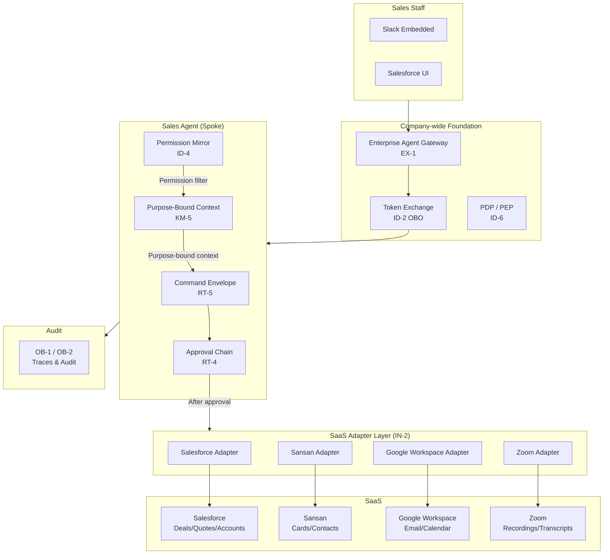
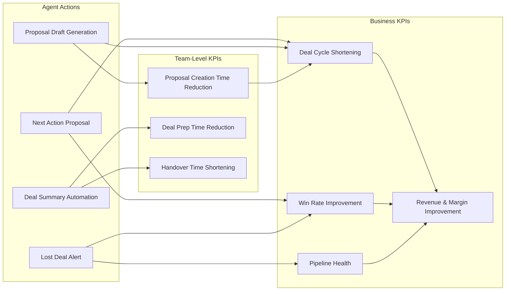
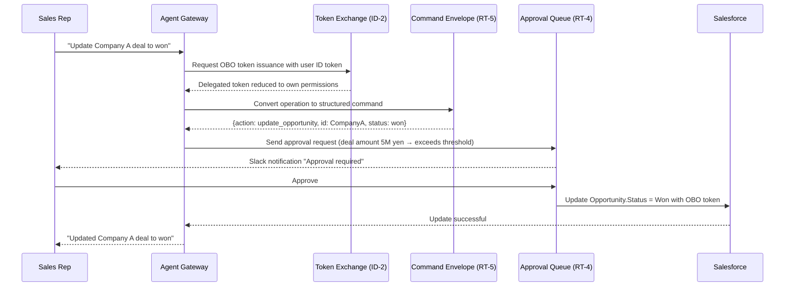

# Sales Agent Pattern Application

## Overview

The purpose of Sales Agent is to move the sales outcome KPIs of **win rate improvement, deal cycle shortening, and pipeline health**. Through value use cases such as next best action proposals, lost deal prediction, proposal draft generation, and deal summary automation, it raises sales staff productivity and revenue contribution.

As the foundation for safely realizing this value, ID-2 (OBO Delegation), ID-4 (Permission Mirror), RT-5 (Command Envelope), and RT-4 (Human Approval) ensure permission fidelity and auditability when crossing Salesforce deal management, Sansan business card information, and Slack team communication.

## Target SaaS

- Salesforce (CRM, deal management, quotes)
- Slack (internal communication, approval notifications)
- Google Workspace (email, calendar, documents)
- Sansan (business cards, customer contact information)
- Zoom (deal recordings, transcriptions)

## Applied Patterns and Reasons

### [ID-2 Identity Federation & On-Behalf-Of (OBO Delegation)](../../patterns/id-identity/id2-identity-federation-obo.md)

When a sales rep requests "change this deal status to won," the agent must operate only with **the requester's own Salesforce permissions**. ID-2 uses RFC 8693 token exchange to provide the mechanism for the agent to call Salesforce with the person's delegated token rather than the agent's own service account. This allows Salesforce's own access controls to prevent accidents like "rewrote a deal outside my assigned accounts through the agent."

### [ID-4 Permission Mirror (Least-Privilege Composition)](../../patterns/id-identity/id4-permission-mirror-least-of.md)

When the agent crosses multiple SaaS systems (Salesforce, Sansan, Google Drive), ID-4's role is to **match the most restrictive permission** among each SaaS. For example, if a sales rep has "view only my assigned customers" permissions in Salesforce, the same restriction is applied when linking Sansan business card information to Salesforce deals. The agent "accidentally crossing" permission boundaries is blocked at the pattern level.

### [IN-2 SaaS Connector / Adapter](../../patterns/in-integration/in2-saas-connector-adapter.md)

Salesforce REST API, Sansan card API, and Google Calendar API all differ in authentication methods, pagination, and error codes. IN-2 absorbs connections to each SaaS through a standardized adapter layer, providing a structure where the agent's logic doesn't need to be aware of "Salesforce-specific API differences." Concentrating retries, timeouts, and log output in the adapter layer also improves traceability during failures.

### [KM-5 Purpose-Bound Context](../../patterns/km-knowledge/km5-purpose-bound-context.md)

For a request like "write a follow-up email for this month's deal with Company A," it would be dangerous for the agent to load all customer deal history, competitive information, and internal evaluation notes into the context. KM-5 provides a mechanism to retrieve "only the context needed for this task" bound to the purpose. Limiting to Company A's deal history only, notes from the last 3 meetings, and the latest version of the quote both reduces information leakage risk and improves response quality.

### [RT-5 Command Envelope](../../patterns/rt-runtime/rt5-command-envelope.md)

Write operations like CRM deal updates, quote amount changes, and contact updates must not be executed as free-text instructions directly. RT-5 converts operations into structured commands of "who, what, with what parameters, when," fixing the operation content in a form that humans can verify. This creates an "operation trail" that can be fed into approval flows, enabling accurate tracking of what was changed in post-hoc audits.

### [RT-4 Human Approval Chain](../../patterns/rt-runtime/rt4-human-approval-chain.md)

Quote amount changes, contract term modifications, and large deal status updates should go through supervisor approval rather than automatic execution. RT-4 automatically routes operations exceeding risk thresholds (e.g., quotes over 1 million yen) to an approval queue and notifies approvers via Slack or email. The agent waits until approval is complete, and executes rollback processing if rejected. This structurally prevents accidents like "the agent arbitrarily changed the terms of a large deal."

## System Architecture

Shows the components of Sales Agent and where each pattern is deployed.

## Value Use Cases

The value of Sales Agent lies not just in "operating safely," but in "growing revenue and making sales activities more efficient." Sales is the department most directly linked to enterprise value (top line), and the agent can directly move **revenue levers** like win rate improvement, deal cycle shortening, pipeline health, and upsell/cross-sell. The following are representative scenarios that move sales department outcome KPIs.

| Use Case | Overview | Effective Outcome KPIs |
|---|---|---|
| Next best action proposals | Based on deal progress, customer attributes, and past similar cases, propose the next action to take (call, send proposal, discount negotiation, etc.) | Win rate, deal cycle shortening |
| Lost deal analysis and prediction | Match past lost deal patterns with current deal states and alert early on high-risk deals | Lost deal rate reduction, pipeline health |
| Deal summary and handover automation | Auto-generate key points from deal history, emails, and meeting notes, reducing handover workload on rep changes | Sales staff productivity, handover lead time |
| Upsell/cross-sell suggestions | Identify expansion opportunities from existing customer contract status and product usage patterns and suggest to sales staff | Deal value, LTV improvement |
| Quote and proposal draft generation | Auto-generate first drafts based on customer requirements and past similar proposals, allowing sales staff to focus on review and adjustment | Proposal creation time reduction, deal cycle shortening |
| Automated competitive intelligence gathering | Organize competitive information from internal knowledge and past deal notes to support deal preparation | Win rate, proposal quality |

## Outcome KPI Mapping

Shows the causal path through which Sales Agent affects business KPIs in GV-10 (Three-Layer Value Measurement).

## Value Staircase (Staged Expansion)

Sales Agent value is raised incrementally.

| Stage | Autonomy | Representative Functions | Expected Outcomes |
|---|---|---|---|
| **Step 1: Efficiency (Read-only)** | Read-only Copilot | Deal summary generation, competitive intelligence search, past similar deal retrieval | Reduce sales staff information-gathering time. Achievable as a quick win within the first few weeks |
| **Step 2: Insights (Analysis)** | Analysis + Proposals | Lost deal alerts, next action proposals, upsell suggestions | Win rate and deal cycle improvement. Progress after gaining trust |
| **Step 3: Execution (Writes)** | Approved automation | Deal status updates, quote draft creation, follow-up email sending | Significant reduction in sales admin workload. RT-4 approval chain ensures safety |

!!! tip "Quick-Win Design"
    Step 1 read-only features (deal summaries, information search) have low permission risk and a small adoption barrier. Give sales staff the feeling of "time freed up" within the first 1–2 weeks, then proceed to Steps 2 and 3 after gaining adoption and trust.

## Typical Flow

The processing flow when a request comes in to "update Company A's deal status to won."

