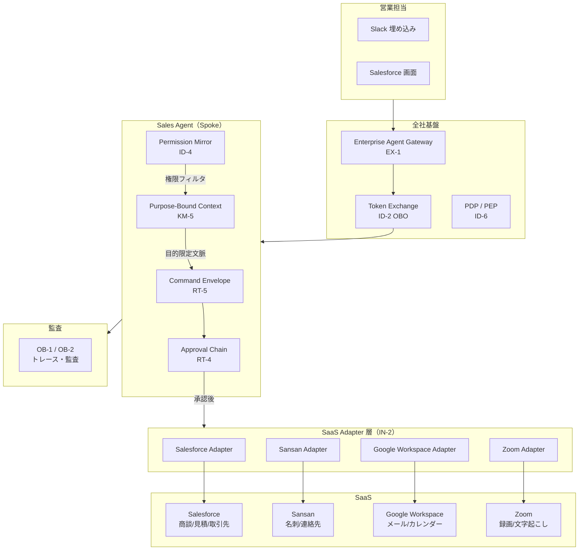
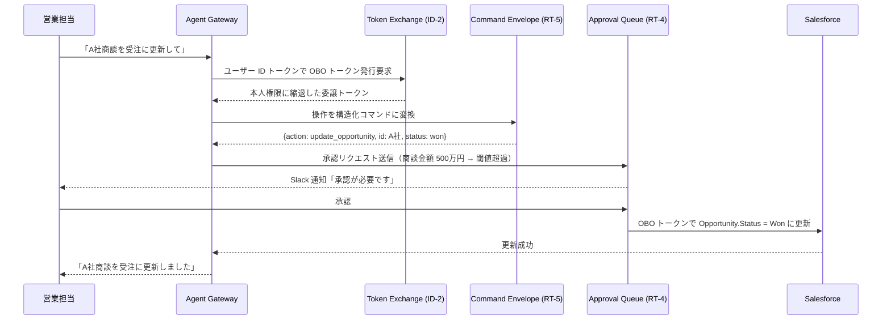

# Sales Agent の適用パターン

## 概要

営業チームのエージェントは Salesforce の商談管理・Sansan の名刺情報・Slack でのチームコミュニケーションを横断する。顧客の機密情報（商談金額・契約条件・競合情報）を扱うため、権限忠実性と監査が特に重要になる。エージェントが「担当外の商談を誤って参照する」「承認なしに見積条件を変更する」といった事故を防ぐために、複数のパターンを組み合わせる必要がある。

## 対象 SaaS

- Salesforce（CRM・商談管理・見積）
- Slack（社内コミュニケーション・承認通知）
- Google Workspace（メール・カレンダー・ドキュメント）
- Sansan（名刺・顧客連絡先情報）
- Zoom（商談録画・文字起こし）

## 適用パターンと理由

### [ID-2 Identity Federation & On-Behalf-Of（OBO委譲）](../../patterns/id-identity/id2-identity-federation-obo.md)

営業担当が「この商談のステータスを受注に変えて」と依頼したとき、エージェントは**依頼者本人の Salesforce 権限**でのみ操作する必要がある。ID-2 は RFC 8693 のトークン交換により、エージェントが自分自身のサービスアカウントではなく本人の委譲トークンで Salesforce を呼ぶ仕組みを提供する。これにより、「エージェント経由で担当外の商談を書き換えた」という事故のリスクを、Salesforce 側のアクセス制御で防げる。

### [ID-4 Permission Mirror（最小合成権限）](../../patterns/id-identity/id4-permission-mirror-least-of.md)

エージェントが複数の SaaS（Salesforce・Sansan・Google Drive）を横断するとき、各 SaaS の権限の中で**最も制限の厳しいものに合わせる**のが ID-4 の役割だ。たとえば営業担当が Salesforce では「自分の担当顧客のみ閲覧可」の権限を持っているなら、Sansan の名刺情報を Salesforce 商談に紐づける操作でも同じ絞り込みを適用する。エージェントが権限の境界を「うっかり越える」ことを、パターンレベルで封じる。

### [IN-2 SaaS Connector / Adapter](../../patterns/in-integration/in2-saas-connector-adapter.md)

Salesforce の REST API・Sansan の名刺 API・Google Calendar の API はそれぞれ認証方式・ページネーション・エラーコードが異なる。IN-2 は各 SaaS への接続を標準化されたアダプター層で吸収し、エージェントのロジックが「Salesforce 固有の API 差異」を意識せずに済む構造を提供する。アダプター層にリトライ・タイムアウト・ログ出力を集中させることで、障害時のトレーサビリティも向上する。

### [KM-5 Purpose-Bound Context（目的限定コンテキスト）](../../patterns/km-knowledge/km5-purpose-bound-context.md)

「今月のA社との商談フォローアップメールを書いて」という依頼に対し、エージェントが全顧客の商談履歴・競合情報・内部評価メモをすべてコンテキストに詰め込むのは危険だ。KM-5 は「このタスクに必要な文脈のみ」を目的に縛って取得する仕組みを提供する。A社担当者のみの商談履歴、直近3回のミーティングメモ、見積書の最新版——この範囲に限定することで、情報漏洩リスクを下げながら応答品質も向上する。

### [RT-5 Command Envelope（構造化コマンド）](../../patterns/rt-runtime/rt5-command-envelope.md)

CRM の商談更新・見積書の金額変更・取引先の連絡先更新といった書き込み操作は、自由テキストの指示そのままでは実行させない。RT-5 は操作を「誰が・何を・どのパラメータで・いつ」という構造化コマンドに変換し、操作内容を人間が検証可能な形式に固定する。これにより、承認フローに入力できる「操作の証跡」が生まれ、事後監査でも何が変更されたかを正確に追跡できる。

### [RT-4 Human Approval Chain（人間承認チェーン）](../../patterns/rt-runtime/rt4-human-approval-chain.md)

見積金額の変更・契約条件の修正・大口商談のステータス更新は、自動実行ではなく上長承認を経るべき操作だ。RT-4 はリスク閾値（例：見積金額100万円以上）を超えた操作を自動的に承認キューに回し、Slack やメールで承認者に通知する。承認が完了するまでエージェントは待機し、否決された場合はロールバック処理を実行する。「エージェントが勝手に大型案件の条件を変えた」という事故を構造的に防ぐ。

## システム構成

Sales Agent がどのような構成要素で成り立ち、各パターンがどこに配置されるかを示す。

## 典型的なフロー

「商談のステータスを受注に更新したい」という依頼が入ったときの処理フローを以下に示す。

