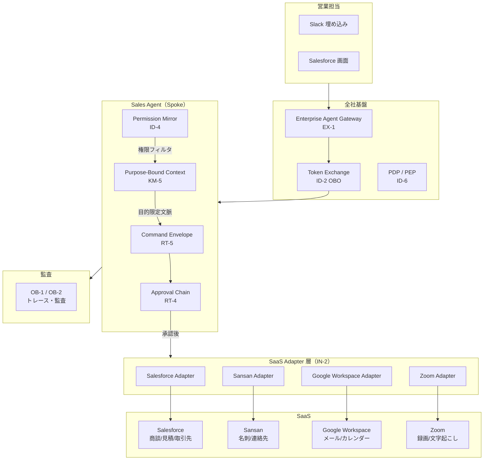
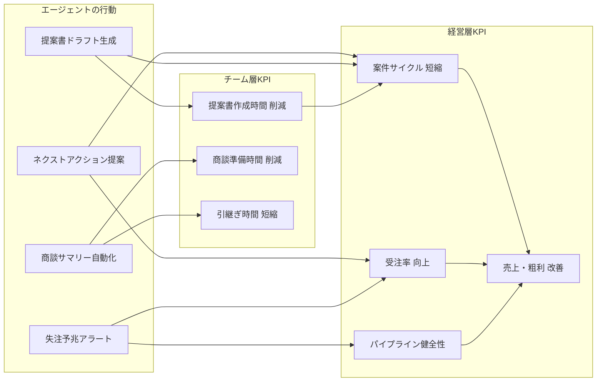
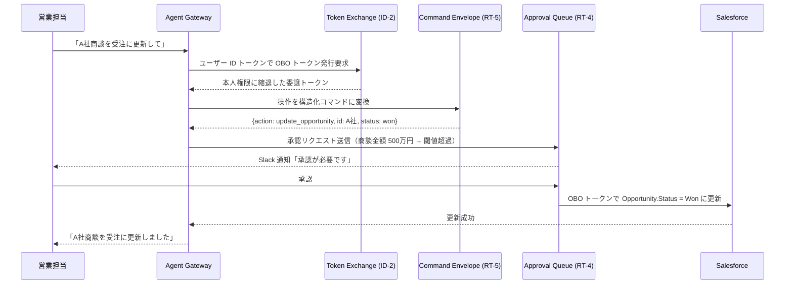

# Sales Agent の適用パターン

## 概要

Sales Agent の目的は**受注率の向上・商談サイクルの短縮・パイプラインの健全化**という営業の成果KPIを動かすことにあります。ネクストベストアクション提案・失注予兆検知・提案書ドラフト生成・商談サマリー自動化といった価値ユースケースを通じて、営業担当の生産性と売上貢献を高められます。

この価値を安全に実現するための土台として、Salesforce の商談管理・Sansan の名刺情報・Slack でのチームコミュニケーションを横断する際の権限忠実性と監査を、ID-2（OBO委譲）・ID-4（最小権限合成）・RT-5（構造化コマンド）・RT-4（人間承認）で担保する構成をとります。

## 対象 SaaS

- Salesforce（CRM・商談管理・見積）
- Slack（社内コミュニケーション・承認通知）
- Google Workspace（メール・カレンダー・ドキュメント）
- Sansan（名刺・顧客連絡先情報）
- Zoom（商談録画・文字起こし）

## 適用パターンと理由

### [ID-2 Identity Federation & On-Behalf-Of（OBO委譲）](../../decisions/id-identity/id-d2-delegation-method.md)

営業担当が「この商談のステータスを受注に変えて」と依頼したとき、エージェントは**依頼者本人の Salesforce 権限**でのみ操作しなければなりません。ID-2 は RFC 8693 のトークン交換により、エージェントが自分自身のサービスアカウントではなく本人の委譲トークンで Salesforce を呼ぶ仕組みを提供します。これにより「エージェント経由で担当外の商談を書き換えた」という事故のリスクを、Salesforce 側のアクセス制御によって防げるようになります。

### [ID-4 Permission Mirror（最小合成権限）](../../decisions/id-identity/id-d3-permission-reduction.md)

エージェントが複数の SaaS（Salesforce・Sansan・Google Drive）を横断するとき、各 SaaS の権限の中で**最も制限の厳しいものに合わせる**のが ID-4 の役割です。営業担当が Salesforce で「自分の担当顧客のみ閲覧可」の権限を持つなら、Sansan の名刺情報を Salesforce 商談に紐づける操作にも同じ絞り込みを適用します。エージェントが権限の境界を「うっかり越える」ことをパターンレベルで封じる仕組みです。

### [IN-2 SaaS Connector / Adapter](../../decisions/in-integration/in-d2-build-vs-reuse.md)

Salesforce の REST API・Sansan の名刺 API・Google Calendar の API は、認証方式・ページネーション・エラーコードがそれぞれ異なります。IN-2 は各 SaaS への接続を標準化されたアダプター層で吸収し、エージェントのロジックが「Salesforce 固有の API 差異」を意識せずに済む構造を提供します。リトライ・タイムアウト・ログ出力をアダプター層に集中させることで、障害時のトレーサビリティが高まるという利点もあります。

### [KM-5 Purpose-Bound Context（目的限定コンテキスト）](../../decisions/km-knowledge/km-d4-purpose-limitation.md)

「今月のA社との商談フォローアップメールを書いて」という依頼に対し、エージェントが全顧客の商談履歴・競合情報・内部評価メモをすべてコンテキストに詰め込むのは危険です。KM-5 は「このタスクに必要な文脈のみ」を目的に縛って取得する仕組みを提供します。A社担当者のみの商談履歴、直近3回のミーティングメモ、見積書の最新版——この範囲に絞ることで、情報漏洩リスクを下げつつ応答品質も高められます。

### [RT-5 Command Envelope（構造化コマンド）](../../decisions/rt-runtime/rt-d3-side-effect-safety.md)

CRM の商談更新・見積書の金額変更・取引先の連絡先更新といった書き込み操作は、自由テキストの指示そのままでは実行させません。RT-5 は操作を「誰が・何を・どのパラメータで・いつ」という構造化コマンドに変換し、人間が検証可能な形式に固定します。承認フローに入力できる「操作の証跡」が生まれ、事後監査でも何が変更されたかを正確に追跡できます。

### [RT-4 Human Approval Chain（人間承認チェーン）](../../decisions/rt-runtime/rt-d2-autonomy-design.md)

見積金額の変更・契約条件の修正・大口商談のステータス更新は、自動実行ではなく上長承認を経るべき操作です。RT-4 はリスク閾値（例：見積金額100万円以上）を超えた操作を自動的に承認キューに回し、Slack やメールで承認者に通知します。承認が完了するまでエージェントは待機し、否決された場合はロールバック処理を実行します。「エージェントが勝手に大型案件の条件を変えた」という事故を、構造として防ぐ仕組みです。

## システム構成

Sales Agent がどのような構成要素で成り立っているか、各パターンがどこに配置されるかを示します。



## 価値ユースケース

Sales Agent の価値は「安全に操作する」ことだけでなく、「売上を伸ばし、営業活動を効率化する」ことにあります。営業は企業価値（トップライン）に最も直結する部門であり、受注率向上・商談サイクル短縮・パイプライン健全化・アップセル/クロスセルといった**売上レバー**をエージェントで直接動かせます。以下は営業部門の成果KPIに効く代表的なシナリオです。

| ユースケース | 概要 | 効く成果KPI |
|---|---|---|
| ネクストベストアクション提案 | 商談の進捗・顧客属性・過去の類似案件を踏まえ、次に取るべきアクション（電話・提案書送付・値引き交渉等）を提案 | 受注率・案件サイクル短縮 |
| 失注分析と予兆検知 | 過去の失注パターンと現在の商談状態を照合し、リスクの高い案件を早期にアラート | 失注率低減・パイプライン健全性 |
| 商談サマリー・引継ぎ自動生成 | 商談履歴・メール・議事録から要点を自動生成し、担当変更時の引継ぎ工数を削減 | 営業担当の生産性・引継ぎリードタイム |
| アップセル・クロスセル示唆 | 既存顧客の契約状況と製品利用パターンから拡大余地を特定し、営業担当に示唆 | 顧客単価・LTV向上 |
| 見積・提案書ドラフト生成 | 顧客要件と過去の類似提案を基に初稿を自動生成し、営業担当はレビューと調整に集中 | 提案書作成時間削減・案件サイクル短縮 |
| 競合情報の自動収集と整理 | 社内ナレッジ・過去商談メモから競合に関する情報を整理し、商談準備を支援 | 受注率・提案品質 |

## 成果KPIマッピング

Sales Agent が GV-10（Three-Layer Value Measurement）の経営KPIにどの因果経路で効くかを示します。



## 価値の階段（段階的拡大）

Sales Agent の価値は段階的に引き上げていきます。

| 段階 | 自律度 | 代表的な機能 | 期待成果 |
|---|---|---|---|
| **Step 1：効率化（読み取り）** | Read-only Copilot | 商談サマリー生成・競合情報検索・過去類似案件の呼び出し | 営業担当の情報収集時間を削減します。クイックウィンとして最初の数週間で実現可能です |
| **Step 2：示唆提供（分析）** | 分析＋提案 | 失注予兆アラート・ネクストアクション提案・アップセル示唆 | 受注率・案件サイクルの改善。信頼を得た上で段階移行します |
| **Step 3：業務実行（書き込み）** | 承認付き自動実行 | 商談ステータス更新・見積ドラフト作成・フォローアップメール送信 | 営業事務工数の大幅削減。RT-4の承認チェーンで安全性を担保します |

!!! tip "クイックウィンの設計"
    Step 1 の読み取り専用機能（商談サマリー・情報検索）は、権限リスクが低く導入障壁が小さいです。最初の1〜2週間で営業担当に「時間が浮いた」実感を与え、定着と信頼を獲得してから Step 2・3 に進んでください。

価値の階段を登り切った後は、[価値ユースケース選定ガイド](../../decisions/decision-guide.md)で次の高価値ユースケースを選定し、[価値成熟度ロードマップ](../../decisions/decision-guide.md)に沿って拡大します。

## 典型的なフロー

「商談のステータスを受注に更新したい」という依頼が入ったときの処理フローを以下に示します。



## Decision Summary

```yaml
decision_summary:
  department: sales
  value_drivers: [revenue_growth, employee_efficiency, automation]
  value_usecases:
    - "ネクストベストアクション提案"
    - "失注分析と予兆検知"
    - "商談サマリー・引継ぎ自動生成"
    - "アップセル・クロスセル示唆"
    - "見積・提案書ドラフト生成"
    - "競合情報の自動収集と整理"
  kpis:
    - "受注率"
    - "商談サイクル日数"
    - "パイプラインカバレッジ"
    - "予測誤差率"
    - "一人当たり売上"
  value_ladder:
    - "Step 1: 効率化（Read-only）— 商談サマリー・情報検索"
    - "Step 2: 示唆提供（分析）— 失注予兆・ネクストアクション"
    - "Step 3: 業務実行（書き込み）— 商談更新・見積作成"
  applied_patterns: [ID-2, ID-4, IN-2, KM-5, RT-5, RT-4]
  revenue_levers:
    - "ネクストベストアクション（受注率向上）"
    - "失注・成約要因分析（失注率低減）"
    - "パイプライン網羅率向上（カバレッジ拡大）"
    - "自動フォローアップ（案件サイクル短縮）"
    - "予測精度向上（フォーキャスト誤差縮小）"
    - "アップセル・クロスセル（顧客単価向上）"
```
