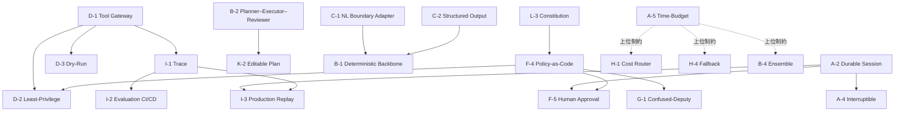

# パターン間の依存関係

## 概要

パターンは排他的な選択肢ではなく、**層として重ねて使う**ものである。あるパターンの効果は、その前提となるパターンが導入されて初めて発揮される。本ページでは代表的な依存関係を整理し、導入順序の判断材料を提供する。

## 依存関係マップ

## 代表的な依存チェーン

### A-2 Durable Session が前提となるパターン群

[A-2 Durable Agent Session](../patterns/a-execution/a2-durable-session.md) は実行状態のチェックポイント永続化を提供する。状態の永続化がなければ、中断も承認待ちもリプレイも実現できない。

- [A-4 Interruptible Agent](../patterns/a-execution/a4-interruptible-agent.md) — 中断・方針変更にはチェックポイントからの再開が必要である。
- [F-5 Human Approval Checkpoint](../patterns/f-reliability/f5-human-approval.md) — 承認待ちの間、セッション状態を保持し続ける必要がある。
- [I-3 Production Replay](../patterns/i-observability/i3-production-replay.md) — リプレイには永続化された実行状態が素材となる。

### D-1 Tool Gateway が実装点となるパターン群

[D-1 Tool Gateway](../patterns/d-tools-mcp/d1-tool-gateway.md) はツール呼び出しを一点に集約する。この集約点があるからこそ、権限制御・ドライラン・監査を一貫して適用できる。

- [D-2 Least-Privilege Tool Binding](../patterns/d-tools-mcp/d2-least-privilege-binding.md) — ゲートウェイでセッション単位の権限を束縛する。
- [D-3 Dry-Run First Execution](../patterns/d-tools-mcp/d3-dry-run-execution.md) — ゲートウェイが副作用実行前にドライランを挟む。
- [I-1 Agent Trace & Observability](../patterns/i-observability/i1-trace-observability.md) — ゲートウェイがツール呼び出しの監査ログを記録する。

### I-1 Trace が素材を供給するパターン群

[I-1 Agent Trace & Observability](../patterns/i-observability/i1-trace-observability.md) はエージェントの全行動を記録する。記録がなければ評価も再現もできない。

- [I-2 Evaluation CI/CD](../patterns/i-observability/i2-evaluation-cicd.md) — トレースデータを評価パイプラインの入力に使う。
- [I-3 Production Replay](../patterns/i-observability/i3-production-replay.md) — トレースから本番シナリオを再現する。

### B-2 Planner が K-2 Editable Plan の前提

[B-2 Planner–Executor–Reviewer](../patterns/b-composition/b2-planner-executor-reviewer.md) が計画を構造化アーティファクト（JSON/DSL）として出力するからこそ、[K-2 Editable Plan](../patterns/k-human/k2-editable-plan.md) で人間が計画を編集できる。

### C-1/C-2 契約化が B-1 決定論的バックボーンの成立条件

[C-1 Natural Language Boundary Adapter](../patterns/c-io-contract/c1-nl-boundary-adapter.md) と [C-2 Structured Output Contract](../patterns/c-io-contract/c2-structured-output-contract.md) によって出力が契約化されて初めて、[B-1 Deterministic Backbone](../patterns/b-composition/b1-deterministic-backbone.md) の決定論的な殻でエージェント出力を包める。

### F-4 / L-3 が統治の背骨

[F-4 Policy-as-Code Guardrail](../patterns/f-reliability/f4-policy-as-code.md) と [L-3 Agent Constitution](../patterns/l-adoption/l3-agent-constitution.md) は、[D-2 Least-Privilege](../patterns/d-tools-mcp/d2-least-privilege-binding.md)・[F-5 Human Approval](../patterns/f-reliability/f5-human-approval.md)・[G-1 Confused-Deputy Limitation](../patterns/g-security/g1-confused-deputy-limitation.md)・[G-2 Data Boundary Firewall](../patterns/g-security/g2-data-boundary-firewall.md)・[G-3 Tenant-Isolated Runtime](../patterns/g-security/g3-tenant-isolated-runtime.md) を貫く統治の背骨として機能する。

### A-5 予算がステップ4の上位制約

[A-5 Time-Budgeted Agent Loop](../patterns/a-execution/a5-time-budgeted-loop.md) のセッション予算は、タイムアウト・リトライ・カスケード・アンサンブルなど[「程度」の選定基準](../selection/degree-criteria.md)で定めるすべてのパラメータの上位制約となる。

## 依存関係の読み方

依存関係は「導入順序の制約」と読める。たとえば D-2 最小権限を導入するなら、先に D-1 Tool Gateway を構築するのが前提となる。ただし、すべての依存先を同時に導入する必要はない。[成熟度別ロードマップ](roadmap.md)に沿って段階的に積み上げるのが現実的である。

!!! tip "関連ページ"
    - [成熟度別ロードマップ](roadmap.md) — 依存関係を踏まえた段階的な導入順序
    - [選定ガイド](selection-guide.md) — 課題から逆引きでパターンを選ぶ
    - [リファレンスアーキテクチャ](reference-architecture.md) — 全パターンの標準構成図
