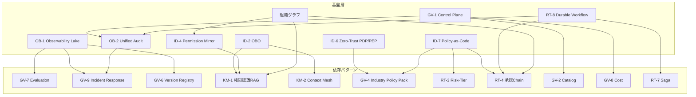

# 依存関係と組み合わせレシピ

## 依存関係（積み上げ構造）

45パターンは独立して採用するものではなく、層として重ねて使う。以下に代表的な依存関係を示す。

### 主要な依存チェーン

| 基盤パターン | 依存先 | 理由 |
|---|---|---|
| [OB-1](../patterns/ob-observability/ob1-observability-lake.md) / [OB-2](../patterns/ob-observability/ob2-unified-audit-lineage.md) | [GV-7](../patterns/gv-governance/gv7-evaluation-governance-pipeline.md)・[GV-9](../patterns/gv-governance/gv9-incident-response-kill-switch.md)・[GV-6](../patterns/gv-governance/gv6-version-registry.md) | 記録なくして評価・再現・調査なし |
| [ID-2](../patterns/id-identity/id2-identity-federation-obo.md) / [ID-4](../patterns/id-identity/id4-permission-mirror-least-of.md) | [KM-1](../patterns/km-knowledge/km1-access-controlled-rag.md)・[KM-2](../patterns/km-knowledge/km2-context-mesh.md) | 権限の伝播なくして安全な横断文脈なし |
| [ID-6](../patterns/id-identity/id6-zero-trust-pdp-pep.md) / [ID-7](../patterns/id-identity/id7-policy-as-code-guardrail.md) | [GV-4](../patterns/gv-governance/gv4-industry-policy-pack.md)・[RT-3](../patterns/rt-runtime/rt3-risk-tiered-autonomy.md)・[RT-4](../patterns/rt-runtime/rt4-human-approval-chain.md) | PDP/ポリシーが判断基盤 |
| [GV-1](../patterns/gv-governance/gv1-agent-control-plane.md) | [GV-2](../patterns/gv-governance/gv2-agent-catalog-marketplace.md)・[GV-8](../patterns/gv-governance/gv8-cost-quota-chargeback.md)・[OB-2](../patterns/ob-observability/ob2-unified-audit-lineage.md) | 実行許可のゲート（統制点） |
| [RT-8](../patterns/rt-runtime/rt8-durable-workflow.md) | [RT-4](../patterns/rt-runtime/rt4-human-approval-chain.md)・[RT-7](../patterns/rt-runtime/rt7-enterprise-saga.md)・[OB-2](../patterns/ob-observability/ob2-unified-audit-lineage.md) | 状態永続化が前提 |

### 横断軸

- **組織グラフ**：[ID-4](../patterns/id-identity/id4-permission-mirror-least-of.md) / [RT-1](../patterns/rt-runtime/rt1-org-hierarchical-hub-spoke.md) / [RT-4](../patterns/rt-runtime/rt4-human-approval-chain.md) / [KM-4](../patterns/km-knowledge/km4-scoped-memory-hierarchy.md) のスコープ・委譲・承認・共有を一貫させる土台
- **ゼロトラスト/監査**：全アクションを三者帰責で貫く

## 組み合わせレシピ（基盤→入口→実行→自動化）

### 1. セキュリティ基盤（最初に敷く）

[ID-2 OBO](../patterns/id-identity/id2-identity-federation-obo.md) ＋ [ID-4 権限忠実](../patterns/id-identity/id4-permission-mirror-least-of.md) ＋ [KM-7 揮発セキュアバス](../patterns/km-knowledge/km7-ephemeral-secure-context-bus.md) ＋ [ID-6 ゼロトラスト](../patterns/id-identity/id6-zero-trust-pdp-pep.md)

### 2. 従業員の入口

[RT-1 Hub & Spoke](../patterns/rt-runtime/rt1-org-hierarchical-hub-spoke.md) を全社ポータルとし、[EX-1 Gateway](../patterns/ex-experience/ex1-enterprise-agent-gateway.md) で統制する。

### 3. 実際の業務遂行

[RT-11 Project Digital Twin](../patterns/rt-runtime/rt11-project-digital-twin.md) をチームの場として展開し、[KM-1](../patterns/km-knowledge/km1-access-controlled-rag.md) / [KM-2](../patterns/km-knowledge/km2-context-mesh.md) で権限付き文脈を供給する。

### 4. バックオフィスの抜本自動化（経営価値の本丸）

[RT-10 イベント駆動](../patterns/rt-runtime/rt10-event-driven-orchestrator.md) ＋ [RT-7 Saga](../patterns/rt-runtime/rt7-enterprise-saga.md) ＋ [RT-4 HitL](../patterns/rt-runtime/rt4-human-approval-chain.md)

### 5. 統治の背骨（全面に貫く）

[GV-1 レジストリ](../patterns/gv-governance/gv1-agent-control-plane.md) ・ [GV-5 モデルGW](../patterns/gv-governance/gv5-central-model-gateway.md) ・ [OB-2 監査](../patterns/ob-observability/ob2-unified-audit-lineage.md) ・ [ID-7 Policy-as-Code](../patterns/id-identity/id7-policy-as-code-guardrail.md)
