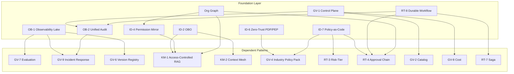

# Dependencies and Dependency Chains

## Overview

The 31 decisions are not a menu to pick from at will — they are built up like a foundation, structure, and interior of a building. For a given pattern to function, other patterns must already be in place. Understanding this dependency structure directly informs introduction sequencing and prioritization.

Attempting to introduce higher-level patterns before the foundational patterns are in place leads to situations like: "it works, but permissions leak," "the root cause can't be identified in an incident because no logs are available," and "policy changes can't be managed as code, so the front line creates its own rules." The dependency map is the blueprint for designing that introduction sequence.

## Dependency Map

The following graph shows the relationship between patterns that function as the foundation layer and the higher-level patterns that depend on them. An arrow means "if the source is not in place, the destination will not function correctly."

## Representative Dependency Chains

### OB (Observability) → GV (Governance) Chain

| Foundation Pattern | Dependent | Reason |
|---|---|---|
| [OB-1 Observability Lake](../decisions/ob-observability/ob-d1-observability-scope.md) | [GV-7 Evaluation](../decisions/gv-governance/gv-d3-change-eval-rigor.md) | The evaluation pipeline uses traces and metrics as input |
| [OB-1 Observability Lake](../decisions/ob-observability/ob-d1-observability-scope.md) | [GV-9 Incident Response](../decisions/gv-governance/gv-d5-incident-kill-switch.md) | Anomaly detection, reproduction, and investigation all presuppose the existence of logs |
| [OB-1 Observability Lake](../decisions/ob-observability/ob-d1-observability-scope.md) | [GV-6 Version Registry](../decisions/gv-governance/gv-d3-change-eval-rigor.md) | Comparing behavior across versions requires execution records |
| [OB-2 Unified Audit](../decisions/ob-observability/ob-d2-audit-attribution.md) | [GV-9 Incident Response](../decisions/gv-governance/gv-d5-incident-kill-switch.md) | Accountability tracing requires a three-party audit trail |

The essence of the observability chain comes down to a single point: "no evaluation, reproduction, or investigation without records." If [OB-1](../decisions/ob-observability/ob-d1-observability-scope.md) is not centrally collecting traces, metrics, and logs, the [GV-7](../decisions/gv-governance/gv-d3-change-eval-rigor.md) evaluation pipeline fires blanks. Governance cannot be discussed in a state where what each agent executed cannot be proven after the fact.

### ID (Identity) → KM (Knowledge Management) Chain

| Foundation Pattern | Dependent | Reason |
|---|---|---|
| [ID-2 OBO](../decisions/id-identity/id-d2-delegation-method.md) | [KM-1 Access-Controlled RAG](../decisions/km-knowledge/km-d1-context-supply.md) | The token reduced to the requester's permissions determines the RAG search scope |
| [ID-4 Permission Mirror](../decisions/id-identity/id-d3-permission-reduction.md) | [KM-1 Access-Controlled RAG](../decisions/km-knowledge/km-d1-context-supply.md) | The least-privilege composition forms the upper limit of document access |
| [ID-2 OBO](../decisions/id-identity/id-d2-delegation-method.md) | [KM-2 Context Mesh](../decisions/km-knowledge/km-d1-context-supply.md) | Permission propagation is essential for cross-SaaS context retrieval |

The key point of this chain comes down to a single point: "no safe cross-cutting context without permission propagation." Without [ID-2](../decisions/id-identity/id-d2-delegation-method.md) OBO (On-Behalf-Of) delegation in place, the agent hits the RAG with the excessive permissions of a service account. This chain cuts off the risk of documents the requester should not see being mixed into search results.

### ID (Identity) → RT/GV Chain

| Foundation Pattern | Dependent | Category | Reason |
|---|---|---|---|
| [ID-6 Zero-Trust PDP/PEP](../decisions/id-identity/id-d5-authorization-method.md) | [GV-4 Industry Policy Pack](../decisions/gv-governance/gv-d6-industry-regulation.md) | ID→GV | The PDP serves as the decision base for evaluating industry regulatory policies |
| [ID-7 Policy-as-Code](../decisions/id-identity/id-d5-authorization-method.md) | [GV-4 Industry Policy Pack](../decisions/gv-governance/gv-d6-industry-regulation.md) | ID→GV | Industry policy packs are managed and applied as policy code |
| [ID-7 Policy-as-Code](../decisions/id-identity/id-d5-authorization-method.md) | [RT-3 Risk-Tiered Autonomy](../decisions/rt-runtime/rt-d2-autonomy-design.md) | ID→RT | Risk tier determination logic is written in policy code |
| [ID-7 Policy-as-Code](../decisions/id-identity/id-d5-authorization-method.md) | [RT-4 Human Approval Chain](../decisions/rt-runtime/rt-d2-autonomy-design.md) | ID→RT | The criteria for when human approval is required are defined in policy |

This chain spans both RT (Runtime) and GV (Governance). Introducing [RT-3](../decisions/rt-runtime/rt-d2-autonomy-design.md) or [RT-4](../decisions/rt-runtime/rt-d2-autonomy-design.md) without [ID-6](../decisions/id-identity/id-d5-authorization-method.md)/[ID-7](../decisions/id-identity/id-d5-authorization-method.md) in place means "judgment of whether an operation is high-risk" depends on configuration files or individual discretion, losing policy consistency across the organization. Similarly, [GV-4](../decisions/gv-governance/gv-d6-industry-regulation.md)'s industry policies cannot be evaluated or applied without a PDP and policy code foundation. Managing policies as code enables change history, testing, and deployment to be governed.

### GV-1 (Control Plane) → GV Chain

| Foundation Pattern | Dependent | Reason |
|---|---|---|
| [GV-1 Control Plane](../decisions/gv-governance/gv-d1-control-plane-scope.md) | [GV-2 Catalog](../decisions/gv-governance/gv-d1-control-plane-scope.md) | The catalog references registration information in the control plane |
| [GV-1 Control Plane](../decisions/gv-governance/gv-d1-control-plane-scope.md) | [GV-8 Cost Quota](../decisions/gv-governance/gv-d4-cost-visibility.md) | Cost allocation requires identification and authorization of execution units |
| [GV-1 Control Plane](../decisions/gv-governance/gv-d1-control-plane-scope.md) | [OB-2 Unified Audit](../decisions/ob-observability/ob-d2-audit-attribution.md) | Execution authorization decision records are written to the unified audit ledger |

[GV-1](../decisions/gv-governance/gv-d1-control-plane-scope.md) is the gate for execution authorization. All agents register their existence through the control plane and are authorized to execute. Without this gate, the catalog becomes a formality, cost management becomes impossible, and no trace remains of which agent ran when.

### RT-8 (Durable Workflow) → RT Chain

| Foundation Pattern | Dependent | Reason |
|---|---|---|
| [RT-8 Durable Workflow](../decisions/rt-runtime/rt-d4-long-running-reliability.md) | [RT-4 Human Approval Chain](../decisions/rt-runtime/rt-d2-autonomy-design.md) | State is persisted so processes do not disappear while waiting for approval |
| [RT-8 Durable Workflow](../decisions/rt-runtime/rt-d4-long-running-reliability.md) | [RT-7 Enterprise Saga](../decisions/rt-runtime/rt-d4-long-running-reliability.md) | Distributed transactions across multiple SaaS systems require state retention for compensating operations |
| [RT-8 Durable Workflow](../decisions/rt-runtime/rt-d4-long-running-reliability.md) | [OB-2 Unified Audit](../decisions/ob-observability/ob-d2-audit-attribution.md) | Audit logs are used to guarantee replay on workflow re-execution |

Long-running workflows execute over hours to days. Without the state persistence of [RT-8](../decisions/rt-runtime/rt-d4-long-running-reliability.md), workflows disappear when services restart mid-process. Durable Workflow's role is to record the state of the approval chain's "waiting for approval" status and where the Saga is in its "compensating operation required" stage.

### Org Graph → ID/RT/KM Chain

| Foundation | Dependent | Reason |
|---|---|---|
| Org Graph | [ID-4 Permission Mirror](../decisions/id-identity/id-d3-permission-reduction.md) | Source for defining permission scope based on department and role |
| Org Graph | [RT-1 Org Hierarchical Hub & Spoke](../decisions/rt-runtime/rt-d1-single-vs-multi-agent.md) | The org hierarchy determines the Hub/Spoke delegation structure |
| Org Graph | [RT-4 Human Approval Chain](../decisions/rt-runtime/rt-d2-autonomy-design.md) | Who approves for whom is drawn from the org graph |
| Org Graph | [KM-4 Scoped Memory Hierarchy](../decisions/km-knowledge/km-d3-memory-scope.md) | Memory scopes (personal/team/department/company-wide) correspond to org structure |
| Org Graph | [KM-3 Canonical Object Knowledge Graph](../decisions/km-knowledge/km-d2-knowledge-normalization.md) | The org master is referenced for entity normalization in the knowledge graph |

The org graph is data, not a system. Without a single authoritative org master normalized from multiple sources — Workday, Okta, project management tools — there is no consistent answer to "what is the range this agent can operate in?" or "who is the approver?"

## Value Measurement and Adoption: The Final Link to Capture Outcomes

Dependency chains define "the order for operating safely," but implementation is not complete without including the point where **value is generated, measured, and adopted** as a result of operation. The following three mechanisms are the final links at the "exit" of all dependency chains.

| Final Link | Role | Key Pages |
|---|---|---|
| [GV-10 Three-Layer Value Measurement](../decisions/gv-governance/gv-d7-value-measurement.md) | Measures the causality of adoption rate (Layer 0) → productivity (Layer 1) → business KPI (Layer 2) to visualize value | The "Value Hypothesis" section of each pattern corresponds to GV-10's measurement layers |
| [Adoption & Change Management](adoption.md) | Increases utilization rate and secures the "denominator" of ROI. Also covers avoidance of value-realization anti-patterns | Three phases of change management roadmap |
| [AI Investment Portfolio](portfolio.md) | Based on measurement results, decides on expansion, improvement, or withdrawal of use cases and determines reinvestment targets | Decision cycle in quarterly reviews |

Build up patterns along the dependency chains, create value with department-specific use cases, measure with GV-10, secure utilization with adoption initiatives, and make reinvestment decisions through the portfolio — when this **value loop (Create → Measure → Adopt → Reinvest)** runs, pattern adoption translates into actual enterprise value improvement.

## How to Read Dependencies

When you want to introduce a pattern, if the upstream (arrow source) in this diagram is not yet in place, start there. For example, if you want to introduce [KM-1 Access-Controlled RAG](../decisions/km-knowledge/km-d1-context-supply.md), first confirm that [ID-2](../decisions/id-identity/id-d2-delegation-method.md) and [ID-4](../decisions/id-identity/id-d3-permission-reduction.md) are operational.

Conversely, foundational layer patterns (OB-1/OB-2, ID-2/ID-4/ID-6/ID-7, GV-1, RT-8, Org Graph) have high priority. Since many other patterns depend on them, trying to introduce them later results in large modification costs to existing patterns. The principle of "lay the foundation first" comes from this dependency structure.

!!! tip "Principle for Introduction Sequence"
    Start from the upstream of the dependency graph. By establishing the foundation layer (observability, identity, control plane) first, the introduction cost and rework for subsequent patterns are greatly reduced.

!!! warning "Foundation-First Alone Delays Value Realization"
    Applying the above technical dependency order directly as a timeline results in "only security infrastructure for the first few months with no visible value," which risks losing executive support. In practice, **an approach of deploying a low-risk, high-frequency use case (knowledge search, meeting summary) to the field within 30 days using only minimum governance (ID-2 OBO read-only version + KM-1 permission filter + OB-1 log), and building the foundation and governance in parallel while letting people experience the value** is effective. For details, refer to [the quick-win track in the combination recipe](recipe.md).
