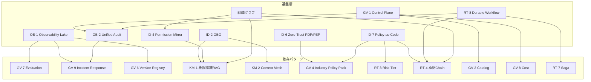

# 依存関係と依存チェーン

## 概要

45のパターンはメニューから好きなものを選ぶのではなく、建物の基礎→構造→内装のように積み上げて使う。あるパターンが機能するには別のパターンが先に整っている必要がある——この依存関係を理解することが、導入順序と優先度の決定に直結する。

基盤パターンが整っていない状態で上位パターンを入れようとすると、「動くには動くが権限が漏れる」「ログが取れていないため事故時に原因特定できない」「ポリシー変更をコードで管理できないため現場が独自ルールを作る」といった事態が起きる。依存関係マップは、その導入順序の設計図である。

## 依存関係マップ

以下のグラフは、基盤層として機能するパターンと、それらに依存する上位パターンの関係を示す。矢印は「矢印元が整っていなければ矢印先は正常に動作しない」ことを意味する。

## 代表的な依存チェーン

### OB（可観測性）→ GV（ガバナンス）チェーン

| 基盤パターン | 依存先 | 理由 |
|---|---|---|
| [OB-1 Observability Lake](../patterns/ob-observability/ob1-observability-lake.md) | [GV-7 評価](../patterns/gv-governance/gv7-evaluation-governance-pipeline.md) | 評価パイプラインはトレースとメトリクスを入力として使う |
| [OB-1 Observability Lake](../patterns/ob-observability/ob1-observability-lake.md) | [GV-9 インシデント対応](../patterns/gv-governance/gv9-incident-response-kill-switch.md) | 異常検知・再現・調査はすべてログの存在が前提 |
| [OB-1 Observability Lake](../patterns/ob-observability/ob1-observability-lake.md) | [GV-6 バージョン管理](../patterns/gv-governance/gv6-version-registry.md) | 版ごとの振る舞い比較には実行記録が必要 |
| [OB-2 Unified Audit](../patterns/ob-observability/ob2-unified-audit-lineage.md) | [GV-9 インシデント対応](../patterns/gv-governance/gv9-incident-response-kill-switch.md) | 三者帰責の監査証跡なしに責任追跡はできない |

可観測性チェーンの本質は「記録なくして評価・再現・調査なし」という一点に尽きる。[OB-1](../patterns/ob-observability/ob1-observability-lake.md) がトレース・メトリクス・ログを一元収集していなければ、[GV-7](../patterns/gv-governance/gv7-evaluation-governance-pipeline.md) の評価パイプラインは空振りになる。どのエージェントが何を実行したかを後から証明できない状態でガバナンスを語ることはできない。

### ID（アイデンティティ）→ KM（知識管理）チェーン

| 基盤パターン | 依存先 | 理由 |
|---|---|---|
| [ID-2 OBO](../patterns/id-identity/id2-identity-federation-obo.md) | [KM-1 権限認識RAG](../patterns/km-knowledge/km1-access-controlled-rag.md) | 依頼者の権限に縮退したトークンがRAGの検索スコープを決める |
| [ID-4 Permission Mirror](../patterns/id-identity/id4-permission-mirror-least-of.md) | [KM-1 権限認識RAG](../patterns/km-knowledge/km1-access-controlled-rag.md) | 最小権限合成がドキュメントアクセスの上限になる |
| [ID-2 OBO](../patterns/id-identity/id2-identity-federation-obo.md) | [KM-2 Context Mesh](../patterns/km-knowledge/km2-context-mesh.md) | 複数SaaSをまたぐ横断文脈の取得には権限伝播が必須 |

このチェーンのポイントは「権限の伝播なくして安全な横断文脈なし」という一点に尽きる。[ID-2](../patterns/id-identity/id2-identity-federation-obo.md) のOBO（On-Behalf-Of）委譲が整っていなければ、エージェントはサービスアカウントの過剰権限でRAGを叩くことになる。依頼者が本来見えないはずのドキュメントが検索結果に混入するリスクを、このチェーンが断ち切る。

### ID（アイデンティティ）→ RT（ランタイム）チェーン

| 基盤パターン | 依存先 | 理由 |
|---|---|---|
| [ID-6 Zero-Trust PDP/PEP](../patterns/id-identity/id6-zero-trust-pdp-pep.md) | [GV-4 Industry Policy Pack](../patterns/gv-governance/gv4-industry-policy-pack.md) | PDPが判断基盤となって業界規制ポリシーを評価する |
| [ID-7 Policy-as-Code](../patterns/id-identity/id7-policy-as-code-guardrail.md) | [RT-3 Risk-Tiered Autonomy](../patterns/rt-runtime/rt3-risk-tiered-autonomy.md) | リスク階層の判定ロジックはポリシーコードに記述される |
| [ID-7 Policy-as-Code](../patterns/id-identity/id7-policy-as-code-guardrail.md) | [RT-4 Human Approval Chain](../patterns/rt-runtime/rt4-human-approval-chain.md) | いつ人間承認が必要かの基準はポリシーで定義する |

[ID-7](../patterns/id-identity/id7-policy-as-code-guardrail.md) が整っていない状態で [RT-3](../patterns/rt-runtime/rt3-risk-tiered-autonomy.md) や [RT-4](../patterns/rt-runtime/rt4-human-approval-chain.md) を導入しようとすると、「高リスク操作かどうかの判定」が設定ファイルや担当者の判断に依存し、組織全体でのポリシー一貫性が失われる。ポリシーをコードとして管理することで、変更履歴・テスト・デプロイが統制される。

### GV-1（コントロールプレーン）→ GV チェーン

| 基盤パターン | 依存先 | 理由 |
|---|---|---|
| [GV-1 Control Plane](../patterns/gv-governance/gv1-agent-control-plane.md) | [GV-2 Catalog](../patterns/gv-governance/gv2-agent-catalog-marketplace.md) | カタログはコントロールプレーンの登録情報を参照する |
| [GV-1 Control Plane](../patterns/gv-governance/gv1-agent-control-plane.md) | [GV-8 Cost Quota](../patterns/gv-governance/gv8-cost-quota-chargeback.md) | コスト割り当てには実行単位の識別と承認が必要 |
| [GV-1 Control Plane](../patterns/gv-governance/gv1-agent-control-plane.md) | [OB-2 Unified Audit](../patterns/ob-observability/ob2-unified-audit-lineage.md) | 実行許可の判断記録は統一監査台帳に書き込まれる |

[GV-1](../patterns/gv-governance/gv1-agent-control-plane.md) は実行許可のゲートである。すべてのエージェントはコントロールプレーンを通じて存在を登録し、実行を許可される。このゲートがなければカタログは形骸化し、コスト管理は不能になり、どのエージェントがいつ動いたかの証跡も残らなくなる。

### RT-8（Durable Workflow）→ RT チェーン

| 基盤パターン | 依存先 | 理由 |
|---|---|---|
| [RT-8 Durable Workflow](../patterns/rt-runtime/rt8-durable-workflow.md) | [RT-4 Human Approval Chain](../patterns/rt-runtime/rt4-human-approval-chain.md) | 承認待ち中にプロセスが消えないよう状態を永続化する |
| [RT-8 Durable Workflow](../patterns/rt-runtime/rt8-durable-workflow.md) | [RT-7 Enterprise Saga](../patterns/rt-runtime/rt7-enterprise-saga.md) | 複数SaaSへの分散トランザクションには補償操作の状態保持が必要 |
| [RT-8 Durable Workflow](../patterns/rt-runtime/rt8-durable-workflow.md) | [OB-2 Unified Audit](../patterns/ob-observability/ob2-unified-audit-lineage.md) | ワークフロー再実行時のリプレイ保証には監査ログが使われる |

長時間ワークフローは数時間から数日にわたって実行される。[RT-8](../patterns/rt-runtime/rt8-durable-workflow.md) の状態永続化がなければ、途中でサービスが再起動したときにワークフローは消失する。承認チェーンの「承認待ち」状態や、Sagaの「補償操作が必要な段階」がどこまで進んだかを記録しているのが Durable Workflow の役割である。

### 組織グラフ → ID/RT/KM チェーン

| 基盤 | 依存先 | 理由 |
|---|---|---|
| 組織グラフ | [ID-4 Permission Mirror](../patterns/id-identity/id4-permission-mirror-least-of.md) | 部署・役職に基づく権限スコープの定義元 |
| 組織グラフ | [RT-1 Org Hierarchical Hub & Spoke](../patterns/rt-runtime/rt1-org-hierarchical-hub-spoke.md) | 組織階層がHub/Spokeの委譲構造を決める |
| 組織グラフ | [RT-4 Human Approval Chain](../patterns/rt-runtime/rt4-human-approval-chain.md) | 誰が誰の承認者かは組織グラフから引く |
| 組織グラフ | [KM-4 Scoped Memory Hierarchy](../patterns/km-knowledge/km4-scoped-memory-hierarchy.md) | メモリのスコープ（個人/チーム/部門/全社）は組織構造に対応する |
| 組織グラフ | [KM-3 Canonical Object Knowledge Graph](../patterns/km-knowledge/km3-canonical-object-knowledge-graph.md) | ナレッジグラフのエンティティ名寄せに組織マスターを参照する |

組織グラフはシステムではなくデータである。Workday・Okta・プロジェクト管理ツールなど複数ソースから名寄せした単一の権威ある組織マスターが存在しなければ、「このエージェントが動かせる範囲はどこか」「誰が承認者か」という問いに一貫した答えを出せない。

## 依存の読み方

あるパターンを導入したいとき、この図の上流（矢印の始点）がまだ整っていなければ、そこから着手する。たとえば [KM-1 権限認識RAG](../patterns/km-knowledge/km1-access-controlled-rag.md) を入れたいなら、まず [ID-2](../patterns/id-identity/id2-identity-federation-obo.md) と [ID-4](../patterns/id-identity/id4-permission-mirror-least-of.md) が動いていることを確認する。

逆に言えば、基盤層のパターン（OB-1/OB-2、ID-2/ID-4/ID-6/ID-7、GV-1、RT-8、組織グラフ）は優先度が高い。これらは他の多くのパターンが依存しているため、後から入れようとすると既存パターンの改修コストが大きくなる。「最初に基盤を敷く」という原則はこの依存構造から来ている。

!!! tip "導入順序の原則"
    依存グラフの上流から着手する。基盤層（可観測性・アイデンティティ・コントロールプレーン）を先に整えることで、後続パターンの導入コストと手戻りが大幅に減る。
