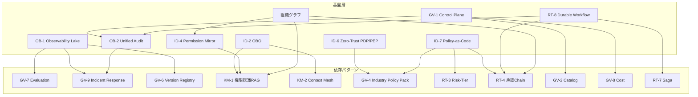

# 依存関係と依存チェーン

## 概要

45のパターンはメニューから好きなものを選ぶものではありません。建物の基礎→構造→内装のように積み上げて使うものです。あるパターンが機能するには別のパターンが先に整っている必要があり、この依存関係の理解が導入順序と優先度の決定に直結します。

基盤パターンが整わないまま上位パターンを入れようとすると問題が生じます。「動くには動くが権限が漏れる」「ログが取れておらず、事故時に原因を特定できない」「ポリシー変更をコードで管理できず、現場が独自ルールを作る」——こうした事態が典型例として挙げられます。依存関係マップは、その導入順序を示す設計図です。

## 依存関係マップ

以下のグラフは、基盤層として機能するパターンと、それらに依存する上位パターンの関係を示します。矢印は「矢印元が整っていなければ矢印先は正常に動作しない」ことを表します。

## 代表的な依存チェーン

### OB（可観測性）→ GV（ガバナンス）チェーン

| 基盤パターン | 依存先 | 理由 |
|---|---|---|
| [OB-1 Observability Lake](../patterns/ob-observability/ob1-observability-lake.md) | [GV-7 評価](../patterns/gv-governance/gv7-evaluation-governance-pipeline.md) | 評価パイプラインはトレースとメトリクスを入力として使います |
| [OB-1 Observability Lake](../patterns/ob-observability/ob1-observability-lake.md) | [GV-9 インシデント対応](../patterns/gv-governance/gv9-incident-response-kill-switch.md) | 異常検知・再現・調査はすべてログの存在が前提です |
| [OB-1 Observability Lake](../patterns/ob-observability/ob1-observability-lake.md) | [GV-6 バージョン管理](../patterns/gv-governance/gv6-version-registry.md) | 版ごとの振る舞い比較には実行記録が必要です |
| [OB-2 Unified Audit](../patterns/ob-observability/ob2-unified-audit-lineage.md) | [GV-9 インシデント対応](../patterns/gv-governance/gv9-incident-response-kill-switch.md) | 三者帰責の監査証跡なしに責任追跡はできません |

可観測性チェーンの本質は「記録なくして評価・再現・調査なし」の一点に集約されます。[OB-1](../patterns/ob-observability/ob1-observability-lake.md) がトレース・メトリクス・ログを一元収集していなければ、[GV-7](../patterns/gv-governance/gv7-evaluation-governance-pipeline.md) の評価パイプラインは空振りに終わります。どのエージェントが何を実行したかを後から証明できない状態では、ガバナンスを語ることはできません。

### ID（アイデンティティ）→ KM（知識管理）チェーン

| 基盤パターン | 依存先 | 理由 |
|---|---|---|
| [ID-2 OBO](../patterns/id-identity/id2-identity-federation-obo.md) | [KM-1 権限認識RAG](../patterns/km-knowledge/km1-access-controlled-rag.md) | 依頼者の権限に縮退したトークンがRAGの検索スコープを決めます |
| [ID-4 Permission Mirror](../patterns/id-identity/id4-permission-mirror-least-of.md) | [KM-1 権限認識RAG](../patterns/km-knowledge/km1-access-controlled-rag.md) | 最小権限合成がドキュメントアクセスの上限になります |
| [ID-2 OBO](../patterns/id-identity/id2-identity-federation-obo.md) | [KM-2 Context Mesh](../patterns/km-knowledge/km2-context-mesh.md) | 複数SaaSをまたぐ横断文脈の取得には権限伝播が必須です |

このチェーンも「権限の伝播なくして安全な横断文脈なし」の一点に集約できます。[ID-2](../patterns/id-identity/id2-identity-federation-obo.md) の OBO（On-Behalf-Of）委譲が整っていなければ、エージェントはサービスアカウントの過剰権限で RAG を叩くことになります。依頼者が本来見えないはずのドキュメントが検索結果に混入するリスクを、このチェーンが断ち切ります。

### ID（アイデンティティ）→ RT/GV チェーン

| 基盤パターン | 依存先 | 分類 | 理由 |
|---|---|---|---|
| [ID-6 Zero-Trust PDP/PEP](../patterns/id-identity/id6-zero-trust-pdp-pep.md) | [GV-4 Industry Policy Pack](../patterns/gv-governance/gv4-industry-policy-pack.md) | ID→GV | PDP が判断基盤となって業界規制ポリシーを評価します |
| [ID-7 Policy-as-Code](../patterns/id-identity/id7-policy-as-code-guardrail.md) | [GV-4 Industry Policy Pack](../patterns/gv-governance/gv4-industry-policy-pack.md) | ID→GV | 業界ポリシーパックはポリシーコードとして管理・適用されます |
| [ID-7 Policy-as-Code](../patterns/id-identity/id7-policy-as-code-guardrail.md) | [RT-3 Risk-Tiered Autonomy](../patterns/rt-runtime/rt3-risk-tiered-autonomy.md) | ID→RT | リスク階層の判定ロジックはポリシーコードに記述されます |
| [ID-7 Policy-as-Code](../patterns/id-identity/id7-policy-as-code-guardrail.md) | [RT-4 Human Approval Chain](../patterns/rt-runtime/rt4-human-approval-chain.md) | ID→RT | いつ人間承認が必要かの基準はポリシーで定義します |

このチェーンは RT（ランタイム）と GV（ガバナンス）の両方にまたがります。[ID-6](../patterns/id-identity/id6-zero-trust-pdp-pep.md)/[ID-7](../patterns/id-identity/id7-policy-as-code-guardrail.md) が整わないまま [RT-3](../patterns/rt-runtime/rt3-risk-tiered-autonomy.md) や [RT-4](../patterns/rt-runtime/rt4-human-approval-chain.md) を導入すると、「高リスク操作かどうかの判定」が設定ファイルや担当者の判断に依存し、組織全体でのポリシー一貫性が失われます。[GV-4](../patterns/gv-governance/gv4-industry-policy-pack.md) の業界ポリシーも、PDP とポリシーコード基盤なしには評価・適用できません。ポリシーをコードとして管理すれば、変更履歴・テスト・デプロイを一貫して統制できるようになります。

### GV-1（コントロールプレーン）→ GV チェーン

| 基盤パターン | 依存先 | 理由 |
|---|---|---|
| [GV-1 Control Plane](../patterns/gv-governance/gv1-agent-control-plane.md) | [GV-2 Catalog](../patterns/gv-governance/gv2-agent-catalog-marketplace.md) | カタログはコントロールプレーンの登録情報を参照します |
| [GV-1 Control Plane](../patterns/gv-governance/gv1-agent-control-plane.md) | [GV-8 Cost Quota](../patterns/gv-governance/gv8-cost-quota-chargeback.md) | コスト割り当てには実行単位の識別と承認が必要です |
| [GV-1 Control Plane](../patterns/gv-governance/gv1-agent-control-plane.md) | [OB-2 Unified Audit](../patterns/ob-observability/ob2-unified-audit-lineage.md) | 実行許可の判断記録は統一監査台帳に書き込まれます |

[GV-1](../patterns/gv-governance/gv1-agent-control-plane.md) は実行許可のゲートとなります。すべてのエージェントはコントロールプレーンを通じて存在を登録し、実行を許可されます。このゲートがなければ、カタログは形骸化し、コスト管理は不能になり、どのエージェントがいつ動いたかの証跡も残りません。

### RT-8（Durable Workflow）→ RT チェーン

| 基盤パターン | 依存先 | 理由 |
|---|---|---|
| [RT-8 Durable Workflow](../patterns/rt-runtime/rt8-durable-workflow.md) | [RT-4 Human Approval Chain](../patterns/rt-runtime/rt4-human-approval-chain.md) | 承認待ち中にプロセスが消えないよう状態を永続化します |
| [RT-8 Durable Workflow](../patterns/rt-runtime/rt8-durable-workflow.md) | [RT-7 Enterprise Saga](../patterns/rt-runtime/rt7-enterprise-saga.md) | 複数SaaSへの分散トランザクションには補償操作の状態保持が必要です |
| [RT-8 Durable Workflow](../patterns/rt-runtime/rt8-durable-workflow.md) | [OB-2 Unified Audit](../patterns/ob-observability/ob2-unified-audit-lineage.md) | ワークフロー再実行時のリプレイ保証には監査ログが使われます |

長時間ワークフローは数時間から数日にわたって実行されることがあります。[RT-8](../patterns/rt-runtime/rt8-durable-workflow.md) の状態永続化がなければ、途中でサービスが再起動したときにワークフローは消えてしまいます。承認チェーンの「承認待ち」状態や、Saga の「補償操作が必要な段階」がどこまで進んだかを記録するのが Durable Workflow の役割となります。

### 組織グラフ → ID/RT/KM チェーン

| 基盤 | 依存先 | 理由 |
|---|---|---|
| 組織グラフ | [ID-4 Permission Mirror](../patterns/id-identity/id4-permission-mirror-least-of.md) | 部署・役職に基づく権限スコープの定義元です |
| 組織グラフ | [RT-1 Org Hierarchical Hub & Spoke](../patterns/rt-runtime/rt1-org-hierarchical-hub-spoke.md) | 組織階層がHub/Spokeの委譲構造を決めます |
| 組織グラフ | [RT-4 Human Approval Chain](../patterns/rt-runtime/rt4-human-approval-chain.md) | 誰が誰の承認者かは組織グラフから引きます |
| 組織グラフ | [KM-4 Scoped Memory Hierarchy](../patterns/km-knowledge/km4-scoped-memory-hierarchy.md) | メモリのスコープ（個人/チーム/部門/全社）は組織構造に対応します |
| 組織グラフ | [KM-3 Canonical Object Knowledge Graph](../patterns/km-knowledge/km3-canonical-object-knowledge-graph.md) | ナレッジグラフのエンティティ名寄せに組織マスターを参照します |

組織グラフはシステムではなくデータです。Workday・Okta・プロジェクト管理ツールなど複数ソースから名寄せした単一の権威ある組織マスターがなければ、「このエージェントが動かせる範囲はどこか」「誰が承認者か」という問いに一貫した答えを返せません。

## 価値計測・定着：成果を回収する最終リンク

依存チェーンは「安全に動かす順序」を定めますが、動かした結果として**価値が生まれ・計測され・定着する**ところまで含めなければ、導入は完了しません。以下の3つの仕組みは、すべての依存チェーンの「出口」に位置する最終リンクです。

| 最終リンク | 役割 | 主要ページ |
|---|---|---|
| [GV-10 Three-Layer Value Measurement](../patterns/gv-governance/gv10-two-layer-value-measurement.md) | 定着率（第0層）→生産性（第1層）→経営KPI（第2層）の因果を計測し、価値を可視化します | 各パターンの「価値仮説」節が GV-10 の計測層に対応 |
| [定着・アダプション](adoption.md) | 利用率を引き上げ、ROIの「分母」を確保します。価値実現アンチパターンの回避もここで扱います | チェンジマネジメント・ロードマップの3フェーズ |
| [AI投資ポートフォリオ](portfolio.md) | 計測結果に基づきユースケースの拡大・改善・撤退を判断し、再投資先を決定します | 四半期レビューでの意思決定サイクル |

依存チェーンに沿ってパターンを積み上げ、部門別ユースケースで価値を創出し、GV-10 で計測し、定着施策で利用率を確保し、ポートフォリオで再投資判断します。この**価値ループ（創出→計測→定着→再投資）**が回ることで、パターン導入が実際の企業価値向上へと結びついていきます。

## 依存の読み方

あるパターンを導入したいとき、この図の上流（矢印の始点）がまだ整っていなければ、そこから着手します。たとえば [KM-1 権限認識RAG](../patterns/km-knowledge/km1-access-controlled-rag.md) を入れたいなら、まず [ID-2](../patterns/id-identity/id2-identity-federation-obo.md) と [ID-4](../patterns/id-identity/id4-permission-mirror-least-of.md) が動いているかを確認するところから始まります。

逆にいえば、基盤層のパターン（OB-1/OB-2・ID-2/ID-4/ID-6/ID-7・GV-1・RT-8・組織グラフ）は優先度が高いといえます。他の多くのパターンがこれらに依存しているため、後から入れようとすると既存パターンの改修コストが膨らみます。「最初に基盤を敷く」という原則は、この依存構造から来ています。

!!! tip "導入順序の原則"
    依存グラフの上流から着手します。基盤層（可観測性・アイデンティティ・コントロールプレーン）を先に整えることで、後続パターンの導入コストと手戻りが大幅に減ります。

!!! warning "基盤完全先行だけでは価値が遅れる"
    上記の技術依存順序をそのまま時系列に適用すると「最初の数ヶ月はセキュリティ基盤だけで価値が見えない」状態が続き、経営支持を失うリスクがあります。実務では**最小統制（Minimum Viable Governance: ID-2 OBO読み取り版 ＋ KM-1 権限フィルタ ＋ OB-1 ログ）だけで Read-only の低リスク高頻度ユースケース（ナレッジ検索・議事録要約）を30日以内に現場に出し、価値を体感させながら基盤と統治を並行整備する**アプローチが有効です。詳細は[組み合わせレシピの価値早期実現トラック](recipe.md)を参照してください。
