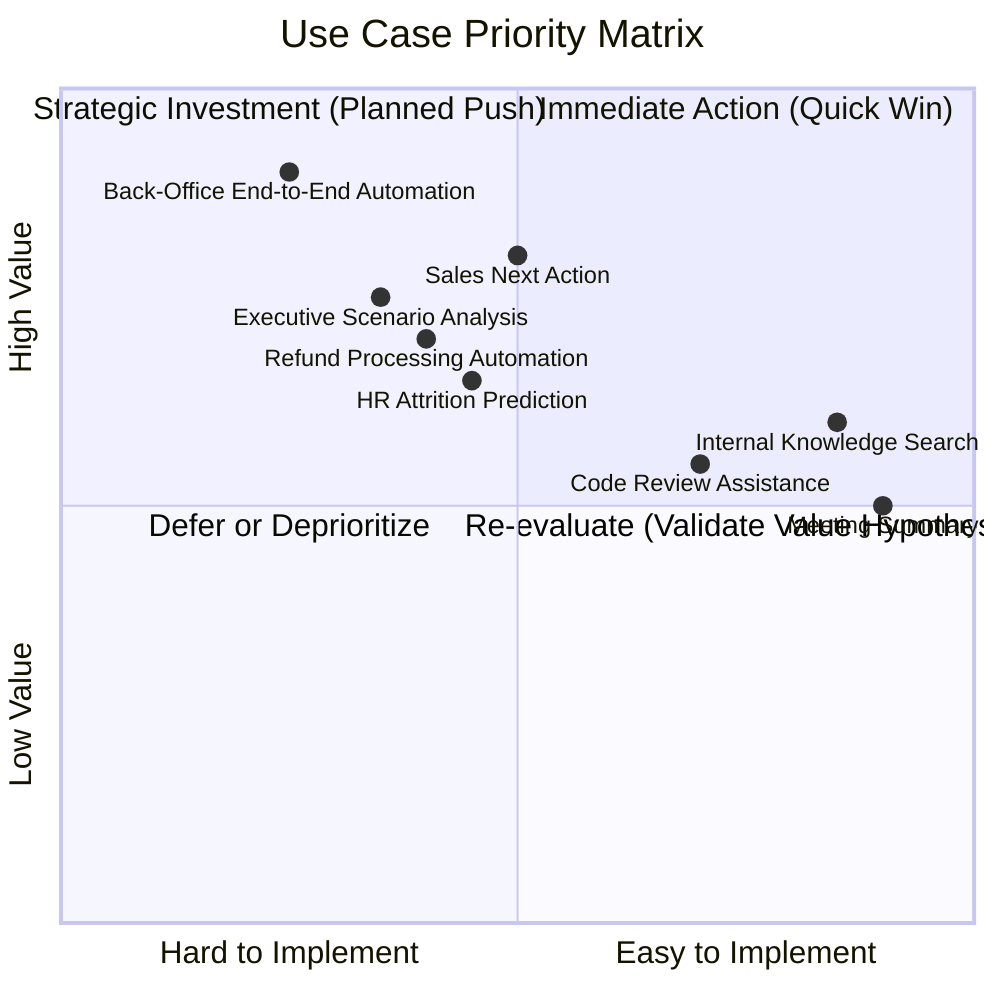
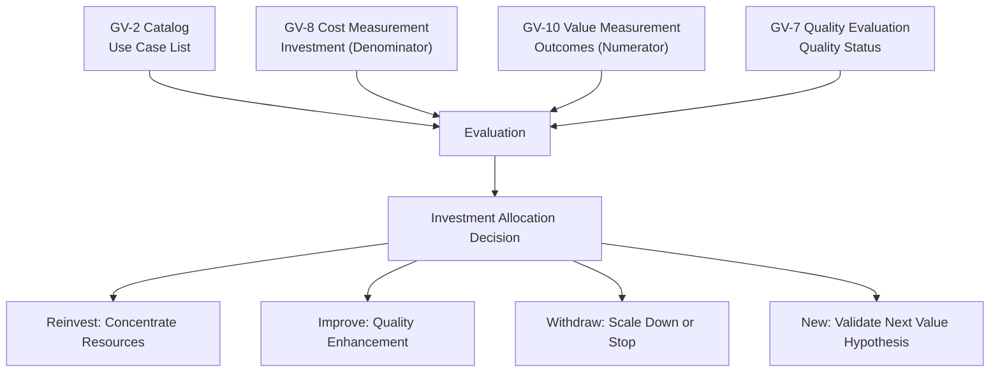

# AI Investment Portfolio Management

## Overview

This is a framework for deciding "which order, and where to invest, to maximize company-wide value" across 31 decisions and multiple departmental agents. Rather than individual use case ROI alone, it manages use cases as a portfolio to achieve company-wide optimal investment allocation.

## Why Portfolio Management Is Necessary

As agent investment expands, the following decisions become necessary:

- Among multiple use case candidates, which to invest in first
- Among running agents, which to concentrate resources on and which to scale down
- How to balance foundational investment (security, governance) with value investment (departmental agents)

These cannot be answered through individual ROI calculations alone. A **portfolio perspective that surveys the whole on three axes — value × cost × risk** is needed.

## Evaluation Framework

### Three-Axis Evaluation

Evaluate each use case (agent candidate) on the following three axes.

| Axis | Evaluation Perspective | Information Source |
|---|---|---|
| **Value Potential** | Contribution to business KPIs, number of affected employees, frequency | GV-10 (value measurement), department interviews |
| **Implementation Ease** | Maturity of required foundations, data preparation status, technical complexity | Consistency with dependency chains and recipes |
| **Risk** | Data sensitivity, write operations, regulatory impact, business impact of failure | RT-3 (risk tier), GV-4 (policy pack) |

### Priority Matrix

## Integration of GV-2 / GV-8 / GV-10 / GV-7

Portfolio management functions by bundling the following four patterns.

| Pattern | Role in Portfolio |
|---|---|
| [GV-2 Agent Catalog](../decisions/gv-governance/gv-d1-control-plane-scope.md) | Managing list of use case candidates with metadata |
| [GV-8 Cost Quota](../decisions/gv-governance/gv-d4-cost-visibility.md) | Measuring investment cost (denominator) for each use case |
| [GV-10 Value Measurement](../decisions/gv-governance/gv-d7-value-measurement.md) | Measuring value (numerator) for each use case |
| [GV-7 Evaluation Pipeline](../decisions/gv-governance/gv-d3-change-eval-rigor.md) | Detecting quality degradation and triggering improvement decisions |

## Operating Cycle

| Frequency | Activity | Participants |
|---|---|---|
| Monthly | Use case-level ROI review (GV-10/GV-8 data review) | AI CoE, department representatives |
| Quarterly | Company-wide portfolio investment allocation review | Executive team, AI CoE |
| Semi-annual | New use case candidate value hypothesis formulation and prioritization | All departments, corporate planning |
| Ad hoc | Emergency response based on quality alerts (GV-7) | AI CoE, relevant department |

## Related Patterns

- [GV-2 Agent Catalog & Marketplace](../decisions/gv-governance/gv-d1-control-plane-scope.md) — Managing the list of use case candidates
- [GV-7 Evaluation & Governance Pipeline](../decisions/gv-governance/gv-d3-change-eval-rigor.md) — Ongoing quality measurement and improvement triggers
- [GV-8 Cost Quota & Chargeback](../decisions/gv-governance/gv-d4-cost-visibility.md) — Cost measurement and allocation
- [GV-10 Three-Layer Value Measurement](../decisions/gv-governance/gv-d7-value-measurement.md) — Value measurement and ROI calculation
- [Executive Agent](departments/executive.md) — Executive agent supporting portfolio decisions
- [Combination Recipe](recipe.md) — Alignment with the quick-win track
