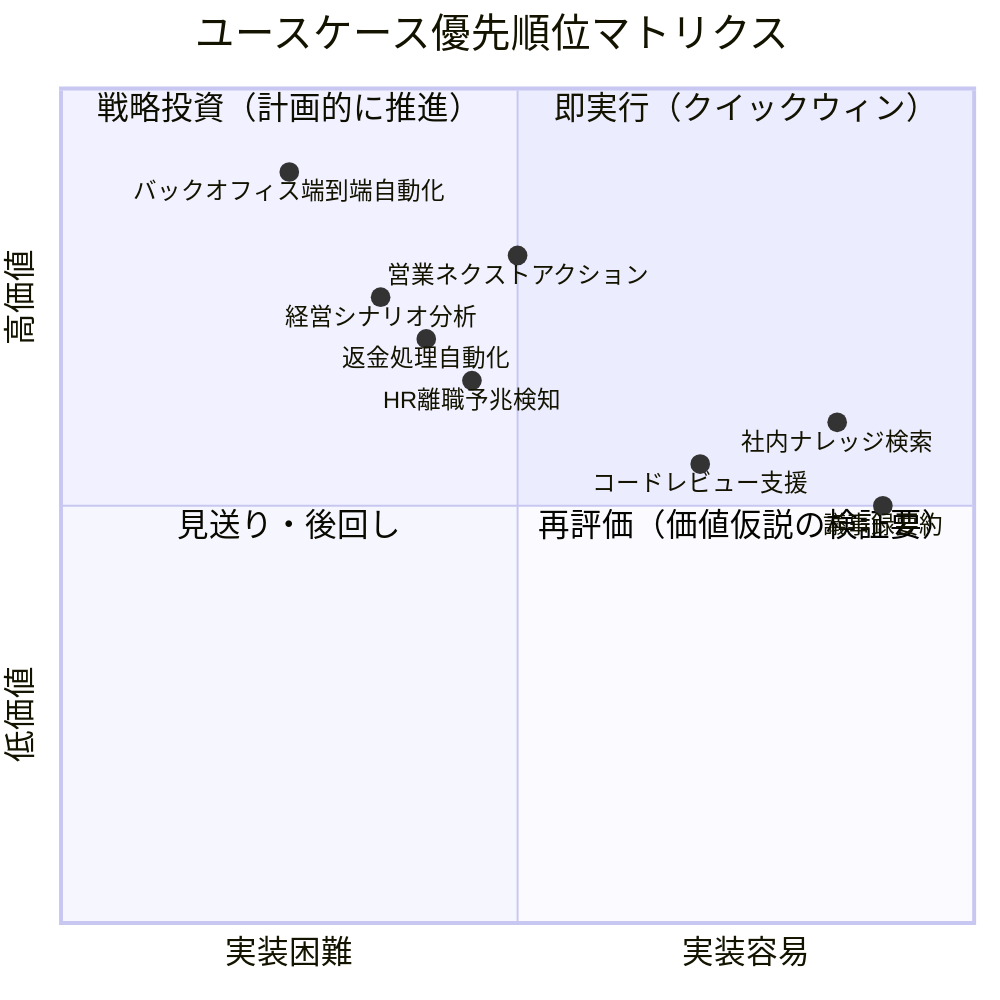
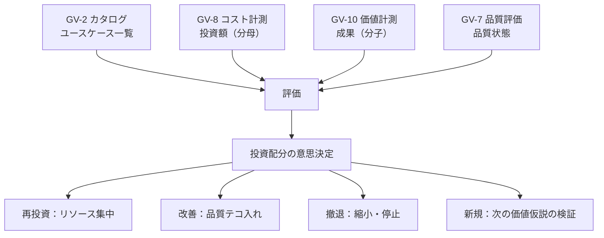

# AI投資ポートフォリオ管理

## 概要

31意思決定・複数部門のエージェントを「どの順で、どこに投資すれば全社の価値が最大化するか」を判断するためのフレームワークです。個別ユースケースのROIだけを見るのではなく、ユースケース群をポートフォリオとして管理し、全社最適の投資配分を実現します。

## なぜポートフォリオ管理が必要か

エージェント投資が拡大すると、次のような判断が求められる場面が増えてきます。

- 複数のユースケース候補のうち、どれに先行投資するか
- 稼働中のエージェントのうち、どれにリソースを集中し、どれを縮小するか
- 基盤投資（セキュリティ・統治）と価値投資（部門エージェント）のバランスをどう取るか

これらは個別のROI計算だけでは答えが出ません。**価値×コスト×リスクの三軸で全体を俯瞰するポートフォリオ視点**が必要です。

## 評価フレームワーク

### 三軸評価

各ユースケース（エージェント候補）を以下の三軸で評価します。

| 軸 | 評価観点 | 情報源 |
|---|---|---|
| **価値ポテンシャル** | 経営KPIへの貢献度・影響を受ける従業員数・頻度 | GV-10（価値計測）・部門ヒアリング |
| **実装容易性** | 必要な基盤の成熟度・データ準備状況・技術的複雑さ | 依存チェーン・レシピとの整合 |
| **リスク** | データ機密度・書き込み有無・規制影響・失敗時の業務影響 | RT-3（リスクティア）・GV-4（ポリシーパック） |

### 優先順位マトリクス

## GV-2 / GV-8 / GV-10 / GV-7 の統合

ポートフォリオ管理は以下の4つのパターンを束ねることで機能します。

| パターン | ポートフォリオでの役割 |
|---|---|
| [GV-2 Agent Catalog](../decisions/gv-governance/gv-d1-control-plane-scope.md) | ユースケース候補の一覧管理・メタデータ付与 |
| [GV-8 Cost Quota](../decisions/gv-governance/gv-d4-cost-visibility.md) | 各ユースケースの投資コスト（分母）の計測 |
| [GV-10 Value Measurement](../decisions/gv-governance/gv-d7-value-measurement.md) | 各ユースケースの価値（分子）の計測 |
| [GV-7 Evaluation Pipeline](../decisions/gv-governance/gv-d3-change-eval-rigor.md) | 品質劣化の検知と改善判断 |

## 運用サイクル

| 頻度 | 活動 | 参加者 |
|---|---|---|
| 月次 | ユースケース別ROIレビュー（GV-10/GV-8データ確認） | AI CoE・部門代表 |
| 四半期 | ポートフォリオ全体の投資配分見直し | 経営層・AI CoE |
| 半期 | 新規ユースケース候補の価値仮説策定と優先順位付け | 全部門・経営企画 |
| 随時 | 品質アラート（GV-7）に基づく緊急対応 | AI CoE・該当部門 |

## 関連パターン

- [GV-2 Agent Catalog & Marketplace](../decisions/gv-governance/gv-d1-control-plane-scope.md) — ユースケース候補の一覧管理
- [GV-7 Evaluation & Governance Pipeline](../decisions/gv-governance/gv-d3-change-eval-rigor.md) — 品質の継続計測と改善トリガー
- [GV-8 Cost Quota & Chargeback](../decisions/gv-governance/gv-d4-cost-visibility.md) — コストの計測と配賦
- [GV-10 Three-Layer Value Measurement](../decisions/gv-governance/gv-d7-value-measurement.md) — 価値の計測とROI算出
- [Executive Agent](departments/executive.md) — ポートフォリオ判断を支援する経営エージェント
- [組み合わせレシピ](recipe.md) — 価値早期実現トラックとの整合
