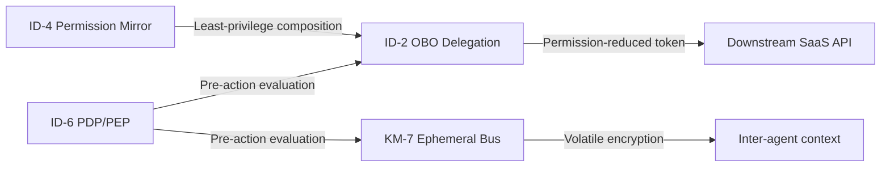
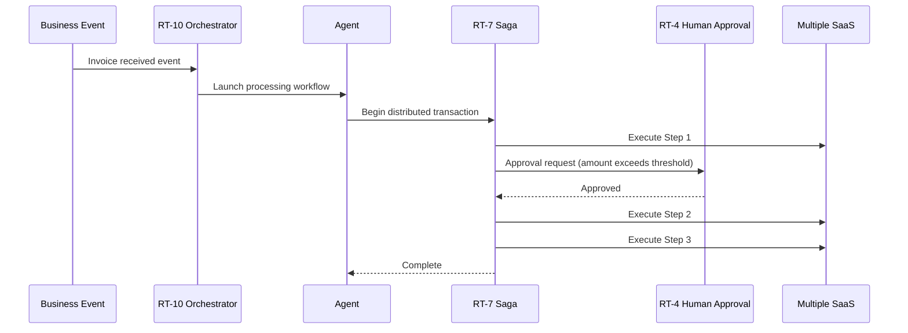
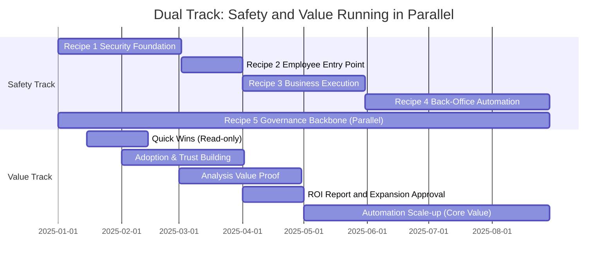
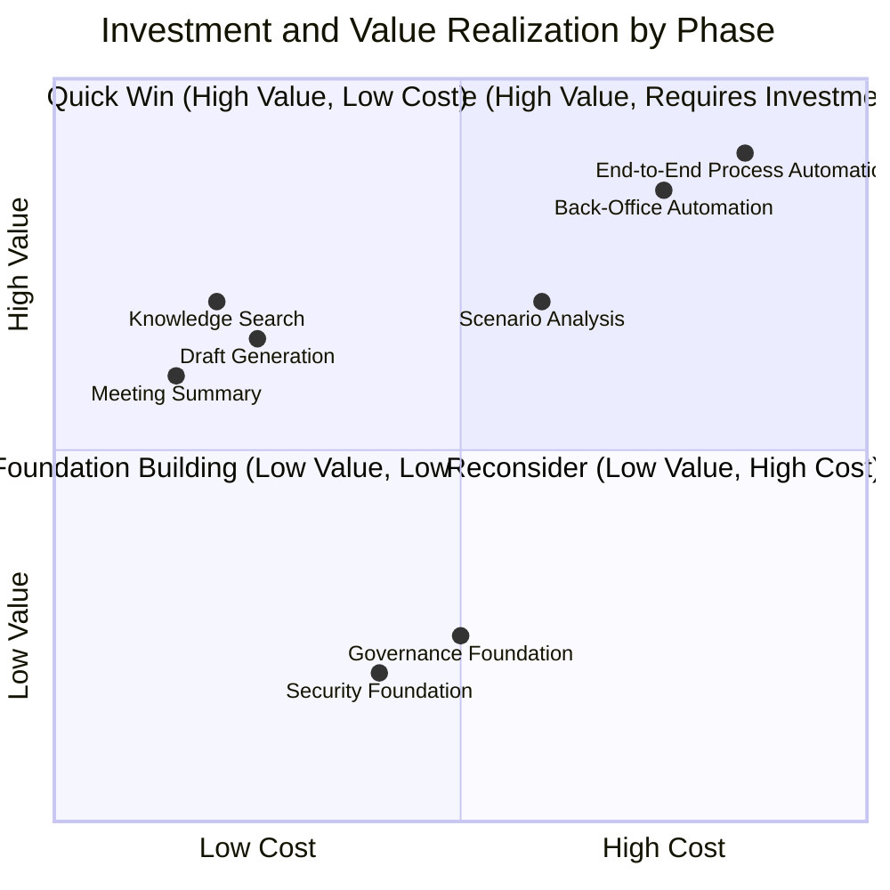

# Combination Recipe

## Overview

The dependency map shows "what depends on what," but in actual implementation, the question is "in what order, and what should be combined with what." This chapter presents a five-stage combination recipe: security foundation → employee entry point → business execution → back-office automation → governance backbone. The bundle of patterns required at each stage and the reasoning behind them are explained.

Each recipe can be selected independently, but dependencies exist. Recipe 1 (Security Foundation) is a prerequisite for everything — without it first, other recipes cannot run safely. Recipe 5 (Governance Backbone) runs throughout all planes and is established in parallel with other recipes.

## Recipe 1: Security Foundation (Laid First)

**Pattern bundle**: [ID-2 OBO](../decisions/id-identity/id-d2-delegation-method.md) + [ID-4 Permission Mirror](../decisions/id-identity/id-d3-permission-reduction.md) + [KM-7 Ephemeral Secure Bus](../decisions/km-knowledge/km-d5-confidentiality-strength.md) + [ID-6 Zero-Trust PDP/PEP](../decisions/id-identity/id-d5-authorization-method.md)

The security foundation is the base of enterprise agents. Without it, all other recipes become "functional but not secure." Below are the roles of the four patterns and what happens in each's absence.

**[ID-2 OBO (On-Behalf-Of Delegation)](../decisions/id-identity/id-d2-delegation-method.md)** is a pattern for calling downstream SaaS using a delegated token reduced to the requester's own permissions. Without this pattern, the agent operates with service account permissions. It tends to result in a "single all-powerful service account hits all SaaS" configuration, making it impossible to prevent the requester from reaching data they should not access.

**[ID-4 Permission Mirror](../decisions/id-identity/id-d3-permission-reduction.md)** is a pattern for running the agent with the most restrictive permission (least common denominator) when spanning multiple SaaS systems. Without this pattern, a person with only view permissions in SaaS-A can call SaaS-B's write API through the agent. Permission propagation is left to each SaaS's individual settings, creating the risk that the agent becomes "an unintended privilege escalation stepping stone."

**[KM-7 Ephemeral Secure Bus](../decisions/km-knowledge/km-d5-confidentiality-strength.md)** is a pattern for flowing context information passed between agents through a volatile, encrypted channel. Without this pattern, context information (request content, intermediate results, personal information) persists in logs and persistent storage. Compliance retention period violations and unnecessary information leakage to subsequent agents easily occur.

**[ID-6 Zero-Trust PDP/PEP](../decisions/id-identity/id-d5-authorization-method.md)** is a pattern for placing an execution point that inserts policy evaluation before every action. Without this pattern, "any authenticated agent can execute anything" becomes the state. An agent that has been compromised or received a prompt injection cannot be stopped from executing arbitrary operations.

!!! tip "Value and Adoption Measures at This Stage"
    Begin baseline measurement for [GV-10](../decisions/gv-governance/gv-d7-value-measurement.md) (processing time and manual task count before introduction). Adoption measures are not yet needed, but running the log infrastructure (OB-1) simultaneously enables subsequent measurement.

## Recipe 2: Employee Entry Point

**Pattern bundle**: [RT-1 Org Hub & Spoke](../decisions/rt-runtime/rt-d1-single-vs-multi-agent.md) + [EX-1 Enterprise Agent Gateway](../decisions/ex-experience/ex-d1-front-door-channel.md)

This is the recipe for governing the "entry point" where employees begin using agents. Without a controlled entry point, proprietary tools proliferate by department and "shadow AI" spreads within the organization without security policy applied.

**[RT-1 Org Hierarchical Hub & Spoke](../decisions/rt-runtime/rt-d1-single-vs-multi-agent.md)** is a pattern for deploying agents in a central Hub (company-wide agent) and departmental Spoke (specialized agent) structure that reflects the organizational hierarchy. The Hub, functioning as a company-wide portal, routes to the appropriate departmental agent based on the type of request. Employees can enter through the entry point without being aware of "which agent to request."

Without this pattern, the HR department sets up its own HR agent, the sales department sets up its own sales agent, each with separate authentication, logs, and policies. Cross-departmental work (HR × Sales) remains disconnected, and auditing is fragmented.

**[EX-1 Enterprise Agent Gateway](../decisions/ex-experience/ex-d1-front-door-channel.md)** is a pattern for consolidating agent access through a single controlled gateway. Authentication, rate limiting, policy application, and log collection are all processed centrally at the gateway, eliminating the need to implement these mechanisms redundantly in each individual agent.

Without this pattern, each agent implements its own authentication, log formats are not unified, and some agents continue to run without policy applied. Cost management and understanding usage patterns may also become difficult.

!!! tip "Value and Adoption Measures at This Stage"
    Begin measuring [GV-10](../decisions/gv-governance/gv-d7-value-measurement.md) Layer 0 (adoption rate, retention rate). Implement Phase 1 of [Adoption & Change Management](../decisions/decision-guide.md) at this stage (guided first-time experience, limited use case rollout) to increase utilization.

## Recipe 3: Actual Business Execution

**Pattern bundle**: [RT-11 Project Digital Twin](../decisions/rt-runtime/rt-d6-project-digital-twin.md) + [KM-1 Access-Controlled RAG](../decisions/km-knowledge/km-d1-context-supply.md) + [KM-2 Context Mesh](../decisions/km-knowledge/km-d1-context-supply.md)

Once the foundation and entry point are established via Recipes 1 and 2, add patterns to support actual business execution. The center of this recipe is building an "agent environment as a place where teams advance daily work."

**[RT-11 Project Digital Twin](../decisions/rt-runtime/rt-d6-project-digital-twin.md)** is a pattern for deploying an agent as a "project twin" that manages project state, context, members, and permissions as a unified whole. Team members can get responses that reflect project-specific context (past decisions, current progress, team agreements) by requesting from "this project's agent."

Without this pattern, team members repeatedly incur the cost of "explaining the background from scratch." Cross-project information is not shared, and agents remain one-off query windows.

**[KM-1 Access-Controlled RAG](../decisions/km-knowledge/km-d1-context-supply.md)** is a pattern for filtering the search scope based on the requester's permissions during document search. Searching "within documents that Person A can view" prevents documents without authorization from being mixed into search results. This requires ID-2/ID-4 from Recipe 1 to be in place.

Without this pattern, the agent searches all documents, and the content of confidential documents seeps into responses for general employees. The RAG "answers anything" experience can only be safely used in enterprises when paired with permission management.

**[KM-2 Context Mesh](../decisions/km-knowledge/km-d1-context-supply.md)** is a pattern for assembling cross-cutting context spanning multiple SaaS and internal systems while preserving permissions. Building a response combining "Salesforce customer information + Confluence proposal + Jira task status" requires cross-cutting context collection while having access rights to each system.

!!! tip "Value and Adoption Measures at This Stage"
    Confirm Layer 1 ([GV-10](../decisions/gv-governance/gv-d7-value-measurement.md)) improvements (processing time reduction, information retrieval time reduction). Promote habit formation in Phase 2 of [Adoption & Change Management](../decisions/decision-guide.md) (champion program, embedding in business processes).

## Recipe 4: Value Realization (Cost-Reduction + Revenue Automation)

**Pattern bundle**: [RT-10 Event-Driven Orchestrator](../decisions/rt-runtime/rt-d5-trigger-mechanism.md) + [RT-7 Enterprise Saga](../decisions/rt-runtime/rt-d4-long-running-reliability.md) + [RT-4 Human Approval Chain](../decisions/rt-runtime/rt-d2-autonomy-design.md)

This is the recipe where enterprise agent business value appears most directly. Value comes from two sources:

- **Cost-reduction (back-office automation)**: End-to-end automation of procurement, expense reimbursement, contract renewal, HR requests, and accounting processing reduces processing workload and labor costs.
- **Revenue (top-line contribution)**: Next best action proposals and lost deal prediction in sales ([Sales Agent](departments/sales.md)), and improving self-resolution rates and churn prediction in customer support ([CS Agent](departments/customer-support.md)) improve win rates, CSAT, and LTV.

Both go beyond being a mere "assistant that returns answers" — the agent functions as an "execution subject" that actually operates systems.

**[RT-10 Event-Driven Orchestrator](../decisions/rt-runtime/rt-d5-trigger-mechanism.md)** is a pattern for detecting business triggers (invoice receipt, approval completion, deadline arrival) as events and launching appropriate agent workflows. It eliminates the manual "next, input this into that system" work and realizes chains of autonomous processing responding to events.

Without this pattern, "AI proposes → human copies and pastes to another system" inefficiency remains. Agents stay limited to "sophisticated search tools" without reaching business process automation.

**[RT-7 Enterprise Saga](../decisions/rt-runtime/rt-d4-long-running-reliability.md)** is a pattern for maintaining consistency in distributed transactions spanning multiple SaaS systems using compensating operations (reverse operations equivalent to rollbacks) at each step. It has a mechanism to cancel the previous two steps when step 3 fails in a 3-step sequence of "create a deal in Salesforce → register a project code in Workday → reserve budget in the accounting system."

Traditional 2-phase commits cannot be used for distributed transactions across SaaS in enterprises. The Saga pattern adopts eventual consistency through compensating operations and guarantees consistency in long-running transactions. The state persistence of [RT-8 Durable Workflow](../decisions/rt-runtime/rt-d4-long-running-reliability.md) is a prerequisite.

**[RT-4 Human Approval Chain](../decisions/rt-runtime/rt-d2-autonomy-design.md)** is a pattern for inserting tiered human approval for high-risk operations (large payments, personnel changes, contract signing). Full automation is not applied to all operations. Rules such as "amounts above a threshold require supervisor approval" and "personal information changes require HR confirmation" are defined as policies, and the agent escalates to humans according to those rules.

For this recipe to function, the security foundation from Recipe 1 (especially ID-7 Policy-as-Code) and state persistence of [RT-8](../decisions/rt-runtime/rt-d4-long-running-reliability.md) must already be in place.

!!! tip "Value and Adoption Measures at This Stage"
    Track the causal chain from Layer 1 → Layer 2 ([GV-10](../decisions/gv-governance/gv-d7-value-measurement.md)) (processing time reduction → labor cost reduction, win rate improvement → revenue improvement). Avoid value-realization anti-patterns in [Adoption & Change Management](../decisions/decision-guide.md) (automating broken processes, uncaptured free time, etc.). Prioritize high-value-potential use cases in [AI Investment Portfolio](../decisions/decision-guide.md).

## Recipe 5: Governance Backbone (Runs Throughout All Planes)

**Pattern bundle**: [GV-1 Agent Control Plane](../decisions/gv-governance/gv-d1-control-plane-scope.md) + [GV-5 Central Model Gateway](../decisions/gv-governance/gv-d2-model-vendor-routing.md) + [OB-2 Unified Audit Lineage](../decisions/ob-observability/ob-d2-audit-attribution.md) + [ID-7 Policy-as-Code](../decisions/id-identity/id-d5-authorization-method.md)

The governance backbone is not something placed before or after a specific recipe — it is a cross-cutting foundation established in parallel with all other recipes. It centrally manages "who can use which agents," "what is permitted," and "what was executed" across the entire organization.

**[GV-1 Agent Control Plane](../decisions/gv-governance/gv-d1-control-plane-scope.md)** is a pattern providing a control plane for centrally managing agent registration, approval, version management, and deactivation. Agents are authorized to execute only after registering with the control plane. Without the control plane, no overall picture of who is running what agents inside the organization can be grasped. It becomes a breeding ground for shadow AI.

**[GV-5 Central Model Gateway](../decisions/gv-governance/gv-d2-model-vendor-routing.md)** is a pattern for consolidating all LLM requests through a central gateway. Model selection, cost management, rate limiting, and prompt filtering are all handled centrally at the gateway. With each department holding its own API keys and calling models directly, cost visibility, usage policy application, and impact management during model changes all become impossible.

**[OB-2 Unified Audit Lineage](../decisions/ob-observability/ob-d2-audit-attribution.md)** is a pattern for recording three-party accountability (person, agent, system) audit trails in a unified format. Regardless of which plane's patterns executed the operation, the same format audit log is generated. In regulatory compliance, internal audits, and incident investigations, the operation chain can be traced as a single lineage.

**[ID-7 Policy-as-Code Guardrail](../decisions/id-identity/id-d5-authorization-method.md)** is a pattern for managing agent behavior constraints as code. Policies for "what is permitted and what is prohibited" are managed in a Git repository, with changes controlled through review, test, and deployment cycles. Policy changes become auditable, and tests can detect unintended policy relaxation in advance.

!!! note "Establish the Governance Backbone from the Start"
    The governance backbone is not a "governance layer added later." GV-1 and GV-5 should begin setup at the same time as Recipe 1, and ideally registration and recording function from the moment the first agent starts running. Adding them later results in large inventory and registration costs for existing agents.

!!! tip "Value and Adoption Measures at This Stage"
    Report Layer 2 ([GV-10](../decisions/gv-governance/gv-d7-value-measurement.md)) improvements (business KPIs: revenue impact, cost reduction, decision speed) to management. Advance company-wide expansion in Phase 3 of [Adoption & Change Management](../decisions/decision-guide.md) (use case expansion, results sharing, horizontal rollout). Decide on expansion, improvement, and withdrawal in the [AI Investment Portfolio](../decisions/decision-guide.md) quarterly review and determine reinvestment targets.

---

## Quick-Win Track for Early Value Realization

Recipes 1–5 above are based on the "safety dependency order." However, directly applying this order as a timeline results in "only security infrastructure for the first few months with no visible value," which risks management concluding "all costs, no effect."

The quick-win track for early value realization places activities to prove value early, **running in parallel with** the safety dependency order.

### Dual-Track Design Philosophy

Rather than "lay all the foundation, then create value," adopt an iterative approach of "**deliver small value quickly with a thin foundation, and use value proof as fuel to thicken the foundation**."

### Quick-Win Phase (First 2–4 Weeks)

**Goal**: Deliver small value quickly so employees feel "this is useful," and gain adoption and executive support.

| Condition | Reason |
|---|---|
| Read-only (no writes) | Risk of permission incidents is near zero; minimum security foundation suffices |
| Low-risk, high-frequency | The more often there are everyday opportunities to use, the faster adoption happens |
| Leverage existing knowledge | Can start immediately without new data preparation |

**Representative quick-win use cases**:

- Internal knowledge search (instant answers on regulations, FAQs, past cases)
- Meeting minutes and deal memo summarization
- Draft generation for standard reports
- Email and chat message drafting

These represent the first stage of TO-4 (Read-only → Write-capable) and correspond to RT-3 (Risk-Tiered Autonomy) Tier 0 (read-only).

### First ROI in 90 Days

Place value milestones aligned with the management budget approval cycle.

| Timing | Milestone | Measurement Metric |
|---|---|---|
| Week 2 | Quick-win deployment begins | Utilization rate for target team |
| Week 4 | Confirm initial adoption indicators | Retention rate > 50% |
| Week 8 | Confirm team-level KPI improvements | Processing time reduction rate (GV-10 Layer 1) |
| Week 12 (90 days) | **First ROI report for management** | Cost reduction or time savings in monetary terms (GV-10 Layer 2) |

!!! tip "Conditions for Achieving 90-Day ROI"
    To show the first ROI in 90 days: (1) limit target use cases to 1–2, (2) run the GV-10 measurement infrastructure from day one, and (3) design the comparison in advance with a control group (team not using agents).

### Investment Recovery Timeline

Below shows the balance of investment (costs) and value realization by phase. The design is to achieve a small surplus early with quick wins, and use that track record as the basis for securing budget for foundational investment.

| Phase | Duration | Main Investment | Expected Value | Cumulative ROI |
|---|---|---|---|---|
| Quick Win | 0–4 weeks | Minimal foundation (OBO read-only version + Gateway) | Time savings from information search and summarization | Small surplus |
| Adoption & Trust | 1–3 months | Change management, onboarding setup | Value area expansion through higher utilization | Beginning of investment recovery |
| Foundation Expansion | 2–6 months | Full setup of security, governance, and observability | Enabling safe write operations | Temporarily investment-leading |
| Automation Scale-up | 4–12 months | Saga, event-driven, approval chain construction | Back-office labor cost reduction, lead time shortening | Full ROI realization |

!!! tip "Investment Recovery Design Principle"
    Showing a "small surplus" early with quick wins is essential for securing budget for foundational investment. "Start by showing value while growing the foundation" — rather than "get everything in place before starting" — is the key to AI investment that does not fail.

### Connection Points with the Safety Track

The value track is not independent from the safety track. They synchronize at the following connection points:

- **Quick-win phase**: Start with Recipe 1's minimum configuration (ID-2 OBO + ID-4 Permission Mirror read-only version). Do not wait for all foundations to be complete.
- **Analysis phase**: When Recipe 3 (KM-1 Access-Controlled RAG + KM-2 Context Mesh) is in place, add analysis-type use cases.
- **Automation scale-up phase**: When Recipe 4 (RT-10 Event-Driven + RT-7 Saga) is in place, advance to automation including write operations.

This design creates a state where "value use cases are also ready when the safety foundation is complete," minimizing the gap between foundation building and value realization.

!!! note "Connection to the Value Loop"
    Value created in quick wins is measured with [GV-10](../decisions/gv-governance/gv-d7-value-measurement.md), utilization is increased with [Adoption & Change Management](../decisions/decision-guide.md), and reinvestment decisions are made with [AI Investment Portfolio](../decisions/decision-guide.md). The condition for agent investment to be sustained is turning this **value loop (Create → Measure → Adopt → Reinvest)** once within 90 days. For details, refer to the [Value Maturity Roadmap](../decisions/decision-guide.md).
