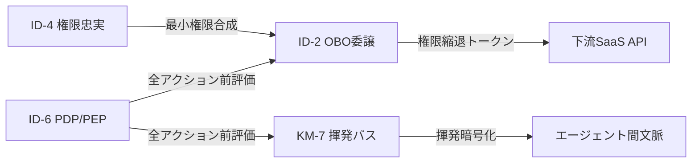
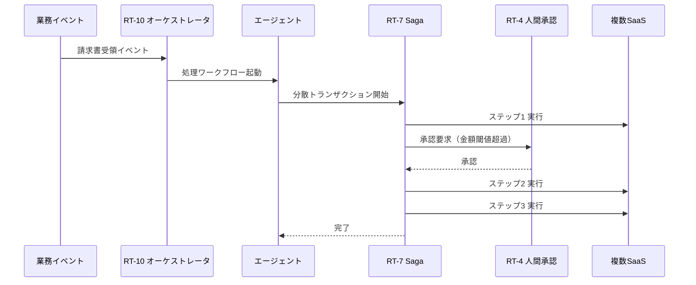
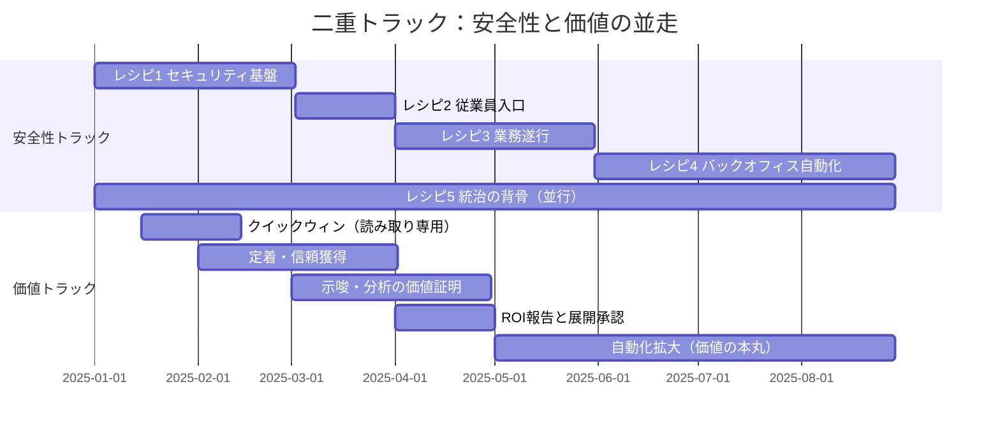
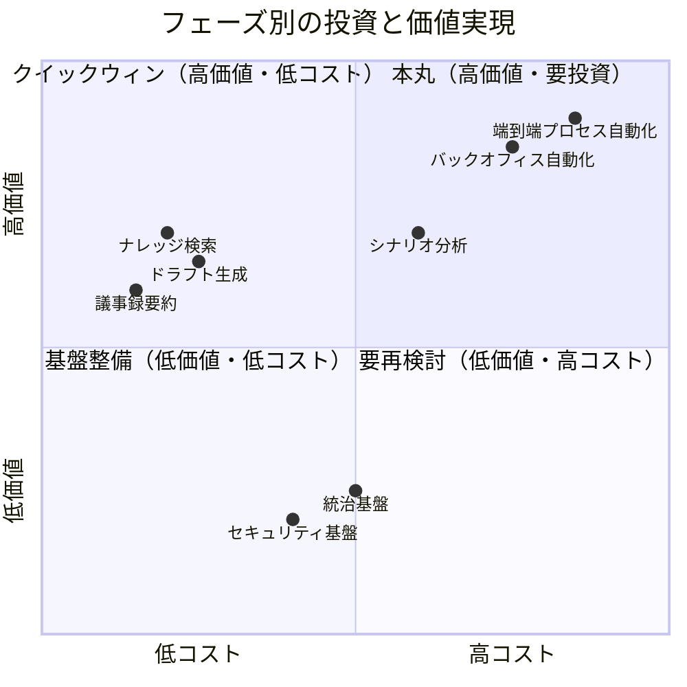

# 組み合わせレシピ

## 概要

依存関係マップは「何が何に依存するか」を示すが、実際の導入では「どの順番で、何と何を組み合わせるか」が問題になる。本章では、セキュリティ基盤→従業員の入口→業務遂行→バックオフィス自動化→統治の背骨という5段階の組み合わせレシピを示す。各段階に必要なパターンの束とその理由もあわせて解説していく。

各レシピは独立して選択できるが、依存関係がある点に注意が必要だ。レシピ1（セキュリティ基盤）はすべての前提であり、最初に敷かなければ他のレシピを安全に動かせない。レシピ5（統治の背骨）は全面を貫くものであり、他のレシピと並行して整備する。

## レシピ1：セキュリティ基盤（最初に敷く）

**パターンの束**: [ID-2 OBO](../patterns/id-identity/id2-identity-federation-obo.md) ＋ [ID-4 権限忠実](../patterns/id-identity/id4-permission-mirror-least-of.md) ＋ [KM-7 揮発セキュアバス](../patterns/km-knowledge/km7-ephemeral-secure-context-bus.md) ＋ [ID-6 ゼロトラスト PDP/PEP](../patterns/id-identity/id6-zero-trust-pdp-pep.md)

セキュリティ基盤はエンタープライズエージェントの土台だ。これがなければ他のすべてのレシピは「動くが安全でない」状態になる。4つのパターンの役割と、それぞれがない場合に何が起きるかを以下に示す。

**[ID-2 OBO（On-Behalf-Of委譲）](../patterns/id-identity/id2-identity-federation-obo.md)** は、依頼者本人の権限に縮退した委譲トークンを使って下流SaaSを呼ぶパターンだ。これがないと、エージェントはサービスアカウントの権限で動くことになる。「万能サービスアカウント1個で全SaaSを叩く」という構成になりやすく、依頼者が本来アクセスできないデータへの到達を防げない。

**[ID-4 Permission Mirror](../patterns/id-identity/id4-permission-mirror-least-of.md)** は、複数SaaSにまたがる場合に最も制限された権限（最小公約数）でエージェントを動かすパターンだ。これがないと、SaaS-A では閲覧権限しかない人物が、エージェント経由で SaaS-B の書き込み API を呼び出せてしまう。権限の伝播が各 SaaS の個別設定に委ねられ、エージェントが「意図せず権限昇格の踏み台」になるリスクが生まれる。

**[KM-7 揮発セキュアバス](../patterns/km-knowledge/km7-ephemeral-secure-context-bus.md)** は、エージェント間で渡される文脈情報を揮発性の暗号化チャネルで流すパターンだ。これがないと、文脈情報（依頼内容・中間結果・個人情報）がログや永続ストアに残り続ける。コンプライアンス上の保持期間違反や、後続エージェントへの不要な情報漏洩が生じやすい。

**[ID-6 Zero-Trust PDP/PEP](../patterns/id-identity/id6-zero-trust-pdp-pep.md)** は、すべてのアクション実行前にポリシー評価を挟む実行点を置くパターンだ。これがないと、「認証済みエージェントは何でも実行できる」状態になる。一度侵害されたエージェントや、プロンプトインジェクションを受けたエージェントが任意の操作を実行しても止められない。

!!! tip "この段階で計測する価値と定着施策"
    [GV-10](../patterns/gv-governance/gv10-two-layer-value-measurement.md) のベースライン計測（導入前の処理時間・手作業回数）を開始する。定着施策はまだ不要だが、ログ基盤（OB-1）を同時に動かすことで後続の計測を可能にする。

## レシピ2：従業員の入口

**パターンの束**: [RT-1 Org Hub & Spoke](../patterns/rt-runtime/rt1-org-hierarchical-hub-spoke.md) ＋ [EX-1 Enterprise Agent Gateway](../patterns/ex-experience/ex1-enterprise-agent-gateway.md)

従業員がエージェントを使い始める「入口」を統制するレシピだ。エントリポイントが統制されていなければ、部門ごとに独自ツールが乱立し、セキュリティポリシーが適用されない「シャドーAI」が組織内に広まる。

**[RT-1 Org Hierarchical Hub & Spoke](../patterns/rt-runtime/rt1-org-hierarchical-hub-spoke.md)** は、組織階層を反映した中央 Hub（全社エージェント）と部門 Spoke（専門エージェント）の構造でエージェントを配置するパターンだ。全社ポータルとして機能する Hub が依頼の種別に応じて適切な部門エージェントにルーティングするため、従業員は「どのエージェントに依頼すればよいか」を意識せずに使い始めることができる。

これがないと、人事部門が独自の人事エージェントを立て、営業部門が独自の営業エージェントを立て、それぞれが別の認証・ログ・ポリシーを持つことになる。横断的な業務（人事×営業）は繋がらず、監査も分断される。

**[EX-1 Enterprise Agent Gateway](../patterns/ex-experience/ex1-enterprise-agent-gateway.md)** は、エージェントへのアクセスを一本の統制されたゲートウェイ経由に集約するパターンだ。認証・レート制限・ポリシー適用・ログ収集がゲートウェイで一括処理されるため、個々のエージェントにこれらの仕組みを重複実装しなくて済む。

これがないと、各エージェントが独自の認証を実装し、ログフォーマットが統一されず、一部のエージェントがポリシー未適用のまま動き続ける。コスト管理や利用状況の把握も困難になる。

!!! tip "この段階で計測する価値と定着施策"
    [GV-10](../patterns/gv-governance/gv10-two-layer-value-measurement.md) 第0層（採用率・継続利用率）の計測を開始する。[定着・アダプション](adoption.md)のフェーズ1（ガイド付き初回体験・ユースケース限定展開）をこの段階で実施し、利用率を引き上げる。

## レシピ3：実際の業務遂行

**パターンの束**: [RT-11 Project Digital Twin](../patterns/rt-runtime/rt11-project-digital-twin.md) ＋ [KM-1 権限認識RAG](../patterns/km-knowledge/km1-access-controlled-rag.md) ＋ [KM-2 Context Mesh](../patterns/km-knowledge/km2-context-mesh.md)

レシピ1・2で基盤と入口が整ったら、実際の業務遂行を支えるパターンを追加する。このレシピの中心は「チームが日常的に業務を進める場としてのエージェント環境」の構築だ。

**[RT-11 Project Digital Twin](../patterns/rt-runtime/rt11-project-digital-twin.md)** は、プロジェクトの状態・文脈・メンバー・権限を一体として管理する「プロジェクトの分身」をエージェントとして展開するパターンだ。チームメンバーが「このプロジェクトのエージェント」に依頼すると、プロジェクト固有の文脈（過去の意思決定・現在の進捗・チームの合意）を踏まえた応答を得られる。

これがないと、チームメンバーが毎回「背景を一から説明する」コストが発生する。プロジェクト横断の情報が共有されず、エージェントが使い捨ての問い合わせ窓口にとどまる。

**[KM-1 権限認識RAG](../patterns/km-knowledge/km1-access-controlled-rag.md)** は、文書検索時に依頼者の権限に基づいて検索スコープをフィルタリングするパターンだ。「Aさんが閲覧できる文書の中から」検索することで、権限のない文書が検索結果に混入しない。レシピ1の ID-2/ID-4 が整っていることが前提となる。

これがないと、エージェントが全文書を検索してしまい、機密文書の内容が一般従業員向けの回答に滲み出る。RAG の「なんでも答えてくれる」体験は、権限管理が伴って初めてエンタープライズで安全に活用できる。

**[KM-2 Context Mesh](../patterns/km-knowledge/km2-context-mesh.md)** は、複数の SaaS や社内システムにまたがる横断的な文脈を、権限を保ちながら組み立てるパターンだ。「Salesforce の顧客情報＋Confluence の提案書＋Jira のタスク状況」を組み合わせた回答を作るには、それぞれのシステムへのアクセス権限を保ちながら横断的に文脈を収集する必要がある。

!!! tip "この段階で計測する価値と定着施策"
    [GV-10](../patterns/gv-governance/gv10-two-layer-value-measurement.md) 第1層（処理時間短縮・情報検索時間削減）の改善を確認する。[定着・アダプション](adoption.md)のフェーズ2（チャンピオン制度・業務プロセスへの組み込み）で習慣化を促進する。

## レシピ4：価値実現（コスト削減型＋売上型の自動化）

**パターンの束**: [RT-10 イベント駆動オーケストレータ](../patterns/rt-runtime/rt10-event-driven-orchestrator.md) ＋ [RT-7 Enterprise Saga](../patterns/rt-runtime/rt7-enterprise-saga.md) ＋ [RT-4 Human Approval Chain](../patterns/rt-runtime/rt4-human-approval-chain.md)

エージェントの経営価値が最も直接的に現れるレシピだ。価値の源泉は大きく2種類に分かれる。

- **コスト削減型（バックオフィス自動化）**：調達・経費精算・契約更新・人事申請・会計処理の端到端自動化により、処理工数と人件費を削減する。
- **売上型（トップライン貢献）**：営業のネクストベストアクション提案・失注予兆検知（[Sales Agent](departments/sales.md)）、カスタマーサポートの自己解決率向上・解約予兆検知（[CS Agent](departments/customer-support.md)）により、受注率・CSAT・LTVを改善する。

いずれも単なる「回答を返すアシスタント」を超え、実際にシステムを動かす「実行主体」としてエージェントが機能する。

**[RT-10 イベント駆動オーケストレータ](../patterns/rt-runtime/rt10-event-driven-orchestrator.md)** は、業務トリガー（請求書受領・承認完了・期日到達）をイベントとして検知し、適切なエージェントワークフローを起動するパターンだ。人間が手動で「次はこのシステムに入力する」という作業が不要になり、イベントに反応した自律的な処理の連鎖を実現できる。

これがないと、「AIが提案→人間がコピペして別システムに入力」という非効率が残る。エージェントを「高度な検索ツール」として使うにとどまり、業務プロセスの自動化には至らない。

**[RT-7 Enterprise Saga](../patterns/rt-runtime/rt7-enterprise-saga.md)** は、複数の SaaS にまたがる分散トランザクションを、各ステップの補償操作（ロールバックに相当する逆操作）で整合性を保つパターンだ。「Salesforce に商談を作成→Workday に案件コードを登録→会計システムに予算を確保」という3ステップのうち3ステップ目で失敗した場合に、前の2ステップを取り消す仕組みを持つ。

エンタープライズの SaaS をまたぐ分散トランザクションに従来型の2フェーズコミットは使えない。Saga パターンは補償操作による結果整合性を採用し、長期トランザクションの整合性を保証する。前提として、[RT-8 Durable Workflow](../patterns/rt-runtime/rt8-durable-workflow.md) の状態永続化が必要だ。

**[RT-4 Human Approval Chain](../patterns/rt-runtime/rt4-human-approval-chain.md)** は、リスクの高い操作（大口支払い・人事変更・契約締結）について人間承認を段階的に挟むパターンだ。完全自動化をすべての操作に適用するわけではない。「一定金額以上は上長承認」「個人情報変更はHR確認」というルールをポリシーとして定義し、エージェントはそのルールに従って人間にエスカレーションする。

このレシピを機能させるには、レシピ1のセキュリティ基盤（特に ID-7 Policy-as-Code）と [RT-8](../patterns/rt-runtime/rt8-durable-workflow.md) の状態永続化が先に整っている必要がある。

!!! tip "この段階で計測する価値と定着施策"
    [GV-10](../patterns/gv-governance/gv10-two-layer-value-measurement.md) 第1層→第2層の因果連鎖（処理時間短縮→人件費削減、受注率向上→売上改善）を追跡する。[定着・アダプション](adoption.md)の価値実現アンチパターン（壊れた業務の自動化・空き時間の未回収等）を回避する。[AI投資ポートフォリオ](portfolio.md)で価値ポテンシャルの高いユースケースを優先する。

## レシピ5：統治の背骨（全面に貫く）

**パターンの束**: [GV-1 Agent Control Plane](../patterns/gv-governance/gv1-agent-control-plane.md) ＋ [GV-5 Central Model Gateway](../patterns/gv-governance/gv5-central-model-gateway.md) ＋ [OB-2 Unified Audit Lineage](../patterns/ob-observability/ob2-unified-audit-lineage.md) ＋ [ID-7 Policy-as-Code](../patterns/id-identity/id7-policy-as-code-guardrail.md)

統治の背骨は特定のレシピの前後に置くものではなく、他のすべてのレシピと並行して整備する横断的な基盤だ。「誰がどのエージェントを使えるか」「何が許されるか」「何が実行されたか」を組織全体で一元的に管理する仕組みとなる。

**[GV-1 Agent Control Plane](../patterns/gv-governance/gv1-agent-control-plane.md)** は、エージェントの登録・承認・バージョン管理・無効化を一元管理するコントロールプレーンを提供するパターンだ。エージェントはコントロールプレーンに登録されて初めて実行が許可される。コントロールプレーンがなければ、組織内で誰がどんなエージェントを動かしているかの全体像が掴めず、シャドーAIの温床になる。

**[GV-5 Central Model Gateway](../patterns/gv-governance/gv5-central-model-gateway.md)** は、すべての LLM リクエストを中央ゲートウェイ経由に集約するパターンだ。モデルの選択・コスト管理・レート制限・プロンプトフィルタリングがゲートウェイで一括処理される。部門ごとに API キーを持って直接モデルを呼ぶ構成では、コストの可視化も、利用ポリシーの適用も、モデル変更時の影響管理もできなくなる。

**[OB-2 Unified Audit Lineage](../patterns/ob-observability/ob2-unified-audit-lineage.md)** は、三者帰責（人・エージェント・システム）の監査証跡を統一フォーマットで記録するパターンだ。どの面のどのパターンが実行した操作であっても、同じフォーマットの監査ログが生成される。規制対応・内部監査・インシデント調査で、操作の連鎖を一本のリネージとして追跡できる。

**[ID-7 Policy-as-Code Guardrail](../patterns/id-identity/id7-policy-as-code-guardrail.md)** は、エージェントの行動制約をコードとして管理するパターンだ。「何が許可され、何が禁止されるか」のポリシーが Git リポジトリで管理され、変更はレビュー・テスト・デプロイのサイクルで制御される。ポリシーの変更を監査可能な形で残せ、テストで意図しない緩和を事前に検知できる。

!!! note "統治の背骨は最初から整備する"
    統治の背骨は「後から追加するガバナンス層」ではない。GV-1 と GV-5 はレシピ1と同時期に整備を始め、エージェントが1つでも動き始めた段階から登録・記録が機能していることが理想だ。後から追加しようとすると、既存エージェントの棚卸しと登録作業が大きなコストになる。

!!! tip "この段階で計測する価値と定着施策"
    [GV-10](../patterns/gv-governance/gv10-two-layer-value-measurement.md) 第2層（経営KPI：売上影響・コスト削減・意思決定速度）の改善を経営に報告する。[定着・アダプション](adoption.md)のフェーズ3（ユースケース拡大・成果共有・横展開）で全社への拡大を推進する。[AI投資ポートフォリオ](portfolio.md)の四半期レビューで拡大・改善・撤退を判断し、再投資先を決定する。

---

## 価値の早期実現（クイックウィン）トラック

上記レシピ1〜5は「安全性の依存順序」に基づいている。しかしこの順序をそのまま時系列に適用すると、「最初の数ヶ月はセキュリティ基盤の整備だけで価値が見えない」状態が続き、経営から「コストばかりで効果がない」と判断されるリスクが生じる。

価値の早期実現トラックは、安全性の依存順序と**並走する形で**価値を早期に証明する活動を配置する。

### 二重トラックの設計思想

「基盤を全部敷いてから価値を出す」のではなく、「**薄い基盤で小さな価値を早く出し、価値の実証を燃料に基盤を厚くする**」反復導入を採用する。

### クイックウィン・フェーズ（最初の2〜4週間）

**目標**：従業員が「これは便利だ」と実感する小さな価値を素早く出し、定着と経営支持を獲得する。

| 条件 | 理由 |
|---|---|
| 読み取り専用（Write なし） | 権限事故のリスクがゼロに近く、セキュリティ基盤が最小で済む |
| 低リスク・高頻度 | 日常的に使う場面が多いほど定着が早い |
| 既存ナレッジ活用 | 新たなデータ整備なしに即開始できる |

**代表的なクイックウィン・ユースケース**：

- 社内ナレッジ検索（規程・FAQ・過去事例の即時回答）
- 議事録・商談メモの要約生成
- 定型レポートの下書き生成
- メール・チャットの文面ドラフト

これらは TO-4（Read-only → Write-capable）の最初の段階であり、RT-3（Risk-Tiered Autonomy）の Tier 0（読み取り専用）に相当する。

### 90日で最初のROI

経営の予算承認サイクルと噛み合わせた価値マイルストンを置く。

| 時期 | マイルストン | 計測指標 |
|---|---|---|
| 2週目 | クイックウィン展開開始 | 対象チームの利用率 |
| 4週目 | 定着の初期指標確認 | 継続利用率 > 50% |
| 8週目 | チーム層KPI改善の確認 | 処理時間短縮率（GV-10 Layer 1） |
| 12週目（90日） | **経営向けROIレポート第1版** | コスト削減額 or 時間削減の金銭換算（GV-10 Layer 2） |

!!! tip "90日ROIの実現条件"
    90日で最初のROIを示すには、(1) クイックウィンの対象ユースケースを1〜2個に絞り、(2) GV-10の計測基盤を初日から稼働させ、(3) 対照群（エージェント未使用チーム）との比較設計を事前に行う必要がある。

### 投資回収の時間軸

各フェーズの投資（コスト）と価値実現のバランスを以下に示す。クイックウィンで早期に小さな黒字を出し、その実績を根拠に基盤投資の予算を確保する設計だ。

| フェーズ | 期間 | 主な投資 | 期待される価値 | 累積ROI |
|---|---|---|---|---|
| クイックウィン | 0〜4週 | 最小基盤構築（OBO読み取り版+Gateway） | 情報検索・要約による時間削減 | 小幅の黒字化 |
| 定着・信頼獲得 | 1〜3ヶ月 | チェンジマネジメント・オンボーディ��グ整備 | 利用率向上による価値の面的拡大 | 投資回収開始 |
| 基盤拡充 | 2〜6ヶ月 | セキュリティ・統治・観測基盤の本格整備 | 安全な書き込み操作の実現 | 一時的に投資先行 |
| 自動化拡大 | 4〜12ヶ月 | Saga・イベント駆動・承認チェーンの構築 | バックオフィ���人件費削減・リードタイム短縮 | 本格的なROI実現 |

!!! tip "投資回収の設計原則"
    クイックウィンで「小さな黒字」を早期に示すことが、基盤投資の予算確保に不可欠だ。「全部揃えてから始める」ではなく「価値を見せながら基盤を育てる」——これが、AI投資が頓挫しない設計の要諦だ。

### 安全性トラックとの接続点

価値トラックは安全性トラックと独立ではない。以下の接続点で同期する。

- **クイックウィン・フェーズ**：レシピ1の最小構成（ID-2 OBO + ID-4 権限忠実の読み取り専用版）で開始。全基盤が整うのを待たない
- **示唆・分析フェーズ**：レシピ3（KM-1 権限認識RAG + KM-2 Context Mesh）が整った段階で、分析系ユースケースを追加
- **自動化拡大フェーズ**：レシピ4（RT-10 イベント駆動 + RT-7 Saga）が整った段階で、書き込み操作を含む自動化に進出

この設計により、「安全性基盤が整ったタイミングで価値のユースケースも準備完了している」状態を作り、基盤整備と価値実現のギャップを最小化する。

!!! note "価値ループとの接続"
    クイックウィンで創出した価値は、[GV-10](../patterns/gv-governance/gv10-two-layer-value-measurement.md) で計測し、[定着・アダプション](adoption.md)で利用率を引き上げ、[AI投資ポートフォリオ](portfolio.md)で再投資判断する。この**価値ループ（創出→計測→定着→再投資）**を90日以内に1回転させることが、エージェント投資が持続する条件だ。詳細は[価値成熟度ロードマップ](value-maturity-roadmap.md)を参照。
