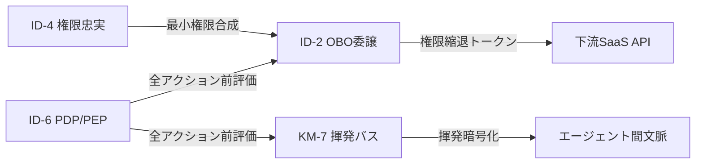
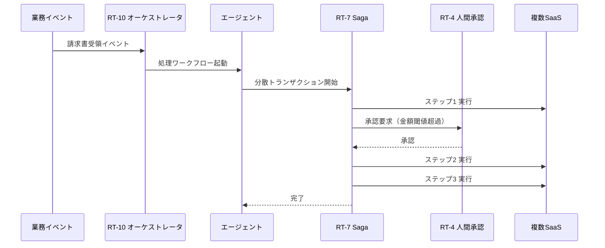

# 組み合わせレシピ

## 概要

依存関係マップは「何が何に依存するか」を示すが、実際の導入では「どの順番で、何と何を組み合わせるか」が問題になる。本章では、セキュリティ基盤→従業員の入口→業務遂行→バックオフィス自動化→統治の背骨という5段階の組み合わせレシピを示す。各段階に必要なパターンの束とその理由を解説する。

各レシピは独立して選択できるが、依存関係がある。レシピ1（セキュリティ基盤）はすべての前提であり、最初に敷かなければ他のレシピが安全に動かない。レシピ5（統治の背骨）は全面に貫くものであり、他のレシピと並行して整備する。

## レシピ1：セキュリティ基盤（最初に敷く）

**パターンの束**: [ID-2 OBO](../patterns/id-identity/id2-identity-federation-obo.md) ＋ [ID-4 権限忠実](../patterns/id-identity/id4-permission-mirror-least-of.md) ＋ [KM-7 揮発セキュアバス](../patterns/km-knowledge/km7-ephemeral-secure-context-bus.md) ＋ [ID-6 ゼロトラスト PDP/PEP](../patterns/id-identity/id6-zero-trust-pdp-pep.md)

セキュリティ基盤はエンタープライズエージェントの土台である。これがなければ他のすべてのレシピは「動くが安全でない」状態になる。4つのパターンの役割と、それぞれがない場合に何が起きるかを以下に示す。

**[ID-2 OBO（On-Behalf-Of委譲）](../patterns/id-identity/id2-identity-federation-obo.md)** は、依頼者本人の権限に縮退した委譲トークンを使って下流SaaSを呼ぶパターンである。このパターンがない場合、エージェントはサービスアカウントの権限で動く。サービスアカウントが過剰な権限を持つ「万能サービスアカウント1個で全SaaSを叩く」という構成になりやすく、依頼者が本来アクセスできないデータへの到達を防げない。

**[ID-4 Permission Mirror](../patterns/id-identity/id4-permission-mirror-least-of.md)** は、複数SaaSにまたがる場合に最も制限された権限（最小公約数）でエージェントを動かすパターンである。このパターンがない場合、SaaS-Aでは閲覧権限しかない人物が、エージェント経由で SaaS-B の書き込みAPIを呼び出せてしまう。権限の伝播が各SaaSの個別設定に委ねられ、エージェントが「意図せず権限昇格の踏み台」になるリスクが生まれる。

**[KM-7 揮発セキュアバス](../patterns/km-knowledge/km7-ephemeral-secure-context-bus.md)** は、エージェント間で渡される文脈情報を揮発性の暗号化チャネルで流すパターンである。このパターンがない場合、文脈情報（依頼内容・中間結果・個人情報）がログや永続ストアに残り続ける。コンプライアンス上の保持期間違反や、後続エージェントへの不要な情報漏洩が起きやすい。

**[ID-6 Zero-Trust PDP/PEP](../patterns/id-identity/id6-zero-trust-pdp-pep.md)** は、すべてのアクション実行前にポリシー評価を挟む実行点を置くパターンである。このパターンがない場合、「認証済みエージェントは何でも実行できる」状態になる。一度侵害されたエージェントや、プロンプトインジェクションを受けたエージェントが任意の操作を実行しても止められない。

## レシピ2：従業員の入口

**パターンの束**: [RT-1 Org Hub & Spoke](../patterns/rt-runtime/rt1-org-hierarchical-hub-spoke.md) ＋ [EX-1 Enterprise Agent Gateway](../patterns/ex-experience/ex1-enterprise-agent-gateway.md)

従業員がエージェントを使い始める「入口」を統制するレシピである。エントリポイントが統制されていなければ、部門ごとに独自ツールが乱立し、セキュリティポリシーが適用されない「シャドーAI」が組織内に広まる。

**[RT-1 Org Hierarchical Hub & Spoke](../patterns/rt-runtime/rt1-org-hierarchical-hub-spoke.md)** は、組織階層を反映した中央Hub（全社エージェント）と部門Spoke（専門エージェント）の構造でエージェントを配置するパターンである。全社ポータルとして機能するHubが、依頼の種別に応じて適切な部門エージェントにルーティングする。従業員は「どのエージェントに依頼すればよいか」を意識せずに入口から入れる。

このパターンがない場合、人事部門が独自の人事エージェントを立て、営業部門が独自の営業エージェントを立て、それぞれが別の認証・ログ・ポリシーを持つことになる。横断的な業務（人事×営業）は繋がらず、監査も分断される。

**[EX-1 Enterprise Agent Gateway](../patterns/ex-experience/ex1-enterprise-agent-gateway.md)** は、エージェントへのアクセスを一本の統制されたゲートウェイ経由に集約するパターンである。認証・レート制限・ポリシー適用・ログ収集がゲートウェイで一括して処理されるため、個々のエージェントにこれらの仕組みを重複実装する必要がなくなる。

このパターンがない場合、各エージェントが独自の認証を実装し、ログフォーマットが統一されず、一部のエージェントがポリシー未適用のまま動き続ける。コスト管理・利用状況の把握も困難になる可能性がある。

## レシピ3：実際の業務遂行

**パターンの束**: [RT-11 Project Digital Twin](../patterns/rt-runtime/rt11-project-digital-twin.md) ＋ [KM-1 権限認識RAG](../patterns/km-knowledge/km1-access-controlled-rag.md) ＋ [KM-2 Context Mesh](../patterns/km-knowledge/km2-context-mesh.md)

レシピ1・2で基盤と入口が整ったら、実際の業務遂行を支えるパターンを追加する。このレシピの中心は「チームが日常的に業務を進める場としてのエージェント環境」の構築である。

**[RT-11 Project Digital Twin](../patterns/rt-runtime/rt11-project-digital-twin.md)** は、プロジェクトの状態・文脈・メンバー・権限を一体として管理する「プロジェクトの分身」をエージェントとして展開するパターンである。チームメンバーは「このプロジェクトのエージェント」に対して依頼することで、プロジェクト固有の文脈（過去の意思決定・現在の進捗・チームの合意）を踏まえた応答を得られる。

このパターンがない場合、チームメンバーが毎回「背景を一から説明する」コストが発生する。プロジェクト横断の情報が共有されず、エージェントが使い捨ての問い合わせ窓口にとどまる。

**[KM-1 権限認識RAG](../patterns/km-knowledge/km1-access-controlled-rag.md)** は、文書検索時に依頼者の権限に基づいて検索スコープをフィルタリングするパターンである。「Aさんが閲覧できる文書の中から」検索することで、権限のない文書が検索結果に混入しない。レシピ1の ID-2/ID-4 が整っていることが前提である。

このパターンがない場合、エージェントが全文書を検索してしまい、機密文書の内容が一般従業員向けの回答に滲み出る。RAGの「なんでも答えてくれる」体験は権限管理が伴ってはじめてエンタープライズで安全に使える。

**[KM-2 Context Mesh](../patterns/km-knowledge/km2-context-mesh.md)** は、複数のSaaSや社内システムにまたがる横断的な文脈を、権限を保ちながら組み立てるパターンである。「Salesforceの顧客情報＋Confluenceの提案書＋Jiraのタスク状況」を組み合わせた回答を作るには、それぞれのシステムへのアクセス権限を持ちながら横断的に文脈を収集する必要がある。

## レシピ4：バックオフィスの抜本自動化（経営価値の本丸）

**パターンの束**: [RT-10 イベント駆動オーケストレータ](../patterns/rt-runtime/rt10-event-driven-orchestrator.md) ＋ [RT-7 Enterprise Saga](../patterns/rt-runtime/rt7-enterprise-saga.md) ＋ [RT-4 Human Approval Chain](../patterns/rt-runtime/rt4-human-approval-chain.md)

バックオフィスの自動化——調達・経費精算・契約更新・人事申請・会計処理——は、企業がエージェントから最も大きな経営価値を得られる領域である。単なる「回答を返すアシスタント」を超え、実際にシステムを動かす「実行主体」としてエージェントが機能する。これが経営価値の本丸と言われる理由である。

**[RT-10 イベント駆動オーケストレータ](../patterns/rt-runtime/rt10-event-driven-orchestrator.md)** は、業務トリガー（請求書受領・承認完了・期日到達）をイベントとして検知し、適切なエージェントワークフローを起動するパターンである。人間が手動で「次はこのシステムに入力する」という作業を省略し、イベントに反応した自律的な処理の連鎖を実現する。

このパターンがない場合、「AIが提案→人間がコピペして別システムに入力」という非効率が残る。エージェントを「高度な検索ツール」として使うにとどまり、業務プロセスの自動化には至らない。

**[RT-7 Enterprise Saga](../patterns/rt-runtime/rt7-enterprise-saga.md)** は、複数のSaaSにまたがる分散トランザクションを、各ステップの補償操作（ロールバックに相当する逆操作）で整合性を保つパターンである。「Salesforceに商談を作成→Workdayに案件コードを登録→会計システムに予算を確保」という3ステップのうち、3ステップ目で失敗した場合に前の2ステップを取り消す仕組みを持つ。

エンタープライズにおいてSaaSをまたぐ分散トランザクションに従来型の2フェーズコミットは使えない。Sagaパターンは補償操作による結果整合性を採用し、長期トランザクションの整合性を保証する。[RT-8 Durable Workflow](../patterns/rt-runtime/rt8-durable-workflow.md) の状態永続化が前提となる。

**[RT-4 Human Approval Chain](../patterns/rt-runtime/rt4-human-approval-chain.md)** は、リスクの高い操作（大口支払い・人事変更・契約締結）について人間承認を段階的に挟むパターンである。完全自動化はすべての操作に適用するわけではない。「一定金額以上は上長承認」「個人情報変更はHR確認」というルールをポリシーとして定義し、エージェントはそのルールに従って人間にエスカレーションする。

このレシピを機能させるには、レシピ1のセキュリティ基盤（特に ID-7 Policy-as-Code）と、[RT-8](../patterns/rt-runtime/rt8-durable-workflow.md) の状態永続化が先に整っている必要がある。

## レシピ5：統治の背骨（全面に貫く）

**パターンの束**: [GV-1 Agent Control Plane](../patterns/gv-governance/gv1-agent-control-plane.md) ＋ [GV-5 Central Model Gateway](../patterns/gv-governance/gv5-central-model-gateway.md) ＋ [OB-2 Unified Audit Lineage](../patterns/ob-observability/ob2-unified-audit-lineage.md) ＋ [ID-7 Policy-as-Code](../patterns/id-identity/id7-policy-as-code-guardrail.md)

統治の背骨は特定のレシピの前後に置くものではなく、他のすべてのレシピと並行して整備する横断的な基盤である。「誰がどのエージェントを使えるか」「何が許されるか」「何が実行されたか」を組織全体で一元的に管理する。

**[GV-1 Agent Control Plane](../patterns/gv-governance/gv1-agent-control-plane.md)** は、エージェントの登録・承認・バージョン管理・無効化を一元管理するコントロールプレーンを提供するパターンである。エージェントはコントロールプレーンに登録されて初めて実行が許可される。コントロールプレーンがなければ、組織内で誰がどんなエージェントを動かしているかの全体像が掴めない。シャドーAIの温床になる。

**[GV-5 Central Model Gateway](../patterns/gv-governance/gv5-central-model-gateway.md)** は、すべてのLLMリクエストを中央ゲートウェイ経由に集約するパターンである。モデルの選択・コスト管理・レート制限・プロンプトフィルタリングがゲートウェイで一括処理される。部門ごとにAPIキーを持って直接モデルを呼ぶ構成では、コストの可視化も、利用ポリシーの適用も、モデル変更時の影響管理もできない。

**[OB-2 Unified Audit Lineage](../patterns/ob-observability/ob2-unified-audit-lineage.md)** は、三者帰責（人・エージェント・システム）の監査証跡を統一フォーマットで記録するパターンである。どの面のどのパターンが実行された操作であっても、同じフォーマットの監査ログが生成される。規制対応・内部監査・インシデント調査において、操作の連鎖を一本のリネージとして追跡できる。

**[ID-7 Policy-as-Code Guardrail](../patterns/id-identity/id7-policy-as-code-guardrail.md)** は、エージェントの行動制約をコードとして管理するパターンである。「何が許可され、何が禁止されるか」のポリシーがGitリポジトリで管理され、変更はレビュー・テスト・デプロイのサイクルで制御される。ポリシーの変更が監査可能になり、テストでポリシーの意図しない緩和を事前に検知できる。

!!! note "統治の背骨は最初から整備する"
    統治の背骨は「後から追加するガバナンス層」ではない。GV-1 と GV-5 はレシピ1と同時期に整備を始め、エージェントが1つでも動き始めた段階から登録・記録が機能していることが理想である。後から追加しようとすると、既存エージェントの棚卸しと登録作業が大きなコストになる。
