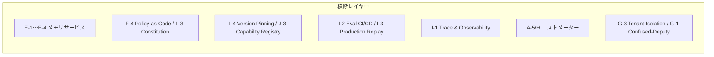

# リファレンスアーキテクチャ

## 概要

本ページでは、約50のパターンがシステム全体のどの位置に配置されるかを標準構成図として示す。パターンは排他的な選択肢ではなく、層として積み上げて使う。すべてのパターンを同時に導入する必要はなく、[成熟度別ロードマップ](roadmap.md)に沿って段階的に積み上げるのが現実的である。

## 標準構成図

```mermaid
flowchart TB
    subgraph UserLayer["ユーザー / UI 層"]
        K1["K-1 Agent Workbench"]
        K2["K-2 Editable Plan"]
    end

    subgraph InputLayer["入力処理層"]
        C1["C-1 NL Boundary Adapter"]
        F2in["F-2 Guardrail Sidecar（入力）"]
        G2in["G-2 Data Boundary Firewall"]
    end

    subgraph SessionLayer["セッション管理層"]
        A1["A-1 Request-to-Job Gateway"]
        A3["A-3 Streaming Progress"]
    end

    subgraph OrchLayer["オーケストレーション層"]
        B1["B-1 Deterministic Backbone"]
        A6["A-6 Agent Saga"]
        A2["A-2 Durable Session"]
        A5["A-5 Time-Budget"]
        A4["A-4 Interruptible"]
    end

    subgraph AgentLayer["エージェント実行層"]
        J1["J-1 Runtime Abstraction"]
        J2["J-2 Model Compatibility"]
        B2["B-2 Planner–Executor–Reviewer"]
        B3["B-3 Supervisor & Specialist"]
        B4["B-4 Ensemble & Debate"]
        B5["B-5 Blackboard"]
        H1["H-1 Cost-Aware Router"]
        H2["H-2 Semantic Cache"]
        H3["H-3 Prompt Cache"]
        H4["H-4 Fallback"]
        H5["H-5 Hedged Execution"]
        F5["F-5 Human Approval"]
        K3["K-3 Escalation"]
    end

    subgraph ToolLayer["ツール実行層"]
        D1["D-1 Tool Gateway"]
        D2["D-2 Least-Privilege"]
        D3["D-3 Dry-Run"]
        D4["D-4 Sandbox"]
        D5["D-5 MCP Adapter"]
        F1["F-1 Evidence-First"]
        F3["F-3 Verifier Agent"]
    end

    subgraph BackendLayer["バックエンド / 外部サービス層"]
        L2["L-2 Anti-Corruption Layer"]
        BizSvc["業務サービス / DB"]
    end

    UserLayer --> InputLayer
    InputLayer --> SessionLayer
    SessionLayer --> OrchLayer
    OrchLayer --> AgentLayer
    AgentLayer --> ToolLayer
    ToolLayer --> BackendLayer
```

## 横断レイヤー

以下のパターンは特定の層に限定されず、システム全体を横断して機能する。

| 横断パターン | 対象 | 役割 |
|---|---|---|
| [E-1 Layered Memory](../patterns/e-memory/e1-layered-memory.md)〜[E-4 Forgetting](../patterns/e-memory/e4-forgetting-expiration.md) | メモリ | セッション・エージェント間の記憶を管理する |
| [F-4 Policy-as-Code](../patterns/f-reliability/f4-policy-as-code.md) / [L-3 Constitution](../patterns/l-adoption/l3-agent-constitution.md) | 統治 | ポリシーと行動規範を全層に適用する |
| [I-4 Version Pinning](../patterns/i-observability/i4-version-pinning.md) / [J-3 Capability Registry](../patterns/j-abstraction/j3-capability-registry.md) | 変更管理 | モデル・プロンプト・ツール・能力を版管理する |
| [I-2 Evaluation CI/CD](../patterns/i-observability/i2-evaluation-cicd.md) / [I-3 Production Replay](../patterns/i-observability/i3-production-replay.md) | 品質 | 評価パイプラインと再現テストを実行する |
| [I-1 Agent Trace & Observability](../patterns/i-observability/i1-trace-observability.md) | 可観測性 | 全行動をトレースとして記録する |
| [A-5 Time-Budget](../patterns/a-execution/a5-time-budgeted-loop.md) / H系 | コスト | 予算制御とコスト最適化を全層に適用する |
| [G-3 Tenant-Isolated Runtime](../patterns/g-security/g3-tenant-isolated-runtime.md) / [G-1 Confused-Deputy](../patterns/g-security/g1-confused-deputy-limitation.md) | セキュリティ | テナント分離と被害限定を全層に適用する |

## 各層の責務

### ユーザー / UI 層

人間との協調点を設計する。[K-1 Agent Workbench](../patterns/k-human/k1-agent-workbench.md) がエージェントの操作・監視UIを提供し、[K-2 Editable Plan](../patterns/k-human/k2-editable-plan.md) が計画の人間編集を可能にする。

### 入力処理層

自然言語入力を安全な契約へ変換する。[C-1 NL Boundary Adapter](../patterns/c-io-contract/c1-nl-boundary-adapter.md) が意図を構造化し、[F-2 Guardrail Sidecar](../patterns/f-reliability/f2-guardrail-sidecar.md) と [G-2 Data Boundary Firewall](../patterns/g-security/g2-data-boundary-firewall.md) が不正入力を遮断する。

### セッション管理層

[A-1 Request-to-Job Gateway](../patterns/a-execution/a1-request-to-job-gateway.md) がリクエストを非同期ジョブに変換し、[A-3 Streaming Progress](../patterns/a-execution/a3-streaming-progress.md) が進捗をクライアントへ逐次提示する。

### オーケストレーション層

[B-1 Deterministic Backbone](../patterns/b-composition/b1-deterministic-backbone.md) が中核ロジックを決定論的に管理する。[A-2 Durable Session](../patterns/a-execution/a2-durable-session.md) が状態を永続化し、[A-5 Time-Budget](../patterns/a-execution/a5-time-budgeted-loop.md) が暴走を防止し、[A-6 Agent Saga](../patterns/a-execution/a6-agent-saga.md) が副作用の補償を担う。[A-4 Interruptible](../patterns/a-execution/a4-interruptible-agent.md) が中断・再開を可能にする。

### エージェント実行層

LLM呼び出しとエージェント構成の実体がここにある。[J-1 Runtime Abstraction](../patterns/j-abstraction/j1-runtime-abstraction.md) と [J-2 Model Compatibility](../patterns/j-abstraction/j2-model-compatibility-layer.md) がベンダーロックインを防ぎ、[B-2](../patterns/b-composition/b2-planner-executor-reviewer.md)・[B-3](../patterns/b-composition/b3-supervisor-specialist.md)・[B-4](../patterns/b-composition/b4-ensemble-debate.md)・[B-5](../patterns/b-composition/b5-blackboard.md) がエージェント構成パターンを提供する。[H-1](../patterns/h-cost-performance/h1-cost-aware-router.md)〜[H-5](../patterns/h-cost-performance/h5-speculative-hedged.md) がコスト・性能を最適化し、[F-5 Human Approval](../patterns/f-reliability/f5-human-approval.md) と [K-3 Escalation](../patterns/k-human/k3-human-escalation.md) が人間への確認・エスカレーションを担う。

### ツール実行層

[D-1 Tool Gateway](../patterns/d-tools-mcp/d1-tool-gateway.md) がツール呼び出しを集約し、[D-2 Least-Privilege](../patterns/d-tools-mcp/d2-least-privilege-binding.md)・[D-3 Dry-Run](../patterns/d-tools-mcp/d3-dry-run-execution.md)・[D-4 Sandbox](../patterns/d-tools-mcp/d4-sandboxed-runtime.md)・[D-5 MCP Adapter](../patterns/d-tools-mcp/d5-mcp-adapter-isolation.md) が権限・安全性を制御する。[F-1 Evidence-First](../patterns/f-reliability/f1-evidence-first.md) が根拠取得を担い、[F-3 Verifier](../patterns/f-reliability/f3-verifier-agent.md) が出力を検証する。

### バックエンド / 外部サービス層

[L-2 Anti-Corruption Layer](../patterns/l-adoption/l2-anti-corruption-layer.md) がレガシーシステムとの境界を隔離し、エージェント側のモデルが業務サービスの都合に汚染されるのを防ぐ。

## 入出力契約の位置づけ

[C-2 Structured Output Contract](../patterns/c-io-contract/c2-structured-output-contract.md)・[C-3 Inverted Structured Output](../patterns/c-io-contract/c3-inverted-structured-output.md)・[C-4 Ambiguity Negotiation](../patterns/c-io-contract/c4-ambiguity-negotiation.md) は特定の層に限定されず、エージェント実行層とオーケストレーション層の境界で出力を契約化する役割を担う。

## 導入の指針

[L-1 Shadow Mode & Progressive Autonomy](../patterns/l-adoption/l1-shadow-progressive-autonomy.md) を用いれば、本構成図の各層を段階的に導入できる。まずシャドーモードで既存システムと並行稼動し、品質が確認できた層から順次自律度を上げる。

!!! tip "関連ページ"
    - [パターン間の依存関係](dependencies.md) — 各パターンの前提と依存先
    - [成熟度別ロードマップ](roadmap.md) — 段階的な導入順序
    - [選定ガイド](selection-guide.md) — 課題からパターンを逆引きする
    - [設計原則と組み合わせ方](principles.md) — パターンの組み合わせ指針と設計原則
