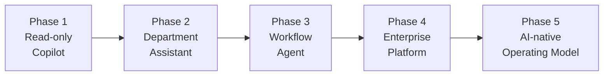

# 成熟度ロードマップ

エンタープライズ AI エージェントの導入は段階的に進める。以下の5フェーズで成熟度を高める。

## Phase 1：Read-only Enterprise Copilot

社内文書検索・要約・FAQ・個人支援。まずシャドー AI を止めて小さく試す。

| パターン | 役割 |
|---|---|
| [KM-1 権限認識 RAG](../patterns/km-knowledge/km1-access-controlled-rag.md) | 権限付き文書検索 |
| [OB-1 Observability Lake](../patterns/ob-observability/ob1-observability-lake.md) | トレース基盤 |
| [GV-5 Model Gateway](../patterns/gv-governance/gv5-central-model-gateway.md) | LLM 呼び出し統制 |
| [GV-1 Control Plane](../patterns/gv-governance/gv1-agent-control-plane.md) | エージェント登録 |

## Phase 2：Department Assistive Agent

部門テンプレートで SaaS 連携エージェントを量産。下書き・チケット案・CRM 更新案を提案し、承認付きで実行する。

| パターン | 役割 |
|---|---|
| [GV-3 Department Agent Factory](../patterns/gv-governance/gv3-department-agent-factory.md) | 部門テンプレート量産 |
| [IN-2 SaaS Adapter](../patterns/in-integration/in2-saas-connector-adapter.md) | SaaS 差吸収 |
| [RT-4 Human Approval](../patterns/rt-runtime/rt4-human-approval-chain.md) | 承認付き実行 |
| [ID-2 OBO](../patterns/id-identity/id2-identity-federation-obo.md) | 本人権限での SaaS アクセス |

## Phase 3：Workflow Agent

長尺の業務プロセスを自動化。承認待ち・障害からの再開、複数システム更新の Saga、イベント駆動の自律処理を導入する。

| パターン | 役割 |
|---|---|
| [RT-8 Durable Workflow](../patterns/rt-runtime/rt8-durable-workflow.md) | 永続ワークフロー |
| [RT-7 Saga](../patterns/rt-runtime/rt7-enterprise-saga.md) | 補償トランザクション |
| [RT-10 Event-Driven](../patterns/rt-runtime/rt10-event-driven-orchestrator.md) | イベント駆動 |
| [RT-9 Work Queue](../patterns/rt-runtime/rt9-work-queue-agent.md) | 業務キュー参加 |

## Phase 4：Enterprise Agent Platform

全社基盤として統治・認可・コスト・評価・事故対応を整備する。

| パターン | 役割 |
|---|---|
| [GV-1 Control Plane](../patterns/gv-governance/gv1-agent-control-plane.md) | 全社統制 |
| [IN-1 Tool/MCP Gateway](../patterns/in-integration/in1-tool-mcp-gateway.md) | ツール統制 |
| [ID-7 Policy-as-Code](../patterns/id-identity/id7-policy-as-code-guardrail.md) | 決定論的認可 |
| [KM-4 Scoped Memory](../patterns/km-knowledge/km4-scoped-memory-hierarchy.md) | メモリ統治 |
| [GV-8 Cost Quota](../patterns/gv-governance/gv8-cost-quota-chargeback.md) | コスト配賦 |
| [GV-7 Eval Pipeline](../patterns/gv-governance/gv7-evaluation-governance-pipeline.md) | 評価 CI/CD |
| [GV-9 Incident Response](../patterns/gv-governance/gv9-incident-response-kill-switch.md) | 事故対応 |
| [ID-4 Permission Mirror](../patterns/id-identity/id4-permission-mirror-least-of.md) | 権限同期 |
| [KM-3 Canonical Object](../patterns/km-knowledge/km3-canonical-object-knowledge-graph.md) | 組織グラフ |

## Phase 5：AI-native Operating Model

人間と AI の業務分担を再設計し、数万人規模の容量・コスト・可用性を最適化する。

| パターン | 役割 |
|---|---|
| [GV-3 Department Factory](../patterns/gv-governance/gv3-department-agent-factory.md) | 全部門展開 |
| [RT-11 Project Twin](../patterns/rt-runtime/rt11-project-digital-twin.md) | チームの AI メンバー |
| [RT-2 RACI Multi-Agent](../patterns/rt-runtime/rt2-raci-multi-agent.md) | 責任分担マルチ |
| [GV-4 Industry Policy Pack](../patterns/gv-governance/gv4-industry-policy-pack.md) | 業界別統制 |
| [ID-1 二面分離](../patterns/id-identity/id1-workforce-customer-split.md) | 顧客面展開 |
| [GV-10 Value Measurement](../patterns/gv-governance/gv10-two-layer-value-measurement.md) | 二層価値計測 |
