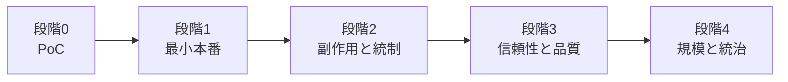

# 成熟度別 導入ロードマップ

## 概要

パターンは一度にすべて導入するものではない。本番で最初に効くパターンから段階的に積み上げることで、各段階でリスクとコストのバランスを取れる。本ページでは、成熟度を5段階に分けてロードマップを示す。

## 段階0：PoC

同期呼び出しと[C-2 Structured Output Contract](../patterns/c-io-contract/c2-structured-output-contract.md)だけで十分である。まず手動評価で品質感を掴む段階であり、非同期化やガードレールは不要である。

| 導入パターン | 目的 |
|---|---|
| [C-2 Structured Output Contract](../patterns/c-io-contract/c2-structured-output-contract.md) | 出力を構造化し後段で扱えるようにする |

## 段階1：最小本番

「落ちない・暴走しない・壊れた出力を垂れ流さない・観測できる」を実現する最小構成である。

| 導入パターン | 目的 |
|---|---|
| [A-1 Request-to-Job Gateway](../patterns/a-execution/a1-request-to-job-gateway.md) | 長時間処理を非同期ジョブ化する |
| [B-1 Deterministic Backbone](../patterns/b-composition/b1-deterministic-backbone.md) | 中核ロジックを決定論的コードに残す |
| [C-2 Structured Output Contract](../patterns/c-io-contract/c2-structured-output-contract.md) | 出力を契約化し下流の安全を確保する |
| [H-4 Graceful Degradation & Fallback](../patterns/h-cost-performance/h4-graceful-degradation.md) | LLM障害時の縮退戦略を確保する |
| [A-5 Time-Budgeted Agent Loop](../patterns/a-execution/a5-time-budgeted-loop.md) | 暴走と予算超過を防止する |
| [I-1 Agent Trace & Observability](../patterns/i-observability/i1-trace-observability.md) | 全行動を記録し可観測性を確保する |

## 段階2：副作用と統制

金銭・物理が絡む副作用を安全に扱う。ツール実行の統制と障害耐性を強化する段階である。

| 導入パターン | 目的 |
|---|---|
| [A-2 Durable Agent Session](../patterns/a-execution/a2-durable-session.md) | 障害・承認待ちからの再開を可能にする |
| [A-6 Agent Saga](../patterns/a-execution/a6-agent-saga.md) | 副作用の連鎖を補償トランザクションで管理する |
| [D-1 Tool Gateway](../patterns/d-tools-mcp/d1-tool-gateway.md) | ツール呼び出しを一点に集約する |
| [D-2 Least-Privilege Tool Binding](../patterns/d-tools-mcp/d2-least-privilege-binding.md) | セッション単位でツール権限を最小化する |
| [D-3 Dry-Run First Execution](../patterns/d-tools-mcp/d3-dry-run-execution.md) | 副作用実行前にドライランで確認する |
| [F-5 Human Approval Checkpoint](../patterns/f-reliability/f5-human-approval.md) | 高リスク操作に人間承認を挟む |

## 段階3：信頼性と品質

確率的な出力を品質保証された出力へ変える。評価パイプラインと継続的な品質改善を組み込む段階である。

| 導入パターン | 目的 |
|---|---|
| [F-1 Evidence-First Answer](../patterns/f-reliability/f1-evidence-first.md) | 根拠に基づく回答で事実性を担保する |
| [F-3 Verifier Agent](../patterns/f-reliability/f3-verifier-agent.md) | 検証エージェントで出力品質を保証する |
| [B-4 Agent Ensemble & Debate](../patterns/b-composition/b4-ensemble-debate.md) | 合議で頑健性と品質を高める |
| [I-2 Evaluation CI/CD](../patterns/i-observability/i2-evaluation-cicd.md) | 評価をCI/CDパイプラインに組み込む |
| [I-4 Version Pinning & Change Management](../patterns/i-observability/i4-version-pinning.md) | モデル・プロンプトの版固定とカナリアリリース |

## 段階4：規模と統治

組織横断・マルチテナント・継続改善に耐える基盤を構築する。

| 導入パターン | 目的 |
|---|---|
| [E-1 Layered Memory](../patterns/e-memory/e1-layered-memory.md) | 階層メモリでコンテキストを管理する |
| [E-2 Context Pack](../patterns/e-memory/e2-context-pack.md) | コンテキスト量を最適化する |
| [E-3 Memory Write Gate](../patterns/e-memory/e3-memory-write-gate.md) | メモリ書き込みを品質管理する |
| [E-4 Forgetting & Expiration](../patterns/e-memory/e4-forgetting-expiration.md) | 不要な記憶を失効させる |
| [G-1 Confused-Deputy Damage Limitation](../patterns/g-security/g1-confused-deputy-limitation.md) | 混乱代理攻撃の被害を限定する |
| [G-2 Data Boundary Firewall](../patterns/g-security/g2-data-boundary-firewall.md) | データ境界を防御する |
| [G-3 Tenant-Isolated Runtime](../patterns/g-security/g3-tenant-isolated-runtime.md) | テナント間を隔離する |
| [H-1 Cost-Aware Model Router](../patterns/h-cost-performance/h1-cost-aware-router.md) | コスト考慮でモデルを振り分ける |
| [H-2 Semantic Result Cache](../patterns/h-cost-performance/h2-semantic-cache.md) | 類似クエリの結果を再利用する |
| [H-3 Prompt-Cache Optimized Context](../patterns/h-cost-performance/h3-prompt-cache-context.md) | プロンプトキャッシュを最適化する |
| [J-1 Agent Runtime Abstraction](../patterns/j-abstraction/j1-runtime-abstraction.md) | 実行基盤を抽象化する |
| [J-2 Model Behavior Compatibility Layer](../patterns/j-abstraction/j2-model-compatibility-layer.md) | モデル差し替え時の互換性を確保する |
| [J-3 Agent Capability Registry](../patterns/j-abstraction/j3-capability-registry.md) | エージェント能力を一元管理する |
| [L-3 Agent Constitution](../patterns/l-adoption/l3-agent-constitution.md) | エージェントの行動規範を明文化する |

## 段階横断で導入するパターン

以下のパターンは特定の段階に限定されず、必要に応じて随時導入する。

| パターン | 導入タイミング |
|---|---|
| [A-3 Streaming Progress](../patterns/a-execution/a3-streaming-progress.md) | UXが重要な場合、段階1以降いつでも |
| [A-4 Interruptible Agent](../patterns/a-execution/a4-interruptible-agent.md) | A-2導入後、探索的タスクに必要な場合 |
| [B-2 Planner–Executor–Reviewer](../patterns/b-composition/b2-planner-executor-reviewer.md) | 複数ステップタスクが必要な段階で |
| [B-3 Supervisor & Specialist](../patterns/b-composition/b3-supervisor-specialist.md) | 多領域・多ツールに拡張する段階で |
| [B-5 Blackboard Coordination](../patterns/b-composition/b5-blackboard.md) | 漸進的な解構築が必要な場合 |
| [C-1 NL Boundary Adapter](../patterns/c-io-contract/c1-nl-boundary-adapter.md) | 自然言語入力を扱う場合に随時 |
| [C-3 Inverted Structured Output](../patterns/c-io-contract/c3-inverted-structured-output.md) | LLMに意思決定を委ねる場合 |
| [C-4 Ambiguity Negotiation](../patterns/c-io-contract/c4-ambiguity-negotiation.md) | 曖昧な入力の解消が必要な場合 |
| [D-4 Sandboxed Tool Runtime](../patterns/d-tools-mcp/d4-sandboxed-runtime.md) | コード実行・ブラウザ操作がある場合 |
| [D-5 MCP Adapter Isolation](../patterns/d-tools-mcp/d5-mcp-adapter-isolation.md) | MCPサーバーを利用する場合 |
| [F-2 Guardrail Sidecar](../patterns/f-reliability/f2-guardrail-sidecar.md) | 入出力の安全性検査が必要な場合 |
| [F-4 Policy-as-Code Guardrail](../patterns/f-reliability/f4-policy-as-code.md) | ポリシーの明文化・自動適用が必要な場合 |
| [H-5 Speculative / Hedged Execution](../patterns/h-cost-performance/h5-speculative-hedged.md) | レイテンシ最適化が必要な場合 |
| [I-3 Production Replay](../patterns/i-observability/i3-production-replay.md) | I-1導入後、再現テストが必要な場合 |
| [K-1 Agent Workbench](../patterns/k-human/k1-agent-workbench.md) | エージェントのUI/UXを構築する場合 |
| [K-2 Editable Plan](../patterns/k-human/k2-editable-plan.md) | B-2導入後、人間による計画編集が必要な場合 |
| [K-3 Agent-to-Human Escalation](../patterns/k-human/k3-human-escalation.md) | エスカレーション経路が必要な場合 |
| [L-1 Shadow Mode & Progressive Autonomy](../patterns/l-adoption/l1-shadow-progressive-autonomy.md) | 既存システムへの後付け導入時 |
| [L-2 Anti-Corruption Layer](../patterns/l-adoption/l2-anti-corruption-layer.md) | レガシーシステムとの統合時 |

!!! tip "関連ページ"
    - [パターン間の依存関係](dependencies.md) — 依存チェーンの詳細
    - [選定ガイド](selection-guide.md) — 課題からパターンを逆引きする
    - [リファレンスアーキテクチャ](reference-architecture.md) — 全パターンの標準構成図
