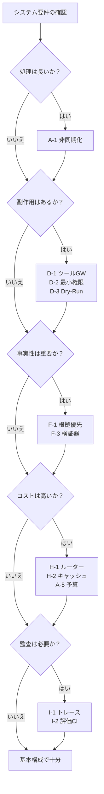

# 選定ガイド（問いから引く）

## 概要

パターンの選定は「どのパターンがあるか」ではなく「自分のシステムは何に困っているか」から始めるのが効果的である。本ページでは、よくある設計上の問いから逆引きで適用候補パターンを示す。

## 問いから引くパターン選定表

### 失敗のコストは高いか？

金銭・契約・物理に直結する操作の失敗が許容できない場合、承認・補償・権限制限・ドライランで被害を限定する。

| パターン | 役割 |
|---|---|
| [F-5 Human Approval Checkpoint](../patterns/f-reliability/f5-human-approval.md) | 高リスク操作に人間承認を挟む |
| [A-6 Agent Saga](../patterns/a-execution/a6-agent-saga.md) | 途中失敗を補償トランザクションで巻き戻す |
| [D-2 Least-Privilege Tool Binding](../patterns/d-tools-mcp/d2-least-privilege-binding.md) | ツール権限を最小化し被害半径を限定する |
| [D-3 Dry-Run First Execution](../patterns/d-tools-mcp/d3-dry-run-execution.md) | 実行前にドライランで影響を確認する |
| [C-3 Inverted Structured Output](../patterns/c-io-contract/c3-inverted-structured-output.md) | 意思決定をオブジェクト化し承認フローに載せる |

### 入力は信頼できるか？（できない）

ユーザー入力やエージェント出力にプロンプトインジェクションや不正データが含まれうる場合、入出力の検査と権限分離で防御する。

| パターン | 役割 |
|---|---|
| [F-2 Guardrail Sidecar](../patterns/f-reliability/f2-guardrail-sidecar.md) | 入出力をガードレールで検査する |
| [G-1 Confused-Deputy Damage Limitation](../patterns/g-security/g1-confused-deputy-limitation.md) | LLMが騙されても被害を限定する |
| [G-2 Data Boundary Firewall](../patterns/g-security/g2-data-boundary-firewall.md) | データ境界を超えた情報漏洩を防ぐ |

### 1リクエストは長いか？

処理時間が数十秒〜数分以上かかる場合、非同期化・永続化・進捗通知で対処する。

| パターン | 役割 |
|---|---|
| [A-1 Request-to-Job Gateway](../patterns/a-execution/a1-request-to-job-gateway.md) | 非同期ジョブとして受け付ける |
| [A-2 Durable Agent Session](../patterns/a-execution/a2-durable-session.md) | 実行状態を永続化し再開可能にする |
| [A-3 Streaming Progress](../patterns/a-execution/a3-streaming-progress.md) | 進捗を逐次提示する |

### 1リクエストは高いか？

LLM呼び出しのコストが高く、予算管理が必要な場合。

| パターン | 役割 |
|---|---|
| [H-1 Cost-Aware Model Router](../patterns/h-cost-performance/h1-cost-aware-router.md) | 難易度に応じてモデルを振り分ける |
| [H-2 Semantic Result Cache](../patterns/h-cost-performance/h2-semantic-cache.md) | 類似クエリの結果を再利用する |
| [H-3 Prompt-Cache Optimized Context](../patterns/h-cost-performance/h3-prompt-cache-context.md) | プロンプトキャッシュでコストを削減する |
| [A-5 Time-Budgeted Agent Loop](../patterns/a-execution/a5-time-budgeted-loop.md) | セッション単位で予算上限を設ける |

### 事実性が命か？

ハルシネーションが許容できず、出力の正確性が最重要な場合。

| パターン | 役割 |
|---|---|
| [F-1 Evidence-First Answer](../patterns/f-reliability/f1-evidence-first.md) | 根拠を先に取得し、それに基づいて回答する |
| [F-3 Verifier Agent](../patterns/f-reliability/f3-verifier-agent.md) | 別のエージェントが出力を検証する |
| [B-4 Agent Ensemble & Debate](../patterns/b-composition/b4-ensemble-debate.md) | 複数の回答を比較・合議して品質を高める |

### レイテンシが命か？

応答速度が最優先で、ミリ秒単位の最適化が必要な場合。

| パターン | 役割 |
|---|---|
| [H-3 Prompt-Cache Optimized Context](../patterns/h-cost-performance/h3-prompt-cache-context.md) | プロンプトキャッシュでLLM応答を高速化する |
| [H-5 Speculative / Hedged Execution](../patterns/h-cost-performance/h5-speculative-hedged.md) | 複数経路を同時実行し最速を採用する |
| [H-1 Cost-Aware Model Router](../patterns/h-cost-performance/h1-cost-aware-router.md) | 軽量モデル経路で高速に処理する |

### モデルを継続的に変えるか？

モデルやプロンプトの更新を安全に行い、リグレッションを防ぎたい場合。

| パターン | 役割 |
|---|---|
| [I-4 Version Pinning & Change Management](../patterns/i-observability/i4-version-pinning.md) | モデル・プロンプトを版固定しカナリアリリースする |
| [I-3 Production Replay](../patterns/i-observability/i3-production-replay.md) | 本番トラフィックで新旧を比較する |
| [J-2 Model Behavior Compatibility Layer](../patterns/j-abstraction/j2-model-compatibility-layer.md) | モデル差し替え時の挙動互換を確保する |

### 説明責任が要るか？

なぜその判断に至ったかを監査・説明する義務がある場合。

| パターン | 役割 |
|---|---|
| [I-1 Agent Trace & Observability](../patterns/i-observability/i1-trace-observability.md) | 全行動をトレースとして記録する |
| [I-3 Production Replay](../patterns/i-observability/i3-production-replay.md) | 過去の判断を再現・検証する |
| [F-4 Policy-as-Code Guardrail](../patterns/f-reliability/f4-policy-as-code.md) | ポリシー適用の記録を残す |

### 既存システムへ後付けか？

レガシーシステムにエージェントを段階的に組み込む場合。

| パターン | 役割 |
|---|---|
| [L-1 Shadow Mode & Progressive Autonomy](../patterns/l-adoption/l1-shadow-progressive-autonomy.md) | シャドー運用で安全に移行する |
| [L-2 Anti-Corruption Layer](../patterns/l-adoption/l2-anti-corruption-layer.md) | レガシーとの境界を隔離する |

## 選定フローチャート

!!! note "組み合わせの指針"
    パターンは排他的でない。複数の問いに「はい」と答えた場合、それぞれの推奨パターンを重ねて適用する。導入順序は[成熟度別ロードマップ](roadmap.md)を参照。

!!! tip "関連ページ"
    - [「程度」の選定基準](../selection/degree-criteria.md) — 各パターンの設定値の決め方
    - [「相反する仕組み」の選定基準](../selection/tradeoffs.md) — 二者択一の判断軸
    - [パターン間の依存関係](dependencies.md) — 導入順序の制約
    - [リファレンスアーキテクチャ](reference-architecture.md) — 全パターンの標準構成図
