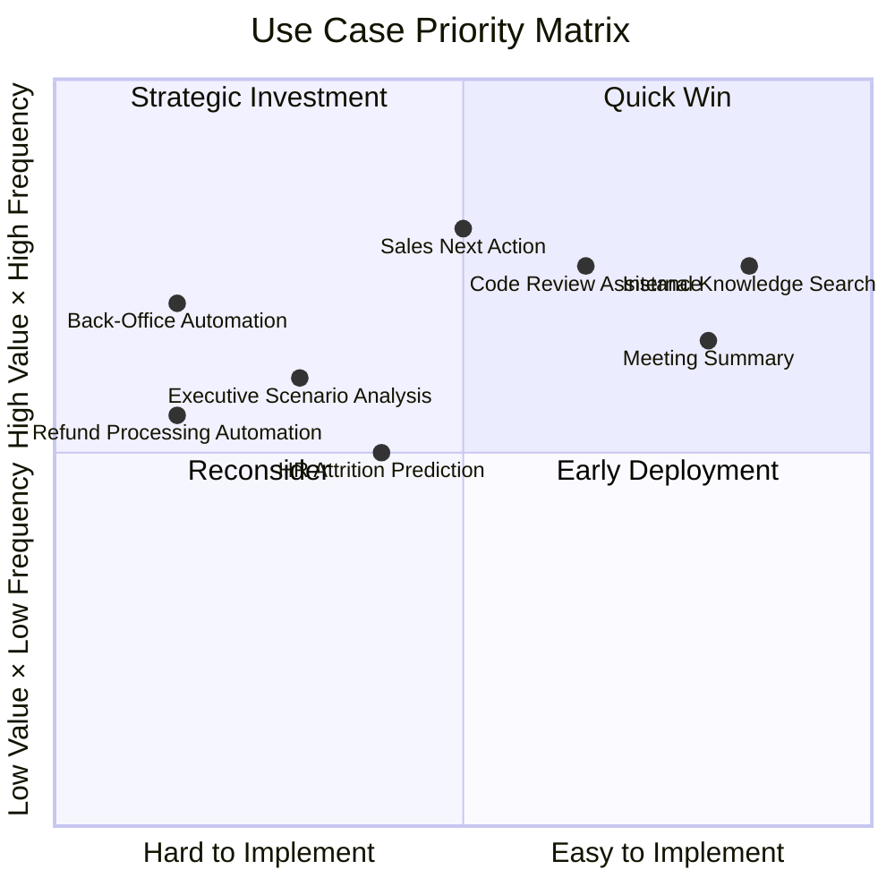
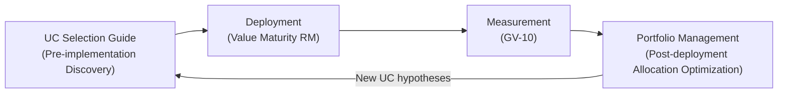

# Value Use Case Selection Guide

## Overview

The first question from readers faced with tens of thousands of employees, dozens of SaaS systems, and 45 patterns is: "**Which business should I tackle first to get value in the shortest time?**" [AI Investment Portfolio Management](portfolio.md) is a mechanism for optimizing investment allocation after deployment, but this guide covers **pre-implementation use case discovery and prioritization**. It translates the "start with low-risk, high-frequency" principle from [Adoption & Change Management](adoption.md) into a quantitative scoring framework to rationally select the first quick wins.

## Five-Axis Scoring

Evaluate each candidate use case on the following five axes and determine priority by total score.

| Axis | Evaluation Perspective | Score Criteria (1-5) |
|---|---|---|
| **Value Impact** | Magnitude of impact on outcome KPIs (revenue, cost, lead time, etc.) | 5: Directly tied to business KPIs / 1: Indirect effect only |
| **Execution Frequency** | How often the target task is executed within the organization | 5: Daily, everyone / 1: Annual, limited group |
| **Implementation Ease** | Burden of required patterns, SaaS integration, and data preparation | 5: Read-only, single SaaS / 1: Writes, multi-SaaS, Saga required |
| **Risk** | Magnitude of damage if something goes wrong (inverse score: low risk = high score) | 5: Read-only, internal only / 1: Customer-facing, high-value writes |
| **Adoptability** | Likelihood that users immediately feel value and continue using | 5: Immediate feedback, natural embedding in existing work / 1: Behavioral change required |

!!! tip "Quick-Win Conditions"
    Use cases with high total scores (especially high scores on implementation ease and risk) are candidates for first deployment in [Value Maturity Roadmap](value-maturity-roadmap.md) Stage 1 (Visualization).

## Scoring Examples

| Use Case | Value | Frequency | Ease | Risk | Adopt | Total | Judgment |
|---|---|---|---|---|---|---|---|
| Internal knowledge search | 3 | 5 | 5 | 5 | 5 | 23 | Quick Win |
| Meeting summary | 3 | 4 | 5 | 5 | 4 | 21 | Quick Win |
| Sales next action proposals | 5 | 4 | 3 | 4 | 4 | 20 | Early Deployment |
| Code review assistance | 3 | 5 | 4 | 4 | 4 | 20 | Early Deployment |
| HR attrition prediction | 4 | 2 | 3 | 3 | 3 | 15 | Mid-term Plan |
| Executive scenario analysis | 5 | 2 | 2 | 3 | 3 | 15 | Mid-term Plan |
| Back-office end-to-end automation | 5 | 3 | 1 | 2 | 3 | 14 | Strategic Investment |
| Refund processing automation | 4 | 3 | 1 | 1 | 3 | 12 | Strategic Investment |

## Selection Process

### Step 1: Enumerate Candidates

Work with stakeholders from each department to identify:

- Repetitive, manual routine tasks currently done by people
- Work where finding, collecting, and compiling information takes time
- Decisions where delays directly impact business outcomes
- Operations where human error leads to costs or reputational damage

### Step 2: Five-Axis Scoring

Evaluate each candidate using the table above. Refer to the [Department Examples](departments/index.md) for department-specific outcome KPIs, and estimate "how much will this KPI move if this business is improved."

### Step 3: Priority Determination

- **Total 20 or above**: Quick win or early deployment candidate. Begin in Stage 1–2
- **Total 15–19**: Mid-term plan. Begin in Stage 2–3 once foundations are established
- **Total 14 or below**: Strategic investment. Deploy in Stage 3–4 on top of sufficient governance foundations

### Step 4: Confirm Required Governance

Confirm the minimum governance (pattern bundle) required for the selected use case using [Dependencies and Dependency Chains](dependency-chain.md) and the [Combination Recipe](recipe.md). Require that quick-win candidates can start with minimum governance (ID-2 read-only version + OB-1 log).

## Connection to Portfolio

Use cases selected and deployed through this guide transition to the management scope of [AI Investment Portfolio Management](portfolio.md). After deployment, measure outcomes with [GV-10 Value Measurement](../patterns/gv-governance/gv10-two-layer-value-measurement.md) and use the results as material for portfolio investment allocation decisions (reinvest, improve, withdraw).

## Related Pages

- [AI Investment Portfolio Management](portfolio.md) — Post-deployment investment allocation optimization
- [Value Maturity Roadmap](value-maturity-roadmap.md) — Staged deployment plan
- [Combination Recipe](recipe.md) — Pattern introduction sequence and quick-win track
- [Adoption & Change Management](adoption.md) — Operational measures for adoption
- [GV-10 Three-Layer Value Measurement](../patterns/gv-governance/gv10-two-layer-value-measurement.md) — Value measurement pattern
- [Department Examples](departments/index.md) — Outcome KPI mapping for each department
