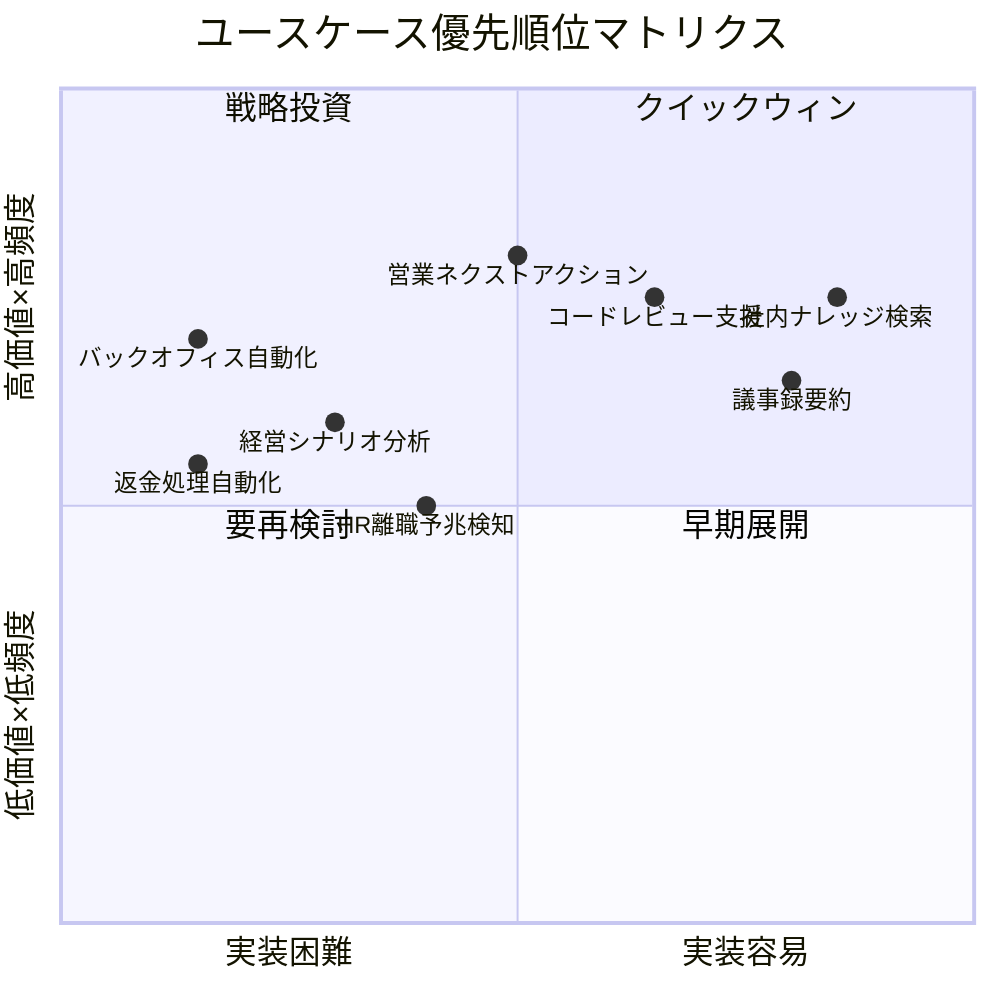
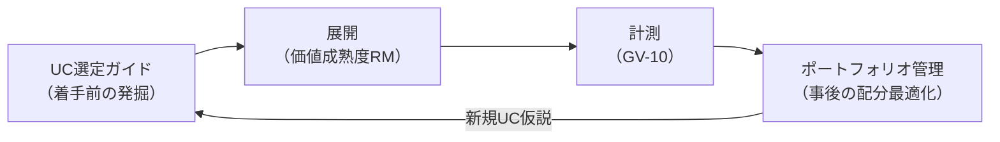

# 価値ユースケース選定ガイド

## 概要

数万人・数十SaaS・45パターンを前にした読者の最初の問いは「**結局どの業務から手をつければ最短で価値が出るか**」でしょう。[AI投資ポートフォリオ管理](portfolio.md)は展開後の投資配分を最適化する仕組みですが、本ガイドが扱うのは**着手前のユースケース発掘と優先順位付け**です。[定着・アダプション](adoption.md)が示す「低リスク・高頻度から」という指針を定量的なスコアリング枠組みに落とし込み、最初のクイックウィンを合理的に選べるようにします。

## 選定の5軸スコアリング

各候補ユースケースを以下の5軸で評価し、総合スコアで優先順位をつけます。

| 軸 | 評価の観点 | スコア基準（1-5） |
|---|---|---|
| **価値インパクト** | 成果KPI（売上・コスト・リードタイム等）への影響の大きさ | 5: 経営KPIに直結 / 1: 間接効果のみ |
| **実行頻度** | 対象業務が組織内で実行される頻度 | 5: 日次・全員 / 1: 年次・一部 |
| **実装容易性** | 必要なパターン数・SaaS連携・データ整備の負荷 | 5: 読み取り専用・単一SaaS / 1: 書き込み・多SaaS・Saga必要 |
| **リスク** | 誤動作時の被害の大きさ（逆スコア：低リスクが高得点） | 5: 読み取り専用・社内限定 / 1: 顧客面・高額書き込み |
| **定着しやすさ** | 利用者がすぐに価値を実感でき、継続利用する見込み | 5: 即時フィードバック・既存業務への自然な組み込み / 1: 行動変容が必要 |

!!! tip "クイックウィンの条件"
    総合スコアが高い（特に実装容易性・リスクの得点が高い）ユースケースは、[価値成熟度ロードマップ](value-maturity-roadmap.md)の Stage 1（可視化）で最初に展開する候補となります。

## スコアリング例

| ユースケース | 価値 | 頻度 | 容易性 | リスク | 定着 | 合計 | 判定 |
|---|---|---|---|---|---|---|---|
| 社内ナレッジ検索 | 3 | 5 | 5 | 5 | 5 | 23 | クイックウィン |
| 議事録要約 | 3 | 4 | 5 | 5 | 4 | 21 | クイックウィン |
| 営業ネクストアクション提案 | 5 | 4 | 3 | 4 | 4 | 20 | 早期展開 |
| コードレビュー支援 | 3 | 5 | 4 | 4 | 4 | 20 | 早期展開 |
| HR離職予兆検知 | 4 | 2 | 3 | 3 | 3 | 15 | 中期計画 |
| 経営シナリオ分析 | 5 | 2 | 2 | 3 | 3 | 15 | 中期計画 |
| バックオフィス端到端自動化 | 5 | 3 | 1 | 2 | 3 | 14 | 戦略投資 |
| 返金処理自動化 | 4 | 3 | 1 | 1 | 3 | 12 | 戦略投資 |

## 選定プロセス

### ステップ1：候補の列挙

各部門のステークホルダーと協力して、以下の観点から候補を洗い出すところから始めます。

- 現在、人手で繰り返している定型作業
- 情報を探す・集める・まとめるのに時間がかかっている業務
- 判断の遅れがビジネス成果に直結する意思決定
- ヒューマンエラーがコストや信頼の毀損につながる操作

### ステップ2：5軸スコアリング

上記の表を用いて各候補を評価します。部門ごとの成果KPIは[部門別適用例](departments/index.md)を参照し、「この業務を改善すると、どの KPI がどれだけ動くか」を事前に見積もっておきます。

### ステップ3：優先順位の決定

- **合計 20以上**：クイックウィンまたは早期展開候補です。Stage 1-2 で着手します
- **合計 15〜19**：中期計画です。Stage 2-3 で基盤が整った段階で着手します
- **合計 14以下**：戦略投資です。Stage 3-4 で十分な統制基盤の上に展開します

### ステップ4：必要統制の確認

選定したユースケースに必要な最小統制（パターンの束）を[依存関係と依存チェーン](dependency-chain.md)と[組み合わせレシピ](recipe.md)で確認します。クイックウィン候補は、最小統制（ID-2 読み取り版 ＋ OB-1 ログ）で開始できることを条件とします。

## portfolioとの接続

本ガイドで選定・展開したユースケースは、[AI投資ポートフォリオ管理](portfolio.md)の管理対象へと移行します。展開後は[GV-10 価値計測](../patterns/gv-governance/gv10-two-layer-value-measurement.md)で成果を計測し、ポートフォリオの投資配分見直し（再投資・改善・撤退）の判断材料として活用できます。

## 関連ページ

- [AI投資ポートフォリオ管理](portfolio.md) — 展開後の投資配分最適化
- [価値成熟度ロードマップ](value-maturity-roadmap.md) — 段階別の展開計画
- [組み合わせレシピ](recipe.md) — パターンの導入順序と価値早期実現トラック
- [定着・アダプション](adoption.md) — 定着の運用施策
- [GV-10 Three-Layer Value Measurement](../patterns/gv-governance/gv10-two-layer-value-measurement.md) — 価値計測パターン
- [部門別適用例](departments/index.md) — 各部門の成果KPIマッピング
