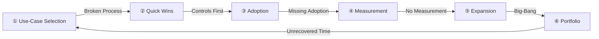

# Value Realization Anti-Patterns

Even with a successful AI agent deployment, falling into these anti-patterns prevents investment from yielding returns. Each anti-pattern is paired with avoidance strategies and links to relevant patterns and value loop nodes.

## Anti-Pattern List

### 1. Automating Broken Processes

**Symptom**: Automating inefficient business processes as-is, creating a state of "failing faster."

**Avoidance**: Review processes before agent introduction. Use the [Use-Case Selection Guide](usecase-selection-guide.md) to select processes worth automating, and improve processes in tandem with deployment.

### 2. Unrecovered Time Savings

**Symptom**: Time freed by agents is not redirected to higher-value activities. Hours are saved, but outcome KPIs don't move.

**Avoidance**: Track the "productivity improvement → business KPI improvement" causal chain using [GV-10 Three-Layer Value Measurement](../patterns/gv-governance/gv10-two-layer-value-measurement.md), and define where freed time should be redirected.

### 3. Deployment Without Measurement

**Symptom**: Continuing to invest in expansion without measuring ROI, eroding executive trust.

**Avoidance**: Start [GV-10](../patterns/gv-governance/gv10-two-layer-value-measurement.md) baseline measurement from the pilot phase and demonstrate reportable ROI within 90 days.

### 4. Missing Adoption Strategy

**Symptom**: Tool deployment without rising utilization rates, failing to secure the ROI denominator.

**Avoidance**: Plan [Adoption & Change Management](adoption.md) initiatives (champion programs, guided first experiences, process integration) from day one.

### 5. Big-Bang Rollout

**Symptom**: Company-wide rollout without piloting, causing uncontrollable blast radius.

**Avoidance**: Follow the [Value Maturity Roadmap](value-maturity-roadmap.md) to expand incrementally from one department and one use case. Start with the minimum safe baseline + quick-win track from [Composition Recipes](recipe.md).

### 6. Controls First, Value Later

**Symptom**: Spending time perfecting security/compliance before delivering value to users, exhausting budget before ROI materializes.

**Avoidance**: Start controls with the minimum safe baseline (ID-1 + ID-6 + GV-1 + OB-2) and prove value quickly with read-only, low-risk quick wins. Expand controls in step with value expansion.

### 7. Siloed Department Deployments

**Symptom**: Each department builds its own agents independently, preventing company-wide learning, reuse, and governance.

**Avoidance**: Establish a company-wide registry with [GV-1 Control Plane](../patterns/gv-governance/gv1-agent-control-plane.md), promote cross-department reuse with [GV-2 Catalog](../patterns/gv-governance/gv2-agent-catalog-marketplace.md), and optimize investment allocation with [AI Investment Portfolio](portfolio.md).

## Relationship to the Value Loop

These anti-patterns emerge when any node of the [Value Loop](../index.md) is missing.

## Related Pages

- [Use-Case Selection Guide](usecase-selection-guide.md)
- [Composition Recipes](recipe.md)
- [Adoption & Change Management](adoption.md)
- [GV-10 Three-Layer Value Measurement](../patterns/gv-governance/gv10-two-layer-value-measurement.md)
- [Value Maturity Roadmap](value-maturity-roadmap.md)
- [AI Investment Portfolio](portfolio.md)
