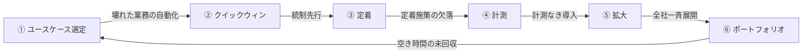

# 価値実現のアンチパターン

AIエージェントを導入しても、以下のアンチパターンに陥ると投資に見合う価値を回収できなくなります。各アンチパターンに対応する回避策と、関連する正規パターン・価値ループノードを以下に示します。

## アンチパターン一覧

### 1. 壊れた業務の自動化

**症状**：非効率な業務プロセスをそのままエージェントで自動化し、「速く間違える」状態になります。

**回避策**：エージェント導入前に業務プロセスを見直します。自動化する価値のあるプロセスを[価値ユースケース選定ガイド](usecase-selection-guide.md)で選定し、プロセス改善とセットで導入します。

### 2. 空き時間の未回収

**症状**：エージェントが生んだ時間短縮を、別の価値活動に転換できていません。業務時間が浮いただけで成果KPIが動かない状態です。

**回避策**：[GV-10 三層価値計測](../decisions/gv-governance/gv-d7-value-measurement.md)で「生産性向上→経営KPI改善」の因果連鎖を追跡し、浮いた時間の転換先を定義します。

### 3. 計測なき導入

**症状**：ROIを測定せずに拡大投資を続けた結果、経営層の信頼を失います。

**回避策**：パイロット段階から[GV-10](../decisions/gv-governance/gv-d7-value-measurement.md)のベースライン計測を開始し、90日以内に経営に報告可能なROIを実証します。

### 4. 定着施策の欠落

**症状**：ツールを導入しても利用率が上がらず、ROIの分母を確保できません。

**回避策**：[定着・アダプション](adoption.md)のチェンジマネジメント施策（チャンピオン制度・ガイド付き初回体験・業務プロセスへの組み込み）を導入初日から計画します。

### 5. 全社一斉展開

**症状**：パイロットを経ずに全社展開した結果、問題の爆発半径が制御不能になります。

**回避策**：[価値成熟度ロードマップ](value-maturity-roadmap.md)に沿い、1部門・1ユースケースから段階的に拡大します。[組み合わせレシピ](recipe.md)の最小安全ベースライン＋クイックウィン経路を起点にします。

### 6. 統制先行・価値後回し

**症状**：セキュリティ・コンプライアンスの要件を完璧に満たすことに時間をかけすぎて、ユーザーに価値が届かないまま予算が枯渇します。

**回避策**：統制は最小安全ベースライン（ID-1 + ID-6 + GV-1 + OB-2）で開始し、読み取り専用・低リスクのクイックウィンで早期に価値を実証します。統制の拡充は価値の拡大とセットで段階的に進めます。

### 7. サイロ化した部門導入

**症状**：部門ごとに独自のエージェントを構築した結果、全社の学習・再利用・ガバナンスが効かなくなります。

**回避策**：[GV-1 Control Plane](../decisions/gv-governance/gv-d1-control-plane-scope.md)で全社レジストリを確立し、[GV-2 Catalog](../decisions/gv-governance/gv-d1-control-plane-scope.md)で部門間の再利用を促進します。[AI投資ポートフォリオ](portfolio.md)で全社最適の投資配分を行います。

## 価値ループとの関係

これらのアンチパターンは、[価値ループ](../index.md)のいずれかのノードが欠落している場合に発生します。

## 関連ページ

- [価値ユースケース選定ガイド](usecase-selection-guide.md)
- [組み合わせレシピ](recipe.md)
- [定着・アダプション](adoption.md)
- [GV-10 三層価値計測](../decisions/gv-governance/gv-d7-value-measurement.md)
- [価値成熟度ロードマップ](value-maturity-roadmap.md)
- [AI投資ポートフォリオ管理](portfolio.md)
