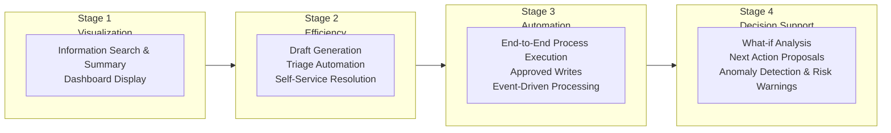
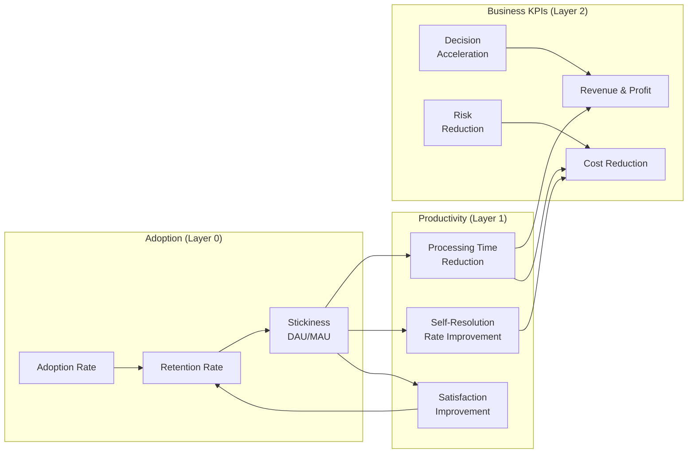

# Value Maturity Roadmap

## Overview

The value of enterprise AI agents does not emerge overnight. This roadmap integrates the Executive's "value staircase," the change management roadmap from [Adoption & Change Management](adoption.md) (0-30 / 30-90 / 90+ days), the staged expansion of [TO-4 Read-only vs Write-capable](../decisions/tradeoff/to4-readonly-vs-write.md), and the risk tiers of [RT-3 Risk-Tiered Autonomy](../patterns/rt-runtime/rt3-risk-tiered-autonomy.md) into **a single company-wide page** — to show management "when, what value, on top of what governance."

## Four-Stage Value Maturity

## Design Elements by Stage

| Stage | Timeline | Representative Use Cases | Expected Outcome KPIs | Patterns Deployed | Minimum Governance | Adoption Measures |
|---|---|---|---|---|---|---|
| **Stage 1: Visualization** | 0–4 weeks | Internal knowledge search, meeting summary, KPI dashboard display | Information search time reduction, self-resolution rate improvement | KM-1, EX-1, OB-1 | ID-2 OBO (read-only version) + OB-1 log | Guided first-time experience, FAQ setup |
| **Stage 2: Efficiency** | 1–3 months | Email drafts, proposal first drafts, ticket triage, deal summaries | Processing time reduction, productivity improvement, staff satisfaction | KM-2, KM-5, RT-5, EX-4 | + ID-4 Permission Mirror + KM-5 Purpose-Limiting | Champion program, embedding in business processes |
| **Stage 3: Automation** | 3–12 months | Back-office end-to-end processing, approved CRM updates, refund processing | Business automation rate, labor cost reduction, lead time reduction | RT-10, RT-7, RT-4, RT-6, RT-8 | + ID-6 PDP/PEP + ID-7 Policy-as-Code + RT-4 Approval | Use case expansion, results sharing, horizontal rollout |
| **Stage 4: Decision Support** | 6 months+ | Scenario analysis, next action proposals, attrition prediction, churn prediction, bottleneck detection | Win rate improvement, attrition rate reduction, decision speed, loss prevention | KM-3, GV-10, GV-7, GV-8 | + GV-10 measurement + GV-7 quality evaluation | ROI reports, investment allocation review |

## Causal Chain: Utilization → Efficiency → Business Outcomes

The causal path through which value accumulates across the four stages is shown below. This diagram integrates the three layers of [GV-10 Value Measurement](../patterns/gv-governance/gv10-two-layer-value-measurement.md) with the metrics system from [Adoption & Change Management](adoption.md).

!!! tip "Value Maturity and Safety Maturity Run in Parallel"
    Deliver value early with Stage 1 minimum governance (ID-2 read-only version + OB-1 log), and progressively thicken governance as stages advance. The design is "show value while growing the foundation," not "deliver value after all foundations are in place." For details, refer to the [quick-win track in the combination recipe](recipe.md).

## Application to Each Department

This roadmap is a company-wide framework; specific use cases and KPIs by department are covered in the following pages:

- [Sales Agent](departments/sales.md) — Win rate, deal cycle, pipeline health
- [HR Agent](departments/hr.md) — Hiring lead time, attrition rate, self-resolution rate
- [Customer Support Agent](departments/customer-support.md) — CSAT, AHT, first-contact resolution, LTV
- [Engineering Agent](departments/engineering.md) — Lead time (DORA), MTTR, review time
- [Executive Agent](departments/executive.md) — Decision speed, judgment accuracy, cost optimization

## Related Pages

- [GV-10 Three-Layer Value Measurement](../patterns/gv-governance/gv10-two-layer-value-measurement.md) — The authoritative pattern for value measurement (Layer 1 and Layer 2 of this roadmap)
- [Adoption & Change Management](adoption.md) — Operational measures for adoption (change management)
- [Combination Recipe](recipe.md) — Pattern introduction sequence and quick-win track
- [AI Investment Portfolio Management](portfolio.md) — Investment allocation optimization by use case
- [Use Case Selection Guide](usecase-selection-guide.md) — How to select initial use cases
- [TO-4 Read-only vs Write-capable](../decisions/tradeoff/to4-readonly-vs-write.md) — Technical decision axis for staged expansion
- [RT-3 Risk-Tiered Autonomy](../patterns/rt-runtime/rt3-risk-tiered-autonomy.md) — Autonomy design based on risk tiers
