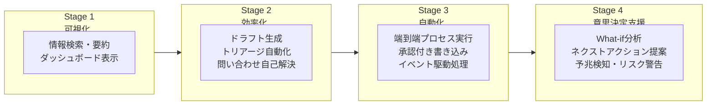
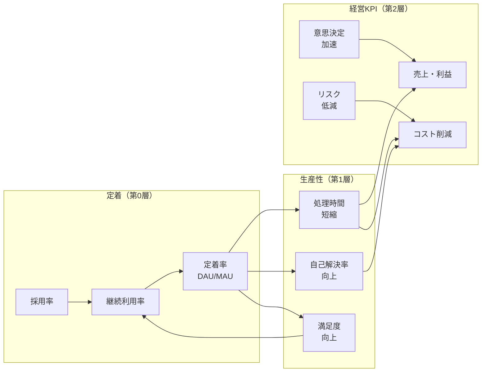

# 価値成熟度ロードマップ

## 概要

エンタープライズAIエージェントの価値は一夜にして出るものではありません。本ロードマップは、Executive の「価値の階段」・[定着・アダプション](adoption.md)のチェンジマネジメント・ロードマップ（0-30 / 30-90 / 90日〜）・[TO-4 Read-only vs Write-capable](../decisions/tradeoff/to4-readonly-vs-write.md) の段階拡張・[RT-3 Risk-Tiered Autonomy](../patterns/rt-runtime/rt3-risk-tiered-autonomy.md) のリスク階層を**全社共通の1枚**に統合したものです。「いつ・何の価値が・どの統制の上に出るか」を経営層に示すことが主目的となります。

## 4段階の価値成熟度

## 段階別の設計要素

| 段階 | 時間軸 | 代表ユースケース | 期待成果KPI | 投入パターン | 必要最小統制 | 定着施策 |
|---|---|---|---|---|---|---|
| **Stage 1：可視化** | 0〜4週 | 社内ナレッジ検索・議事録要約・KPIダッシュボード表示 | 情報検索時間削減・自己解決率向上 | KM-1, EX-1, OB-1 | ID-2 OBO（読み取り版）＋ OB-1 ログ | ガイド付き初回体験・FAQ整備 |
| **Stage 2：効率化** | 1〜3ヶ月 | メールドラフト・提案書初稿・チケットトリアージ・商談サマリー | 処理時間短縮・生産性向上・担当者満足度 | KM-2, KM-5, RT-5, EX-4 | ＋ ID-4 権限忠実 ＋ KM-5 目的限定 | チャンピオン制度・業務プロセス組み込み |
| **Stage 3：自動化** | 3〜12ヶ月 | バックオフィス端到端処理・承認付きCRM更新・返金処理 | 業務自動化率・人件費削減・リードタイム短縮 | RT-10, RT-7, RT-4, RT-6, RT-8 | ＋ ID-6 PDP/PEP ＋ ID-7 Policy-as-Code ＋ RT-4 承認 | ユースケース拡大・成果共有・横展開 |
| **Stage 4：意思決定支援** | 6ヶ月〜 | シナリオ分析・ネクストアクション提案・離職予兆・解約予兆・ボトルネック検知 | 受注率向上・離職率低減・意思決定速度・損失回避 | KM-3, GV-10, GV-7, GV-8 | ＋ GV-10 計測 ＋ GV-7 品質評価 | ROIレポート・投資配分見直し |

## 因果連鎖：利用率→効率→事業成果

4段階を通じて価値が積み上がる因果経路を示します。この図は[GV-10 価値計測](../patterns/gv-governance/gv10-two-layer-value-measurement.md)の3層と[定着・アダプション](adoption.md)の指標体系を統合したものです。

!!! tip "価値成熟度と安全成熟度は並走する"
    Stage 1 の最小統制（ID-2 読み取り版 ＋ OB-1 ログ）で価値を早期に出し、段階が進むにつれて統制を厚くしていきます。「全基盤が揃ってから価値を出す」のではなく「価値を見せながら基盤を育てる」設計です。詳細は[組み合わせレシピの価値早期実現トラック](recipe.md)を参照してください。

## 各部門への適用

本ロードマップは全社共通のフレームワークです。各部門の具体的なユースケース・KPIは以下で参照できます。

- [Sales Agent](departments/sales.md) — 受注率・案件サイクル・パイプライン健全性
- [HR Agent](departments/hr.md) — 採用リードタイム・離職率・自己解決率
- [Customer Support Agent](departments/customer-support.md) — CSAT・AHT・一次解決率・LTV
- [Engineering Agent](departments/engineering.md) — リードタイム(DORA)・MTTR・レビュー時間
- [Executive Agent](departments/executive.md) — 意思決定速度・判断精度・コスト最適化

## 関連ページ

- [GV-10 Three-Layer Value Measurement](../patterns/gv-governance/gv10-two-layer-value-measurement.md) — 価値計測の正本パターン（本ロードマップの第1層・第2層）
- [定着・アダプション](adoption.md) — 定着の運用施策（チェンジマネジメント）
- [組み合わせレシピ](recipe.md) — パターンの導入順序と価値早期実現トラック
- [AI投資ポートフォリオ管理](portfolio.md) — ユースケース別の投資配分最適化
- [ユースケース選定ガイド](usecase-selection-guide.md) — 初期ユースケースの選び方
- [TO-4 Read-only vs Write-capable](../decisions/tradeoff/to4-readonly-vs-write.md) — 段階的拡張の技術的判断軸
- [RT-3 Risk-Tiered Autonomy](../patterns/rt-runtime/rt3-risk-tiered-autonomy.md) — リスク階層に応じた自律度設計
