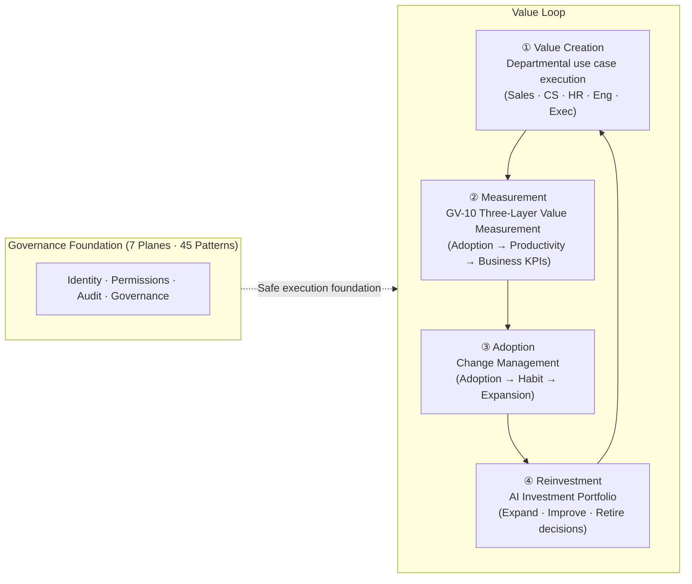

# Introduction: Core Thesis, Taxonomy, Org Graph, and 7 Planes

## Core Thesis

The central challenge of integrating AI agents into an enterprise is not "**making AI smarter**," but rather "**safely introducing a new execution actor into the enterprise's existing identity, permissions, accountability, business processes, auditing, data boundaries, and organizational structures — and extracting enterprise value in the form of improved sales, productivity, and decision-making**." Safe participation is a prerequisite; improving enterprise value is the purpose.

An enterprise AI agent is not just a chat UI. It is a **controllable, auditable, permission-governed "digital business actor"** — one that faithfully reflects the organization's permission structure, binds together the truth of existing systems (System of Record) without disrupting them, and confines all actions to a form that can be audited and governed across the enterprise. Within that safe enclosure, released intelligence functions as an **execution actor that generates enterprise value** in the form of improved win rates, business automation, accelerated decision-making, and cost optimization.

Safe operation is a prerequisite; improving enterprise value is the purpose. The governance design ("who's authority, which data, with what protections, under whose responsibility") encompassed by the 7 planes and 45 patterns of this reference, and the value design ("which outcome KPIs, via which pathways, by when") covered in [Department Use Cases](../integration/departments/index.md), [Adoption & Change Management](../integration/adoption.md), and [AI Investment Portfolio](../integration/portfolio.md) are two wheels of the same vehicle.

### Value Loop: Create → Measure → Adopt → Reinvest

The governance design (7 planes · 45 patterns) provides a safe execution foundation. Value then circulates through four steps on top of that foundation. Keeping this loop turning is the substance of enterprise value creation.



| Step | Actor | Key Pages |
|---|---|---|
| ① Value Creation | Departmental agents drive outcome KPIs | [Department Use Cases](../integration/departments/index.md) · [Combination Recipes](../integration/recipe.md) |
| ② Measurement | Track causation across adoption → productivity → business KPIs (3 layers) | [GV-10 Three-Layer Value Measurement](../patterns/gv-governance/gv10-two-layer-value-measurement.md) |
| ③ Adoption | Raise utilization to secure the ROI denominator | [Adoption & Change Management](../integration/adoption.md) |
| ④ Reinvestment | Decide to expand, improve, or retire based on measurements | [AI Investment Portfolio](../integration/portfolio.md) · [Use Case Selection Guide](../integration/usecase-selection-guide.md) |

## AI Agents as "Enterprise Execution Actors"

A general AI chat is a "response actor," but an enterprise agent is a "business execution actor" — defined and managed as a **first-class object** within enterprise systems.

```text
EnterpriseAgent
- agent_id / owner_department / business_purpose
- allowed_users / allowed_projects / allowed_tools / allowed_data_domains
- risk_tier / approval_policy / memory_scope
- audit_policy / cost_budget / incident_owner
- model_version / prompt_version / policy_version
```

### Agent Taxonomy (Role Types)

| Type | Role | Examples |
|---|---|---|
| Employee Copilot | Personal work assistance for individual employees | Email drafting, document creation, scheduling |
| Department Agent | Execution support for departmental operations | HR / Sales / Finance Agent |
| Project Agent | Task support at the project level | PMO Agent, Issue Triage Agent |
| Process Agent | Automated execution of business processes | Approvals, billing, refunds, onboarding |
| Customer-facing Agent | Dialogue and support with customers | CS Agent, EC Agent |
| Governance Agent | Audit, risk, and quality management | Compliance / Security Review Agent |
| Platform Agent | Internal development and operations support | SRE / Data / Dev Agent |

## Reflecting Enterprise Structure in Architecture (Org Graph)

An enterprise is not a flat collection of users. Permissions, memory, logs, evaluations, and costs must be designed in alignment with the organizational hierarchy.

```text
Company > Business Unit > Department > Section/Group > Team > Project > Subproject > Work Item
                                                                 └ Daily Operations
```

| Scope | Target | Sharing Range |
|---|---|---|
| User | Personal preferences and work style | Self only |
| Team | Team rules, recurring meetings, tasks | Team |
| Project | Decisions, background, deliverables | Project + above |
| Department | Business standards, KPIs, procedures, budgets | Department |
| Company | Company-wide policies, executive information, organizational knowledge | Company-wide |
| Customer | Per-customer contracts, inquiries, usage history | Assigned staff and authorized individuals |

This structure is managed as a single **Org Graph** consolidated from Workday (organization, job titles, reporting lines), Okta/Entra ID (groups), and Linear/Asana/Jira/Notion (projects). Every plane uses this graph as the basis for scope, delegation, sharing, and approval.

## Overall Architecture: 7 Planes and 2 Cross-Cutting Axes

```mermaid
graph TB
    subgraph Users["Users"]
        E[Employees / Managers / Executives]
        C[Customers / Partners]
    end

    subgraph F1["Plane 1: Experience & Gateway (EX)"]
        GW[Enterprise Agent Gateway<br/>Auth / Classification / Risk / Rate / Audit entry]
    end

    subgraph F3["Plane 3: Identity & Trust (ID)"]
        IDP[IdP Integration / OBO Token Exchange / Workload Identity]
        PDP[PDP/PEP / Permission Mirror / JIT Credentials]
    end

    subgraph F2["Plane 2: Control & Governance (GV)"]
        GOV[Registry / Model GW / Policy / Evaluation / Cost / Incident Response]
    end

    subgraph F4["Plane 4: Runtime & Orchestration (RT)"]
        RT[Hub & Spoke / RACI / Risk-Tier / Approval / Saga / Durable WF]
    end

    subgraph F5["Plane 5: Knowledge & Memory (KM)"]
        KM[Access-Controlled RAG / Context Mesh / Canonical Object / Scoped Memory]
    end

    subgraph F6["Plane 6: Integration & Tools (IN)"]
        IN[Tool/MCP Gateway / SaaS Adapter / Rate Broker / iPaaS]
    end

    subgraph SoR["System of Record"]
        S[Salesforce / ServiceNow / Workday / Slack / Box / Jira / Zendesk, etc.]
    end

    subgraph F7["Plane 7: Observability & Audit (OB)"]
        OB[Observability Lake / Unified Audit & Lineage (Three-Party Attribution)]
    end

    Users --> F1
    F1 --> F3
    F3 --> F2
    F2 --> F4
    F4 --> F5
    F5 --> F6
    F6 --> SoR
    SoR --> F7
```

The responsibilities of each plane are as follows.

| Plane | Theme | Focus | Pattern Count |
|---|---|---|---|
| [Plane 1: Experience & Gateway (EX)](../patterns/ex-experience/index.md) | Entry point and delivery surface | Reach users where work happens; enforce control at the entry point | 3 |
| [Plane 2: Control & Governance (GV)](../patterns/gv-governance/index.md) | Governance and control | Central registry, model governance, evaluation, cost, incident response | 10 |
| [Plane 3: Identity & Trust (ID)](../patterns/id-identity/index.md) | Faithful propagation of permissions | Guarantee who's authority the agent operates under (highest design complexity of all planes) | 8 |
| [Plane 4: Runtime & Orchestration (RT)](../patterns/rt-runtime/index.md) | Division of labor, execution, automation | Responsibility allocation, autonomy, side effects, long-running tasks, events | 11 |
| [Plane 5: Knowledge, Memory & Context (KM)](../patterns/km-knowledge/index.md) | Capture and leverage knowledge | Supply cross-cutting context while preserving permissions | 7 |
| [Plane 6: Integration & Tools (IN)](../patterns/in-integration/index.md) | Existing system integration | Bundle rather than build; absorb system-specific differences | 4 |
| [Plane 7: Observability & Audit (OB)](../patterns/ob-observability/index.md) | Accountability | Make all actions reconstructable via three-party attribution | 2 |

!!! tip "How to Read This"
    Planes 1–2 handle "entry and governance"; Plane 3 handles "faithful propagation of permissions (high design complexity)"; Planes 4–6 handle "execution, knowledge, and integration"; Plane 7 handles "accountability." The dependency structure stacking these planes is shown in [Dependency Chains](../integration/dependency-chain.md). **Which enterprise value KPIs each pattern affects** is stated in each pattern's "Value Hypothesis" section; concrete outcome KPI mappings by department are in [Department Use Cases](../integration/departments/index.md); phased deployment design is in [Value Maturity Roadmap](../integration/value-maturity-roadmap.md); and how to choose initial use cases is covered in the [Use Case Selection Guide](../integration/usecase-selection-guide.md).

**Two cross-cutting axes** span all planes:

- **Org Graph**: The foundation from which all planes consistently derive scope, delegation, and approval based on organizational structure.
- **Zero Trust / Audit**: Every call is authorized and recorded with three-party attribution: human + agent + system.

## Alignment with Standards and Frameworks

In enterprises, these are treated not as "guidelines for application design" but as "**constraints for enterprise architecture design**."

| Standard / Framework | Role |
|---|---|
| **NIST AI RMF (Generative AI Profile)** | Framework for identifying generative AI-specific risks and designing management actions |
| **OWASP Top 10 for LLM Applications** | Organizes key risks: Prompt Injection / Sensitive Information Disclosure / Excessive Agency / Unbounded Consumption |
| **NIST SP 800-207 Zero Trust Architecture** | Protection centered on subjects, assets, and resources rather than perimeters |
| **OIDC / SCIM** | Built on existing identity standards (authentication and provisioning); no proliferation of proprietary identity management |
| **OAuth 2.0 Token Exchange (RFC 8693)** | Standard for delegation and proxy execution (OBO) |
| **OPA/Rego · Cedar** | Deterministic authorization via Policy-as-Code |
| **MCP (Model Context Protocol)** | Standard for tool connectivity (governed through a Gateway in enterprise settings) |
| **CloudEvents** | Common description for SaaS and internal events |
| **OpenTelemetry GenAI semantic conventions** | Standard observability for agent, model, and tool calls |

### Standards / Risk Items ↔ Pattern Mapping

The following shows which patterns and selection criteria in this reference address each standard and risk item.

| Standard / Risk Item | Corresponding Patterns / Selection Criteria |
|---|---|
| **OWASP: Prompt Injection** | [ID-7 Policy-as-Code Guardrail](../patterns/id-identity/id7-policy-as-code-guardrail.md), [TO-12 Prompt vs Platform](../selection/tradeoff/to12-prompt-vs-platform.md) |
| **OWASP: Sensitive Information Disclosure** | [KM-1 Access-Controlled RAG](../patterns/km-knowledge/km1-access-controlled-rag.md), [KM-6 DLP & Redaction](../patterns/km-knowledge/km6-dlp-redaction-boundary.md), [ID-1 Two-Surface Separation](../patterns/id-identity/id1-workforce-customer-split.md) |
| **OWASP: Excessive Agency** | [RT-3 Risk-Tiered Autonomy](../patterns/rt-runtime/rt3-risk-tiered-autonomy.md), [RT-6 SoR Write Boundary](../patterns/rt-runtime/rt6-sor-write-boundary.md), [ID-4 Permission Mirror](../patterns/id-identity/id4-permission-mirror-least-of.md) |
| **OWASP: Unbounded Consumption** | [DC-2 Timeout, Retry, Budget](../selection/degree/dc2-timeout-retry-budget.md), [GV-8 Cost Quota & Chargeback](../patterns/gv-governance/gv8-cost-quota-chargeback.md) |
| **NIST AI RMF: Generative AI Risk Management** | [GV-7 Evaluation Pipeline](../patterns/gv-governance/gv7-evaluation-governance-pipeline.md), [GV-4 Industry Policy Pack](../patterns/gv-governance/gv4-industry-policy-pack.md), [DC-1 Autonomy Tier](../selection/degree/dc1-risk-tier-boundary.md) |
| **NIST SP 800-207: Zero Trust** | [ID-6 Zero-Trust PDP/PEP](../patterns/id-identity/id6-zero-trust-pdp-pep.md), [ID-2 OBO Delegation](../patterns/id-identity/id2-identity-federation-obo.md), [ID-5 JIT Credentials](../patterns/id-identity/id5-jit-scoped-credentials.md) |
| **RFC 8693: Token Exchange** | [ID-2 OBO Delegation](../patterns/id-identity/id2-identity-federation-obo.md) |
| **OPA/Rego · Cedar** | [ID-7 Policy-as-Code Guardrail](../patterns/id-identity/id7-policy-as-code-guardrail.md) |
| **MCP** | [IN-1 Tool / MCP Gateway](../patterns/in-integration/in1-tool-mcp-gateway.md) |
| **CloudEvents** | [RT-10 Event-Driven Orchestrator](../patterns/rt-runtime/rt10-event-driven-orchestrator.md) |
| **OpenTelemetry** | [OB-1 Observability Lake](../patterns/ob-observability/ob1-observability-lake.md), [OB-2 Unified Audit](../patterns/ob-observability/ob2-unified-audit-lineage.md) |

## How to Navigate This Reference

1. **This chapter**: Thesis, integration principles, foundational concepts, 7-plane architecture, standards alignment
2. **[Item Design and Plane Classification](schema.md)**: Description schema for each pattern and plane (category) design
3. **[Pattern Catalog](../patterns/index.md)**: The body of 7 planes · 45 patterns (Experience 3 + Governance 10 + Identity 8 + Runtime 11 + Knowledge 7 + Integration 4 + Observability 2)
4. **[Degree Selection Criteria](../selection/degree/index.md)**: How to set continuous parameters (9 items)
5. **[Tradeoff Selection Criteria](../selection/tradeoff/index.md)**: Decision axes for binary choices (12 items)
6. **[Integration & Combination](../integration/dependency-chain.md)**: Dependency chains, cross-cutting axes, combination recipes, department use cases, reference architectures
7. **[Glossary](../glossary.md)**: Definitions of specialized terms
