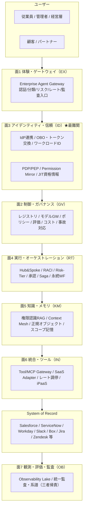

# はじめに：中心命題・分類学・組織グラフ・7面

## 中心命題

エンタープライズにAIエージェントを組み込む中心課題は「**AIを賢くすること**」ではなく、「**企業の既存のID・権限・責任・業務プロセス・監査・データ境界・組織構造の中に、新しい実行主体を安全に参加させること**」である。

エンタープライズAIエージェントとは、単なるチャットUIではない。組織の権限構造を忠実に投影し、既存システムの真実（System of Record）を壊さずに束ね、すべての行為を企業横断で監査・統治できる形に閉じ込めた、**管理可能・監査可能・権限制御された「デジタル業務主体」**である。エージェントの知能は前提条件にすぎず、勝負は「誰の権限で・どのデータを・どう守って・誰の責任で」動かすかにある。

## AIエージェントは「企業内の実行主体」である

一般的なAIチャットは「回答主体」だが、エンタープライズエージェントは「業務実行主体」であり、企業システム上の**一級オブジェクト**として定義・管理する。

```text
EnterpriseAgent
- agent_id / owner_department / business_purpose
- allowed_users / allowed_projects / allowed_tools / allowed_data_domains
- risk_tier / approval_policy / memory_scope
- audit_policy / cost_budget / incident_owner
- model_version / prompt_version / policy_version
```

### エージェント分類学（役割の型）

| 分類 | 役割 | 例 |
|---|---|---|
| Employee Copilot | 従業員個人の業務支援 | メール下書き、資料作成、予定調整 |
| Department Agent | 部門業務の実行支援 | HR / Sales / Finance Agent |
| Project Agent | プロジェクト単位の作業支援 | PMO Agent、Issue Triage Agent |
| Process Agent | 業務プロセスの自動実行 | 稟議、請求、返金、オンボーディング |
| Customer-facing Agent | 顧客との対話・サポート | CS Agent、EC Agent |
| Governance Agent | 監査・リスク・品質管理 | Compliance / Security Review Agent |
| Platform Agent | 社内開発・運用支援 | SRE / Data / Dev Agent |

## 企業構造をアーキテクチャに反映する（組織グラフ）

企業はフラットなユーザー集合ではない。権限・メモリ・ログ・評価・コストは、組織の階層に紐づけて設計する。

```text
Company > Business Unit > Department > Section/Group > Team > Project > Subproject > Work Item
                                                                 └ Daily Operations
```

| スコープ | 対象 | 共有範囲 |
|---|---|---|
| User | 個人の嗜好・作業スタイル | 本人のみ |
| Team | チームルール・定例・タスク | チーム |
| Project | 決定事項・背景・成果物 | プロジェクト＋上位 |
| Department | 業務標準・KPI・手順・予算 | 部門 |
| Company | 全社規程・経営情報・全社ナレッジ | 全社 |
| Customer | 顧客別契約・問い合わせ・利用履歴 | 担当者・許可者 |

この構造を、Workday（組織・職位・レポートライン）、Okta/Entra ID（グループ）、Linear/Asana/Jira/Notion（プロジェクト）から名寄せした単一の**組織グラフ（Org Graph）**として持ち、すべての面がスコープ・委譲・共有・承認の根拠にする。

## 全体アーキテクチャ：7面と2つの横断軸



各面の責務は以下のとおりである。

| 面 | テーマ | 主眼 | パターン数 |
|---|---|---|---|
| [面1 体験・ゲートウェイ (EX)](../patterns/ex-experience/index.md) | 入口と提供面 | 仕事のある場所に届け、入口で統制する | 3 |
| [面2 制御・ガバナンス (GV)](../patterns/gv-governance/index.md) | 統治・統制 | 一元レジストリ・モデル統制・評価・コスト・事故対応 | 10 |
| [面3 アイデンティティ・信頼 (ID)](../patterns/id-identity/index.md) | 権限の忠実な伝播 ★最難関 | 誰の権限で動くかを保証する | 8 |
| [面4 実行・オーケストレーション (RT)](../patterns/rt-runtime/index.md) | 分業・実行・自動化 | 責任分担・自律度・副作用・長尺・イベント | 11 |
| [面5 知識・メモリ・コンテキスト (KM)](../patterns/km-knowledge/index.md) | 漏らさず活かす | 権限を保ったまま横断文脈を供給 | 7 |
| [面6 統合・ツール (IN)](../patterns/in-integration/index.md) | 既存システム連携 | 作らず束ね、固有差を吸収 | 4 |
| [面7 観測・評価・監査 (OB)](../patterns/ob-observability/index.md) | 説明責任 | 三者帰責で全行為を再構成可能に | 2 |

!!! tip "読み方"
    面1〜2が「入口と統治」、面3が「最難関の権限」、面4〜6が「実行と知識と連携」、面7が「説明責任」。これらを積み上げる依存関係は[依存関係と依存チェーン](../integration/dependency-chain.md)で示す。

**横断軸**として以下の2つが全面を貫く。

- **組織グラフ**：全面がスコープ・委譲・承認を組織構造から一貫して導く土台。
- **ゼロトラスト／監査**：全呼び出しを「人＋エージェント＋システム」の三者で認可・記録する。

## 標準・フレームワークとの整合

エンタープライズでは、これらを「アプリ設計の指針」でなく「**企業アーキテクチャ設計の制約**」として扱う。

| 標準・フレームワーク | 位置づけ |
|---|---|
| **NIST AI RMF（Generative AI Profile）** | 生成AI固有リスクの特定と管理アクション設計の枠組み |
| **OWASP Top 10 for LLM Applications** | Prompt Injection / Sensitive Information Disclosure / Excessive Agency / Unbounded Consumption 等を主要リスクとして整理 |
| **NIST SP 800-207 Zero Trust Architecture** | 境界でなく主体・資産・リソース中心の保護 |
| **OIDC / SCIM** | 既存ID標準（認証・プロビジョニング）の上に乗る。独自ID管理を乱立させない |
| **OAuth 2.0 Token Exchange（RFC 8693）** | 委譲・代理実行（OBO）の標準 |
| **OPA/Rego・Cedar** | Policy-as-Code による決定論的認可 |
| **MCP（Model Context Protocol）** | ツール接続の標準（企業ではGateway経由に統制） |
| **CloudEvents** | SaaS/社内イベントの共通記述 |
| **OpenTelemetry GenAI semantic conventions** | エージェント・モデル・ツール呼び出しの標準観測 |

## 本書の歩き方

1. **本章**：命題・統合方針・基礎概念・7面アーキテクチャ・標準整合
2. **[項目設計と面分類](schema.md)**：各パターンの記述スキーマと面（カテゴリ）設計
3. **[パターンカタログ](../patterns/index.md)**：7面・計45パターンの本体
4. **[「程度」の選定基準](../selection/degree/index.md)**：連続量の決め方
5. **[「相反する仕組み」の選定基準](../selection/tradeoff/index.md)**：二者択一の判断軸
6. **[統合と組み合わせ方](../integration/dependency-chain.md)**：依存関係・横断軸・組み合わせレシピ・部門別適用例・リファレンスアーキテクチャ
