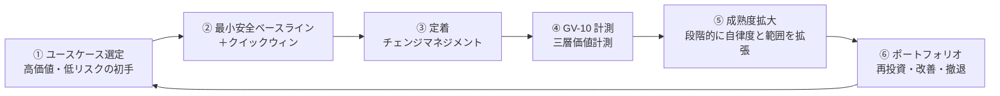
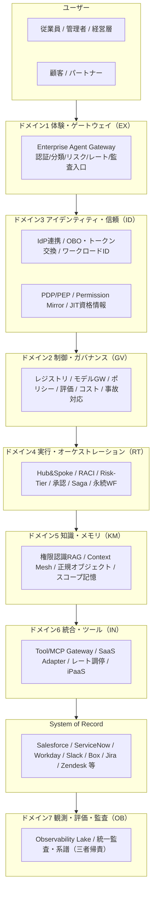

# はじめに：中心命題・組織グラフ・意思決定ドメイン

## 本リファレンスの使い方

### 人間のアーキテクト・エンジニア向け

1. **[設計原則](principles.md)** で基本思想を理解します
2. **[意思決定カタログ](../decisions/index.md)** をドメインごとに閲覧し、関連する意思決定を特定します
3. **[意思決定の手引き](../decisions/decision-guide.md)** でシナリオ別の決定表と決定フローを確認します
4. **[組み合わせレシピ](../integration/recipe.md)** で実証済みの意思決定の組み合わせを参照します
5. **[部門別適用例](../integration/departments/index.md)** で自部門の具体例を確認します

### コーディングエージェント向け

本リファレンスは、コーディングエージェント（Claude Code、Cursor、GitHub Copilot Workspace 等）がAIエージェントを組み込んだソフトウェアの設計・開発を補助する用途を想定しています。

1. **まず読む**: リポジトリルートの `agents.md` — 推論手順・出力テンプレート・価値ドライバ語彙の全体像
2. **機械可読データ**: [`docs/_machine/`](../_machine/index.json) 配下の JSON ファイル群 — 全意思決定・ビルディングブロック・部門事例・価値ループを構造化データとして提供
    - `decisions.json` — 31意思決定のメタデータ（applies_when, decision_keys, value_drivers, requires 等）
    - `building-blocks.json` — ビルディングブロック定義・オプション・推奨条件
    - `departments.json` — 部門別の価値ユースケース・成果KPI
    - `value-loop.json` — 価値ループの6ノードと相互リンク
3. **意思決定の手引き**: [意思決定の手引き](../decisions/decision-guide.md) — シナリオ別の決定表と決定フロー
4. **詳細設計**: 個別意思決定ページの `## Interfaces` セクションに、実装すべきインターフェイスの YAML 定義がある。ここからスタブコードを生成できる
5. **ガイド**: [コーディングエージェント向けガイド](../coding-agent-guide/index.md) — 推論手順の詳細・出力テンプレート・機械可読データの参照方法

!!! tip "コーディングエージェントへのヒント"
    ユーザーが「〇〇のシナリオでAIエージェントを設計して」と依頼したら、まず `decisions.json` を読み込み、`applies_when` でシナリオに合致する意思決定をフィルタし、`requires` で依存を解決してから、該当意思決定の詳細ページを読むのが効率的です。

### コーディングエージェント向け：End-to-End 例

**シナリオ**: ユーザーが「Salesforce と Slack に接続する営業AIエージェントを設計して」と依頼した場合

**Step 1 — 要件から value_drivers と制約を抽出する**

`decisions.json` を読み込み、関連する意思決定を特定します。Sales シナリオでは ID-D2（委譲方式）、RT-D2（自律度設計）、RT-D3（副作用安全）が主要です。

→ 結果: value_drivers = [revenue_growth, employee_efficiency], 制約 = [cross_saas, write_operations]

**Step 2 — 意思決定を選定し依存を解決する**

`decisions.json` から `applies_when` が合致する意思決定をフィルタし、`requires` で依存を再帰的に解決します。

→ 結果: [EX-D1, ID-D2, ID-D3, RT-D2, RT-D3, IN-D1, KM-D1, OB-D1, GV-D1, ID-D5, ...]

**Step 3 — 意思決定の詳細を読む**

各意思決定ページの `## Interfaces` セクションから YAML 定義を取得します。`code_examples` の TypeScript/Python 型定義からスタブコードを生成できます。

**Step 4 — ビルディングブロックを評価する**

`building-blocks.json` の各オプションの `pick_when` を要件と照合します。

- ID-D2: CRM への本人代理操作 → OBO（option A）
- RT-D2: CRM 書き込み＝中リスク → Tier 2-3（提案＋確認）
- RT-D3: 商談更新あり → Write-capable（段階的）

**Step 5 — アーキテクチャを生成する**

`agents.md` の出力テンプレートに従い、意思決定の設計内容を組み合わせてアーキテクチャ提案を生成します。

## 中心命題

エンタープライズにAIエージェントを組み込む中心課題は「**AIを賢くすること**」ではありません。「**企業の既存のID・権限・責任・業務プロセス・監査・データ境界・組織構造の中に、新しい実行主体を安全に参加させ、売上・生産性・意思決定の向上という企業価値を引き出すこと**」——これが本質といえます。安全に参加させることは前提条件にすぎず、目的はあくまで企業価値の向上にあります。

エンタープライズAIエージェントは単なるチャットUIではありません。組織の権限構造を忠実に投影し、既存システム（System of Record）を壊さずに束ね、すべての行為を企業横断で監査・統治できる形に閉じ込めた**管理可能・監査可能・権限制御された「デジタル業務主体」**です。その安全な檻の中で解き放たれた知能が、受注率向上・業務自動化・意思決定加速・コスト最適化という**企業価値を創出する実行主体**として機能します。

「誰の権限で・どのデータを・どう守って・誰の責任で」動かすかという統制設計（本書の7つの意思決定ドメイン・31意思決定）と、「何の成果KPIを・どの経路で・いつまでに」動かすかという価値設計（[部門別適用例](../integration/departments/index.md)・[定着・アダプション](../integration/adoption.md)・[AI投資ポートフォリオ](../integration/portfolio.md)）は、車の両輪になります。

### 価値ループ：選定→クイックウィン→定着→計測→拡大→再投資

統制設計（7つの意思決定ドメイン・31意思決定）が安全な実行基盤を提供し、その上で価値が6ステップを循環します。このループを回し続けることで、企業価値の向上が実現します。



| ステップ | 担い手 | 主要ページ |
|---|---|---|
| ① ユースケース選定 | 高価値・低リスクの初手を選ぶ | [価値ユースケース選定ガイド](../integration/usecase-selection-guide.md) |
| ② クイックウィン | MVP構成で30〜60日以内に初期価値を実証 | [組み合わせレシピ](../integration/recipe.md) |
| ③ 定着 | 利用率を引き上げ、ROIの分母を確保する | [定着・アダプション](../integration/adoption.md) |
| ④ 計測 | 定着率→生産性→経営KPIの3層で因果を追跡 | [GV-D7 三層価値計測](../decisions/gv-governance/gv-d7-value-measurement.md) |
| ⑤ 成熟度拡大 | 段階的に適用範囲と自律度を拡大する | [価値成熟度ロードマップ](../integration/value-maturity-roadmap.md) |
| ⑥ ポートフォリオ | 計測結果に基づき拡大・改善・撤退を判断 | [AI投資ポートフォリオ](../integration/portfolio.md) |

## AIエージェントは「企業内の実行主体」です

一般的なAIチャットが「回答主体」であるのに対し、エンタープライズエージェントは「業務実行主体」として機能します。企業システム上の**一級オブジェクト**として定義・管理する対象です。

```text
EnterpriseAgent
- agent_id / owner_department / business_purpose
- allowed_users / allowed_projects / allowed_tools / allowed_data_domains
- risk_tier / approval_policy / memory_scope
- audit_policy / cost_budget / incident_owner
- model_version / prompt_version / policy_version
```

### エージェント分類学（役割の型）

| 分類 | 役割 | 例 |
|---|---|---|
| Employee Copilot | 従業員個人の業務支援 | メール下書き、資料作成、予定調整 |
| Department Agent | 部門業務の実行支援 | HR / Sales / Finance Agent |
| Project Agent | プロジェクト単位の作業支援 | PMO Agent、Issue Triage Agent |
| Process Agent | 業務プロセスの自動実行 | 稟議、請求、返金、オンボーディング |
| Customer-facing Agent | 顧客との対話・サポート | CS Agent、EC Agent |
| Governance Agent | 監査・リスク・品質管理 | Compliance / Security Review Agent |
| Platform Agent | 社内開発・運用支援 | SRE / Data / Dev Agent |

## 企業構造をアーキテクチャに反映する（組織グラフ）

企業はフラットなユーザーの集合ではありません。権限・メモリ・ログ・評価・コストはすべて、組織の階層に紐づけて設計します。

```text
Company > Business Unit > Department > Section/Group > Team > Project > Subproject > Work Item
                                                                 └ Daily Operations
```

| スコープ | 対象 | 共有範囲 |
|---|---|---|
| User | 個人の嗜好・作業スタイル | 本人のみ |
| Team | チームルール・定例・タスク | チーム |
| Project | 決定事項・背景・成果物 | プロジェクト＋上位 |
| Department | 業務標準・KPI・手順・予算 | 部門 |
| Company | 全社規程・経営情報・全社ナレッジ | 全社 |
| Customer | 顧客別契約・問い合わせ・利用履歴 | 担当者・許可者 |

この構造を、Workday（組織・職位・レポートライン）・Okta/Entra ID（グループ）・Linear/Asana/Jira/Notion（プロジェクト）から名寄せした単一の**組織グラフ（Org Graph）**として管理します。全ドメインがスコープ・委譲・共有・承認の根拠をここから引く形になります。

## 全体アーキテクチャ：7つの意思決定ドメインと2つの横断軸



各ドメインの責務は以下のとおりです。

| ドメイン | テーマ | 主眼 | 意思決定数 |
|---|---|---|---|
| [ドメイン1 体験・ゲートウェイ (EX)](../decisions/ex-experience/ex-d1-front-door-channel.md) | 入口と提供面 | 仕事のある場所に届け、入口で統制する | 3 |
| [ドメイン2 制御・ガバナンス (GV)](../decisions/gv-governance/gv-d1-control-plane-scope.md) | 統治・統制 | 一元レジストリ・モデル統制・評価・コスト・事故対応 | 10 |
| [ドメイン3 アイデンティティ・信頼 (ID)](../decisions/id-identity/id-d1-workforce-customer-split.md) | 権限の忠実な伝播 | 誰の権限で動くかを保証する（全ドメインの中で最も設計難度が高い） | 8 |
| [ドメイン4 実行・オーケストレーション (RT)](../decisions/rt-runtime/rt-d1-single-vs-multi-agent.md) | 分業・実行・自動化 | 責任分担・自律度・副作用・長尺・イベント | 11 |
| [ドメイン5 知識・メモリ・コンテキスト (KM)](../decisions/km-knowledge/km-d1-context-supply.md) | 漏らさず活かす | 権限を保ったまま横断文脈を供給 | 7 |
| [ドメイン6 統合・ツール (IN)](../decisions/in-integration/in-d1-tool-gateway.md) | 既存システム連携 | 作らず束ね、固有差を吸収 | 4 |
| [ドメイン7 観測・評価・監査 (OB)](../decisions/ob-observability/ob-d1-observability-scope.md) | 説明責任 | 三者帰責で全行為を再構成可能に | 2 |

!!! tip "読み方"
    ドメイン1〜2が「入口と統治」、ドメイン3が「権限の忠実な伝播（設計難度が高い）」、ドメイン4〜6が「実行と知識と連携」、ドメイン7が「説明責任」にあたります。これらを積み上げる依存関係は[依存関係と依存チェーン](../integration/dependency-chain.md)で示しています。各意思決定が**どの企業価値KPIに効くか**は各意思決定の「価値仮説」節に記載しています。部門ごとの具体的な成果KPIマッピングは[部門別適用例](../integration/departments/index.md)、導入の段階設計は[価値成熟度ロードマップ](../integration/value-maturity-roadmap.md)、初期ユースケースの選び方は[ユースケース選定ガイド](../integration/usecase-selection-guide.md)で扱っています。

**横断軸**として以下の2つが全ドメインを貫きます。

- **組織グラフ**：全ドメインがスコープ・委譲・承認を組織構造から一貫して導く土台です。
- **ゼロトラスト／監査**：全呼び出しを「人＋エージェント＋システム」の三者で認可・記録します。

## 標準・フレームワークとの整合

エンタープライズでは、これらを「アプリ設計の指針」ではなく「**企業アーキテクチャ設計の制約**」として扱います。この違いが重要になります。

| 標準・フレームワーク | 位置づけ |
|---|---|
| **NIST AI RMF（Generative AI Profile）** | 生成AI固有リスクの特定と管理アクション設計の枠組み |
| **OWASP Top 10 for LLM Applications** | Prompt Injection / Sensitive Information Disclosure / Excessive Agency / Unbounded Consumption 等を主要リスクとして整理 |
| **NIST SP 800-207 Zero Trust Architecture** | 境界でなく主体・資産・リソース中心の保護 |
| **OIDC / SCIM** | 既存ID標準（認証・プロビジョニング）の上に乗る。独自ID管理を乱立させない |
| **OAuth 2.0 Token Exchange（RFC 8693）** | 委譲・代理実行（OBO）の標準 |
| **OPA/Rego・Cedar** | Policy-as-Code による決定論的認可 |
| **MCP（Model Context Protocol）** | ツール接続の標準（企業ではGateway経由に統制） |
| **CloudEvents** | SaaS/社内イベントの共通記述 |
| **OpenTelemetry GenAI semantic conventions** | エージェント・モデル・ツール呼び出しの標準観測 |

### 標準・リスク項目 ⇔ 意思決定対応表

各標準やリスク項目が、本書のどの意思決定で対処されるかを以下にまとめています。

| 標準・リスク項目 | 対応する意思決定 |
|---|---|
| **OWASP: Prompt Injection** | [ID-7 Policy-as-Code Guardrail](../decisions/id-identity/id-d5-authorization-method.md)、[TO-12 プロンプト vs 実行基盤](../decisions/id-identity/id-d5-authorization-method.md) |
| **OWASP: Sensitive Information Disclosure** | [KM-1 Access-Controlled RAG](../decisions/km-knowledge/km-d1-context-supply.md)、[KM-6 DLP & Redaction](../decisions/km-knowledge/km-d5-confidentiality-strength.md)、[ID-1 二面分離](../decisions/id-identity/id-d1-workforce-customer-split.md) |
| **OWASP: Excessive Agency** | [RT-3 Risk-Tiered Autonomy](../decisions/rt-runtime/rt-d2-autonomy-design.md)、[RT-6 SoR Write Boundary](../decisions/rt-runtime/rt-d3-side-effect-safety.md)、[ID-4 Permission Mirror](../decisions/id-identity/id-d3-permission-reduction.md) |
| **OWASP: Unbounded Consumption** | [DC-2 タイムアウト・リトライ・予算](../decisions/gv-governance/gv-d4-cost-visibility.md)、[GV-8 Cost Quota & Chargeback](../decisions/gv-governance/gv-d4-cost-visibility.md) |
| **NIST AI RMF: 生成AIリスク管理** | [GV-7 Evaluation Pipeline](../decisions/gv-governance/gv-d3-change-eval-rigor.md)、[GV-4 Industry Policy Pack](../decisions/gv-governance/gv-d6-industry-regulation.md)、[DC-1 自律度ティア](../decisions/rt-runtime/rt-d2-autonomy-design.md) |
| **NIST SP 800-207: Zero Trust** | [ID-6 Zero-Trust PDP/PEP](../decisions/id-identity/id-d5-authorization-method.md)、[ID-2 OBO 委譲](../decisions/id-identity/id-d2-delegation-method.md)、[ID-5 JIT Credentials](../decisions/id-identity/id-d4-credential-minimization.md) |
| **RFC 8693: Token Exchange** | [ID-2 OBO 委譲](../decisions/id-identity/id-d2-delegation-method.md) |
| **OPA/Rego・Cedar** | [ID-7 Policy-as-Code Guardrail](../decisions/id-identity/id-d5-authorization-method.md) |
| **MCP** | [IN-1 Tool / MCP Gateway](../decisions/in-integration/in-d1-tool-gateway.md) |
| **CloudEvents** | [RT-10 Event-Driven Orchestrator](../decisions/rt-runtime/rt-d5-trigger-mechanism.md) |
| **OpenTelemetry** | [OB-1 Observability Lake](../decisions/ob-observability/ob-d1-observability-scope.md)、[OB-2 Unified Audit](../decisions/ob-observability/ob-d2-audit-attribution.md) |

## 本書の歩き方

1. **本章**：命題・統合方針・基礎概念・7つの意思決定ドメイン・標準整合
2. **[項目設計とドメイン分類](schema.md)**：各意思決定の記述スキーマとドメイン（カテゴリ）設計
3. **[意思決定カタログ](../decisions/index.md)**：7ドメイン・計31意思決定の本体（体験3＋ガバナンス10＋アイデンティティ8＋ランタイム11＋知識7＋統合4＋観測2）
4. **[意思決定の手引き](../decisions/decision-guide.md)**：シナリオ別の決定表と決定フロー
5. **[統合と組み合わせ方](../integration/dependency-chain.md)**：依存関係・横断軸・組み合わせレシピ・部門別適用例・リファレンスアーキテクチャ
6. **[用語集](foundations.md)**：専門用語の定義一覧
