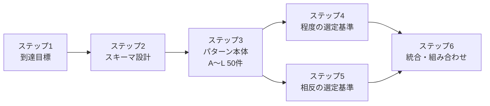

# はじめに：到達目標とエージェント特性

## 本書の到達目標

AIエージェントは「賢いが信用しきれない・遅く・高コストで・確率的で・騙されうる実行主体」である。本サイトの目的は、この異質なコンポーネントを**決定論的な殻・契約・権限・検証・予算・観測・統治の中に安全に閉じ込め**、その周囲を従来のソフトウェア工学（状態管理・トランザクション・監査・テスト・デプロイ・可観測性）で固める設計知を、再利用可能なパターン集として提供することにある。

## 統合にあたっての評価と方針

本サイトのパターン体系は、複数の独立した調査レポートを統合・再分類したものである。統合に際しての方針は以下のとおり。

- **パターン網羅性**：詳細カタログ版（A〜L、12カテゴリ）が最も粒度が細かく実務的であったため、これを骨格として全面採用した。
- **独自パターンの補追**：「ブラックボード型協調」「投機/ヘッジ実行」をそれぞれカテゴリB・Hに統合した。「意図ルーティング」はB-3・H-1に内包させた。
- **手薄だった2領域の強化**：「程度（how much）の決め方」と「相反する選択肢（どちらを採るか）の判断基準」を独立章（ステップ4・5）として厚く再構成した。
- **重複排除**：同一概念の別名（例：耐久セッション/チェックポイント、補償トランザクション/Saga、ACL/腐敗防止層）は1パターンに正規化した。

## 全体アジェンダ（本サイトの歩き方）

本サイトは以下の流れで構成される。

1. **ステップ1（本ページ）**：到達目標・統合方針・アジェンダ。
2. **[ステップ2](schema.md)**：各パターンを記述する共通スキーマと、カテゴリ分類の設計。
3. **[ステップ3](../patterns/index.md)**：アーキテクチャパターン本体（カテゴリA〜L、計約50パターン）。
4. **[ステップ4](../selection/degree-criteria.md)**：「程度」の選定基準（タイムアウト・リトライ・予算・ログ粒度・コンテキスト量・温度・ガードレール強度など、連続量の決め方）。
5. **[ステップ5](../selection/tradeoffs.md)**：「相反する仕組み」の選定基準（同期/非同期、単一/複数エージェント、抽象化/固有最適化など、二者択一の判断軸）。
6. **[ステップ6](../integration/dependencies.md)**：全体統合（依存関係・成熟度ロードマップ・選定ガイド・リファレンスアーキテクチャ・設計原則・組み合わせ方）。

## 設計を駆動するAIエージェントの性質（force）

すべてのパターンは、以下のエージェント特性が生む「設計圧力」への応答である。これらは独立でなく**連鎖**して制約を強める。

| エージェント特性 | アーキテクチャ上の含意 | 主な対応カテゴリ |
|---|---|---|
| 1リクエストが長い（数秒〜数十分） | 同期RPCでなくJob/Session/Workflowとして扱う | A |
| 1リクエストが高コストかつ可変 | 予算制御・キャッシュ・モデル選択・早期停止 | H |
| 非決定論的（同入力でも出力が変わる） | 再現性・評価・ガードレール・監査ログ | C/F/I |
| ハルシネーション | 根拠確認・検証器・RAG・外部API優先 | F |
| 自然言語インターフェイス | 意図解析・曖昧性解消・契約化・構造化出力 | C |
| メモリをセッション/エージェント間で受け渡す | メモリを一級のデータ管理対象にする | E |
| 可用性が不安定（外部LLM依存） | フォールバック・ルーティング・縮退・再実行 | H |
| ツール/MCPで副作用を起こす | 権限・サンドボックス・冪等性・補償・監査 | D/G |
| LLM差し替えで挙動が変わる | モデル抽象化・評価CI・カナリア・版固定 | I/J |
| プロンプトインジェクション | LLMを「騙されうる代理人」とみなし被害半径を限定 | G |
| 過剰な自律性（excessive agency） | 権限・機能・自律判断を最小化する | D/F/G |
| ループ・暴走の可能性 | ステップ/予算/時間の上限とデッドマンスイッチ | A/H |
| 説明責任（なぜそうしたか） | トレース保存・リプレイ・版記録 | I |

!!! note "整合する公知の枠組み"
    MCP（Model Context Protocol）、OWASP Top 10 for LLM Applications（Excessive Agency / Prompt Injection / Insecure Plugin Design 等）、NIST AI RMF（生成AIプロファイル）、LangGraphのdurable execution/checkpoint、OpenAIのStructured Outputs・prompt caching・evals、AWS Bedrock AgentCore。

!!! tip "読み方のガイド"
    カテゴリA〜Bは「骨格」、C〜Gは「安全と品質の境界層」、H〜Jは「資源と運用」、K〜Lは「人とプロセス」として位置づけられる。後段の[ステップ6](../integration/dependencies.md)で、これらを積み上げる依存関係と標準構成を示す。
