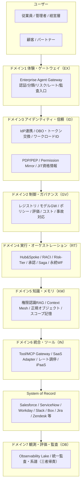

# 概念と原則

本ページでは、エンタープライズAIエージェント・アーキテクチャの基礎となる中心命題、組織グラフ、7つの意思決定ドメイン、設計原則、共通スキーマ、前提概念をまとめています。すべての意思決定ページの土台となる考え方です。

## 中心命題

エンタープライズにAIエージェントを組み込む中心課題は「**AIを賢くすること**」ではありません。「**企業の既存のID・権限・責任・業務プロセス・監査・データ境界・組織構造の中に、新しい実行主体を安全に参加させ、売上・生産性・意思決定の向上という企業価値を引き出すこと**」——これが本質といえます。安全に参加させることは前提条件にすぎず、目的はあくまで企業価値の向上にあります。

エンタープライズAIエージェントは単なるチャットUIではありません。組織の権限構造を忠実に投影し、既存システム（System of Record）を壊さずに束ね、すべての行為を企業横断で監査・統治できる形に閉じ込めた**管理可能・監査可能・権限制御された「デジタル業務主体」**です。その安全な檻の中で解き放たれた知能が、受注率向上・業務自動化・意思決定加速・コスト最適化という**企業価値を創出する実行主体**として機能します。

「誰の権限で・どのデータを・どう守って・誰の責任で」動かすかという統制設計（本書の7つの意思決定ドメイン・31意思決定）と、「何の成果KPIを・どの経路で・いつまでに」動かすかという価値設計（[部門別適用例](../integration/departments/index.md)・[定着・アダプション](../decisions/decision-guide.md)・[AI投資ポートフォリオ](../decisions/decision-guide.md)）は、車の両輪になります。

## AIエージェントは「企業内の実行主体」です

一般的なAIチャットが「回答主体」であるのに対し、エンタープライズエージェントは「業務実行主体」として機能します。企業システム上の**一級オブジェクト**として定義・管理する対象です。

```text
EnterpriseAgent
- agent_id / owner_department / business_purpose
- allowed_users / allowed_projects / allowed_tools / allowed_data_domains
- risk_tier / approval_policy / memory_scope
- audit_policy / cost_budget / incident_owner
- model_version / prompt_version / policy_version
```

### エージェント分類学（役割の型）

| 分類 | 役割 | 例 |
|---|---|---|
| Employee Copilot | 従業員個人の業務支援 | メール下書き、資料作成、予定調整 |
| Department Agent | 部門業務の実行支援 | HR / Sales / Finance Agent |
| Project Agent | プロジェクト単位の作業支援 | PMO Agent、Issue Triage Agent |
| Process Agent | 業務プロセスの自動実行 | 稟議、請求、返金、オンボーディング |
| Customer-facing Agent | 顧客との対話・サポート | CS Agent、EC Agent |
| Governance Agent | 監査・リスク・品質管理 | Compliance / Security Review Agent |
| Platform Agent | 社内開発・運用支援 | SRE / Data / Dev Agent |

## 企業構造をアーキテクチャに反映する（組織グラフ）

企業はフラットなユーザーの集合ではありません。権限・メモリ・ログ・評価・コストはすべて、組織の階層に紐づけて設計します。

```text
Company > Business Unit > Department > Section/Group > Team > Project > Subproject > Work Item
                                                                 └ Daily Operations
```

| スコープ | 対象 | 共有範囲 |
|---|---|---|
| User | 個人の嗜好・作業スタイル | 本人のみ |
| Team | チームルール・定例・タスク | チーム |
| Project | 決定事項・背景・成果物 | プロジェクト＋上位 |
| Department | 業務標準・KPI・手順・予算 | 部門 |
| Company | 全社規程・経営情報・全社ナレッジ | 全社 |
| Customer | 顧客別契約・問い合わせ・利用履歴 | 担当者・許可者 |

この構造を、Workday（組織・職位・レポートライン）・Okta/Entra ID（グループ）・Linear/Asana/Jira/Notion（プロジェクト）から名寄せした単一の**組織グラフ（Org Graph）**として管理します。全ドメインがスコープ・委譲・共有・承認の根拠をここから引く形になります。

## 全体アーキテクチャ：7つの意思決定ドメインと2つの横断軸



各ドメインの責務は以下のとおりです。

| ドメイン | テーマ | 主眼 | 意思決定数 |
|---|---|---|---|
| [ドメイン1 体験・ゲートウェイ (EX)](../decisions/ex-experience/ex-d1-front-door-channel.md) | 入口と提供面 | 仕事のある場所に届け、入口で統制する | 3 |
| [ドメイン2 制御・ガバナンス (GV)](../decisions/gv-governance/gv-d1-control-plane-scope.md) | 統治・統制 | 一元レジストリ・モデル統制・評価・コスト・事故対応 | 10 |
| [ドメイン3 アイデンティティ・信頼 (ID)](../decisions/id-identity/id-d1-workforce-customer-split.md) | 権限の忠実な伝播 | 誰の権限で動くかを保証する（全ドメインの中で最も設計難度が高い） | 8 |
| [ドメイン4 実行・オーケストレーション (RT)](../decisions/rt-runtime/rt-d1-single-vs-multi-agent.md) | 分業・実行・自動化 | 責任分担・自律度・副作用・長尺・イベント | 11 |
| [ドメイン5 知識・メモリ・コンテキスト (KM)](../decisions/km-knowledge/km-d1-context-supply.md) | 漏らさず活かす | 権限を保ったまま横断文脈を供給 | 7 |
| [ドメイン6 統合・ツール (IN)](../decisions/in-integration/in-d1-tool-gateway.md) | 既存システム連携 | 作らず束ね、固有差を吸収 | 4 |
| [ドメイン7 観測・評価・監査 (OB)](../decisions/ob-observability/ob-d1-observability-scope.md) | 説明責任 | 三者帰責で全行為を再構成可能に | 2 |

!!! tip "読み方"
    ドメイン1〜2が「入口と統治」、ドメイン3が「権限の忠実な伝播（設計難度が高い）」、ドメイン4〜6が「実行と知識と連携」、ドメイン7が「説明責任」にあたります。これらを積み上げる依存関係は[依存関係と依存チェーン](../integration/dependency-chain.md)で示しています。各意思決定が**どの企業価値KPIに効くか**は各意思決定の「価値仮説」節に記載しています。部門ごとの具体的な成果KPIマッピングは[部門別適用例](../integration/departments/index.md)、導入の段階設計は[価値成熟度ロードマップ](../decisions/decision-guide.md)、初期ユースケースの選び方は[ユースケース選定ガイド](../decisions/decision-guide.md)で扱っています。

**横断軸**として以下の2つが全ドメインを貫きます。

- **組織グラフ**：全ドメインがスコープ・委譲・承認を組織構造から一貫して導く土台です。
- **ゼロトラスト／監査**：全呼び出しを「人＋エージェント＋システム」の三者で認可・記録します。

## 標準・フレームワークとの整合

エンタープライズでは、これらを「アプリ設計の指針」ではなく「**企業アーキテクチャ設計の制約**」として扱います。この違いが重要になります。

| 標準・フレームワーク | 位置づけ |
|---|---|
| **NIST AI RMF（Generative AI Profile）** | 生成AI固有リスクの特定と管理アクション設計の枠組み |
| **OWASP Top 10 for LLM Applications** | Prompt Injection / Sensitive Information Disclosure / Excessive Agency / Unbounded Consumption 等を主要リスクとして整理 |
| **NIST SP 800-207 Zero Trust Architecture** | 境界でなく主体・資産・リソース中心の保護 |
| **OIDC / SCIM** | 既存ID標準（認証・プロビジョニング）の上に乗る。独自ID管理を乱立させない |
| **OAuth 2.0 Token Exchange（RFC 8693）** | 委譲・代理実行（OBO）の標準 |
| **OPA/Rego・Cedar** | Policy-as-Code による決定論的認可 |
| **MCP（Model Context Protocol）** | ツール接続の標準（企業ではGateway経由に統制） |
| **CloudEvents** | SaaS/社内イベントの共通記述 |
| **OpenTelemetry GenAI semantic conventions** | エージェント・モデル・ツール呼び出しの標準観測 |

### 標準・リスク項目 ⇔ 意思決定対応表

各標準やリスク項目が、本書のどの意思決定で対処されるかを以下にまとめています。

| 標準・リスク項目 | 対応する意思決定 |
|---|---|
| **OWASP: Prompt Injection** | [ID-7 Policy-as-Code Guardrail](../decisions/id-identity/id-d5-authorization-method.md)、[TO-12 プロンプト vs 実行基盤](../decisions/id-identity/id-d5-authorization-method.md) |
| **OWASP: Sensitive Information Disclosure** | [KM-1 Access-Controlled RAG](../decisions/km-knowledge/km-d1-context-supply.md)、[KM-6 DLP & Redaction](../decisions/km-knowledge/km-d5-confidentiality-strength.md)、[ID-1 二面分離](../decisions/id-identity/id-d1-workforce-customer-split.md) |
| **OWASP: Excessive Agency** | [RT-3 Risk-Tiered Autonomy](../decisions/rt-runtime/rt-d2-autonomy-design.md)、[RT-6 SoR Write Boundary](../decisions/rt-runtime/rt-d3-side-effect-safety.md)、[ID-4 Permission Mirror](../decisions/id-identity/id-d3-permission-reduction.md) |
| **OWASP: Unbounded Consumption** | [DC-2 タイムアウト・リトライ・予算](../decisions/gv-governance/gv-d4-cost-visibility.md)、[GV-8 Cost Quota & Chargeback](../decisions/gv-governance/gv-d4-cost-visibility.md) |
| **NIST AI RMF: 生成AIリスク管理** | [GV-7 Evaluation Pipeline](../decisions/gv-governance/gv-d3-change-eval-rigor.md)、[GV-4 Industry Policy Pack](../decisions/gv-governance/gv-d6-industry-regulation.md)、[DC-1 自律度ティア](../decisions/rt-runtime/rt-d2-autonomy-design.md) |
| **NIST SP 800-207: Zero Trust** | [ID-6 Zero-Trust PDP/PEP](../decisions/id-identity/id-d5-authorization-method.md)、[ID-2 OBO 委譲](../decisions/id-identity/id-d2-delegation-method.md)、[ID-5 JIT Credentials](../decisions/id-identity/id-d4-credential-minimization.md) |
| **RFC 8693: Token Exchange** | [ID-2 OBO 委譲](../decisions/id-identity/id-d2-delegation-method.md) |
| **OPA/Rego・Cedar** | [ID-7 Policy-as-Code Guardrail](../decisions/id-identity/id-d5-authorization-method.md) |
| **MCP** | [IN-1 Tool / MCP Gateway](../decisions/in-integration/in-d1-tool-gateway.md) |
| **CloudEvents** | [RT-10 Event-Driven Orchestrator](../decisions/rt-runtime/rt-d5-trigger-mechanism.md) |
| **OpenTelemetry** | [OB-1 Observability Lake](../decisions/ob-observability/ob-d1-observability-scope.md)、[OB-2 Unified Audit](../decisions/ob-observability/ob-d2-audit-attribution.md) |

## 設計原則

> **価値を生むために動かし、壊さないために統べる。** 目的は企業価値の創出であり、統制（権限・組織・監査）はその価値を持続的に生み続けるための土台です。この二重命題がすべての設計原則の根底にあります。

エンタープライズAIエージェント・アーキテクチャを貫く12箇条の設計原則を示します。

### 原則一覧

#### 1. エージェントは本人の権限を超えない

実効権限は「能力 ∩ 本人権限 ∩ ポリシー」の最小です。便利さのための全権化は避けてください。

エージェントが万能サービスアカウントで動く設計は危険です。侵害が起きた瞬間、全ユーザー・全 SaaS のデータが一度にさらされてしまいます。OBO 委譲で依頼者本人の権限に縮退したトークンを SaaS ごとに取得し、SaaS 側のネイティブ認可で実データアクセスを制約する二段構えが基本形です。委譲非対応の系では Permission Mirror で権限を近似できますが、あくまでキャッシュであり権威ソースではない点を常に意識してください。

参照：[ID-4 Permission Mirror](../decisions/id-identity/id-d3-permission-reduction.md) / [ID-2 OBO](../decisions/id-identity/id-d2-delegation-method.md)

#### 2. 従業員面と顧客面を物理的に分ける

最も重大な事故クラス——顧客向けが社内データに到達する（逆も同様）——を構造的に排除します。

従業員向けと顧客向けが同一の IdP・データストア・ネットワークセグメントを共有すると、一方の脆弱性が他方の面に波及します。IdP とデータストアの物理分離、面間のネットワーク到達性ゼロは初日から確立してください。そうすることで、設計レビューやペネトレーションテストで「面をまたぐ経路が存在しない」ことを証明できるようになります。

参照：[ID-1 二面分離](../decisions/id-identity/id-d1-workforce-customer-split.md)

#### 3. 作らず、寄り添う

SoR を置き換えず、読み取り、正規手続きで書き込みます。既存の統合資産を再利用します。

Salesforce・Workday・ServiceNow などの SoR は企業の業務データの真実を保持しています。エージェントがこれらを迂回して独自にデータを持つと、整合性の崩壊と二重管理が生じます。エージェントは SoR の API を正規手続きで呼び出し、書き込みは検証済みのドメインサービス経由に限定します。既存の iPaaS フロー（MuleSoft・Workato 等）がある場合は、コネクタを自作せず MCP アダプターでラップして再利用するのが基本方針です。

参照：[RT-6 SoR Write Boundary](../decisions/rt-runtime/rt-d3-side-effect-safety.md) / [IN-4 iPaaS Reuse](../decisions/in-integration/in-d2-build-vs-reuse.md)

#### 4. データはコピーする前に疑う

no-copy・JIT・ACL 同梱を既定とし、集約は目的が明確なときだけにします。

全社文書を1つのベクトル DB にコピーして索引化すると、コピーした瞬間に元の ACL が切り離され、権限変更の反映遅延が漏洩に直結します。既定は「コピーしない」（JIT 取得・フェデレーション）とし、コピーが必要な場合は ACL メタデータを同梱して検索時に本人権限でフィルタしてください。データの集約にはモザイク効果（単体では非機密なデータが組み合わさることで機密情報が推測可能になるリスク）もあるため、目的と範囲を絞ることが重要です。

参照：[KM-2 Context Mesh](../decisions/km-knowledge/km-d1-context-supply.md) / [KM-1 Access-Controlled RAG](../decisions/km-knowledge/km-d1-context-supply.md)

#### 5. 組織グラフを唯一の権威に

スコープ・共有・承認・委譲を組織構造から一貫して導きます。

「このエージェントが動かせる範囲はどこか」「誰が承認者か」「メモリのスコープはどこまでか」——これらの問いに一貫した答えを出すには、Workday・Okta・プロジェクト管理ツール等から名寄せした単一の組織マスターが欠かせません。組織グラフを唯一の権威とすることで、異動・昇格・退職といったライフサイクルイベントが、エージェントの権限スコープ・承認チェーン・メモリ階層に自動で反映される仕組みができあがります。

参照：[KM-3 Canonical Object & KG](../decisions/km-knowledge/km-d2-knowledge-normalization.md) / [KM-4 Scoped Memory](../decisions/km-knowledge/km-d3-memory-scope.md)

#### 6. プロンプトでなく、アイデンティティとポリシーで守る

安全保証は実行基盤側に置きます。プロンプトはセキュリティ境界になりません。

「機密情報を出力するな」とプロンプトに書いても、プロンプトインジェクションで容易に突破されます。安全の保証は LLM の外側——PDP/PEP によるゼロトラスト認可・OPA/Cedar 等のポリシーコード・DLP によるマスキング——に置きます。ポリシーをコードとして管理すれば、変更履歴・テスト・CI/CD による自動検証が可能になり、組織全体でのポリシー一貫性も担保できるようになります。

参照：[ID-7 Policy-as-Code](../decisions/id-identity/id-d5-authorization-method.md) / [ID-6 Zero-Trust](../decisions/id-identity/id-d5-authorization-method.md)

#### 7. すべての行為を三者で帰責する

人・エージェント・システムを相関 ID で貫き、企業横断で監査します。

エージェントの操作が「サービスアカウントが実行した」としか記録されなければ、インシデント調査で誰が依頼し何が起きたかを追跡できません。すべての行為に「依頼者（人間）・実行主体（エージェント/ワークロード）・対象システム」の三者を相関 ID で紐付けて記録します。三者帰責の監査証跡はコンプライアンス監査・インシデント対応・責任追跡の基盤となります。後付けでの導入は極めて困難なため、初日から設計に組み込んでください。

参照：[OB-2 Unified Audit](../decisions/ob-observability/ob-d2-audit-attribution.md) / [OB-1 Observability Lake](../decisions/ob-observability/ob-d1-observability-scope.md)

#### 8. 中央はガードレールと舗装路を、部署は業務ロジックを

集権と分権の二層統治を採用します。中央がインフラ・認可・監査・評価を担い、部署がドメイン知識・ユースケースを持ちます。

中央プラットフォームチームが Gateway・IdP 連携・モデル Gateway・監査基盤・評価パイプラインを整備し、部署はその上にドメイン固有のエージェントテンプレート・業務ロジック・ユースケースを構築します。中央が全業務ロジックを抱えると部署の機動性が失われ、逆に部署が独自にインフラを立てるとガバナンスが崩壊します。テンプレート工場パターンを活用すれば、中央が安全なひな形を提供し、部署がパラメータを埋める形の分業が成り立ちます。

参照：[GV-3 Department Factory](../decisions/gv-governance/gv-d1-control-plane-scope.md) / [GV-1 Control Plane](../decisions/gv-governance/gv-d1-control-plane-scope.md)

#### 9. 自然言語はUIであり内部プロトコルではない

作用は必ず構造化コマンドへ変換してください。自然言語のまま API に渡してはいけません。

LLM が生成した自然言語をそのまま下流システムに渡すと、意図の曖昧さ・インジェクション・再現不能という三重の問題が生じます。ユーザーの自然言語入力は Gateway で受け取り、LLM が意図を解釈した後、actor・target_system・action・params を持つ構造化コマンド（Command Envelope）に変換します。構造化されたコマンドはポリシー評価・監査記録・冪等性保証の対象にできるため、企業システムとの統合に必要な決定論性が確保できます。

参照：[RT-5 Command Envelope](../decisions/rt-runtime/rt-d3-side-effect-safety.md) / [IN-2 SaaS Adapter](../decisions/in-integration/in-d2-build-vs-reuse.md)

#### 10. エージェントは「業務キューを処理する管理されたデジタル業務主体」

チャットボットではなく、登録・監査・権限制御・評価され続ける実行主体として設計します。

エージェントは agent_id・owner_department・risk_tier・allowed_tools・cost_budget 等の属性を持つ、企業内の一級オブジェクトです。コントロールプレーンに登録されていないエージェントは実行を許可されません。登録済みのエージェントは継続的に評価・監査・コスト管理の対象となります。この設計によってエージェントの増殖を統制し、「誰が・いつ・どのエージェントを・どの権限で動かしたか」を企業横断で把握できるようになります。

参照：[RT-9 Work Queue](../decisions/rt-runtime/rt-d5-trigger-mechanism.md) / [GV-1 Control Plane](../decisions/gv-governance/gv-d1-control-plane-scope.md)

#### 11. AIを賢くするより、企業の境界内で安全に働けるようにする

知能は前提であり、勝負は権限・統合・統治にあります。

LLM の能力向上はモデルベンダーが担っています。エンタープライズアーキテクトが設計すべきは、その知能を企業の ID・権限・監査・組織構造の中にどう閉じ込めるかです。Gateway による統一入口、ゼロトラスト認可による都度検証、ポリシーコードによる決定論的な行動制御——これらの「檻」が整って初めて、確率的な知能を数万人規模の本番に投入できる段階に達します。

参照：[EX-1 Gateway](../decisions/ex-experience/ex-d1-front-door-channel.md) / [ID-6 Zero-Trust](../decisions/id-identity/id-d5-authorization-method.md)

#### 12. やるか/やらないかでなく、どの程度かを設計する

自律度・ログ・予算・キャッシュ等の連続量を、トレースと eval で継続調整します。

エージェントの導入は「全自動か手動か」の二択ではありません。自律度のティア境界、ログの三層分離（メタ/本文/集計）、コスト予算、キャッシュ TTL、ガードレール強度——いずれも連続量であり、業務リスク・データ機密度・組織の成熟度に応じて段階的に調整してください。この調整はリリース時に一度決めて終わりではなく、Observability Lake のトレースと評価パイプラインの出力を継続的にフィードバックしながら更新し続けるものです。

参照：[「程度」の選定基準](../decisions/index.md) / [GV-7 Eval Pipeline](../decisions/gv-governance/gv-d3-change-eval-rigor.md)

---

> 最も凝縮すると——**AIエージェントを企業に導入するとは、LLMを業務システムにつなぐことではなく、企業のID・権限・責任・データ・プロセス・監査・組織構造の中に新しい実行主体を安全に参加させることです。** 確率的な知能を決定論的な権限・組織・監査の檻の中に閉じ込めたとき、初めて数万人規模の本番に耐えるエンタープライズAIエージェントが成立します。

## 意思決定ページの共通スキーマ

### 共通記述スキーマ

各パターンを以下の8項目で統一記述します。「価値仮説」は各パターンが企業価値のどこに効くかを明示するための項目であり、「落とし穴」は事故に直結しやすいため独立した明示項目として設けました。

| # | 項目 | 記述内容 |
|---|---|---|
| 1 | **概要** | 何であるかの一文要約 |
| 2 | **解決する企業課題** | どういう課題を解決するために、どのエンタープライズ固有の力（漏洩・サイロ・動的文脈・監査・コスト）に応えるか |
| 3 | **価値仮説** | このパターンがどの企業価値KPI（売上・利益／業務自動化／プロジェクト生産性／従業員効率／経営判断速度）に、どの経路で効くか。1〜3行で記載し、[GV-10](../decisions/gv-governance/gv-d7-value-measurement.md) の計測層と対応づける |
| 4 | **解決策と設計** | 課題の解決策と、それを実現する設計としての構造・データフロー・状態遷移・実装上の要点 |
| 5 | **向き／不向き** | 採用が効く条件と、害・過剰になる条件 |
| 6 | **要素技術・既存システム連携** | 代表技術・標準・対象SaaS |
| 7 | **落とし穴／選定の勘所** | 典型的な失敗と回避の指針 |
| 8 | **関連パターン** | 類似・補完・対比される他のパターンへのリンク |

!!! note "解決策と設計節の図"
    構造・データフロー・状態遷移・認可シーケンスは mermaid で記述します。特に [ID-2 OBO委譲](../decisions/id-identity/id-d2-delegation-method.md)、[ID-6 PDP/PEP](../decisions/id-identity/id-d5-authorization-method.md)、[RT-7 Saga](../decisions/rt-runtime/rt-d4-long-running-reliability.md)、[RT-10 イベント駆動](../decisions/rt-runtime/rt-d5-trigger-mechanism.md) はシーケンス/フロー図を推奨します。

### 面（カテゴリ）設計

パターンは「どの設計圧力に応えるか」で7面に分類しています。この分類は責務境界とも一致し、[リファレンスアーキテクチャ](../integration/architecture/index.md)の層構造にそのまま対応しています。

| 面 | テーマ | 主眼 | パターン数 |
|---|---|---|---|
| [面1 体験・ゲートウェイ (EX)](../decisions/ex-experience/ex-d1-front-door-channel.md) | 入口と提供面 | 仕事のある場所に届け、入口で統制する | 3 |
| [面2 制御・ガバナンス (GV)](../decisions/gv-governance/gv-d1-control-plane-scope.md) | 統治・統制 | 一元レジストリ・モデル統制・評価・コスト・事故対応 | 10 |
| [面3 アイデンティティ・信頼 (ID)](../decisions/id-identity/id-d1-workforce-customer-split.md) | 権限の忠実な伝播 | 誰の権限で動くかを保証する（全面の中で最も設計難度が高い） | 8 |
| [面4 実行・オーケストレーション (RT)](../decisions/rt-runtime/rt-d1-single-vs-multi-agent.md) | 分業・実行・自動化 | 責任分担・自律度・副作用・長尺・イベント | 11 |
| [面5 知識・メモリ・コンテキスト (KM)](../decisions/km-knowledge/km-d1-context-supply.md) | 漏らさず活かす | 権限を保ったまま横断文脈を供給 | 7 |
| [面6 統合・ツール (IN)](../decisions/in-integration/in-d1-tool-gateway.md) | 既存システム連携 | 作らず束ね、固有差を吸収 | 4 |
| [面7 観測・評価・監査 (OB)](../decisions/ob-observability/ob-d1-observability-scope.md) | 説明責任 | 三者帰責で全行為を再構成可能に | 2 |

#### 面の読み方

面1〜2が「入口と統治」、面3が「権限の忠実な伝播（設計難度が高い）」、面4〜6が「実行と知識と連携」、面7が「説明責任」に当たります。積み上げる依存関係は[依存関係と依存チェーン](../integration/dependency-chain.md)で示します。

#### エンタープライズ固有の設計圧力

設計圧力とは、一般的なソフトウェア設計ではあまり表面化しない、エンタープライズ固有の力のことです。

| 設計圧力 | 具体例 |
|---|---|
| **漏洩** | 顧客データの社外流出、部門間の不正アクセス、PII の外部LLM送信 |
| **サイロ** | SaaS間のデータ分断、部門間の語彙差、横断文脈の統合不能 |
| **動的文脈** | 人事異動・プロジェクト終了による権限変更、リアルタイムな組織構造の反映 |
| **監査** | 規制対応の証跡、インシデント原因究明、説明責任の確保 |
| **コスト** | LLMトークンの部門按分、マルチエージェントの推論爆発、SaaS APIレート消費 |

#### 横断軸

7面に加えて、以下の2つが全面を貫く横断軸として機能します。

- **組織グラフ**：全面がスコープ・委譲・承認を組織構造から一貫して導く土台です。[ID-4](../decisions/id-identity/id-d3-permission-reduction.md)・[RT-1](../decisions/rt-runtime/rt-d1-single-vs-multi-agent.md)・[RT-4](../decisions/rt-runtime/rt-d2-autonomy-design.md)・[KM-4](../decisions/km-knowledge/km-d3-memory-scope.md) の根拠となります。
- **ゼロトラスト／監査**：全呼び出しを「人＋エージェント＋システム」の三者で認可・記録します。[ID-6](../decisions/id-identity/id-d5-authorization-method.md)・[OB-2](../decisions/ob-observability/ob-d2-audit-attribution.md) が中核を担います。

### フロントマター拡張（機械可読メタデータ）

本文の8項目スキーマに加え、各パターンページのフロントマター（YAML）に以下のフィールドを必須としています。コーディングエージェントはこのメタデータを `docs/_machine/patterns.json` から一括参照できます。

| フィールド | 型 | 説明 |
|---|---|---|
| `id` / `pattern_id` | string | パターンID（例：`ID-2`） |
| `applies_when` | list | 採用が有効な条件タグ |
| `not_applicable_when` | list | 採用が不適切な条件タグ |
| `decision_keys` | list | 参加する意思決定基準（DC/TO）のID |
| `value_drivers` | list | 効く企業価値ドライバ（下記語彙から選択） |
| `kpis` | list | GV-10 連携の代表指標 |
| `prerequisites` / `requires` | list | 依存する上流パターンのID |
| `related` / `required_by` | list | 双方向リンク対象のパターンID |
| `maturity_stage` | string | `foundation` / `execution` / `value_loop` のいずれか |
| `mvp` | string | 最小成立構成の一文説明 |
| `cost_orientation` | string | 相対コスト感 `S` / `M` / `L` |

#### 価値ドライバ語彙（統一タグ）

全パターン・全部門事例の `value_drivers` フィールドで使用する語彙は、以下に統一しています。

| タグ | 意味 |
|---|---|
| `employee_efficiency` | 従業員の業務効率化 |
| `decision_quality` | 意思決定の質と速度向上 |
| `automation` | 業務プロセスの自動化 |
| `revenue_growth` | 売上・利益の成長 |
| `customer_value` | 顧客体験・満足度向上 |
| `audit_compliance` | 監査・コンプライアンスの確保 |
| `executive_decision` | 経営判断の加速 |
| `project_productivity` | プロジェクト生産性向上 |

#### Decision Summary ブロック（末尾必須）

各パターンページの末尾に、以下の形式で機械可読かつ人間可読の Decision Summary YAML ブロックを配置します。

````markdown
## Decision Summary

```yaml
decision_summary:
  pattern: ID-2
  participates_in:
    - decision: TO-1
      role: option_a
  recommended_if:
    - "複数SaaSへ本人権限で書き込みが発生する"
  avoid_if:
    - "委譲を受理しないSaaS（ID-4で代替）"
  combines_with: [ID-4, KM-1, RT-5, OB-2]
  conflicts_with: []
  value_outcome:
    drivers: [audit_compliance, employee_efficiency]
    kpis: [監査追跡可能率, 誤アクセス事故件数]
  mvp: "主要2〜3 SaaSのみOBO化、残りはID-4で近似"
  cost: M
```
````

`scripts/build_machine_index.py` がこのブロックを抽出し、`docs/_machine/patterns.json` 等の機械可読 JSON を自動生成します。

## 前提概念

本リファレンスの意思決定ページ群で繰り返し登場する重要概念を定義しています。各用語は初出の意思決定ページでもインライン定義していますが、ここでは横断的な参照として集約しています。

### アイデンティティ・認可

| 用語 | 定義 |
|---|---|
| **OBO（On-Behalf-Of）** | OAuth 2.0 Token Exchange（RFC 8693）等を用いて、依頼者本人の権限に縮退したトークンで下流サービスを呼び出す委譲方式です。→ [ID-D2](../decisions/id-identity/id-d2-delegation-method.md) |
| **混乱代理（Confused Deputy）** | 権限のある主体が、権限のない主体の要求を自身の権限で実行してしまうセキュリティ上の問題です。エージェントがサービスアカウントの過剰権限でユーザーの代理操作を行う場合に発生します。→ [ID-D2](../decisions/id-identity/id-d2-delegation-method.md) |
| **Permission Mirror** | 各SaaSの権限（ACL/ロール/グループ）をエージェント基盤側に同期したキャッシュです。**権威ソースではなく近似**であり、SaaSネイティブ認可の補完として機能します。→ [ID-D3](../decisions/id-identity/id-d3-permission-reduction.md) |
| **PDP / PEP** | Policy Decision Point（ポリシー判断点）/ Policy Enforcement Point（ポリシー施行点）のことです。認可判断のロジック（PDP）と、その判断を実行時に適用するゲート（PEP）を分離する設計です。→ [ID-D5](../decisions/id-identity/id-d5-authorization-method.md) |
| **Zanzibar / ReBAC** | Google が開発した関係ベースアクセス制御（ReBAC）システムです。「ユーザーXはドキュメントYのビューワーである」のような関係タプルで権限を表現します。SpiceDB・OpenFGA 等のOSS実装があります。→ [ID-D3](../decisions/id-identity/id-d3-permission-reduction.md)、[ID-D5](../decisions/id-identity/id-d5-authorization-method.md) |
| **ABAC** | Attribute-Based Access Control の略です。主体・リソース・環境の属性（部門、役職、時刻、機密度等）に基づいてアクセスを制御するモデルです。→ [ID-D5](../decisions/id-identity/id-d5-authorization-method.md) |

### データ・知識

| 用語 | 定義 |
|---|---|
| **SoR（System of Record）** | 業務データの正（マスター）を保持するシステムです。Salesforce（CRM）・Workday（HCM）・ServiceNow（ITSM）等が該当します。エージェントの書き込み境界はSoRの整合性保護の観点で設計されます。→ [RT-D3](../decisions/rt-runtime/rt-d3-side-effect-safety.md) |
| **モザイク効果（Mosaic Effect）** | 単体では非機密のデータが複数組み合わさることで機密情報を推測可能になる現象です。例：部署構成＋役職＋評価期間から個人の人事評価を推測できてしまいます。→ [KM-D5](../decisions/km-knowledge/km-d5-confidentiality-strength.md) |
| **DLP（Data Loss Prevention）** | 機密データの外部漏洩を検知・防止する仕組みです。エージェントのコンテキストに含まれる機密情報のマスキング・除去に適用されます。→ [KM-D5](../decisions/km-knowledge/km-d5-confidentiality-strength.md) |
| **DPA（Data Processing Agreement）** | データ処理契約のことです。LLMベンダーに対して入力データの学習利用禁止・処理後の削除等を契約上義務付ける文書です。→ [KM-D5](../decisions/km-knowledge/km-d5-confidentiality-strength.md) |

### セキュリティ・計算

| 用語 | 定義 |
|---|---|
| **TEE（Trusted Execution Environment）** | ハードウェアレベルでメモリを暗号化・隔離し、ホストOS・管理者からもデータを読めないようにする実行環境です。Confidential VM、NVIDIA Confidential GPU 等が該当します。LLM推論にはGPU Confidential Computingが必要であり、現状は高コスト・限定的です。→ [KM-D5](../decisions/km-knowledge/km-d5-confidentiality-strength.md) |
| **OPA / Cedar** | Open Policy Agent（Rego言語）とAWS Cedar（Permit/Forbidルール）のことです。ポリシーをコードとして記述・テスト・バージョン管理する基盤です。→ [ID-D5](../decisions/id-identity/id-d5-authorization-method.md) |

### 実行・オーケストレーション

| 用語 | 定義 |
|---|---|
| **Saga** | 分散トランザクションを一連のローカルトランザクション＋補償操作に分解するパターンです。複数SaaSにまたがる操作の部分失敗時にロールバックを保証します。→ [RT-D4](../decisions/rt-runtime/rt-d4-long-running-reliability.md) |
| **RACI** | Responsible（実行責任者）・Accountable（説明責任者）・Consulted（相談先）・Informed（報告先）の4役割でタスク責任分担を定義するマトリクスです。→ [RT-D1](../decisions/rt-runtime/rt-d1-single-vs-multi-agent.md) |
| **MCP（Model Context Protocol）** | LLMとツール/データソースの接続を標準化するプロトコルです。エージェントが外部システムを呼び出す際の共通インターフェースとして機能します。→ [IN-D1](../decisions/in-integration/in-d1-tool-gateway.md) |
| **GraphRAG** | ナレッジグラフとベクトル検索を組み合わせたRAG手法です。エンティティ間の関係性クエリに強みがあります。→ [KM-D2](../decisions/km-knowledge/km-d2-knowledge-normalization.md) |
