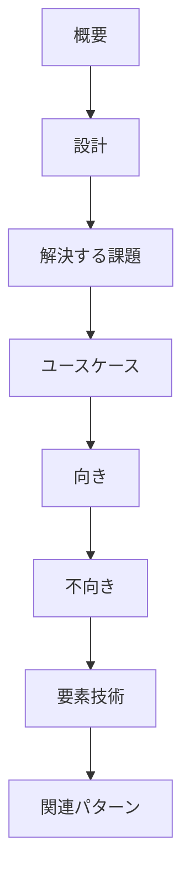

# 項目設計とカテゴリ分類

## 共通記述スキーマ

すべてのパターンを、以下の7項目（本サイトでは「関連パターン」を加えた8節）で統一記述する。横並び比較と選定を可能にするためである。

| 節 | 記述内容 |
|---|---|
| **概要** | そのパターンが何であるかの一文要約 |
| **設計** | 構造・データフロー・状態遷移・実装上の要点 |
| **解決する課題** | どのエージェント特性（force）に応えるか |
| **ユースケース** | 典型的な適用場面 |
| **向き** | 採用が効くシステム条件 |
| **不向き** | 採用がオーバーヘッドや害になる条件 |
| **要素技術** | 代表的な実装技術・プロダクト・標準 |
| **関連パターン** | 依存・併用するパターンへのリンク |

「向き」と「不向き」を対にすることで、採用判断のトレードオフを明示する。「要素技術」は抽象語でなく具体的なプロダクト名・標準名・手法名で挙げ、実装の出発点を示す。

## カテゴリ分類の設計

パターンは「どの設計圧力（force）に応えるか」で12カテゴリに分類する。これは責務境界とも一致し、[リファレンスアーキテクチャ](../integration/reference-architecture.md)の層構造に対応する。

| カテゴリ | テーマ | 主眼 |
|---|---|---|
| **A** | 実行・セッション・オーケストレーション | 長く・止まり・再開し・暴走しうる実行を骨格化 |
| **B** | エージェント構成・分担 | 何を決定論に残し、どこをどう分業するか |
| **C** | 入出力・契約化 | 曖昧な自然言語を安全な契約へ変換 |
| **D** | ツール・MCP・外部接続 | 副作用の最重要リスク境界の統制 |
| **E** | メモリ・コンテキスト管理 | 記憶を保存・忘却・権限付きのデータ機能に |
| **F** | 信頼性・検証・ガードレール | 確率的出力を品質保証された出力へ |
| **G** | セキュリティ・マルチテナント | 騙されても被害が小さい設計 |
| **H** | コスト・性能・可用性 | 高コスト・可変・不安定の資源管理 |
| **I** | 観測性・評価・変更管理（LLMOps） | 測定・再現・安全な継続変更 |
| **J** | デプロイ・ベンダー抽象化 | モデル/SDKロックインの構造的隔離 |
| **K** | 人間協調・UI/UX | 制御された自律性と協働点の設計 |
| **L** | 導入・移行・統治 | 後付け統合と段階的な信頼獲得 |

!!! tip "読み方"
    A〜Bは「骨格」、C〜Gは「安全と品質の境界層」、H〜Jは「資源と運用」、K〜Lは「人とプロセス」。後段の[統合](../integration/dependencies.md)で、これらを積み上げる依存関係と標準構成を示す。
