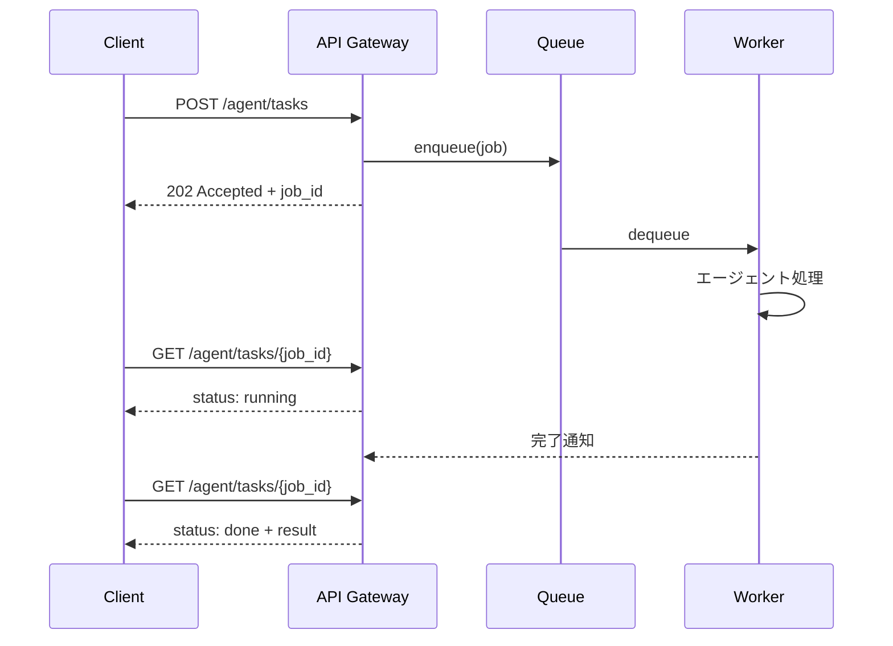

# A-1 Request-to-Job Gateway（非同期ジョブ受付）

## 概要

1リクエストを同期APIでなく非同期ジョブとして受け付け、実処理をバックグラウンドのワーカー/ワークフローへ委ねる。

## 設計

API Gatewayがリクエストを受理し、即座に `agent_session_id` および `job_id` を発行して `202 Accepted` を返す。実処理はキュー/ワークフローエンジンへ投入され、バックグラウンドのワーカーが処理する。クライアントはポーリング・WebSocket・SSE・push通知のいずれかで進捗と結果を取得する。

ジョブの状態は `pending → running → (partial) → done/failed/timeout` の遷移をとる。

Web層とエージェント層を分離することで、それぞれ独立にスケールできる。キューがバーストを吸収し、ワーカーの処理能力に応じて流量を制御する。

## 解決する課題

AIエージェントの「1リクエストが長い」特性に応える。具体的には以下の課題を解決する。

- HTTPタイムアウトによる処理中断
- コネクション占有によるリソース枯渇
- ロードバランサの切断
- バースト時の過負荷
- Web層とエージェント層の独立スケール

## ユースケース

- リサーチ・調査タスク
- レポート・資料生成
- コード生成・修正
- データ分析
- 長尺の問い合わせ対応
- RPA的処理

## 向き

完了まで複数ステップや外部検索を伴うタスク全般に適する。処理時間が数十秒〜数分以上かかるエージェント処理は、本パターンの適用が基本となる。

## 不向き

数百ミリ秒の即応が求められるオートコンプリートや同期トランザクションには過剰である。処理が十分に短い場合、非同期化のオーバーヘッド（キュー投入・ポーリング）が逆にレイテンシを悪化させる。

## 要素技術

- **メッセージキュー**：SQS、Pub/Sub、Kafka、Redis Streams
- **タスクキュー**：Celery、Sidekiq
- **ワークフローエンジン**：Temporal、Step Functions、Cloud Tasks
- **リアルタイム通知**：WebSocket、SSE
- **ジョブ状態ストア**：PostgreSQL、Redis

## 関連パターン

- [A-2 Durable Agent Session](a2-durable-session.md) — ジョブの実行状態をチェックポイント永続化し、障害耐性を高める
- [A-3 Streaming Progress](a3-streaming-progress.md) — 非同期ジョブの進捗をリアルタイムにクライアントへ提示する
- [A-5 Time-Budgeted Agent Loop](a5-time-budgeted-loop.md) — ジョブに時間・コスト予算を課し暴走を防ぐ
- [H-4 Graceful Degradation & Fallback](../h-cost-performance/h4-graceful-degradation.md) — ワーカー障害時の縮退戦略
