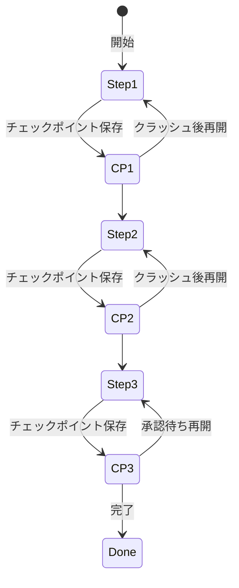

# A-2 Durable Agent Session（耐久セッション／チェックポイント）

## 概要

実行状態をステップ単位でチェックポイント永続化し、クラッシュ・中断・承認待ちから再開できるようにする。

## 設計

各ステップの入出力・ツール結果・モデル応答・判断・エラーを `agent_session_state` に保存する。再開は直前チェックポイントから行う。

LLM呼び出しは非決定論的であるため、アクティビティ境界の外で結果を固定し二度引かない（リプレイ安全性）。これにより、再開時に同じLLM呼び出しを繰り返して異なる結果を得てしまう問題を回避する。

セッション状態には以下を含める。

- 各ステップの入出力
- ツール呼び出し結果
- LLM応答（固定化済み）
- 判断ログ
- エラー情報
- 現在の状態（pending / running / waiting_approval / done / failed）

## 解決する課題

以下のエージェント特性に応える。

- プロセス再起動・LLMタイムアウト・ツール失敗への耐性
- 数時間〜数日の人間承認待ち保持
- 冪等性の確保

## ユースケース

- 承認付き業務処理
- 複数ツール連携タスク
- 数十分の自律タスク
- 長期ワークフロー

## 向き

副作用を伴う長尺ワークフロー、SLAの厳しい基幹連携に適する。処理の途中で人間の承認を挟む必要がある場面では必須となる。

## 不向き

完全ステートレスな単発チャットや、低価値な使い捨て処理には過剰である。チェックポイント保存のオーバーヘッドが処理時間に対して大きくなる短時間処理にも向かない。

## 要素技術

- **耐久実行基盤**：Temporal、AWS Step Functions、Azure Durable Functions、Restate、Inngest
- **チェックポイント**：LangGraph checkpoint
- **イベントソーシング**：event sourcing
- **永続化ストア**：PostgreSQL、DynamoDB、Redis

## 関連パターン

- [A-1 Request-to-Job Gateway](a1-request-to-job-gateway.md) — 非同期ジョブとして耐久セッションを起動する
- [A-4 Interruptible Agent](a4-interruptible-agent.md) — 本パターンの上に中断・方針変更を構築する
- [F-5 Human Approval Checkpoint](../f-reliability/f5-human-approval.md) — 承認待ちで状態を保持する前提
- [I-3 Production Replay](../i-observability/i3-production-replay.md) — セッション状態をリプレイに活用する
